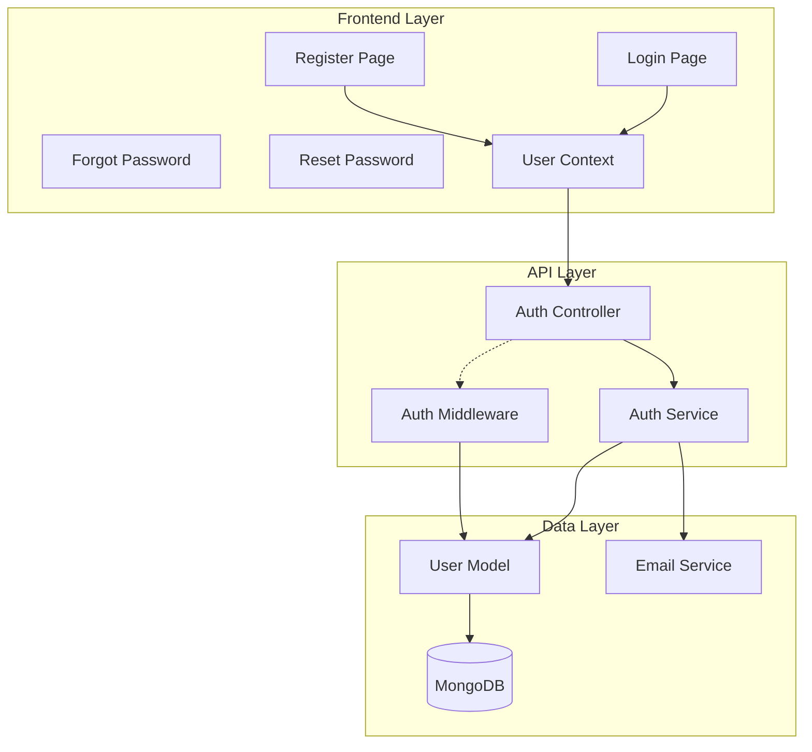
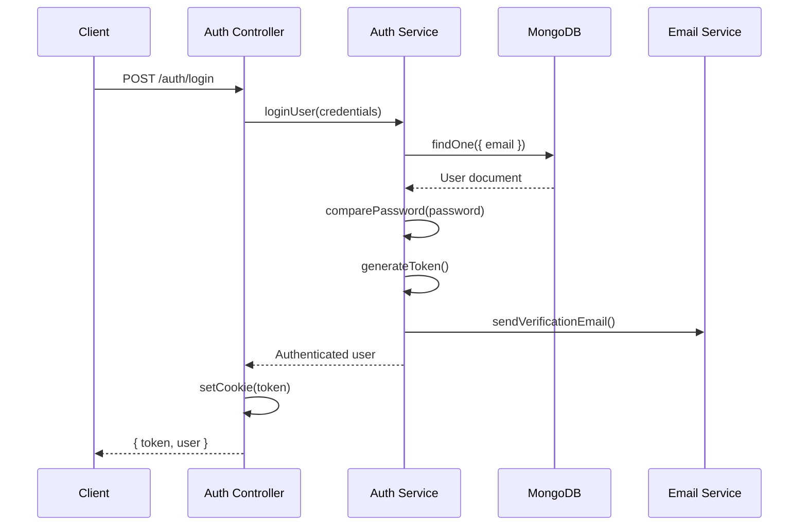
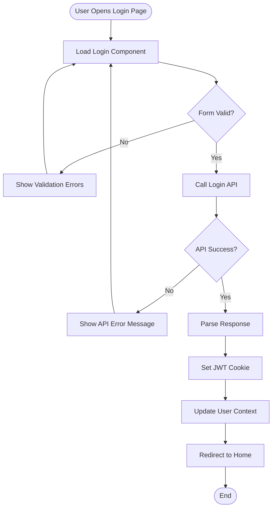
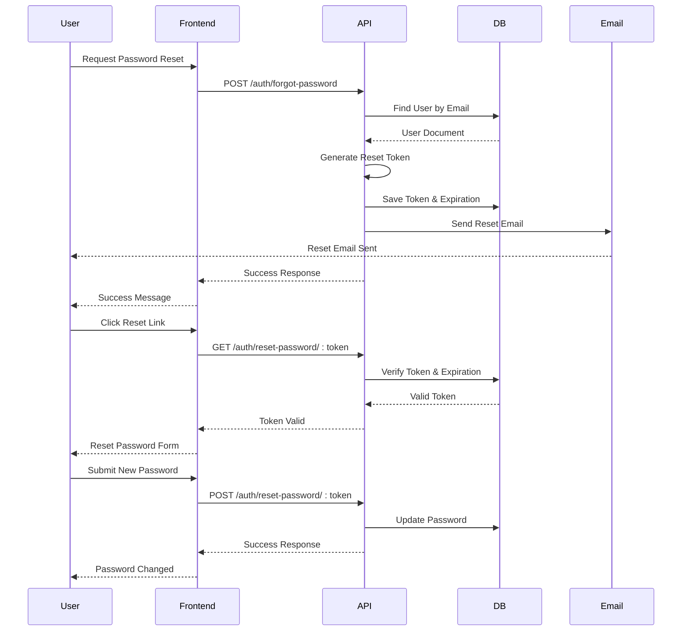

# Authentication System

<cite>
**Referenced Files in This Document**
- [src/pages/Login.tsx](file://src/pages/Login.tsx)
- [src/pages/Register.tsx](file://src/pages/Register.tsx)
- [src/pages/ForgotPassword.tsx](file://src/pages/ForgotPassword.tsx)
- [src/pages/ResetPassword.tsx](file://src/pages/ResetPassword.tsx)
- [src/UserContext.tsx](file://src/UserContext.tsx)
- [src/config/api.config.ts](file://src/config/api.config.ts)
- [api-fastify/src/controllers/auth.controller.ts](file://api-fastify/src/controllers/auth.controller.ts)
- [api-fastify/src/services/auth.service.ts](file://api-fastify/src/services/auth.service.ts)
- [api-fastify/src/middlewares/auth.middleware.ts](file://api-fastify/src/middlewares/auth.middleware.ts)
- [api-fastify/src/models/user.model.ts](file://api-fastify/src/models/user.model.ts)
- [api-fastify/src/types/auth.types.ts](file://api-fastify/src/types/auth.types.ts)
- [api-fastify/src/types/user.types.ts](file://api-fastify/src/types/user.types.ts)
</cite>

## Table of Contents
1. [Introduction](#introduction)
2. [System Architecture](#system-architecture)
3. [Frontend Components](#frontend-components)
4. [Backend Services](#backend-services)
5. [Authentication Flow](#authentication-flow)
6. [Role-Based Access Control](#role-based-access-control)
7. [Security Implementation](#security-implementation)
8. [Error Handling](#error-handling)
9. [Testing and Debugging](#testing-and-debugging)
10. [Common Issues and Solutions](#common-issues-and-solutions)

## Introduction

The MERN_chatai_blog authentication system provides a comprehensive solution for user management, including registration, login, password reset, and role-based access control. Built with React for the frontend and Fastify for the backend, the system implements JWT-based authentication with robust security measures and intuitive user interfaces.

The authentication system consists of four main components:
- **Frontend Authentication Pages**: Login, Register, Forgot Password, and Reset Password forms
- **User Context Management**: Centralized state management for user authentication status
- **Backend Controllers**: API endpoints for authentication operations
- **Authentication Middleware**: Security layer for protecting routes and validating permissions

## System Architecture

The authentication system follows a layered architecture with clear separation of concerns:



**Diagram sources**
- [src/pages/Login.tsx](file://src/pages/Login.tsx#L1-L50)
- [src/UserContext.tsx](file://src/UserContext.tsx#L1-L100)
- [api-fastify/src/controllers/auth.controller.ts](file://api-fastify/src/controllers/auth.controller.ts#L1-L50)
- [api-fastify/src/services/auth.service.ts](file://api-fastify/src/services/auth.service.ts#L1-L50)

## Frontend Components

### Login Component

The Login component provides a secure and user-friendly interface for user authentication:

```typescript
// Key features of the Login component
const [email, setEmail] = useState<string>("");
const [password, setPassword] = useState<string>("");
const [isSubmitting, setIsSubmitting] = useState<boolean>(false);
const [errors, setErrors] = useState<ValidationErrors>({});
const [successMessage, setSuccessMessage] = useState<string | null>(null);
```

**Section sources**
- [src/pages/Login.tsx](file://src/pages/Login.tsx#L15-L30)

#### Form Validation

The login form implements comprehensive validation:

```typescript
const validateForm = (): boolean => {
  const newErrors: ValidationErrors = {};
  let isValid = true;

  if (!email.trim()) {
    newErrors.email = "L'adresse email est requise";
    isValid = false;
  } else if (!/^\S+@\S+\.\S+$/.test(email)) {
    newErrors.email = "Veuillez entrer une adresse email valide";
    isValid = false;
  }

  if (!password) {
    newErrors.password = "Le mot de passe est requis";
    isValid = false;
  } else if (password.length < 6) {
    newErrors.password = "Le mot de passe doit contenir au moins 6 caractères";
    isValid = false;
  }

  setErrors(newErrors);
  return isValid;
};
```

**Section sources**
- [src/pages/Login.tsx](file://src/pages/Login.tsx#L50-L75)

#### Test Credentials Functionality

The system includes a convenient test login feature for development:

```typescript
const handleTestLogin = async () => {
  setEmail("admin@example.com");
  setPassword("admin123");

  try {
    const response = await fetch(API_ENDPOINTS.auth.login, {
      method: "POST",
      headers: { "Content-Type": "application/json" },
      body: JSON.stringify({
        email: "admin@example.com",
        password: "admin123"
      }),
    });

    if (response.ok) {
      const data = await response.json();
      setSuccessMessage(`Test de connexion réussi! Utilisateur: ${data.user.username}`);
    }
  } catch (error) {
    setErrors({ general: "Une erreur s'est produite lors du test de connexion" });
  }
};
```

**Section sources**
- [src/pages/Login.tsx](file://src/pages/Login.tsx#L80-L120)

### User Context Management

The UserContext provides centralized state management for authentication:

```typescript
interface UserContextType {
  userInfo: UserInfo;
  setUserInfo: Dispatch<SetStateAction<UserInfo>>;
  checkAuth: () => Promise<boolean>;
  login: (email: string, password: string) => Promise<boolean>;
  logout: () => Promise<void>;
  isLoading: boolean;
}
```

**Section sources**
- [src/UserContext.tsx](file://src/UserContext.tsx#L20-L30)

#### Automatic Session Verification

The UserContext automatically verifies authentication status:

```typescript
useEffect(() => {
  // Vérifier l'authentification au chargement initial
  checkAuth()

  // Configurer une vérification périodique de la session
  const interval = setInterval(() => {
    if (userInfo) {
      checkAuth()
    }
  }, 5 * 60 * 1000) // Vérifier toutes les 5 minutes

  return () => clearInterval(interval)
}, [userInfo?.id])
```

**Section sources**
- [src/UserContext.tsx](file://src/UserContext.tsx#L280-L300)

### API Configuration

The system uses a centralized API configuration:

```typescript
export const API_ENDPOINTS = {
  auth: {
    login: `${API_BASE_URL}/auth/login`,
    register: `${API_BASE_URL}/auth/register`,
    logout: `${API_BASE_URL}/auth/logout`,
    forgotPassword: `${API_BASE_URL}/auth/forgot-password`,
    resetPassword: (token: string) => `${API_BASE_URL}/auth/reset-password/${token}`,
    verifyEmail: (token: string) => `${API_BASE_URL}/auth/verify-email/${token}`,
    me: `${API_BASE_URL}/auth/me`,
    checkAdmin: `${API_BASE_URL}/auth/check-admin`,
    checkAuthor: `${API_BASE_URL}/auth/check-author`,
  },
  // ... other endpoints
};
```

**Section sources**
- [src/config/api.config.ts](file://src/config/api.config.ts#L15-L40)

## Backend Services

### Authentication Controller

The authentication controller handles all API endpoints:



**Diagram sources**
- [api-fastify/src/controllers/auth.controller.ts](file://api-fastify/src/controllers/auth.controller.ts#L30-L80)
- [api-fastify/src/services/auth.service.ts](file://api-fastify/src/services/auth.service.ts#L50-L100)

#### Login Implementation

```typescript
export const login = async (
  request: FastifyRequest<{ Body: LoginInput }>,
  reply: FastifyReply
) => {
  try {
    const user = await AuthService.loginUser(request.body);

    // Générer un token JWT
    const token = await reply.jwtSign(
      {
        _id: user._id.toString(),
        email: user.email,
        username: user.username,
        role: user.role,
      },
      {
        expiresIn: process.env.JWT_EXPIRES_IN || '30d',
      }
    );

    // Définir le cookie avec le token JWT
    reply.setCookie('token', token, {
      path: '/',
      httpOnly: true,
      secure: process.env.NODE_ENV === 'production',
      sameSite: 'lax',
      maxAge: 30 * 24 * 60 * 60 * 1000, // 30 jours
    });

    return reply.status(200).send({
      token,
      user,
    });
  } catch (error) {
    // Handle errors
  }
};
```

**Section sources**
- [api-fastify/src/controllers/auth.controller.ts](file://api-fastify/src/controllers/auth.controller.ts#L30-L80)

### Authentication Service

The service layer implements business logic for authentication:

```typescript
export const loginUser = async (credentials: LoginInput) => {
  const { email, password } = credentials;

  // Trouver l'utilisateur par email
  const user = await User.findOne({ email }) as IUser;

  // Vérifier si l'utilisateur existe
  if (!user) {
    throw new Error('Email ou mot de passe incorrect');
  }

  // Vérifier le mot de passe
  const isPasswordValid = await user.comparePassword(password);

  if (!isPasswordValid) {
    throw new Error('Email ou mot de passe incorrect');
  }

  return {
    _id: user._id.toString(),
    username: user.username,
    email: user.email,
    firstName: user.firstName,
    lastName: user.lastName,
    role: user.role,
    isVerified: user.isVerified,
  };
};
```

**Section sources**
- [api-fastify/src/services/auth.service.ts](file://api-fastify/src/services/auth.service.ts#L50-L100)

### User Model

The User model defines the database schema and implements password hashing:

```typescript
const userSchema = new Schema<IUser>({
  username: {
    type: String,
    required: true,
    unique: true,
    trim: true,
    minlength: 3,
    maxlength: 30,
  },
  email: {
    type: String,
    required: true,
    unique: true,
    trim: true,
    lowercase: true,
    match: [/^\S+@\S+\.\S+$/, 'Veuillez fournir une adresse email valide'],
  },
  password: {
    type: String,
    required: true,
    minlength: 6,
  },
  role: {
    type: String,
    enum: Object.values(UserRole),
    default: UserRole.USER,
  },
  // ... other fields
});
```

**Section sources**
- [api-fastify/src/models/user.model.ts](file://api-fastify/src/models/user.model.ts#L5-L50)

## Authentication Flow

### Complete Login Flow



**Diagram sources**
- [src/pages/Login.tsx](file://src/pages/Login.tsx#L130-L180)
- [src/UserContext.tsx](file://src/UserContext.tsx#L150-L200)

### Password Reset Flow

The password reset process involves multiple steps:



**Diagram sources**
- [src/pages/ForgotPassword.tsx](file://src/pages/ForgotPassword.tsx#L40-L80)
- [src/pages/ResetPassword.tsx](file://src/pages/ResetPassword.tsx#L80-L120)
- [api-fastify/src/services/auth.service.ts](file://api-fastify/src/services/auth.service.ts#L120-L170)

## Role-Based Access Control

### User Roles

The system supports four distinct user roles:

```typescript
export enum UserRole {
  USER = 'user',
  ADMIN = 'admin',
  EDITOR = 'editor',
  AUTHOR = 'author',
}
```

**Section sources**
- [api-fastify/src/types/user.types.ts](file://api-fastify/src/types/user.types.ts#L6-L12)

### Access Control Middleware

The authentication middleware provides granular access control:

```typescript
export const isAdmin = async (request: FastifyRequest, reply: FastifyReply) => {
  try {
    // Vérifier le token JWT
    await request.jwtVerify();

    // Récupérer l'utilisateur à partir de la base de données
    const user = await User.findById(request.user._id);

    // Vérifier si l'utilisateur existe et est un administrateur
    if (!user || user.role !== UserRole.ADMIN) {
      return reply.status(403).send({ 
        message: 'Accès refusé - Droits d\'administrateur requis' 
      });
    }
  } catch (error) {
    reply.status(401).send({ 
      message: 'Non autorisé - Veuillez vous connecter' 
    });
  }
};
```

**Section sources**
- [api-fastify/src/middlewares/auth.middleware.ts](file://api-fastify/src/middlewares/auth.middleware.ts#L40-L60)

### Role Verification Endpoints

The system provides dedicated endpoints for role verification:

```typescript
export const checkAdmin = async (
  request: FastifyRequest,
  reply: FastifyReply
) => {
  try {
    const userId = request.user._id;
    const user = await AuthService.getCurrentUser(userId);
    const isAdmin = user.role === UserRole.ADMIN;

    return reply.status(200).send({
      isAdmin,
    });
  } catch (error) {
    return reply.status(500).send({
      message: 'Une erreur est survenue lors de la vérification des privilèges d\'administrateur',
      isAdmin: false,
    });
  }
};
```

**Section sources**
- [api-fastify/src/controllers/auth.controller.ts](file://api-fastify/src/controllers/auth.controller.ts#L280-L300)

## Security Implementation

### JWT Token Management

The system implements secure JWT token handling:

```typescript
// Token configuration with security settings
reply.setCookie('token', token, {
  path: '/',
  httpOnly: true,           // Prevents JavaScript access
  secure: process.env.NODE_ENV === 'production', // HTTPS only in production
  sameSite: 'lax',          // CSRF protection
  maxAge: 30 * 24 * 60 * 60 * 1000, // 30 days
});
```

**Section sources**
- [api-fastify/src/controllers/auth.controller.ts](file://api-fastify/src/controllers/auth.controller.ts#L50-L70)

### Password Security

Password security is implemented through bcrypt hashing:

```typescript
// Password hashing middleware
userSchema.pre('save', async function (next) {
  if (!this.isModified('password')) return next();

  try {
    const salt = await bcrypt.genSalt(10);
    this.password = await bcrypt.hash(this.password as string, salt);
    next();
  } catch (error: any) {
    next(error);
  }
});

// Password comparison method
userSchema.methods.comparePassword = async function (candidatePassword: string): Promise<boolean> {
  try {
    return await bcrypt.compare(candidatePassword, this.password);
  } catch (error) {
    throw error;
  }
};
```

**Section sources**
- [api-fastify/src/models/user.model.ts](file://api-fastify/src/models/user.model.ts#L50-L80)

### Email Verification

The system implements email verification for new accounts:

```typescript
export const registerUser = async (userData: RegisterInput) => {
  const { username, email, password } = userData;

  // Check for existing user
  const existingUser = await User.findOne({
    $or: [{ email }, { username }],
  });

  if (existingUser) {
    throw new Error(
      existingUser.email === email
        ? 'Cet email est déjà utilisé'
        : 'Ce nom d\'utilisateur est déjà utilisé'
    );
  }

  // Generate verification token
  const verificationToken = generateToken();

  // Create new user
  const newUser = new User({
    username,
    email,
    password,
    firstName,
    lastName,
    verificationToken,
  });

  // Send verification email
  const appUrl = process.env.APP_URL || 'http://localhost:3000';
  const verificationUrl = `${appUrl}/verify-email?token=${verificationToken}`;

  await EmailService.sendEmail(email, subject, html);

  return newUser;
};
```

**Section sources**
- [api-fastify/src/services/auth.service.ts](file://api-fastify/src/services/auth.service.ts#L15-L60)

## Error Handling

### Frontend Error Management

The frontend implements comprehensive error handling:

```typescript
const handleLoginError = async (res: Response): Promise<void> => {
  let errorMessage = "Login failed";
  
  const contentType = res.headers.get('content-type');
  if (contentType && contentType.includes('application/json')) {
    try {
      const errorData = await res.json();
      errorMessage = errorData.message || errorMessage;
      console.error("Détails de l'erreur:", errorData);
    } catch (e) {
      console.warn("Failed to parse login error response as JSON:", 
                   e instanceof Error ? e.message : String(e));
    }
  } else {
    errorMessage = `Erreur serveur (${res.status})`;
  }

  console.error(`Login failed (${res.status}): ${errorMessage}`);
};
```

**Section sources**
- [src/UserContext.tsx](file://src/UserContext.tsx#L120-L150)

### Backend Error Responses

The backend provides structured error responses:

```typescript
try {
  const user = await AuthService.loginUser(request.body);
  // Success handling...
} catch (error) {
  request.log.error(error);

  if (error instanceof Error && error.message.includes('incorrect')) {
    return reply.status(401).send({
      message: error.message,
    });
  }

  return reply.status(500).send({
    message: 'Une erreur est survenue lors de la connexion',
  });
}
```

**Section sources**
- [api-fastify/src/controllers/auth.controller.ts](file://api-fastify/src/controllers/auth.controller.ts#L30-L50)

## Testing and Debugging

### Test Login Feature

The system includes a convenient test login feature for development:

```typescript
const handleTestLogin = async () => {
  setEmail("admin@example.com");
  setPassword("admin123");

  setIsSubmitting(true);

  try {
    const response = await fetch(API_ENDPOINTS.auth.login, {
      method: "POST",
      headers: {
        "Content-Type": "application/json",
      },
      body: JSON.stringify({
        email: "admin@example.com",
        password: "admin123"
      }),
    });

    console.log("Test login response status:", response.status);

    const contentType = response.headers.get('content-type');
    let data: any = null;
    
    if (contentType && contentType.includes('application/json')) {
      try {
        data = await response.json();
        console.log("Test login response data:", data);
      } catch (jsonError) {
        console.error("Erreur lors de la lecture de la réponse JSON:", jsonError);
      }
    }

    if (response.ok) {
      if (data && data.user && data.user._id) {
        setSuccessMessage(`Test de connexion réussi! Utilisateur: ${data.user.username}`);
      }
    }
  } catch (error) {
    console.error("Test login error:", error);
  } finally {
    setIsSubmitting(false);
  }
};
```

**Section sources**
- [src/pages/Login.tsx](file://src/pages/Login.tsx#L80-L120)

### Debug Information

The system provides extensive debug logging:

```typescript
// Debug logging in UserContext
console.log("Checking authentication status...");
console.log("Document cookies:", document.cookie);
console.log("Auth check response data:", responseData);
console.log("Login response data:", responseData);
console.log("Cookies after login:", document.cookie);
```

**Section sources**
- [src/UserContext.tsx](file://src/UserContext.tsx#L40-L80)

## Common Issues and Solutions

### Authentication Failures

**Issue**: Login fails with "Email or password incorrect"
**Solution**: 
1. Verify credentials are correct
2. Check if account is verified
3. Ensure password meets minimum length requirements (6 characters)
4. Clear browser cookies and try again

**Issue**: Token expiration problems
**Solution**:
1. The system automatically checks authentication status every 5 minutes
2. Users will be logged out if token expires
3. Re-login will refresh the token

### CORS and Cookie Issues

**Issue**: Cookies not being set properly
**Solution**:
1. Ensure API_BASE_URL is correctly configured
2. Check that cookies are being sent with credentials: "include"
3. Verify SameSite policy matches your deployment environment

### Role-Based Access Problems

**Issue**: "Access denied - Administrator rights required"
**Solution**:
1. Verify user role in database
2. Check that user is logged in
3. Ensure proper middleware is applied to protected routes

### Password Reset Issues

**Issue**: Reset email not received
**Solution**:
1. Verify email address is correct
2. Check spam folder
3. Ensure email service is properly configured
4. Verify token hasn't expired (1 hour validity)

### Performance Considerations

The authentication system includes several performance optimizations:

1. **Automatic Session Verification**: Checks authentication status every 5 minutes instead of constantly
2. **JWT Tokens**: Stateless authentication reduces server memory usage
3. **Cookie-based Storage**: Secure token storage with automatic expiration
4. **Efficient Validation**: Frontend validation prevents unnecessary API calls

### Best Practices

1. **Always use HTTPS in production** - Set secure flag on cookies
2. **Implement rate limiting** - Prevent brute force attacks
3. **Monitor authentication logs** - Track suspicious activities
4. **Regular security audits** - Review authentication flows periodically
5. **Use strong passwords** - Minimum 6 characters enforced
6. **Implement two-factor authentication** - For sensitive applications

The authentication system provides a robust, secure, and user-friendly solution for managing user access in the MERN_chatai_blog application. Its modular design allows for easy maintenance and future enhancements while maintaining high security standards.