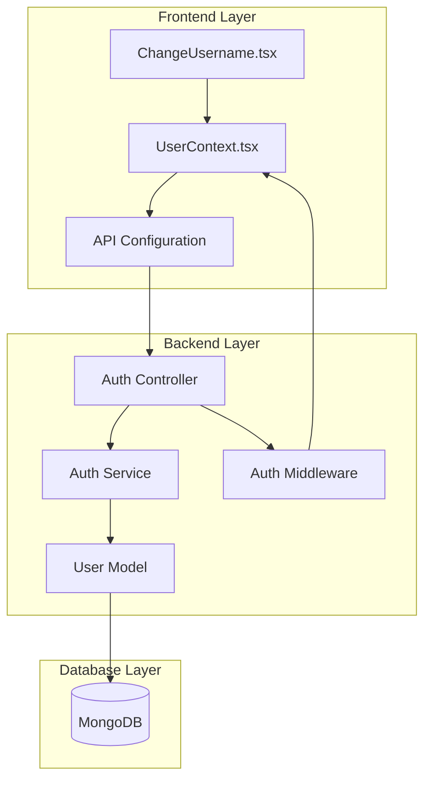
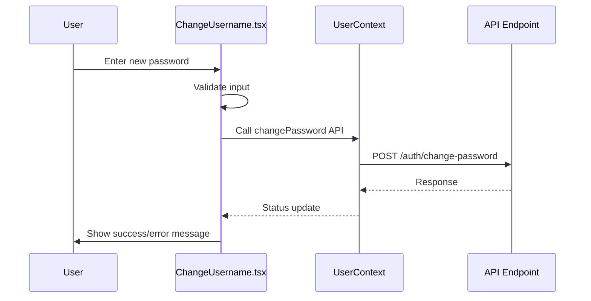
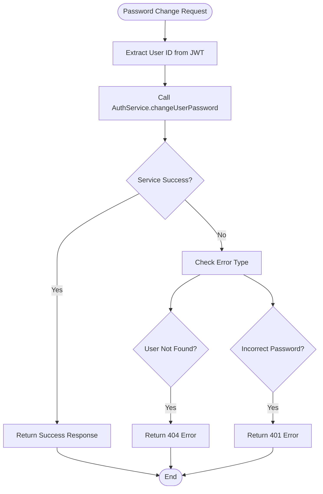
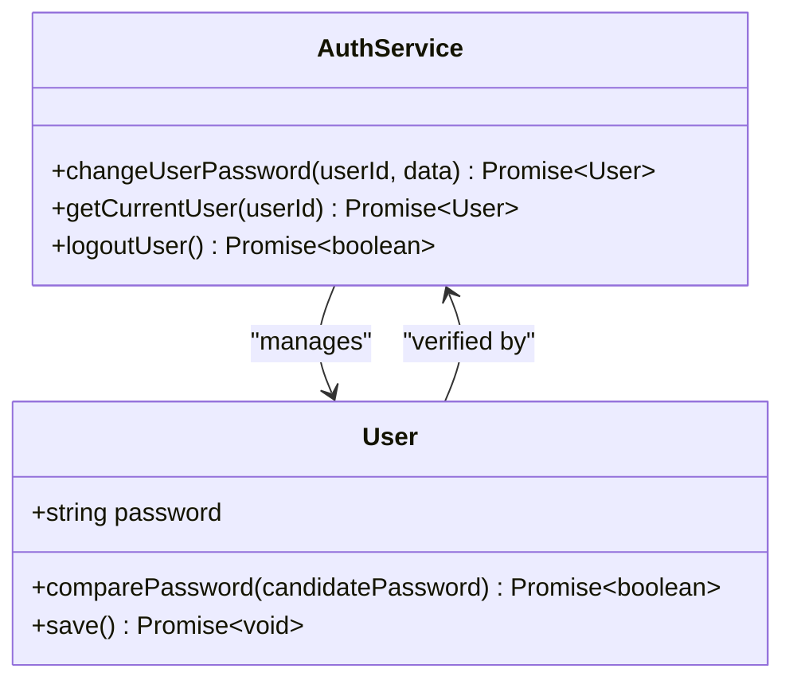
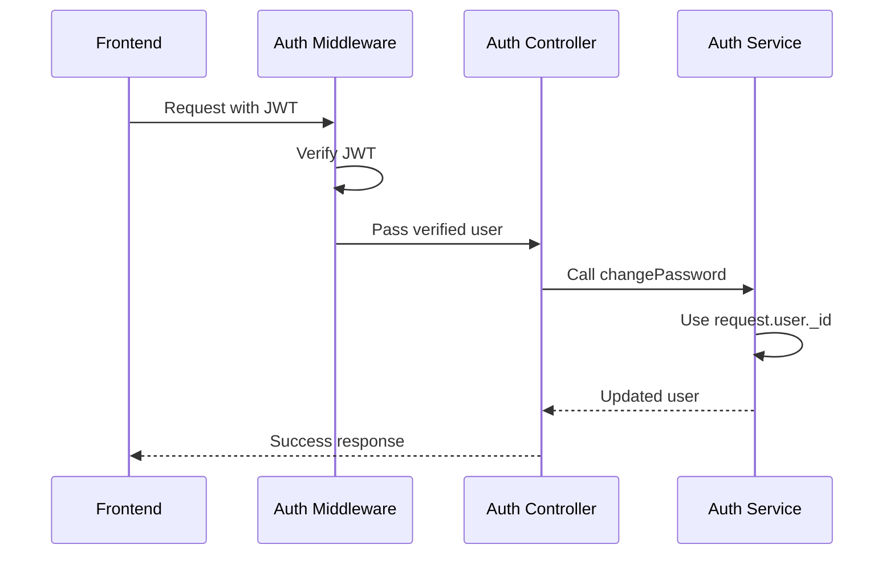

# Password Change Functionality

<cite>
**Referenced Files in This Document**
- [ChangeUsername.tsx](file://src/pages/ChangeUsername.tsx)
- [ForgotPassword.tsx](file://src/pages/ForgotPassword.tsx)
- [ResetPassword.tsx](file://src/pages/ResetPassword.tsx)
- [auth.controller.ts](file://api-fastify/src/controllers/auth.controller.ts)
- [auth.service.ts](file://api-fastify/src/services/auth.service.ts)
- [user.model.ts](file://api-fastify/src/models/user.model.ts)
- [auth.middleware.ts](file://api-fastify/src/middlewares/auth.middleware.ts)
- [auth.routes.ts](file://api-fastify/src/routes/auth.routes.ts)
- [auth.schema.ts](file://api-fastify/src/schemas/auth.schema.ts)
- [UserContext.tsx](file://src/UserContext.tsx)
- [api.config.ts](file://src/config/api.config.ts)
- [user.types.ts](file://api-fastify/src/types/user.types.ts)
- [auth.types.ts](file://api-fastify/src/types/auth.types.ts)
- [user.controller.ts](file://api-fastify/src/controllers/user.controller.ts)
</cite>

## Table of Contents
1. [Introduction](#introduction)
2. [System Architecture](#system-architecture)
3. [Frontend Implementation](#frontend-implementation)
4. [Backend Implementation](#backend-implementation)
5. [Security Measures](#security-measures)
6. [Authentication Integration](#authentication-integration)
7. [Error Handling](#error-handling)
8. [Common Issues and Solutions](#common-issues-and-solutions)
9. [Best Practices](#best-practices)
10. [Troubleshooting Guide](#troubleshooting-guide)

## Introduction

The password change functionality in MERN_chatai_blog provides authenticated users with the ability to update their existing password securely. This system implements a comprehensive security model that requires users to verify their current password before allowing updates, ensuring that unauthorized changes cannot occur.

The implementation spans both frontend and backend components, featuring robust validation, secure password handling, and seamless integration with the existing authentication system. The system maintains session continuity and provides appropriate feedback to users throughout the process.

## System Architecture

The password change system follows a layered architecture pattern with clear separation of concerns between presentation, business logic, and data persistence layers.



**Diagram sources**
- [ChangeUsername.tsx](file://src/pages/ChangeUsername.tsx#L1-L231)
- [UserContext.tsx](file://src/UserContext.tsx#L1-L312)
- [auth.controller.ts](file://api-fastify/src/controllers/auth.controller.ts#L180-L200)
- [auth.service.ts](file://api-fastify/src/services/auth.service.ts#L190-L220)

## Frontend Implementation

### ChangeUsername Component

The ChangeUsername component serves as the primary interface for password change operations. While named "ChangeUsername," it demonstrates the pattern used for password updates.



**Diagram sources**
- [ChangeUsername.tsx](file://src/pages/ChangeUsername.tsx#L80-L120)
- [UserContext.tsx](file://src/UserContext.tsx#L200-L250)

The frontend implementation includes comprehensive validation and user feedback mechanisms:

- **Input Validation**: Ensures passwords meet minimum length requirements
- **Real-time Feedback**: Provides immediate validation feedback
- **Loading States**: Shows progress indicators during API calls
- **Error Handling**: Displays meaningful error messages without revealing sensitive information

**Section sources**
- [ChangeUsername.tsx](file://src/pages/ChangeUsername.tsx#L40-L80)
- [UserContext.tsx](file://src/UserContext.tsx#L200-L280)

### API Configuration

The frontend communicates with the backend through a centralized API configuration that defines all endpoints:

```typescript
// Password change endpoint
users: {
  changePassword: `${API_BASE_URL}/auth/change-password`,
}
```

**Section sources**
- [api.config.ts](file://src/config/api.config.ts#L30-L50)

## Backend Implementation

### Authentication Controller

The authentication controller handles the password change request and coordinates with the service layer:



**Diagram sources**
- [auth.controller.ts](file://api-fastify/src/controllers/auth.controller.ts#L180-L200)

The controller implements proper error handling with appropriate HTTP status codes:

- **200 OK**: Successful password change
- **401 Unauthorized**: Incorrect current password
- **404 Not Found**: User not found
- **500 Internal Server Error**: Unexpected errors

**Section sources**
- [auth.controller.ts](file://api-fastify/src/controllers/auth.controller.ts#L180-L200)

### Authentication Service

The authentication service contains the core password change logic:



**Diagram sources**
- [auth.service.ts](file://api-fastify/src/services/auth.service.ts#L190-L220)
- [user.model.ts](file://api-fastify/src/models/user.model.ts#L60-L70)

The service implements the following critical steps:

1. **User Verification**: Finds the user by ID
2. **Password Validation**: Uses `comparePassword()` method to verify current password
3. **Password Update**: Updates the password field
4. **Persistence**: Saves the updated user record

**Section sources**
- [auth.service.ts](file://api-fastify/src/services/auth.service.ts#L190-L220)

### User Model Implementation

The user model provides the `comparePassword` method for secure password verification:

```typescript
// Method for comparing passwords
userSchema.methods.comparePassword = async function (candidatePassword: string): Promise<boolean> {
  try {
    return await bcrypt.compare(candidatePassword, this.password);
  } catch (error) {
    throw error;
  }
};
```

The model also includes automatic password hashing during save operations:

```typescript
// Middleware for password hashing
userSchema.pre('save', async function (next) {
  if (!this.isModified('password')) return next();
  
  try {
    const salt = await bcrypt.genSalt(10);
    this.password = await bcrypt.hash(this.password as string, salt);
    next();
  } catch (error: any) {
    next(error);
  }
});
```

**Section sources**
- [user.model.ts](file://api-fastify/src/models/user.model.ts#L60-L80)

## Security Measures

### Password Verification

The system implements multiple layers of security to protect against unauthorized password changes:

1. **Current Password Requirement**: Users must provide their current password to initiate a change
2. **Secure Comparison**: Uses bcrypt's `compare` method for timing-safe password verification
3. **Error Message Protection**: Returns generic error messages to prevent account enumeration attacks

### Token Management

Upon successful password change, the system clears any reset tokens to enhance security:

```typescript
// Clear reset tokens after password change
user.resetPasswordToken = undefined;
user.resetPasswordExpires = undefined;
await user.save();
```

### Session Continuity

The password change operation maintains session continuity by:

- Preserving the existing JWT token
- Allowing continued access without re-authentication
- Maintaining user context state

**Section sources**
- [auth.service.ts](file://api-fastify/src/services/auth.service.ts#L200-L220)

## Authentication Integration

### JWT-Based Authentication

The system uses JSON Web Tokens for authentication, with the user ID embedded in the token payload:



**Diagram sources**
- [auth.middleware.ts](file://api-fastify/src/middlewares/auth.middleware.ts#L10-L30)
- [auth.controller.ts](file://api-fastify/src/controllers/auth.controller.ts#L180-L190)

### Middleware Protection

The password change endpoint is protected by the authentication middleware:

```typescript
fastify.post('/change-password', {
  schema: changePasswordSchema,
  preHandler: [authenticate],
}, AuthController.changePassword);
```

**Section sources**
- [auth.routes.ts](file://api-fastify/src/routes/auth.routes.ts#L35-L40)

## Error Handling

### Frontend Error Handling

The frontend implements comprehensive error handling with user-friendly messages:

```typescript
// Error handling in ChangeUsername component
try {
  const response = await fetch(API_ENDPOINTS.users.changePassword, {
    method: "POST",
    headers: {
      "Content-Type": "application/json",
    },
    body: JSON.stringify({ currentPassword, newPassword }),
    credentials: "include",
  });
  
  if (!response.ok) {
    const errorData = await response.json();
    setErrorMessage(errorData.message || "Failed to change password");
  }
} catch (error) {
  setErrorMessage("An error occurred while changing password");
}
```

### Backend Error Handling

The backend provides structured error responses with appropriate HTTP status codes:

- **401 Unauthorized**: Current password is incorrect
- **404 Not Found**: User not found
- **500 Internal Server Error**: Unexpected errors

**Section sources**
- [ChangeUsername.tsx](file://src/pages/ChangeUsername.tsx#L100-L130)
- [auth.controller.ts](file://api-fastify/src/controllers/auth.controller.ts#L190-L210)

## Common Issues and Solutions

### Password Reuse Prevention

While not explicitly implemented in the current codebase, password reuse prevention can be added by:

1. Storing previous password hashes
2. Comparing new passwords against stored hashes
3. Rejecting passwords that match recent history

### Brute Force Protection

Implement rate limiting on password change endpoints:

```typescript
// Example rate limiting middleware
const rateLimit = require('express-rate-limit');

const passwordChangeLimiter = rateLimit({
  windowMs: 15 * 60 * 1000, // 15 minutes
  max: 5, // Limit each IP to 5 requests per windowMs
  message: 'Too many password change attempts, please try again later'
});
```

### Proper Error Messaging

Ensure error messages don't reveal account information:

```typescript
// Good: Generic error message
throw new Error('Current password is incorrect');

// Bad: Reveals account existence
throw new Error('User not found with provided current password');
```

## Best Practices

### Password Strength Requirements

Implement strong password policies:

- Minimum length of 8-12 characters
- Combination of uppercase, lowercase, numbers, and special characters
- No common passwords or dictionary words
- Regular password rotation recommendations

### Secure Communication

- Use HTTPS for all password-related communications
- Implement HSTS (HTTP Strict Transport Security)
- Validate all inputs on both client and server sides

### Audit Logging

Maintain audit logs for password changes:

```typescript
// Example audit logging
const auditLogger = {
  logPasswordChange: async (userId: string, ipAddress: string) => {
    // Log password change event
    await AuditLog.create({
      userId,
      action: 'PASSWORD_CHANGE',
      ipAddress,
      timestamp: new Date()
    });
  }
};
```

## Troubleshooting Guide

### Issue: Password Change Fails with "Current password is incorrect"

**Possible Causes:**
- User entered wrong current password
- Password comparison timing issue
- Database corruption or encoding problems

**Solutions:**
1. Verify the current password is correct
2. Check database character encoding
3. Review bcrypt configuration

### Issue: JWT Token Invalid After Password Change

**Possible Causes:**
- Token expiration not handled properly
- Session state not updated

**Solutions:**
1. Implement token refresh mechanism
2. Update user context after password change
3. Clear old tokens from client storage

### Issue: CORS or Cookie Problems

**Possible Causes:**
- Cross-origin request restrictions
- Cookie security settings

**Solutions:**
1. Configure CORS properly for API endpoints
2. Set appropriate cookie attributes (secure, httpOnly)
3. Verify cookie domain and path settings

**Section sources**
- [ChangeUsername.tsx](file://src/pages/ChangeUsername.tsx#L100-L150)
- [UserContext.tsx](file://src/UserContext.tsx#L250-L300)