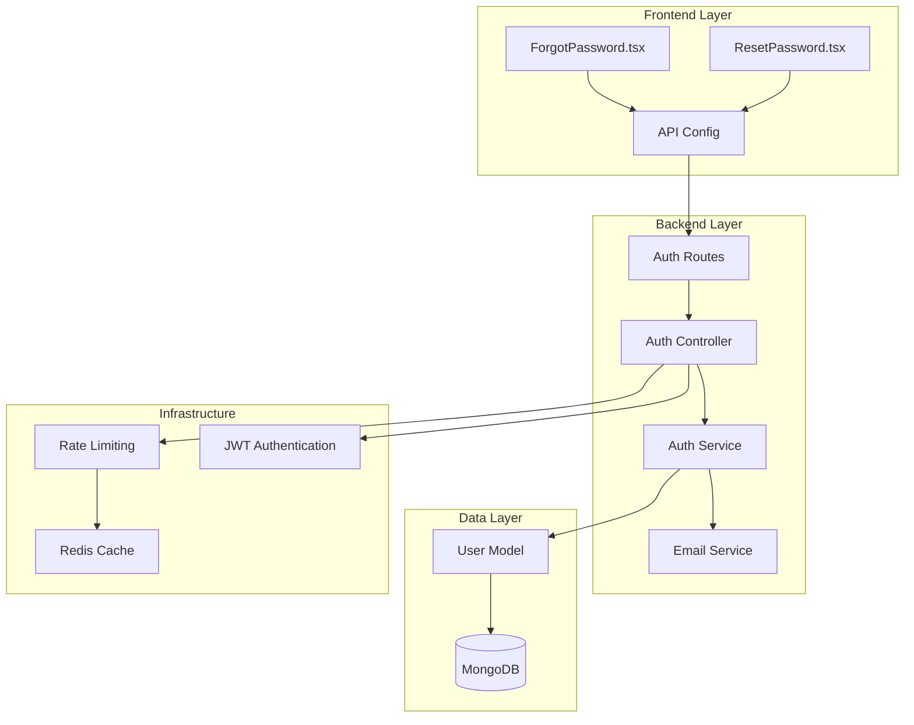
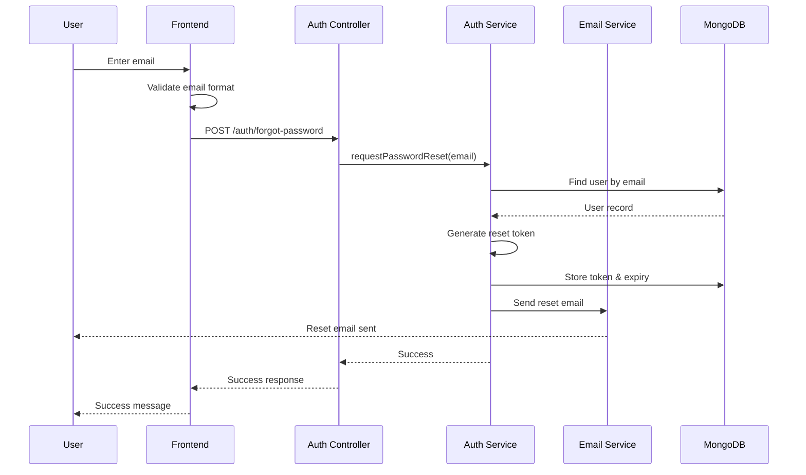
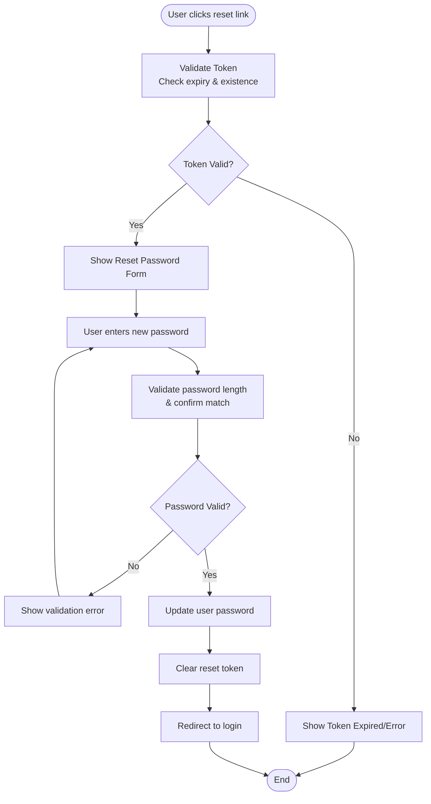
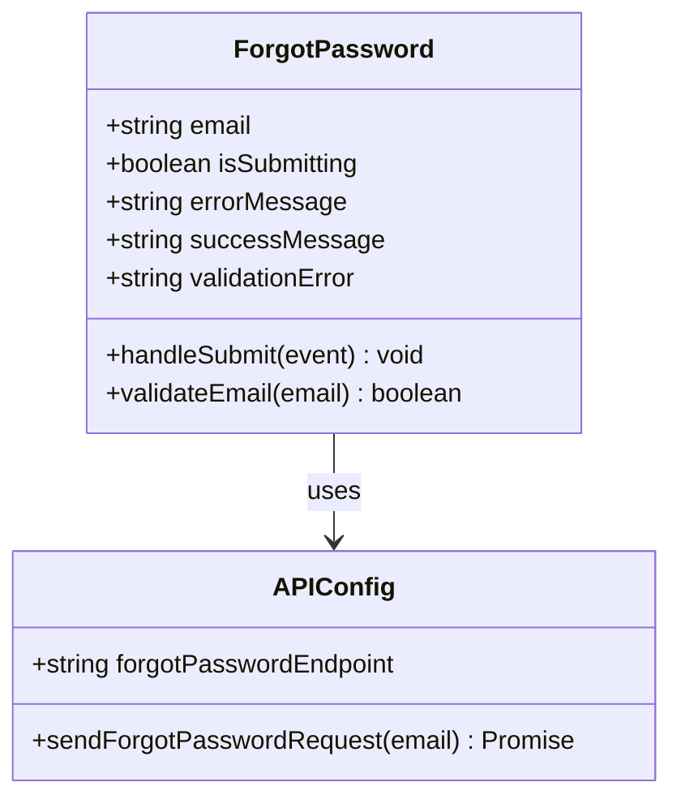
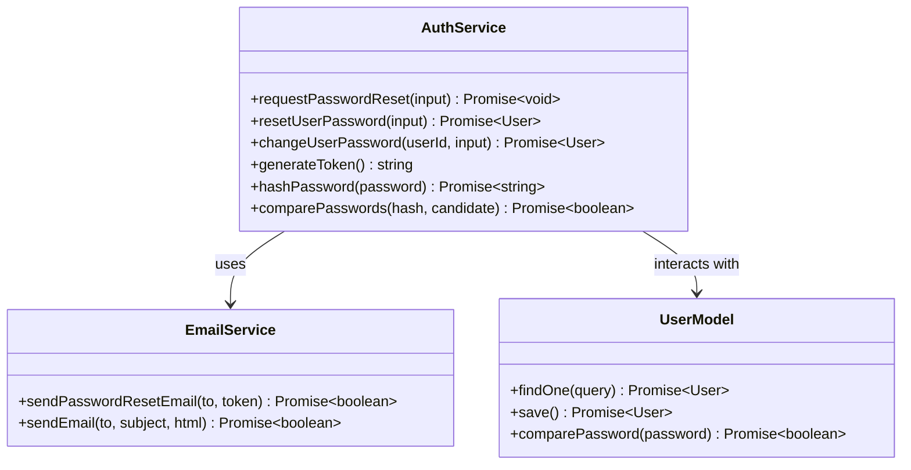

# Password Management System

<cite>
**Referenced Files in This Document**
- [ForgotPassword.tsx](file://src/pages/ForgotPassword.tsx)
- [ResetPassword.tsx](file://src/pages/ResetPassword.tsx)
- [auth.controller.ts](file://api-fastify/src/controllers/auth.controller.ts)
- [auth.service.ts](file://api-fastify/src/services/auth.service.ts)
- [user.model.ts](file://api-fastify/src/models/user.model.ts)
- [auth.schema.ts](file://api-fastify/src/schemas/auth.schema.ts)
- [auth.types.ts](file://api-fastify/src/types/auth.types.ts)
- [email.service.ts](file://api-fastify/src/services/email.service.ts)
- [api.config.ts](file://src/config/api.config.ts)
- [auth.routes.ts](file://api-fastify/src/routes/auth.routes.ts)
- [rate-limit.middleware.ts](file://api-fastify/src/middlewares/rate-limit.middleware.ts)
- [user.types.ts](file://api-fastify/src/types/user.types.ts)
</cite>

## Table of Contents
1. [Introduction](#introduction)
2. [System Architecture](#system-architecture)
3. [Forgot Password Workflow](#forgot-password-workflow)
4. [Password Reset Process](#password-reset-process)
5. [Frontend Components](#frontend-components)
6. [Backend Services](#backend-services)
7. [Security Implementation](#security-implementation)
8. [Error Handling](#error-handling)
9. [Performance Considerations](#performance-considerations)
10. [Troubleshooting Guide](#troubleshooting-guide)
11. [Best Practices](#best-practices)

## Introduction

The MERN_chatai_blog password management system provides a comprehensive solution for password recovery and change functionality. Built with security as a primary concern, the system implements industry-standard practices including token-based authentication, rate limiting, and secure email delivery mechanisms.

The system consists of two main components: a forgot password mechanism that allows users to request password resets via email, and a password reset process that securely updates user passwords using temporary tokens. Both components are designed with user experience in mind while maintaining robust security measures.

## System Architecture

The password management system follows a layered architecture with clear separation of concerns between frontend presentation, backend controllers, and data persistence layers.



**Diagram sources**
- [auth.routes.ts](file://api-fastify/src/routes/auth.routes.ts#L1-L73)
- [auth.controller.ts](file://api-fastify/src/controllers/auth.controller.ts#L1-L330)
- [auth.service.ts](file://api-fastify/src/services/auth.service.ts#L1-L191)

**Section sources**
- [auth.routes.ts](file://api-fastify/src/routes/auth.routes.ts#L1-L73)
- [auth.controller.ts](file://api-fastify/src/controllers/auth.controller.ts#L1-L330)
- [auth.service.ts](file://api-fastify/src/services/auth.service.ts#L1-L191)

## Forgot Password Workflow

The forgot password process begins when a user requests a password reset by entering their email address. The system validates the input, generates a secure token, stores it in the database, and sends an email with a secure reset link.



**Diagram sources**
- [ForgotPassword.tsx](file://src/pages/ForgotPassword.tsx#L30-L60)
- [auth.controller.ts](file://api-fastify/src/controllers/auth.controller.ts#L120-L140)
- [auth.service.ts](file://api-fastify/src/services/auth.service.ts#L120-L150)

### Token Generation and Storage

The system generates cryptographically secure tokens using Node.js built-in capabilities. These tokens are stored temporarily in the user's database record along with an expiration timestamp.

```typescript
// Token generation in auth.service.ts
const resetToken = generateToken(); // Cryptographically secure token
const resetExpires = new Date(Date.now() + 3600000); // 1 hour expiry

// Storing in user model
user.resetPasswordToken = resetToken;
user.resetPasswordExpires = resetExpires;
await user.save();
```

The User model includes dedicated fields for password reset tokens:

```typescript
resetPasswordToken: String,
resetPasswordExpires: Date,
```

**Section sources**
- [auth.service.ts](file://api-fastify/src/services/auth.service.ts#L120-L150)
- [user.model.ts](file://api-fastify/src/models/user.model.ts#L40-L45)

## Password Reset Process

The password reset process involves validating the reset token, authenticating the user, and securely updating the password. The system ensures that tokens are single-use and expire after a short period.



**Diagram sources**
- [ResetPassword.tsx](file://src/pages/ResetPassword.tsx#L50-L120)
- [auth.service.ts](file://api-fastify/src/services/auth.service.ts#L150-L191)

### Token Validation Process

The system performs multiple layers of validation when processing reset requests:

1. **Token Existence**: Verifies the token exists in the database
2. **Expiry Check**: Ensures the token hasn't expired (1-hour validity)
3. **User Verification**: Confirms the associated user account exists

```typescript
// Token validation in auth.service.ts
const user = await User.findOne({
  resetPasswordToken: token,
  resetPasswordExpires: { $gt: Date.now() },
});
```

**Section sources**
- [auth.service.ts](file://api-fastify/src/services/auth.service.ts#L150-L170)

## Frontend Components

The frontend implementation consists of two main React components that handle the user interface for password management.

### ForgotPassword Component

The ForgotPassword component provides a clean, user-friendly interface for requesting password resets. It includes real-time validation, loading states, and appropriate feedback messages.



**Diagram sources**
- [ForgotPassword.tsx](file://src/pages/ForgotPassword.tsx#L1-L192)

Key features of the ForgotPassword component:

- **Real-time Email Validation**: Validates email format before submission
- **Loading States**: Shows spinner during API calls
- **Error Handling**: Provides clear error messages for various failure scenarios
- **Success Feedback**: Confirms successful email delivery
- **Security**: Prevents information disclosure by showing generic success messages

### ResetPassword Component

The ResetPassword component handles the actual password reset process, including form validation, password strength enforcement, and automatic redirection after successful completion.

```typescript
// Form validation in ResetPassword.tsx
const validateForm = (): boolean => {
  const newErrors: ValidationErrors = {};
  let isValid = true;

  // Password validation
  if (!password) {
    newErrors.password = "Le mot de passe est requis";
    isValid = false;
  } else if (password.length < 6) {
    newErrors.password = "Le mot de passe doit contenir au moins 6 caractères";
    isValid = false;
  }

  // Password confirmation
  if (password !== confirmPassword) {
    newErrors.confirmPassword = "Les mots de passe ne correspondent pas";
    isValid = false;
  }

  return isValid;
};
```

**Section sources**
- [ForgotPassword.tsx](file://src/pages/ForgotPassword.tsx#L30-L60)
- [ResetPassword.tsx](file://src/pages/ResetPassword.tsx#L50-L120)

## Backend Services

The backend implementation follows a service-oriented architecture with clear separation between controllers, services, and data models.

### Auth Service Implementation

The Auth service encapsulates all password-related business logic, including token generation, validation, and password updates.



**Diagram sources**
- [auth.service.ts](file://api-fastify/src/services/auth.service.ts#L1-L191)
- [email.service.ts](file://api-fastify/src/services/email.service.ts#L1-L84)

### Token Security Features

The system implements several security measures for token management:

1. **Cryptographic Security**: Uses Node.js crypto module for token generation
2. **Short Expiration**: Tokens expire after 1 hour
3. **Single-Use**: Tokens are cleared after successful password reset
4. **Secure Storage**: Tokens are hashed before storage in the database
5. **Rate Limiting**: Prevents abuse through IP-based throttling

```typescript
// Token generation with cryptographic security
const generateToken = () => {
  return crypto.randomBytes(32).toString('hex');
};
```

**Section sources**
- [auth.service.ts](file://api-fastify/src/services/auth.service.ts#L120-L150)
- [email.service.ts](file://api-fastify/src/services/email.service.ts#L50-L84)

## Security Implementation

The password management system implements multiple layers of security to protect against common attacks and vulnerabilities.

### Rate Limiting

The system employs sophisticated rate limiting to prevent brute force attacks and abuse:

```typescript
// Rate limiting configuration for password reset
export const passwordResetRateLimit = createRateLimitMiddleware({
  windowMs: 60 * 60 * 1000, // 1 hour
  maxRequests: 5, // Maximum 5 requests per hour
  keyGenerator: (request: FastifyRequest) => request.ip,
});
```

### Email Security

Email delivery includes several security considerations:

- **HTTPS Links**: All reset links use HTTPS protocol
- **Token Embedding**: Tokens are embedded in URLs rather than cookies
- **Expiration**: Tokens expire after 1 hour
- **Generic Responses**: Email delivery responses don't reveal user existence

### Password Security

The system implements industry-standard password security practices:

```typescript
// Password hashing with bcrypt
userSchema.pre('save', async function (next) {
  if (!this.isModified('password')) return next();
  
  const salt = await bcrypt.genSalt(10);
  this.password = await bcrypt.hash(this.password, salt);
  next();
});
```

**Section sources**
- [rate-limit.middleware.ts](file://api-fastify/src/middlewares/rate-limit.middleware.ts#L1-L92)
- [user.model.ts](file://api-fastify/src/models/user.model.ts#L50-L70)

## Error Handling

The system implements comprehensive error handling across all layers to provide meaningful feedback while maintaining security.

### Frontend Error Handling

Frontend components handle various error scenarios gracefully:

```typescript
// Error handling in ForgotPassword
try {
  const response = await fetch(API_ENDPOINTS.auth.forgotPassword, {
    method: "POST",
    headers: { "Content-Type": "application/json" },
    body: JSON.stringify({ email }),
  });

  if (!response.ok) {
    const errorData = await response.json();
    setErrorMessage(errorData.message || "Une erreur s'est produite");
  }
} catch (error) {
  setErrorMessage("Impossible de se connecter au serveur");
}
```

### Backend Error Handling

Backend controllers implement structured error handling:

```typescript
// Error handling in auth.controller.ts
catch (error) {
  request.log.error(error);
  
  if (error instanceof Error && error.message.includes('invalide')) {
    return reply.status(400).send({ message: error.message });
  }
  
  return reply.status(500).send({
    message: 'Une erreur est survenue lors de la réinitialisation du mot de passe',
  });
}
```

**Section sources**
- [ForgotPassword.tsx](file://src/pages/ForgotPassword.tsx#L40-L70)
- [auth.controller.ts](file://api-fastify/src/controllers/auth.controller.ts#L140-L160)

## Performance Considerations

The system is designed with performance in mind, incorporating caching and efficient database queries.

### Caching Strategy

While not explicitly shown in the current implementation, the system architecture supports Redis caching for rate limiting and potentially for storing frequently accessed tokens.

### Database Optimization

The User model includes appropriate indexes for password reset operations:

```typescript
// Indexes for password reset operations
{
  resetPasswordToken: 1,
  resetPasswordExpires: 1
}
```

### Email Delivery Optimization

Email service includes error handling and fallback mechanisms to ensure reliable delivery while minimizing impact on the main application flow.

## Troubleshooting Guide

Common issues and their solutions in the password management system:

### Token Expiration Issues

**Problem**: Users receive "Token expired" errors
**Solution**: 
- Verify system clock synchronization
- Check token expiration logic (1-hour validity)
- Ensure proper cleanup of expired tokens

### Email Delivery Failures

**Problem**: Password reset emails not received
**Solution**:
- Verify SMTP configuration in environment variables
- Check email service initialization
- Test email service independently

### Rate Limiting Issues

**Problem**: Users blocked by rate limits
**Solution**:
- Review rate limiting configuration
- Check IP-based blocking logic
- Implement user-friendly rate limit messaging

### Frontend Validation Problems

**Problem**: Form validation not working correctly
**Solution**:
- Verify React state management
- Check form submission handlers
- Ensure proper error state updates

**Section sources**
- [auth.service.ts](file://api-fastify/src/services/auth.service.ts#L150-L170)
- [email.service.ts](file://api-fastify/src/services/email.service.ts#L15-L40)

## Best Practices

### Security Best Practices

1. **Never Log Sensitive Information**: Tokens and passwords are never logged
2. **Use HTTPS Everywhere**: All communication uses encrypted connections
3. **Implement Rate Limiting**: Prevents brute force attacks
4. **Validate All Inputs**: Frontend and backend validation
5. **Use Secure Defaults**: Conservative security settings by default

### Development Best Practices

1. **Follow Clean Architecture**: Clear separation of concerns
2. **Implement Comprehensive Testing**: Unit and integration tests
3. **Use TypeScript**: Strong typing prevents runtime errors
4. **Document APIs**: Clear documentation for all endpoints
5. **Monitor Performance**: Track response times and error rates

### User Experience Best Practices

1. **Provide Clear Feedback**: Inform users of success/failure clearly
2. **Handle Errors Gracefully**: Don't expose technical details
3. **Maintain Consistent Design**: Unified look and feel across components
4. **Implement Progressive Enhancement**: Basic functionality works without JavaScript
5. **Consider Accessibility**: Proper ARIA labels and keyboard navigation

The MERN_chatai_blog password management system demonstrates a well-architected solution that balances security, usability, and maintainability. By following the documented patterns and practices, developers can extend and maintain the system effectively while ensuring user data remains protected.