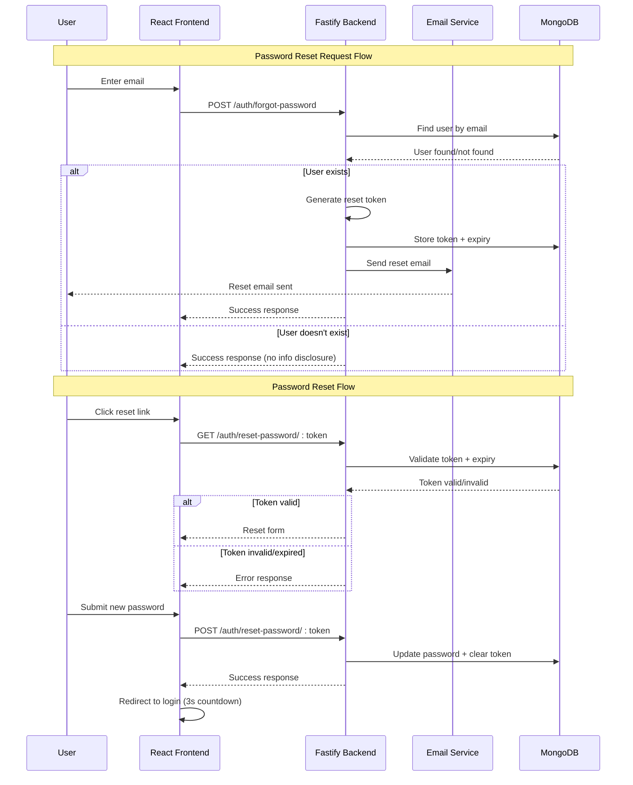
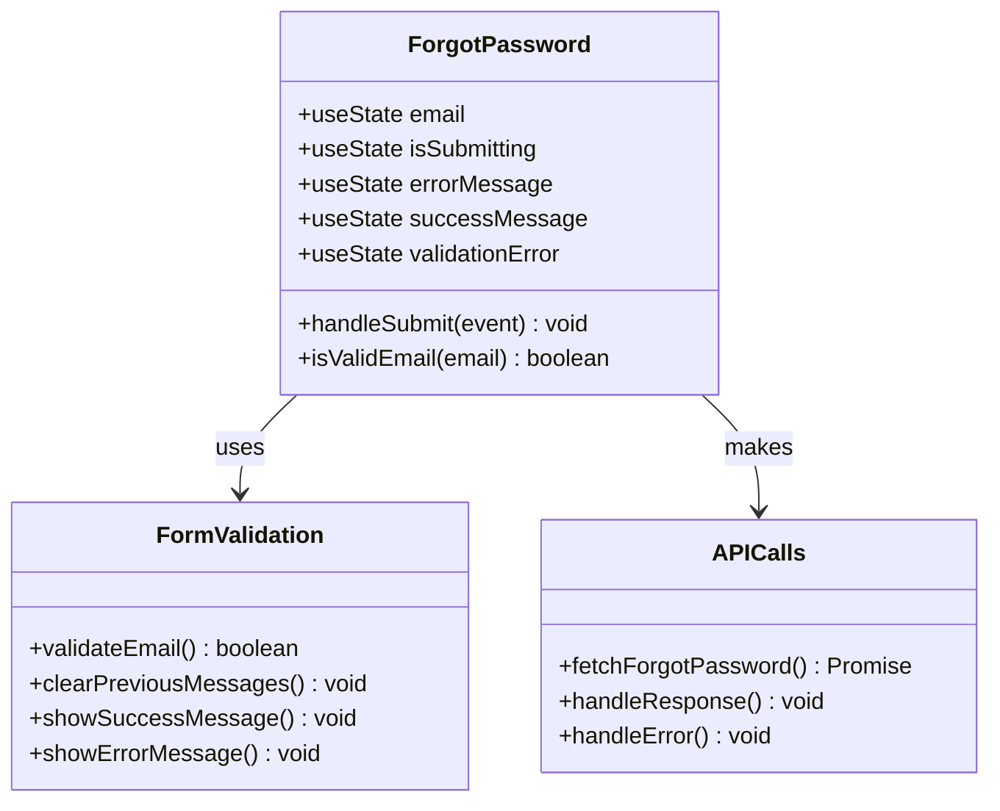
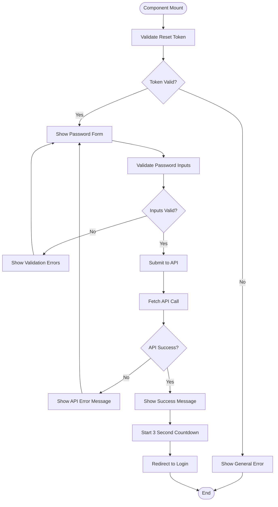
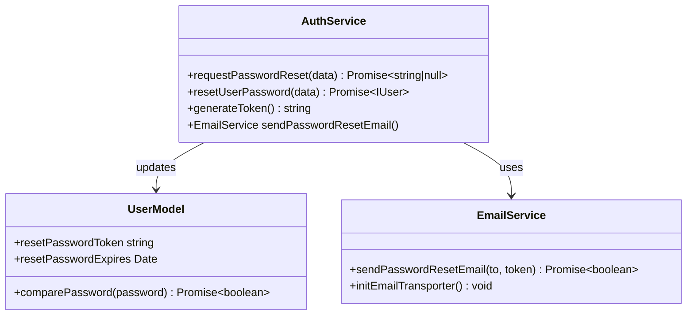

# Password Reset Functionality

<cite>
**Referenced Files in This Document**
- [ForgotPassword.tsx](file://src/pages/ForgotPassword.tsx)
- [ResetPassword.tsx](file://src/pages/ResetPassword.tsx)
- [auth.service.ts](file://api-fastify/src/services/auth.service.ts)
- [auth.controller.ts](file://api-fastify/src/controllers/auth.controller.ts)
- [email.service.ts](file://api-fastify/src/services/email.service.ts)
- [user.model.ts](file://api-fastify/src/models/user.model.ts)
- [auth.schema.ts](file://api-fastify/src/schemas/auth.schema.ts)
- [auth.types.ts](file://api-fastify/src/types/auth.types.ts)
- [user.types.ts](file://api-fastify/src/types/user.types.ts)
- [auth.routes.ts](file://api-fastify/src/routes/auth.routes.ts)
- [api.config.ts](file://src/config/api.config.ts)
</cite>

## Table of Contents
1. [Introduction](#introduction)
2. [System Architecture](#system-architecture)
3. [Frontend Implementation](#frontend-implementation)
4. [Backend Implementation](#backend-implementation)
5. [Security Features](#security-features)
6. [Error Handling](#error-handling)
7. [API Integration](#api-integration)
8. [User Experience](#user-experience)
9. [Common Issues and Solutions](#common-issues-and-solutions)
10. [Best Practices](#best-practices)

## Introduction

The password reset functionality in MERN_chatai_blog provides a secure and user-friendly mechanism for users to recover access to their accounts when they forget their passwords. This system implements a time-limited token-based approach that ensures security while maintaining usability.

The implementation consists of two main components:
- **Frontend**: React components (`ForgotPassword.tsx` and `ResetPassword.tsx`) that handle user interaction and form validation
- **Backend**: Express.js service layer (`auth.service.ts`) that manages token generation, storage, and validation

## System Architecture

The password reset system follows a secure token-based workflow with comprehensive validation and error handling at each stage.



**Diagram sources**
- [ForgotPassword.tsx](file://src/pages/ForgotPassword.tsx#L30-L60)
- [ResetPassword.tsx](file://src/pages/ResetPassword.tsx#L73-L123)
- [auth.service.ts](file://api-fastify/src/services/auth.service.ts#L138-L191)

## Frontend Implementation

### ForgotPassword Component

The `ForgotPassword.tsx` component handles the initial password reset request form and provides comprehensive user feedback.



**Diagram sources**
- [ForgotPassword.tsx](file://src/pages/ForgotPassword.tsx#L10-L45)

#### Key Features:

1. **Form Validation**: Comprehensive email validation using regex pattern
2. **UI State Management**: Separate state for different types of messages
3. **Loading States**: Visual feedback during API calls
4. **Error Handling**: Graceful error display with user-friendly messages
5. **Success Feedback**: Clear indication of successful email delivery

#### Implementation Details:

The component uses React's `useState` hook for managing form state and UI feedback:

```typescript
// Form state management
const [email, setEmail] = useState<string>("");
const [isSubmitting, setIsSubmitting] = useState<boolean>(false);
const [errorMessage, setErrorMessage] = useState<string | null>(null);
const [successMessage, setSuccessMessage] = useState<string | null>(null);
const [validationError, setValidationError] = useState<string | null>(null);
```

**Section sources**
- [ForgotPassword.tsx](file://src/pages/ForgotPassword.tsx#L10-L45)

### ResetPassword Component

The `ResetPassword.tsx` component handles the password reset form with advanced validation and countdown redirection.



**Diagram sources**
- [ResetPassword.tsx](file://src/pages/ResetPassword.tsx#L33-L76)
- [ResetPassword.tsx](file://src/pages/ResetPassword.tsx#L73-L123)

#### Advanced Features:

1. **Token Validation**: Validates reset token presence and validity
2. **Password Validation**: Ensures password meets minimum length requirements
3. **Confirmation Validation**: Verifies password confirmation matches
4. **Countdown Redirection**: Automatic redirect after successful reset
5. **Real-time Error Clearing**: Clears validation errors when user modifies input

**Section sources**
- [ResetPassword.tsx](file://src/pages/ResetPassword.tsx#L15-L76)
- [ResetPassword.tsx](file://src/pages/ResetPassword.tsx#L73-L123)

## Backend Implementation

### Authentication Service

The `auth.service.ts` module contains the core business logic for password reset functionality.



**Diagram sources**
- [auth.service.ts](file://api-fastify/src/services/auth.service.ts#L138-L191)
- [user.model.ts](file://api-fastify/src/models/user.model.ts#L1-L96)
- [email.service.ts](file://api-fastify/src/services/email.service.ts#L1-L83)

#### Core Functions:

1. **Token Generation**: Creates cryptographically secure random tokens
2. **Database Updates**: Stores tokens with expiration timestamps
3. **Email Delivery**: Sends secure reset links via configured email service
4. **Token Validation**: Verifies tokens haven't expired before allowing password updates

#### Implementation Details:

The service implements several critical security measures:

```typescript
// Generate a secure random token
const resetToken = generateToken();
const resetExpires = new Date(Date.now() + 3600000); // 1 hour expiry

// Store in user document
user.resetPasswordToken = resetToken;
user.resetPasswordExpires = resetExpires;
await user.save();
```

**Section sources**
- [auth.service.ts](file://api-fastify/src/services/auth.service.ts#L138-L191)

### Database Schema Changes

The user model was extended to support password reset functionality:

```typescript
interface IUser extends Document {
  // ... existing fields ...
  resetPasswordToken?: string;
  resetPasswordExpires?: Date;
}
```

The schema includes automatic removal of sensitive fields in API responses:

```typescript
toJSON: {
  transform: (_, ret) => {
    delete ret.password;
    delete ret.verificationToken;
    delete ret.resetPasswordToken;
    delete ret.resetPasswordExpires;
    return ret;
  },
}
```

**Section sources**
- [user.model.ts](file://api-fastify/src/models/user.model.ts#L1-L96)

### Email Service Integration

The email service provides secure email delivery for password reset links:

```typescript
export const sendPasswordResetEmail = async (
  to: string,
  token: string
): Promise<boolean> => {
  const appUrl = process.env.APP_URL || 'http://localhost:3000';
  const resetUrl = `${appUrl}/reset-password?token=${token}`;

  const subject = 'Réinitialisation de votre mot de passe';
  const html = `
    <h1>Réinitialisation de votre mot de passe</h1>
    <p>Vous avez demandé la réinitialisation de votre mot de passe.</p>
    <p>Cliquez sur le lien ci-dessous pour réinitialiser votre mot de passe :</p>
    <p><a href="${resetUrl}">Réinitialiser mon mot de passe</a></p>
    <p>Ce lien est valable pendant 1 heure.</p>
    <p>Si vous n'avez pas demandé la réinitialisation de votre mot de passe, ignorez cet email.</p>
  `;

  return sendEmail(to, subject, html);
};
```

**Section sources**
- [email.service.ts](file://api-fastify/src/services/email.service.ts#L50-L83)

## Security Features

### Token Expiration

All password reset tokens have a strict 1-hour expiration window:

```typescript
const resetExpires = new Date(Date.now() + 3600000); // 1 hour
```

During validation, the system checks both token existence and expiration:

```typescript
const user = await User.findOne({
  resetPasswordToken: token,
  resetPasswordExpires: { $gt: Date.now() },
});
```

### Enumeration Attack Protection

The system protects against user enumeration attacks by returning identical responses regardless of whether the email exists:

```typescript
if (!user) {
  return null; // No information disclosure
}
```

### Concurrent Reset Prevention

Each user can only have one active reset token at a time. New requests overwrite existing tokens:

```typescript
user.resetPasswordToken = resetToken;
user.resetPasswordExpires = resetExpires;
await user.save();
```

### Password Validation

Both frontend and backend enforce strong password requirements:

- Minimum 6 characters
- Strong password policies enforced by backend
- Password confirmation validation

**Section sources**
- [auth.service.ts](file://api-fastify/src/services/auth.service.ts#L145-L155)
- [ForgotPassword.tsx](file://src/pages/ForgotPassword.tsx#L15-L25)
- [ResetPassword.tsx](file://src/pages/ResetPassword.tsx#L40-L55)

## Error Handling

### Frontend Error Management

The frontend implements comprehensive error handling with user-friendly messages:

```typescript
try {
  const response = await fetch(API_ENDPOINTS.auth.forgotPassword, {
    method: "POST",
    headers: { "Content-Type": "application/json" },
    body: JSON.stringify({ email }),
  });

  const data = await response.json();

  if (response.ok) {
    setSuccessMessage("Un email avec les instructions pour réinitialiser votre mot de passe...");
  } else {
    setErrorMessage(data.message || "Une erreur s'est produite. Veuillez réessayer.");
  }
} catch (error) {
  console.error("Error during password reset request:", error);
  setErrorMessage("Impossible de se connecter au serveur. Veuillez vérifier votre connexion...");
}
```

### Backend Error Handling

The backend provides structured error responses with appropriate HTTP status codes:

```typescript
try {
  await AuthService.requestPasswordReset(request.body);
  return reply.status(200).send({
    message: 'Si un compte existe avec cet email, un lien de réinitialisation a été envoyé.',
  });
} catch (error) {
  request.log.error(error);
  return reply.status(500).send({
    message: 'Une erreur est survenue lors de la demande de réinitialisation de mot de passe',
  });
}
```

**Section sources**
- [ForgotPassword.tsx](file://src/pages/ForgotPassword.tsx#L40-L65)
- [auth.controller.ts](file://api-fastify/src/controllers/auth.controller.ts#L100-L120)

## API Integration

### Endpoint Definitions

The API exposes dedicated endpoints for password reset functionality:

```typescript
export const API_ENDPOINTS = {
  auth: {
    forgotPassword: `${API_BASE_URL}/auth/forgot-password`,
    resetPassword: (token: string) => `${API_BASE_URL}/auth/reset-password/${token}`,
    // ... other endpoints
  },
};
```

### Request/Response Patterns

#### Forgot Password Request
```typescript
// Frontend
{
  method: "POST",
  headers: { "Content-Type": "application/json" },
  body: JSON.stringify({ email })
}

// Backend Schema
body: {
  type: 'object',
  required: ['email'],
  properties: { email: { type: 'string', format: 'email' } }
}
```

#### Reset Password Request
```typescript
// Frontend
{
  method: "POST",
  headers: { "Content-Type": "application/json" },
  body: JSON.stringify({ password })
}

// Backend Schema
body: {
  type: 'object',
  required: ['token', 'password'],
  properties: {
    token: { type: 'string' },
    password: { type: 'string', minLength: 6 }
  }
}
```

**Section sources**
- [api.config.ts](file://src/config/api.config.ts#L10-L20)
- [auth.schema.ts](file://api-fastify/src/schemas/auth.schema.ts#L97-L150)

## User Experience

### Progressive Disclosure

The system implements progressive disclosure of information:

1. **Initial Request**: Users only need to provide their email address
2. **Token Validation**: Only shown when accessing the reset link
3. **Password Reset**: Full form only appears when token is valid

### Visual Feedback

Comprehensive visual feedback throughout the process:

```typescript
// Loading states
<button disabled={isSubmitting}>
  {isSubmitting ? (
    <span className="flex items-center">
      <Loader2 className="h-4 w-4 animate-spin mr-2" />
      Envoi en cours...
    </span>
  ) : (
    "Récupérer mon mot de passe"
  )}
</button>
```

### Countdown Redirection

After successful password reset, users receive a 3-second countdown before automatic redirection:

```typescript
useEffect(() => {
  if (successMessage && countdown > 0) {
    const timer = setTimeout(() => {
      setCountdown(countdown - 1);
    }, 1000);
    return () => clearTimeout(timer);
  } else if (successMessage && countdown === 0) {
    navigate("/login_page");
  }
}, [successMessage, countdown, navigate]);
```

**Section sources**
- [ForgotPassword.tsx](file://src/pages/ForgotPassword.tsx#L165-L190)
- [ResetPassword.tsx](file://src/pages/ResetPassword.tsx#L33-L45)
- [ResetPassword.tsx](file://src/pages/ResetPassword.tsx#L161-L197)

## Common Issues and Solutions

### Email Delivery Failures

**Problem**: Password reset emails not reaching users

**Solutions**:
1. Verify email service configuration in environment variables
2. Check SMTP settings and credentials
3. Implement retry mechanisms for failed deliveries
4. Provide manual resend option

### Token Leakage Risks

**Problem**: Tokens exposed in browser history or logs

**Solutions**:
1. Use HTTPS exclusively for all communications
2. Implement token rotation for multiple reset attempts
3. Log token usage with IP tracking
4. Monitor for suspicious activity patterns

### Concurrent Reset Attempts

**Problem**: Multiple reset attempts causing confusion

**Solutions**:
1. Implement rate limiting on reset requests
2. Clear existing tokens before generating new ones
3. Notify users of pending reset attempts
4. Allow cancellation of pending resets

### UX Improvements for Countdown Redirects

**Problem**: Users missing the countdown redirect

**Solutions**:
1. Display countdown timer prominently
2. Provide manual redirect link
3. Implement session persistence across redirects
4. Show clear success indicators before redirect

## Best Practices

### Security Recommendations

1. **Token Storage**: Store tokens securely in database with proper indexing
2. **Expiration Handling**: Implement cleanup jobs for expired tokens
3. **Rate Limiting**: Apply rate limits to prevent abuse
4. **Logging**: Log all reset attempts with sufficient detail for auditing

### Performance Optimizations

1. **Database Indexing**: Index `resetPasswordToken` and `resetPasswordExpires` fields
2. **Caching**: Cache user lookups for frequently accessed emails
3. **Background Processing**: Use queue workers for email delivery
4. **Connection Pooling**: Optimize database connection management

### Monitoring and Maintenance

1. **Health Checks**: Monitor email service availability
2. **Error Tracking**: Implement comprehensive error reporting
3. **Usage Analytics**: Track reset request patterns
4. **Security Audits**: Regular security assessments of the reset flow

### Future Enhancements

1. **Multi-factor Authentication**: Integrate with MFA systems
2. **Security Questions**: Add additional verification methods
3. **Activity Notifications**: Notify users of password changes
4. **Audit Trails**: Maintain comprehensive audit logs

The password reset functionality in MERN_chatai_blog demonstrates a well-architected approach to account recovery that balances security, usability, and maintainability. The implementation follows industry best practices while providing a seamless user experience.