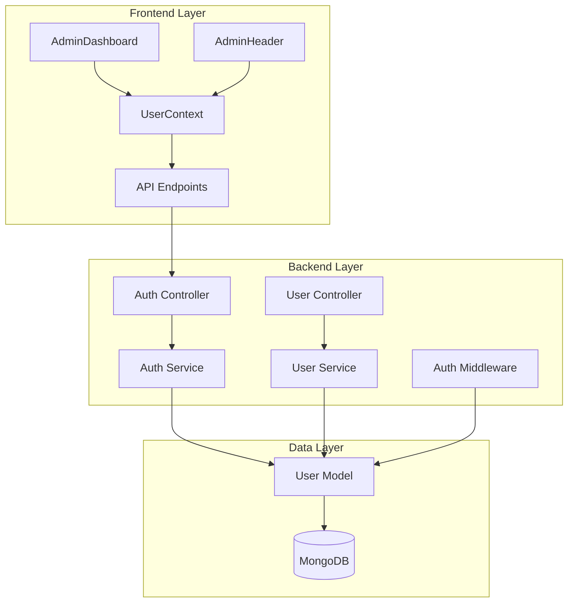
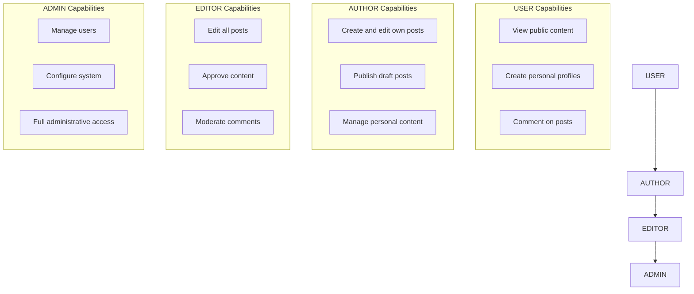
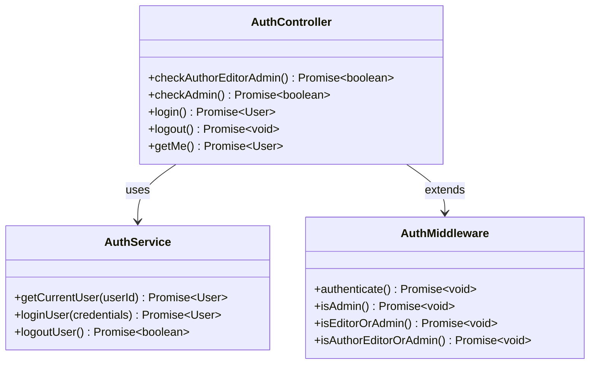
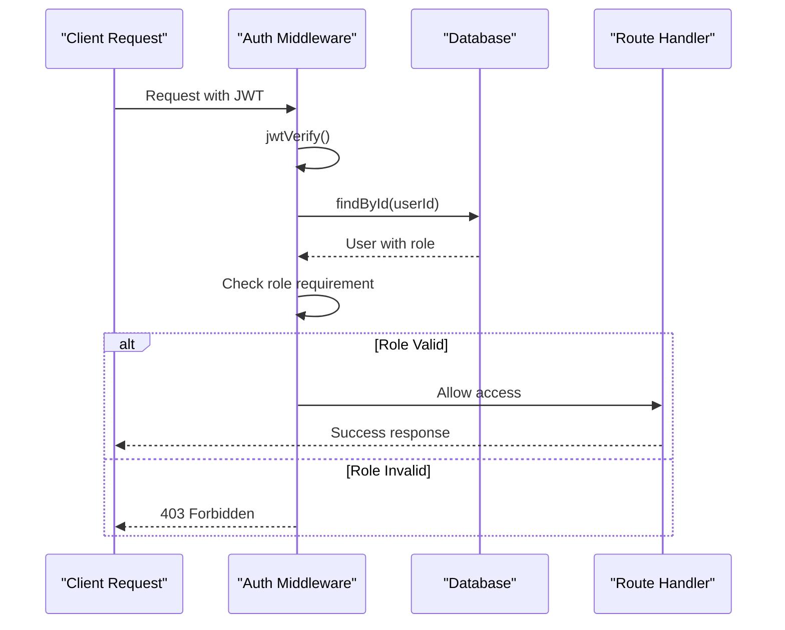
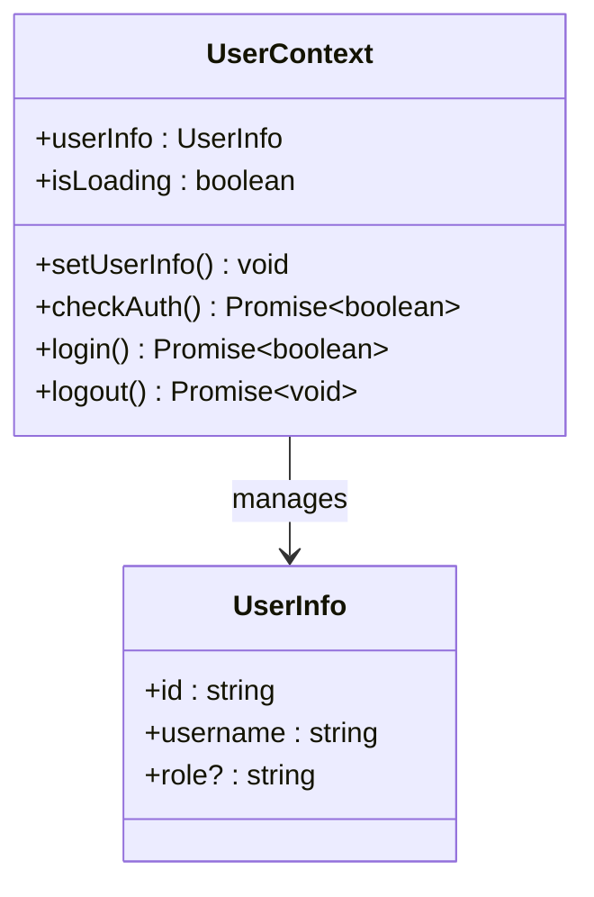
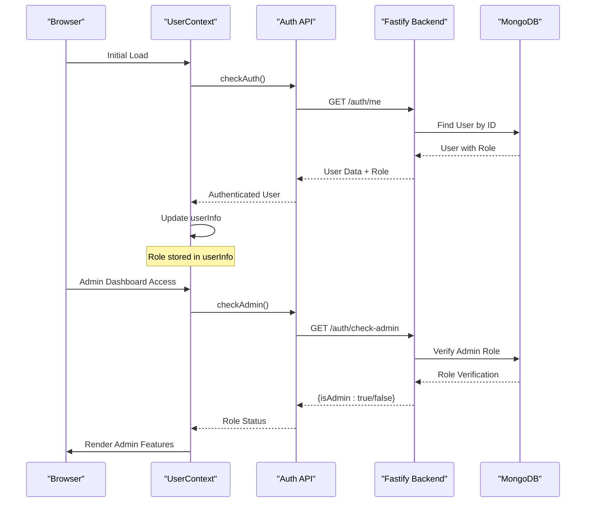

# Role-Based Access Control System

<cite>
**Referenced Files in This Document**
- [UserContext.tsx](file://src/UserContext.tsx)
- [auth.controller.ts](file://api-fastify/src/controllers/auth.controller.ts)
- [auth.service.ts](file://api-fastify/src/services/auth.service.ts)
- [user.types.ts](file://api-fastify/src/types/user.types.ts)
- [auth.middleware.ts](file://api-fastify/src/middlewares/auth.middleware.ts)
- [AdminDashboard.tsx](file://src/pages/AdminDashboard.tsx)
- [AdminHeader.tsx](file://src/components/AdminHeader.tsx)
- [user.model.ts](file://api-fastify/src/models/user.model.ts)
- [user.controller.ts](file://api-fastify/src/controllers/user.controller.ts)
- [user.service.ts](file://api-fastify/src/services/user.service.ts)
- [api.config.ts](file://src/config/api.config.ts)
- [auth.routes.ts](file://api-fastify/src/routes/auth.routes.ts)
</cite>

## Table of Contents
1. [Introduction](#introduction)
2. [System Architecture](#system-architecture)
3. [User Roles Definition](#user-roles-definition)
4. [Backend Implementation](#backend-implementation)
5. [Frontend Implementation](#frontend-implementation)
6. [Authentication Flow](#authentication-flow)
7. [Role Verification Mechanisms](#role-verification-mechanisms)
8. [Security Considerations](#security-considerations)
9. [Common Issues and Solutions](#common-issues-and-solutions)
10. [Best Practices](#best-practices)

## Introduction

The MERN_chatai_blog application implements a comprehensive role-based access control (RBAC) system that manages user permissions across different levels of functionality. The system defines four distinct user roles: USER, AUTHOR, EDITOR, and ADMIN, each with specific capabilities and restrictions.

This RBAC system ensures that users can only access features appropriate to their assigned role, maintaining security and preventing unauthorized access to sensitive administrative functions. The implementation spans both the frontend React application and the backend Fastify server, with seamless integration between the two systems.

## System Architecture

The role-based access control system follows a layered architecture with clear separation of concerns between authentication, authorization, and role management.



**Diagram sources**
- [UserContext.tsx](file://src/UserContext.tsx#L1-L312)
- [auth.controller.ts](file://api-fastify/src/controllers/auth.controller.ts#L1-L330)
- [auth.middleware.ts](file://api-fastify/src/middlewares/auth.middleware.ts#L1-L128)

## User Roles Definition

The system defines four hierarchical user roles, each with specific permissions and capabilities:

```typescript
export enum UserRole {
  USER = 'user',
  ADMIN = 'admin',
  EDITOR = 'editor',
  AUTHOR = 'author',
}
```

### Role Hierarchy and Permissions



**Diagram sources**
- [user.types.ts](file://api-fastify/src/types/user.types.ts#L6-L12)

**Section sources**
- [user.types.ts](file://api-fastify/src/types/user.types.ts#L6-L12)
- [user.model.ts](file://api-fastify/src/models/user.model.ts#L35-L40)

## Backend Implementation

The backend implementation handles authentication, role verification, and authorization through a combination of controllers, services, and middleware.

### Authentication Controllers

The authentication system consists of several specialized controllers that handle role-based access verification:



**Diagram sources**
- [auth.controller.ts](file://api-fastify/src/controllers/auth.controller.ts#L200-L330)
- [auth.service.ts](file://api-fastify/src/services/auth.service.ts#L1-L243)
- [auth.middleware.ts](file://api-fastify/src/middlewares/auth.middleware.ts#L1-L128)

### JWT Token Payload

When users authenticate, their role information is included in the JWT token payload:

```typescript
const token = await reply.jwtSign(
  {
    _id: user._id.toString(),
    email: user.email,
    username: user.username,
    role: user.role,
  },
  {
    expiresIn: process.env.JWT_EXPIRES_IN || '30d',
  }
);
```

This ensures that role information is immediately available to the frontend without requiring additional API calls.

**Section sources**
- [auth.controller.ts](file://api-fastify/src/controllers/auth.controller.ts#L40-L60)
- [auth.service.ts](file://api-fastify/src/services/auth.service.ts#L60-L85)

### Role Verification Endpoints

The system provides dedicated endpoints for role verification:

#### Check Author/Editor/Admin Endpoint
```typescript
export const checkAuthorEditorAdmin = async (
  request: FastifyRequest,
  reply: FastifyReply
) => {
  try {
    const userId = request.user._id;
    const user = await AuthService.getCurrentUser(userId);
    const isAuthorOrAdmin = user.role === UserRole.AUTHOR || 
                           user.role === UserRole.EDITOR || 
                           user.role === UserRole.ADMIN;
    
    return reply.status(200).send({ isAuthorOrAdmin });
  } catch (error) {
    return reply.status(500).send({
      message: 'Une erreur est survenue lors de la vérification des privilèges',
      isAuthorOrAdmin: false,
    });
  }
};
```

#### Check Admin Endpoint
```typescript
export const checkAdmin = async (
  request: FastifyRequest,
  reply: FastifyReply
) => {
  try {
    const userId = request.user._id;
    const user = await AuthService.getCurrentUser(userId);
    const isAdmin = user.role === UserRole.ADMIN;
    
    return reply.status(200).send({ isAdmin });
  } catch (error) {
    return reply.status(500).send({
      message: 'Une erreur est survenue lors de la vérification des privilèges d\'administrateur',
      isAdmin: false,
    });
  }
};
```

**Section sources**
- [auth.controller.ts](file://api-fastify/src/controllers/auth.controller.ts#L200-L250)

### Middleware-Based Authorization

The system uses middleware for enforcing role-based access control at the route level:



**Diagram sources**
- [auth.middleware.ts](file://api-fastify/src/middlewares/auth.middleware.ts#L20-L128)

**Section sources**
- [auth.middleware.ts](file://api-fastify/src/middlewares/auth.middleware.ts#L20-L128)

## Frontend Implementation

The frontend implements role-based access control through the UserContext provider and various UI components.

### UserContext Provider

The UserContext manages user authentication state and role information:



**Diagram sources**
- [UserContext.tsx](file://src/UserContext.tsx#L20-L35)

### Role-Based UI Components

The AdminDashboard component demonstrates role-based UI rendering:

```typescript
// Check admin status using dedicated route
const checkAdminStatus = useCallback(async () => {
  try {
    if (userInfo && userInfo.role === 'admin') {
      setIsAdmin(true)
      return
    }
    
    const response = await fetch(API_ENDPOINTS.auth.checkAdmin, {
      credentials: "include",
    })
    
    if (!response.ok) {
      throw new Error(`Failed to verify admin status (${response.status})`)
    }
    
    const data = await response.json()
    setIsAdmin(data.isAdmin)
  } catch (error) {
    setIsAdmin(false)
    setError(`Unable to verify admin privileges: ${error}`)
  }
}, [userInfo])
```

**Section sources**
- [AdminDashboard.tsx](file://src/pages/AdminDashboard.tsx#L40-L80)

### API Configuration

The frontend defines API endpoints for role verification:

```typescript
export const API_ENDPOINTS = {
  auth: {
    checkAdmin: `${API_BASE_URL}/auth/check-admin`,
    checkAuthor: `${API_BASE_URL}/auth/check-author`,
  },
  users: {
    changeRole: (id: string) => `${API_BASE_URL}/users/${id}/role`,
  },
}
```

**Section sources**
- [api.config.ts](file://src/config/api.config.ts#L15-L25)

## Authentication Flow

The authentication flow integrates role verification throughout the user lifecycle:



**Diagram sources**
- [UserContext.tsx](file://src/UserContext.tsx#L40-L120)
- [AdminDashboard.tsx](file://src/pages/AdminDashboard.tsx#L40-L80)

**Section sources**
- [UserContext.tsx](file://src/UserContext.tsx#L40-L120)

## Role Verification Mechanisms

The system implements multiple layers of role verification to ensure security and flexibility.

### Client-Side Role Checking

The UserContext provides immediate role information for UI rendering:

```typescript
// Direct role access from userInfo
if (userInfo && userInfo.role === 'admin') {
  // Render admin-specific UI
}
```

### Server-Side Role Verification

Controllers implement role verification for business logic:

```typescript
export const changeUserRole = async (
  request: FastifyRequest<{ Params: { id: string }; Body: { role: string } }>,
  reply: FastifyReply
) => {
  try {
    const { id } = request.params;
    const { role } = request.body;
    
    // Business logic verification
    const userWithNewRole = await UserService.changeUserRole(id, role as UserRole);
    
    return reply.status(200).send({
      message: 'Rôle de l\'utilisateur modifié avec succès',
      user: userWithNewRole,
    });
  } catch (error) {
    // Handle role-related errors
  }
};
```

### Middleware-Based Authorization

The system uses middleware for automatic role enforcement:

```typescript
export const isAdmin = async (request: FastifyRequest, reply: FastifyReply) => {
  try {
    await request.jwtVerify();
    const user = await User.findById(request.user._id);
    
    if (!user || user.role !== UserRole.ADMIN) {
      return reply.status(403).send({ 
        message: 'Accès refusé - Droits d\'administrateur requis' 
      });
    }
  } catch (error) {
    reply.status(401).send({ 
      message: 'Non autorisé - Veuillez vous connecter' 
    });
  }
};
```

**Section sources**
- [user.controller.ts](file://api-fastify/src/controllers/user.controller.ts#L160-L190)
- [auth.middleware.ts](file://api-fastify/src/middlewares/auth.middleware.ts#L40-L60)

## Security Considerations

The RBAC system implements several security measures to prevent unauthorized access and role escalation.

### Role Escalation Prevention

The system prevents administrators from demoting the last remaining admin:

```typescript
// Prevent demoting the last admin
if (user.role === UserRole.ADMIN && role !== UserRole.ADMIN) {
  const adminCount = await User.countDocuments({ role: UserRole.ADMIN });
  if (adminCount <= 1) {
    throw new Error('Impossible de rétrograder le dernier administrateur');
  }
}
```

### Session Management

The system uses secure cookie-based session management:

```typescript
reply.setCookie('token', token, {
  path: '/',
  httpOnly: true,
  secure: process.env.NODE_ENV === 'production',
  sameSite: 'lax',
  maxAge: 30 * 24 * 60 * 60 * 1000, // 30 days
});
```

### Error Handling

Comprehensive error handling prevents information leakage:

```typescript
// Generic error messages for security
return reply.status(401).send({
  message: 'Email ou mot de passe incorrect',
});

// Specific error handling for role-related operations
if (error.message.includes('Impossible de rétrograder')) {
  return reply.status(400).send({
    message: error.message,
  });
}
```

**Section sources**
- [user.service.ts](file://api-fastify/src/services/user.service.ts#L155-L165)
- [auth.controller.ts](file://api-fastify/src/controllers/auth.controller.ts#L50-L60)

## Common Issues and Solutions

### Issue 1: Stale Role Information

**Problem**: The frontend may display outdated role information after a role change.

**Solution**: Implement periodic role verification:

```typescript
useEffect(() => {
  // Check authentication at initial load
  checkAuth()

  // Configure periodic session verification
  const interval = setInterval(() => {
    if (userInfo) {
      checkAuth()
    }
  }, 5 * 60 * 1000) // Check every 5 minutes

  return () => clearInterval(interval)
}, [userInfo?.id])
```

### Issue 2: Role Verification Failures

**Problem**: Role checks fail silently or return incorrect results.

**Solution**: Implement robust error handling with user feedback:

```typescript
const checkAdminStatus = useCallback(async () => {
  try {
    const response = await fetch(API_ENDPOINTS.auth.checkAdmin, {
      credentials: "include",
    })

    if (!response.ok) {
      let errorMessage = "Failed to verify admin status";
      try {
        const errorData = await response.json();
        errorMessage = errorData.message || errorMessage;
      } catch (e) {
        console.error("Could not parse error response:", e);
      }
      throw new Error(`${errorMessage} (${response.status})`);
    }

    const data = await response.json()
    setIsAdmin(data.isAdmin)
  } catch (error) {
    console.error("Error checking admin status:", error)
    setIsAdmin(false)
    setError(`Unable to verify admin privileges: ${error}`)
  }
}, [userInfo])
```

### Issue 3: Race Conditions in Role Changes

**Problem**: Concurrent role changes may lead to inconsistent state.

**Solution**: Implement optimistic UI updates with proper error handling:

```typescript
const handleRoleChange = useCallback(async (userId: string, newRole: string) => {
  // Optimistic update
  setUsers((prevUsers) =>
    prevUsers.map((user) =>
      user._id === userId ? { ...user, role: newRole } : user
    )
  )

  try {
    const response = await fetch(API_ENDPOINTS.users.changeRole(userId), {
      method: "PATCH",
      headers: { "Content-Type": "application/json" },
      body: JSON.stringify({ role: newRole }),
      credentials: "include",
    })

    if (!response.ok) {
      throw new Error("Failed to change role");
    }

    const data = await response.json()
    console.log(data.message || "Role changed successfully")
  } catch (error) {
    // Rollback on error
    setUsers((prevUsers) =>
      prevUsers.map((user) =>
        user._id === userId ? { ...user, role: user.role } : user
      )
    )
    setError(error instanceof Error ? error.message : "An unknown error occurred")
  }
}, [])
```

**Section sources**
- [UserContext.tsx](file://src/UserContext.tsx#L280-L310)
- [AdminDashboard.tsx](file://src/pages/AdminDashboard.tsx#L40-L80)
- [AdminDashboard.tsx](file://src/pages/AdminDashboard.tsx#L120-L180)

## Best Practices

### 1. Role-Based UI Rendering

Always check user roles before rendering sensitive UI elements:

```typescript
// Good: Check role before rendering
{userInfo?.role === 'admin' && (
  <AdminSettingsPanel />
)}

// Bad: Assume role without verification
<AdminSettingsPanel /> // May cause runtime errors
```

### 2. Progressive Enhancement

Implement fallback mechanisms for role verification failures:

```typescript
const [isAdmin, setIsAdmin] = useState(false)

useEffect(() => {
  // Attempt role verification
  checkAdminStatus()
  
  // Fallback to basic UI if verification fails
  if (!userInfo?.role) {
    setIsAdmin(false)
  }
}, [userInfo])
```

### 3. Secure Role Storage

Store role information securely in the JWT token:

```typescript
// Include role in JWT payload
const token = await reply.jwtSign({
  _id: user._id.toString(),
  email: user.email,
  username: user.username,
  role: user.role, // Essential for client-side role checking
})
```

### 4. Comprehensive Error Handling

Provide meaningful error messages while maintaining security:

```typescript
// Generic error for security
return reply.status(403).send({
  message: 'Accès refusé - Droits d\'administrateur requis',
})

// Specific error for debugging
console.error('Admin verification failed:', error)
```

### 5. Regular Role Verification

Implement periodic role verification for long-running sessions:

```typescript
// Check role periodically
const interval = setInterval(() => {
  if (userInfo) {
    checkAuth()
  }
}, 5 * 60 * 1000) // Every 5 minutes
```

The role-based access control system in MERN_chatai_blog provides a robust foundation for managing user permissions across different functional areas. By combining secure authentication, comprehensive role verification, and intuitive frontend integration, the system ensures that users can only access features appropriate to their assigned roles while maintaining excellent user experience and security standards.