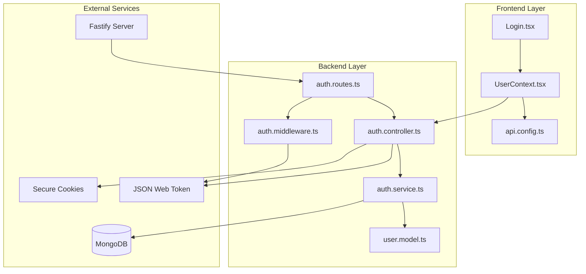
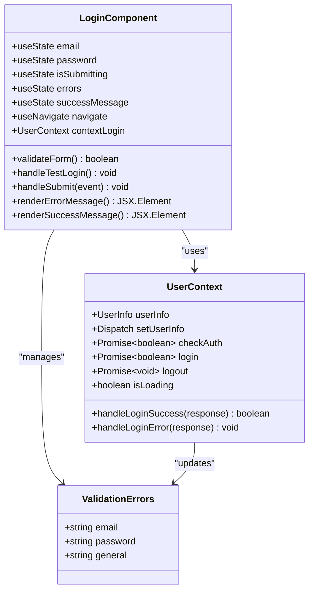
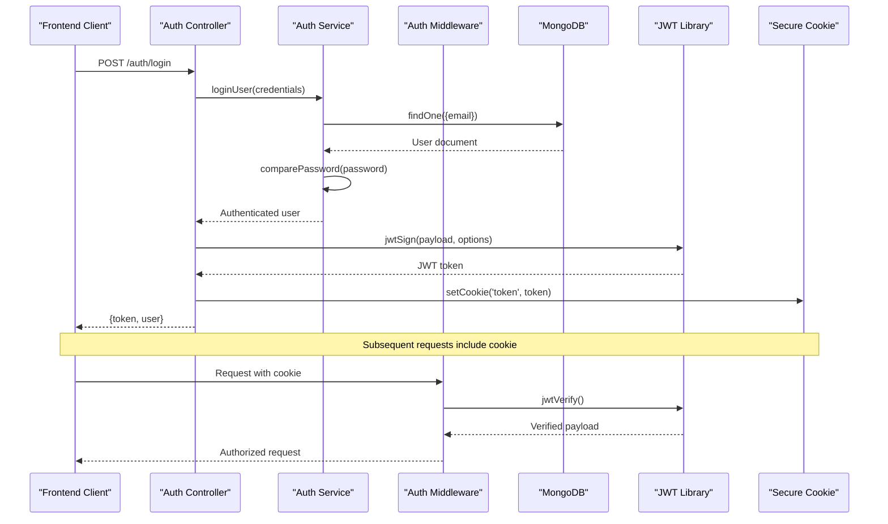
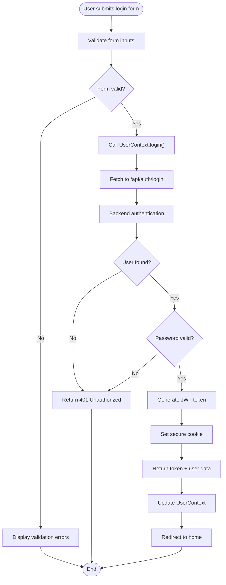

# User Login System

<cite>
**Referenced Files in This Document**
- [src/pages/Login.tsx](file://src/pages/Login.tsx)
- [src/UserContext.tsx](file://src/UserContext.tsx)
- [api-fastify/src/controllers/auth.controller.ts](file://api-fastify/src/controllers/auth.controller.ts)
- [api-fastify/src/services/auth.service.ts](file://api-fastify/src/services/auth.service.ts)
- [api-fastify/src/middlewares/auth.middleware.ts](file://api-fastify/src/middlewares/auth.middleware.ts)
- [api-fastify/src/models/user.model.ts](file://api-fastify/src/models/user.model.ts)
- [api-fastify/src/types/auth.types.ts](file://api-fastify/src/types/auth.types.ts)
- [api-fastify/src/routes/auth.routes.ts](file://api-fastify/src/routes/auth.routes.ts)
- [api-fastify/src/schemas/auth.schema.ts](file://api-fastify/src/schemas/auth.schema.ts)
- [src/config/api.config.ts](file://src/config/api.config.ts)
</cite>

## Table of Contents
1. [Introduction](#introduction)
2. [System Architecture](#system-architecture)
3. [Frontend Implementation](#frontend-implementation)
4. [Backend Implementation](#backend-implementation)
5. [Authentication Flow](#authentication-flow)
6. [Security Features](#security-features)
7. [Session Management](#session-management)
8. [Error Handling](#error-handling)
9. [Testing and Debugging](#testing-and-debugging)
10. [Best Practices](#best-practices)
11. [Troubleshooting Guide](#troubleshooting-guide)

## Introduction

The MERN_chatai_blog user login system provides a comprehensive authentication mechanism built on modern web technologies. The system implements JWT-based authentication with secure cookie handling, form validation, and role-based access control. It features a React-based frontend with TypeScript integration and a Fastify-powered backend with MongoDB persistence.

The authentication system supports multiple user roles (USER, AUTHOR, EDITOR, ADMIN) and includes robust security measures including CSRF protection, secure cookie configuration, and comprehensive error handling. The system also provides testing capabilities with predefined credentials for development environments.

## System Architecture

The authentication system follows a layered architecture with clear separation of concerns between frontend and backend components.



**Diagram sources**
- [src/pages/Login.tsx](file://src/pages/Login.tsx#L1-L327)
- [src/UserContext.tsx](file://src/UserContext.tsx#L1-L312)
- [api-fastify/src/controllers/auth.controller.ts](file://api-fastify/src/controllers/auth.controller.ts#L1-L330)
- [api-fastify/src/services/auth.service.ts](file://api-fastify/src/services/auth.service.ts#L1-L243)

## Frontend Implementation

### Login Component Architecture

The frontend login system is implemented through a sophisticated React component that handles form validation, user feedback, and API communication.



**Diagram sources**
- [src/pages/Login.tsx](file://src/pages/Login.tsx#L15-L322)
- [src/UserContext.tsx](file://src/UserContext.tsx#L28-L35)

### Form Validation System

The login form implements comprehensive validation with real-time feedback:

```typescript
// Email validation with regex pattern
if (!email.trim()) {
  newErrors.email = "L'adresse email est requise"
} else if (!/^\S+@\S+\.\S+$/.test(email)) {
  newErrors.email = "Veuillez entrer une adresse email valide"
}

// Password validation with length requirement
if (!password) {
  newErrors.password = "Le mot de passe est requis"
} else if (password.length < 6) {
  newErrors.password = "Le mot de passe doit contenir au moins 6 caractères"
}
```

### Test Credentials Functionality

The system includes a convenient test login feature for development:

```typescript
const handleTestLogin = async () => {
  setEmail("admin@example.com")
  setPassword("admin123")
  
  const response = await fetch(API_ENDPOINTS.auth.login, {
    method: "POST",
    headers: { "Content-Type": "application/json" },
    body: JSON.stringify({
      email: "admin@example.com",
      password: "admin123"
    }),
  })
  
  // Handle response and display success/error messages
}
```

**Section sources**
- [src/pages/Login.tsx](file://src/pages/Login.tsx#L50-L120)
- [src/pages/Login.tsx](file://src/pages/Login.tsx#L122-L170)

## Backend Implementation

### Authentication Controller

The backend authentication controller handles JWT token generation and secure cookie configuration:



**Diagram sources**
- [api-fastify/src/controllers/auth.controller.ts](file://api-fastify/src/controllers/auth.controller.ts#L40-L95)
- [api-fastify/src/services/auth.service.ts](file://api-fastify/src/services/auth.service.ts#L60-L100)

### JWT Token Generation

The backend generates secure JWT tokens with configurable expiration:

```typescript
const token = await reply.jwtSign(
  {
    _id: user._id.toString(),
    email: user.email,
    username: user.username,
    role: user.role,
  },
  {
    expiresIn: process.env.JWT_EXPIRES_IN || '30d',
  }
);
```

### Secure Cookie Configuration

The system implements comprehensive cookie security settings:

```typescript
reply.setCookie('token', token, {
  path: '/',
  httpOnly: true,
  secure: process.env.NODE_ENV === 'production',
  sameSite: 'lax',
  maxAge: 30 * 24 * 60 * 60 * 1000, // 30 days in milliseconds
});
```

**Section sources**
- [api-fastify/src/controllers/auth.controller.ts](file://api-fastify/src/controllers/auth.controller.ts#L52-L65)
- [api-fastify/src/controllers/auth.controller.ts](file://api-fastify/src/controllers/auth.controller.ts#L67-L75)

## Authentication Flow

### Complete Login Process

The authentication flow involves multiple steps from form submission to session establishment:



**Diagram sources**
- [src/pages/Login.tsx](file://src/pages/Login.tsx#L172-L210)
- [src/UserContext.tsx](file://src/UserContext.tsx#L170-L200)

### Session Verification

The system continuously verifies user sessions to maintain security:

```typescript
const checkAuth = async (): Promise<boolean> => {
  try {
    const res = await fetch(API_ENDPOINTS.users.profile, {
      method: "GET",
      credentials: "include",
      headers: { "Content-Type": "application/json" },
    })
    
    if (res.ok) {
      const responseData = await res.json()
      // Update user info from response
      setUserInfo({
        id: responseData.user._id,
        username: responseData.user.username,
        role: responseData.user.role,
      })
      return true
    } else if (res.status === 401 || res.status === 403) {
      setUserInfo(null)
      return false
    }
  } catch (error) {
    setUserInfo(null)
    return false
  }
}
```

**Section sources**
- [src/UserContext.tsx](file://src/UserContext.tsx#L47-L120)

## Security Features

### Role-Based Access Control

The system implements multiple user roles with different access levels:

```typescript
// Role definitions in user model
enum UserRole {
  USER = 'user',
  AUTHOR = 'author',
  EDITOR = 'editor',
  ADMIN = 'admin'
}

// Middleware for role verification
export const isAdmin = async (request: FastifyRequest, reply: FastifyReply) => {
  await request.jwtVerify();
  const user = await User.findById(request.user._id);
  
  if (!user || user.role !== UserRole.ADMIN) {
    return reply.status(403).send({ 
      message: 'Accès refusé - Droits d\'administrateur requis' 
    });
  }
};
```

### CSRF Protection

The system implements SameSite cookie protection:

```typescript
// Secure cookie configuration with SameSite protection
reply.setCookie('token', token, {
  path: '/',
  httpOnly: true,
  secure: process.env.NODE_ENV === 'production',
  sameSite: 'lax', // Protection against Cross-Site Request Forgery
  maxAge: 30 * 24 * 60 * 60 * 1000,
});
```

### Password Security

The backend implements bcrypt-based password hashing:

```typescript
// Pre-save middleware for password hashing
userSchema.pre('save', async function (next) {
  if (!this.isModified('password')) return next();
  
  try {
    const salt = await bcrypt.genSalt(10);
    this.password = await bcrypt.hash(this.password as string, salt);
    next();
  } catch (error: any) {
    next(error);
  }
});

// Password comparison method
userSchema.methods.comparePassword = async function (candidatePassword: string): Promise<boolean> {
  return await bcrypt.compare(candidatePassword, this.password);
};
```

**Section sources**
- [api-fastify/src/middlewares/auth.middleware.ts](file://api-fastify/src/middlewares/auth.middleware.ts#L30-L50)
- [api-fastify/src/models/user.model.ts](file://api-fastify/src/models/user.model.ts#L50-L70)

## Session Management

### Automatic Session Refresh

The system implements automatic session verification with periodic checks:

```typescript
useEffect(() => {
  // Initial authentication check
  checkAuth()

  // Periodic session verification (every 5 minutes)
  const interval = setInterval(() => {
    if (userInfo) {
      checkAuth()
    }
  }, 5 * 60 * 1000)

  return () => clearInterval(interval)
}, [userInfo?.id])
```

### Logout Process

The logout process clears both server-side and client-side authentication state:

```typescript
const logout = async (): Promise<void> => {
  try {
    const res = await fetch(API_ENDPOINTS.auth.logout, {
      method: "POST",
      credentials: "include",
      headers: { "Content-Type": "application/json" },
    })

    if (res.ok) {
      setUserInfo(null)
      // Clear local storage if needed
      // localStorage.removeItem('some-user-data')
    }
  } catch (error) {
    // Even on error, clear local state
    setUserInfo(null)
  }
}
```

**Section sources**
- [src/UserContext.tsx](file://src/UserContext.tsx#L295-L312)
- [src/UserContext.tsx](file://src/UserContext.tsx#L220-L260)

## Error Handling

### Comprehensive Error Management

The system implements robust error handling across all components:

```typescript
// Frontend error handling
const handleSubmit = async (ev: FormEvent) => {
  ev.preventDefault()
  setErrors({})
  
  if (!validateForm()) return
  
  setIsSubmitting(true)
  
  try {
    const success = await contextLogin(email, password)
    
    if (success) {
      setSuccessMessage("Connexion réussie! Redirection...")
      setTimeout(() => navigate("/", { replace: true }), 1000)
    } else {
      setErrors({ general: "Email ou mot de passe incorrect" })
    }
  } catch (error) {
    setErrors({
      general: error instanceof Error
        ? error.message
        : "Une erreur s'est produite lors de la connexion"
    })
  } finally {
    setIsSubmitting(false)
  }
}
```

### Backend Error Responses

The backend provides structured error responses:

```typescript
// Authentication error handling
if (error instanceof Error && error.message.includes('incorrect')) {
  return reply.status(401).send({
    message: error.message,
  });
}

// General error handling
return reply.status(500).send({
  message: 'Une erreur est survenue lors de la connexion',
});
```

**Section sources**
- [src/pages/Login.tsx](file://src/pages/Login.tsx#L172-L210)
- [api-fastify/src/controllers/auth.controller.ts](file://api-fastify/src/controllers/auth.controller.ts#L80-L95)

## Testing and Debugging

### Test Login Feature

The system includes a convenient test login feature for development:

```typescript
// Test credentials for development
const handleTestLogin = async () => {
  setEmail("admin@example.com")
  setPassword("admin123")
  
  setIsSubmitting(true)
  
  try {
    const response = await fetch(API_ENDPOINTS.auth.login, {
      method: "POST",
      headers: {
        "Content-Type": "application/json",
      },
      body: JSON.stringify({
        email: "admin@example.com",
        password: "admin123"
      }),
    });
    
    if (response.ok) {
      const data = await response.json()
      setSuccessMessage(`Test de connexion réussi! Utilisateur: ${data.user.username}`)
    } else {
      const errorMessage = data?.message || `Erreur serveur (${response.status})`
      setErrors({ general: errorMessage })
    }
  } catch (error) {
    setErrors({
      general: error instanceof Error
        ? error.message
        : "Une erreur s'est produite lors du test de connexion"
    })
  } finally {
    setIsSubmitting(false)
  }
}
```

### Debug Information

The system provides extensive debug logging:

```typescript
// Debug logging in UserContext
console.log("Checking authentication status...")
console.log("Document cookies:", document.cookie)
console.log("Login response data:", responseData)
console.log("Cookies after login:", document.cookie)
```

**Section sources**
- [src/pages/Login.tsx](file://src/pages/Login.tsx#L122-L170)
- [src/UserContext.tsx](file://src/UserContext.tsx#L124-L140)

## Best Practices

### Security Recommendations

1. **Environment Configuration**: Always use environment variables for sensitive configuration
2. **HTTPS Enforcement**: Enable secure cookies in production environments
3. **Token Expiration**: Configure appropriate token expiration times
4. **Input Validation**: Implement comprehensive form validation on both client and server
5. **Error Information**: Avoid exposing sensitive information in error messages

### Performance Optimization

1. **Session Caching**: Implement session caching for frequently accessed user data
2. **Connection Pooling**: Use connection pooling for database connections
3. **Rate Limiting**: Implement rate limiting for authentication endpoints
4. **CDN Integration**: Serve static assets through CDN for improved performance

### Development Guidelines

1. **Type Safety**: Use TypeScript interfaces for all data structures
2. **Code Organization**: Maintain clear separation between concerns
3. **Documentation**: Document all public APIs and complex logic
4. **Testing**: Implement comprehensive unit and integration tests

## Troubleshooting Guide

### Common Issues and Solutions

#### Authentication Failures

**Problem**: Users cannot log in despite correct credentials
**Solution**: 
1. Check database connectivity and user record existence
2. Verify password hashing and comparison logic
3. Review JWT token generation and validation
4. Check cookie configuration and browser settings

#### Token Expiration Issues

**Problem**: Users are logged out unexpectedly
**Solution**:
1. Verify JWT expiration configuration
2. Check token refresh mechanisms
3. Review cookie expiration settings
4. Implement automatic token renewal

#### CORS and Cookie Problems

**Problem**: Authentication works locally but fails in production
**Solution**:
1. Verify CORS configuration
2. Check secure cookie settings for HTTPS
3. Review SameSite cookie policy
4. Ensure proper credential handling

#### Session Persistence Issues

**Problem**: User sessions are lost between browser restarts
**Solution**:
1. Verify cookie path and domain settings
2. Check SameSite configuration
3. Review session storage mechanisms
4. Implement persistent login options

### Debugging Tools

1. **Browser Developer Tools**: Monitor network requests and cookie storage
2. **Console Logging**: Use comprehensive logging for authentication flows
3. **Database Queries**: Monitor database operations during authentication
4. **JWT Decoding**: Decode JWT tokens to verify claims and expiration

### Monitoring and Maintenance

1. **Log Analysis**: Regularly review authentication logs for anomalies
2. **Performance Metrics**: Monitor authentication endpoint performance
3. **Security Audits**: Conduct regular security assessments
4. **User Feedback**: Collect and address user authentication issues promptly