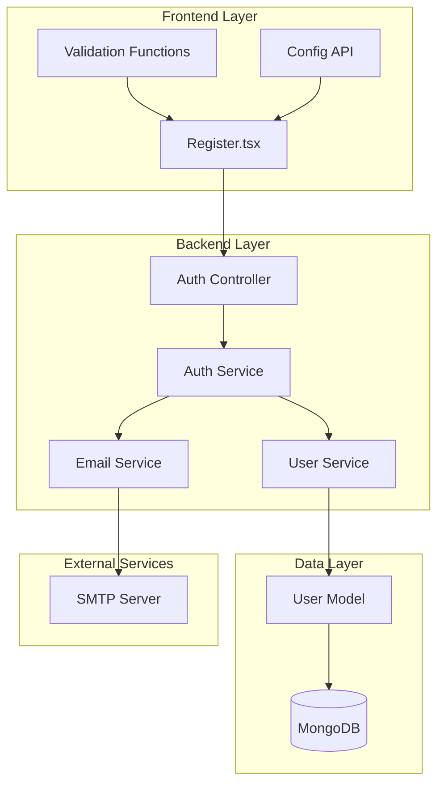

# User Registration Feature Documentation

<cite>
**Referenced Files in This Document**
- [src/pages/Register.tsx](file://src/pages/Register.tsx)
- [api-fastify/src/controllers/auth.controller.ts](file://api-fastify/src/controllers/auth.controller.ts)
- [api-fastify/src/services/auth.service.ts](file://api-fastify/src/services/auth.service.ts)
- [api-fastify/src/models/user.model.ts](file://api-fastify/src/models/user.model.ts)
- [api-fastify/src/services/email.service.ts](file://api-fastify/src/services/email.service.ts)
- [api-fastify/src/types/auth.types.ts](file://api-fastify/src/types/auth.types.ts)
- [api-fastify/src/types/user.types.ts](file://api-fastify/src/types/user.types.ts)
- [api-fastify/src/routes/auth.routes.ts](file://api-fastify/src/routes/auth.routes.ts)
- [api-fastify/src/schemas/auth.schema.ts](file://api-fastify/src/schemas/auth.schema.ts)
- [src/config/api.config.ts](file://src/config/api.config.ts)
</cite>

## Table of Contents
1. [Introduction](#introduction)
2. [System Architecture](#system-architecture)
3. [Frontend Implementation](#frontend-implementation)
4. [Backend Services](#backend-services)
5. [Data Models and Validation](#data-models-and-validation)
6. [Email Verification Workflow](#email-verification-workflow)
7. [Error Handling Strategies](#error-handling-strategies)
8. [Security Considerations](#security-considerations)
9. [Common Issues and Solutions](#common-issues-and-solutions)
10. [Best Practices](#best-practices)

## Introduction

The user registration feature in MERN_chatai_blog provides a comprehensive authentication system that allows new users to create accounts, receive email verification, and activate their accounts. The implementation follows a modern MERN stack architecture with TypeScript, React for the frontend, and Fastify with MongoDB for the backend.

The registration process involves multiple layers of validation, secure password hashing, email verification with token-based activation, and robust error handling. The system ensures data integrity while providing a smooth user experience with real-time feedback and appropriate security measures.

## System Architecture

The registration feature follows a layered architecture pattern with clear separation of concerns between frontend and backend components.



**Diagram sources**
- [src/pages/Register.tsx](file://src/pages/Register.tsx#L1-L288)
- [api-fastify/src/controllers/auth.controller.ts](file://api-fastify/src/controllers/auth.controller.ts#L1-L330)
- [api-fastify/src/services/auth.service.ts](file://api-fastify/src/services/auth.service.ts#L1-L243)

## Frontend Implementation

The frontend registration component (`Register.tsx`) provides a user-friendly interface with comprehensive form validation and real-time feedback.

### Component Structure

The registration form is built using React functional components with hooks for state management:

```typescript
// Form state management
const [username, setUsername] = useState<string>("");
const [password, setPassword] = useState<string>("");
const [email, setEmail] = useState<string>("");
const [isSubmitting, setIsSubmitting] = useState<boolean>(false);
const [errors, setErrors] = useState<ValidationErrors>({});
const [successMessage, setSuccessMessage] = useState<string | null>(null);
```

### Form Validation Logic

The frontend implements comprehensive validation rules:

```typescript
const validateForm = (): boolean => {
  const newErrors: ValidationErrors = {};
  let isValid = true;

  // Email validation
  if (!email.trim()) {
    newErrors.email = "L'email est requis";
    isValid = false;
  } else if (!/\S+@\S+\.\S+/.test(email)) {
    newErrors.email = "L'email n'est pas valide";
    isValid = false;
  }

  // Username validation
  if (!username.trim()) {
    newErrors.username = "Le nom d'utilisateur est requis";
    isValid = false;
  } else if (username.length < 3) {
    newErrors.username = "Le nom d'utilisateur doit contenir au moins 3 caractères";
    isValid = false;
  }

  // Password validation
  if (!password) {
    newErrors.password = "Le mot de passe est requis";
    isValid = false;
  } else if (password.length < 6) {
    newErrors.password = "Le mot de passe doit contenir au moins 6 caractères";
    isValid = false;
  }

  setErrors(newErrors);
  return isValid;
};
```

### API Integration

The form submission handles communication with the backend API:

```typescript
async function handleSubmit(ev: React.FormEvent<HTMLFormElement>) {
  ev.preventDefault();
  
  if (!validateForm()) return;
  
  setIsSubmitting(true);
  
  try {
    const response = await fetch(API_ENDPOINTS.auth.register, {
      method: "POST",
      headers: { "Content-Type": "application/json" },
      body: JSON.stringify({ username, password, email }),
    });

    if (!response.ok) {
      const data = await response.json().catch(() => ({}));
      throw new Error(data.message || `Échec de l'inscription: ${response.status}`);
    }

    setSuccessMessage("Inscription réussie! Redirection vers la page de connexion...");
    setTimeout(() => navigate("/login_page"), 2000);
    
  } catch (error) {
    setErrors({
      general: error instanceof Error
        ? error.message
        : "Une erreur s'est produite lors de l'inscription"
    });
  } finally {
    setIsSubmitting(false);
  }
}
```

**Section sources**
- [src/pages/Register.tsx](file://src/pages/Register.tsx#L1-L288)
- [src/config/api.config.ts](file://src/config/api.config.ts#L1-L273)

## Backend Services

The backend implements a robust authentication service with comprehensive validation and security measures.

### Authentication Controller

The controller handles incoming registration requests and coordinates with the service layer:

```typescript
export const register = async (
  request: FastifyRequest<{ Body: RegisterInput }>,
  reply: FastifyReply
) => {
  try {
    const newUser = await AuthService.registerUser(request.body);

    return reply.status(201).send({
      message: 'Inscription réussie. Veuillez vérifier votre email pour activer votre compte.',
      user: newUser,
    });
  } catch (error) {
    request.log.error(error);

    if (error instanceof Error && error.message.includes('déjà utilisé')) {
      return reply.status(400).send({ message: error.message });
    }

    return reply.status(500).send({
      message: 'Une erreur est survenue lors de l\'inscription',
    });
  }
};
```

### Authentication Service

The service layer implements the core registration logic:

```typescript
export const registerUser = async (userData: RegisterInput) => {
  const { username, email, password, firstName, lastName } = userData;

  // Check for existing user
  const existingUser = await User.findOne({
    $or: [{ email }, { username }],
  });

  if (existingUser) {
    throw new Error(
      existingUser.email === email
        ? 'Cet email est déjà utilisé'
        : 'Ce nom d\'utilisateur est déjà utilisé'
    );
  }

  // Generate verification token
  const verificationToken = generateToken();

  // Create new user
  const newUser = new User({
    username,
    email,
    password,
    firstName,
    lastName,
    verificationToken,
  });

  // Save user
  await newUser.save();

  // Send verification email
  const appUrl = process.env.APP_URL || 'http://localhost:3000';
  const verificationUrl = `${appUrl}/verify-email?token=${verificationToken}`;

  const subject = 'Vérification de votre adresse email';
  const html = `
    <h1>Vérification de votre adresse email</h1>
    <p>Merci de vous être inscrit sur notre plateforme.</p>
    <p>Cliquez sur le lien ci-dessous pour vérifier votre adresse email :</p>
    <p><a href="${verificationUrl}">Vérifier mon adresse email</a></p>
  `;

  await EmailService.sendEmail(email, subject, html);

  return newUser;
};
```

**Section sources**
- [api-fastify/src/controllers/auth.controller.ts](file://api-fastify/src/controllers/auth.controller.ts#L15-L35)
- [api-fastify/src/services/auth.service.ts](file://api-fastify/src/services/auth.service.ts#L15-L60)

## Data Models and Validation

The system uses Mongoose models with comprehensive validation schemas.

### User Model Definition

```typescript
const userSchema = new Schema<IUser>({
  username: {
    type: String,
    required: true,
    unique: true,
    trim: true,
    minlength: 3,
    maxlength: 30,
  },
  email: {
    type: String,
    required: true,
    unique: true,
    trim: true,
    lowercase: true,
    match: [/^\S+@\S+\.\S+$/, 'Veuillez fournir une adresse email valide'],
  },
  password: {
    type: String,
    required: true,
    minlength: 6,
  },
  firstName: { type: String, trim: true },
  lastName: { type: String, trim: true },
  role: {
    type: String,
    enum: Object.values(UserRole),
    default: UserRole.USER,
  },
  isVerified: { type: Boolean, default: false },
  verificationToken: String,
  resetPasswordToken: String,
  resetPasswordExpires: Date,
});
```

### Password Security

The model includes automatic password hashing middleware:

```typescript
userSchema.pre('save', async function (next) {
  if (!this.isModified('password')) return next();

  try {
    const salt = await bcrypt.genSalt(10);
    this.password = await bcrypt.hash(this.password as string, salt);
    next();
  } catch (error: any) {
    next(error);
  }
});
```

### Request Validation

Fastify schemas ensure data integrity:

```typescript
export const registerSchema: FastifySchema = {
  body: {
    type: 'object',
    required: ['username', 'email', 'password'],
    properties: {
      username: { type: 'string', minLength: 3, maxLength: 30 },
      email: { type: 'string', format: 'email' },
      password: { type: 'string', minLength: 6 },
      firstName: { type: 'string', nullable: true },
      lastName: { type: 'string', nullable: true },
    },
  },
};
```

**Section sources**
- [api-fastify/src/models/user.model.ts](file://api-fastify/src/models/user.model.ts#L1-L97)
- [api-fastify/src/schemas/auth.schema.ts](file://api-fastify/src/schemas/auth.schema.ts#L35-L55)

## Email Verification Workflow

The email verification system ensures account legitimacy through token-based activation.

### Verification Token Generation

```typescript
// Token generation in auth.service.ts
const verificationToken = generateToken(); // Custom token generator

// User creation with token
const newUser = new User({
  username,
  email,
  password,
  firstName,
  lastName,
  verificationToken,
});
```

### Email Template Structure

The verification email includes a clickable link:

```html
<h1>Vérification de votre adresse email</h1>
<p>Merci de vous être inscrit sur notre plateforme.</p>
<p>Cliquez sur le lien ci-dessous pour vérifier votre adresse email :</p>
<p><a href="${verificationUrl}">Vérifier mon adresse email</a></p>
```

### Verification Endpoint

```typescript
export const verifyEmail = async (
  request: FastifyRequest<{ Params: VerifyEmailInput }>,
  reply: FastifyReply
) => {
  try {
    const { token } = request.params as { token: string };
    await AuthService.verifyUserEmail(token);

    return reply.status(200).send({
      message: 'Email vérifié avec succès. Vous pouvez maintenant vous connecter.',
    });
  } catch (error) {
    request.log.error(error);

    if (error instanceof Error && error.message.includes('invalide')) {
      return reply.status(400).send({ message: error.message });
    }

    return reply.status(500).send({
      message: 'Une erreur est survenue lors de la vérification de l\'email',
    });
  }
};
```

### Verification Service Logic

```typescript
export const verifyUserEmail = async (token: string) => {
  const user = await User.findOne({ verificationToken: token }) as IUser;

  if (!user) {
    throw new Error('Token de vérification invalide');
  }

  user.isVerified = true;
  user.verificationToken = undefined;
  await user.save();

  return user;
};
```

**Section sources**
- [api-fastify/src/services/auth.service.ts](file://api-fastify/src/services/auth.service.ts#L40-L60)
- [api-fastify/src/controllers/auth.controller.ts](file://api-fastify/src/controllers/auth.controller.ts#L65-L85)

## Error Handling Strategies

The system implements comprehensive error handling at multiple levels.

### Frontend Error Management

```typescript
// Real-time error clearing
useEffect(() => {
  if (username && errors.username) {
    setErrors(prev => ({ ...prev, username: undefined }));
  }
  if (password && errors.password) {
    setErrors(prev => ({ ...prev, password: undefined }));
  }
  if (email && errors.email) {
    setErrors(prev => ({ ...prev, email: undefined }));
  }
}, [username, password, email]);

// Error display component
const renderErrorMessage = () => {
  if (!errors.general) return null;

  return (
    <div className="mb-4 p-3 bg-red-50 border border-red-200 rounded-md flex items-start">
      <AlertCircle className="h-5 w-5 text-red-500 mr-2 flex-shrink-0 mt-0.5" />
      <div>
        <p className="text-red-800 text-sm font-medium">{errors.general}</p>
        <button
          onClick={() => setErrors(prev => ({ ...prev, general: undefined }))}
          className="text-xs text-red-600 hover:text-red-800 mt-1"
        >
          Fermer
        </button>
      </div>
    </div>
  );
};
```

### Backend Error Classification

```typescript
// Duplicate email/username detection
if (existingUser) {
  throw new Error(
    existingUser.email === email
      ? 'Cet email est déjà utilisé'
      : 'Ce nom d\'utilisateur est déjà utilisé'
  );
}

// Token validation errors
if (!user) {
  throw new Error('Token de vérification invalide');
}

// Generic error handling
return reply.status(500).send({
  message: 'Une erreur est survenue lors de l\'inscription',
});
```

### Error Response Patterns

```typescript
// Success response
{
  message: 'Inscription réussie. Veuillez vérifier votre email pour activer votre compte.',
  user: newUser,
}

// Client error response
{
  message: 'Cet email est déjà utilisé'
}

// Server error response
{
  message: 'Une erreur est survenue lors de l\'inscription'
}
```

**Section sources**
- [src/pages/Register.tsx](file://src/pages/Register.tsx#L25-L45)
- [api-fastify/src/services/auth.service.ts](file://api-fastify/src/services/auth.service.ts#L25-L35)

## Security Considerations

The registration system implements multiple security layers to protect user data and prevent abuse.

### Password Security

- **Bcrypt Hashing**: Passwords are hashed using bcrypt with salt rounds of 10
- **Pre-save Middleware**: Automatic password hashing before saving to database
- **Secure Storage**: Passwords are never stored in plain text

### Token Security

- **Random Token Generation**: Unique verification tokens generated for each user
- **Token Expiration**: Tokens are cleared after successful verification
- **Secure Transmission**: Tokens transmitted via HTTPS only

### Input Validation

- **Frontend Validation**: Real-time form validation with immediate feedback
- **Backend Validation**: Comprehensive schema validation using Fastify
- **Sanitization**: Input sanitization prevents injection attacks

### Rate Limiting

The system includes rate limiting middleware to prevent abuse:

```typescript
// Example rate limiting configuration
{
  windowMs: 15 * 60 * 1000, // 15 minutes
  max: 100, // Limit each IP to 100 requests per windowMs
  message: 'Too many registration attempts from this IP, please try again later'
}
```

### CORS and Headers

- **CORS Protection**: Proper CORS headers configured
- **HTTP Headers**: Security headers like HSTS, CSP, X-Frame-Options
- **Cookie Security**: Secure, HttpOnly, SameSite cookies for JWT tokens

## Common Issues and Solutions

### Email Delivery Failures

**Problem**: Verification emails not reaching users
**Solutions**:
1. Verify SMTP configuration in environment variables
2. Check email service provider quotas
3. Implement retry mechanisms for failed deliveries
4. Add email validation before registration

### Token Expiration Issues

**Problem**: Verification links become invalid
**Solutions**:
1. Implement token refresh mechanisms
2. Add "resend verification" functionality
3. Extend token validity periods temporarily
4. Provide clear instructions for expired links

### Duplicate Account Prevention

**Problem**: Users creating multiple accounts
**Solutions**:
1. Implement IP-based rate limiting
2. Add CAPTCHA verification for new registrations
3. Monitor suspicious activity patterns
4. Implement account linking capabilities

### Database Connection Issues

**Problem**: Registration fails due to database connectivity
**Solutions**:
1. Implement connection pooling
2. Add circuit breaker patterns
3. Provide graceful degradation
4. Monitor database health metrics

### Performance Optimization

**Problem**: Slow registration response times
**Solutions**:
1. Optimize database queries
2. Implement caching for user lookups
3. Use asynchronous email sending
4. Add connection timeouts

## Best Practices

### Development Guidelines

1. **Consistent Error Messages**: Use standardized error message formats
2. **Logging**: Implement comprehensive logging for debugging and monitoring
3. **Testing**: Write unit and integration tests for all components
4. **Documentation**: Maintain up-to-date API documentation

### Security Best Practices

1. **HTTPS Only**: Ensure all communications use HTTPS
2. **Input Sanitization**: Sanitize all user inputs
3. **Validation**: Implement both client-side and server-side validation
4. **Monitoring**: Monitor for suspicious activities

### User Experience

1. **Real-time Feedback**: Provide instant validation feedback
2. **Clear Messaging**: Use clear, user-friendly error messages
3. **Progress Indicators**: Show loading states during submissions
4. **Accessibility**: Ensure forms are accessible to all users

### Maintenance

1. **Code Reviews**: Implement mandatory code reviews
2. **Dependency Updates**: Regularly update dependencies
3. **Security Audits**: Conduct periodic security assessments
4. **Performance Monitoring**: Monitor system performance continuously

The user registration feature in MERN_chatai_blog demonstrates a well-architected authentication system that balances security, usability, and maintainability. By following the patterns and practices outlined in this documentation, developers can ensure reliable and secure user registration functionality.