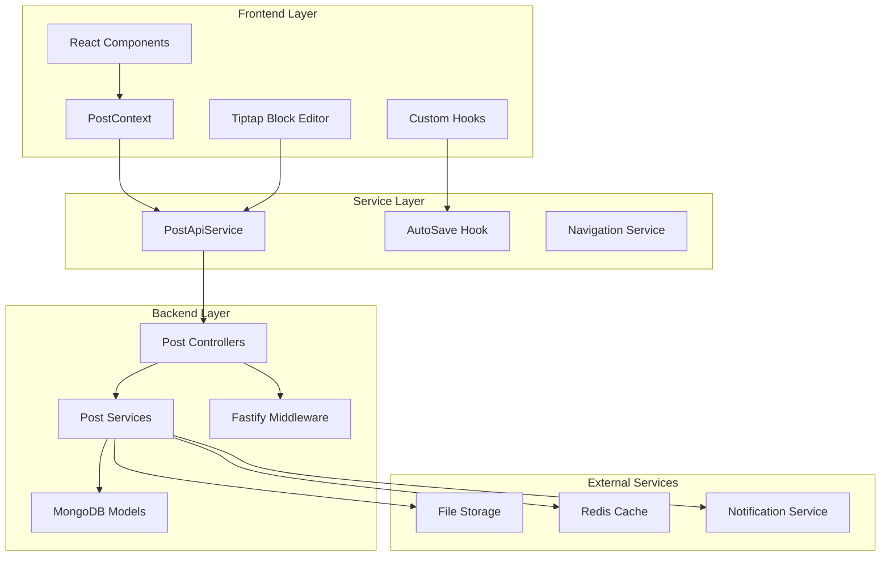
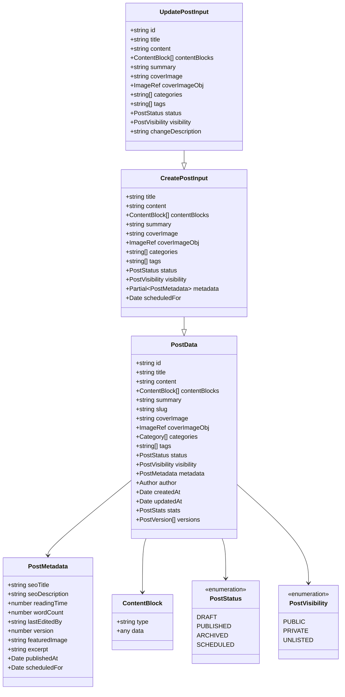
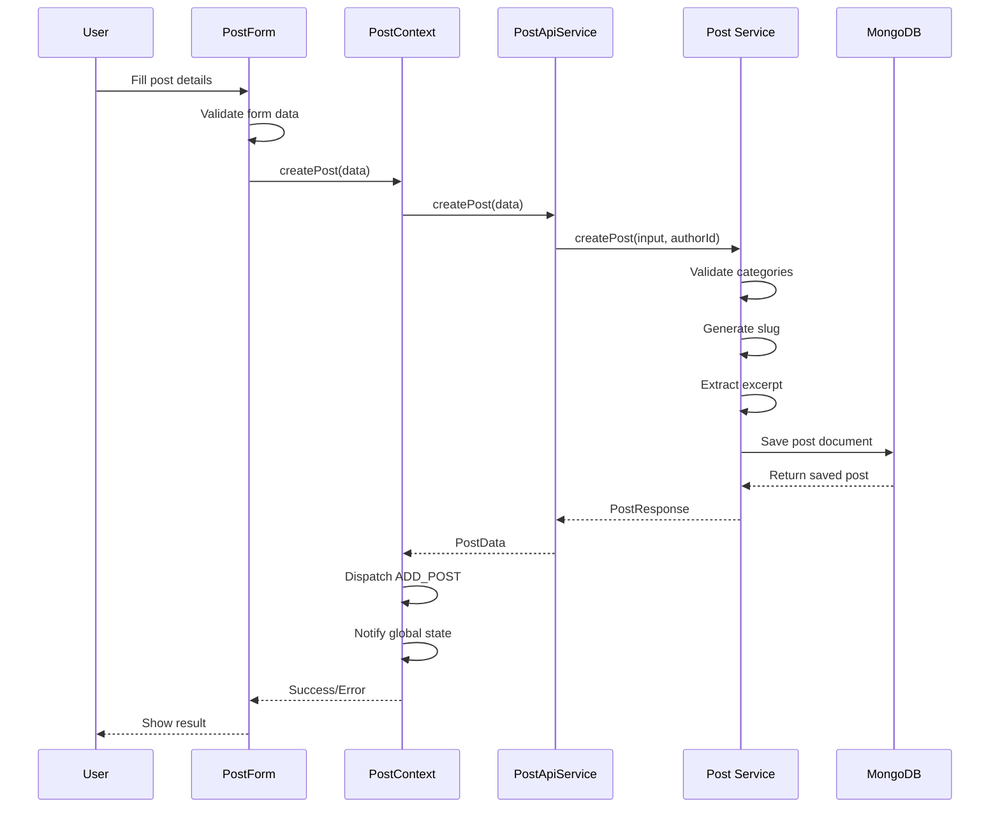
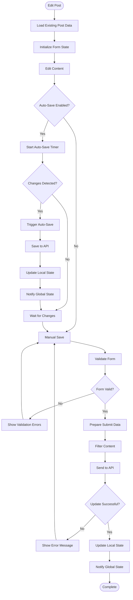
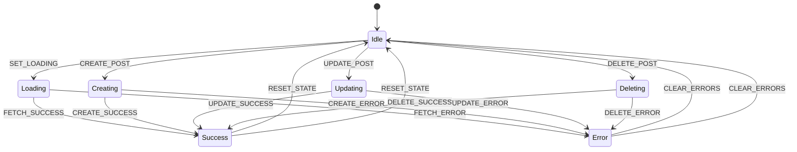
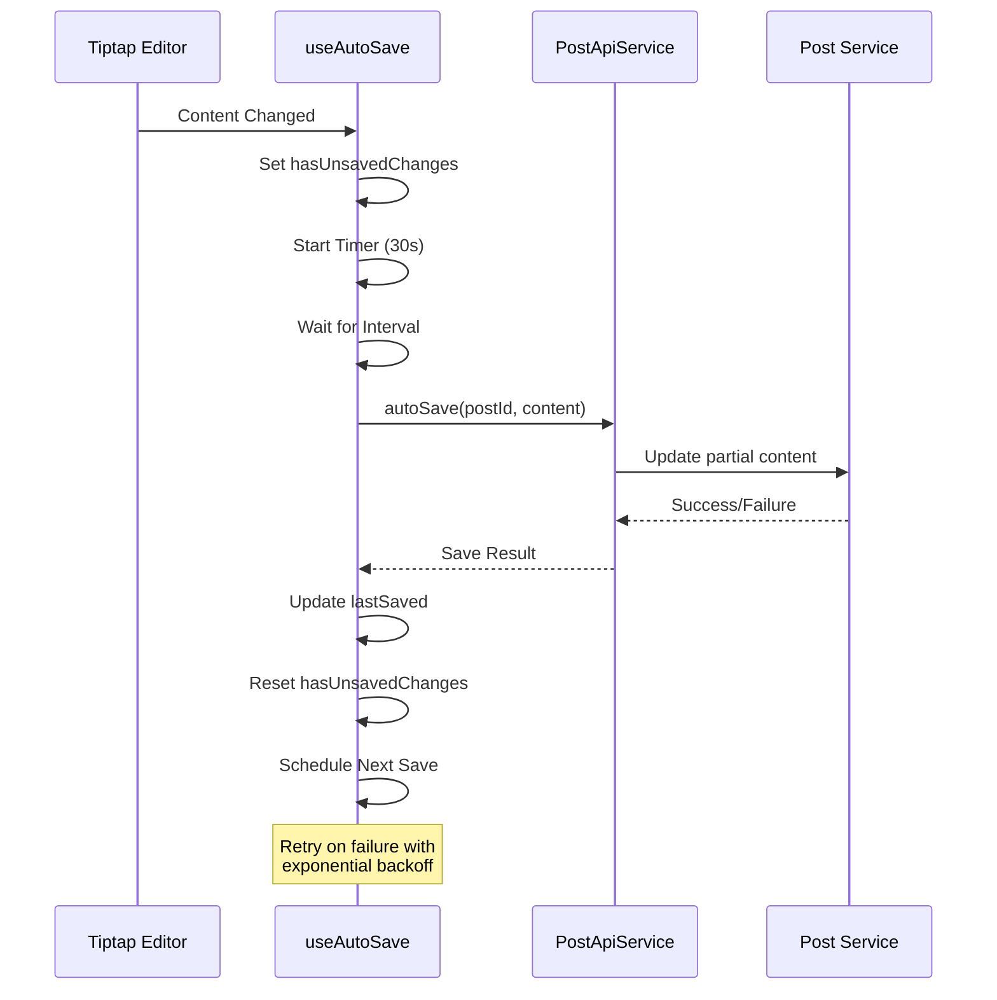
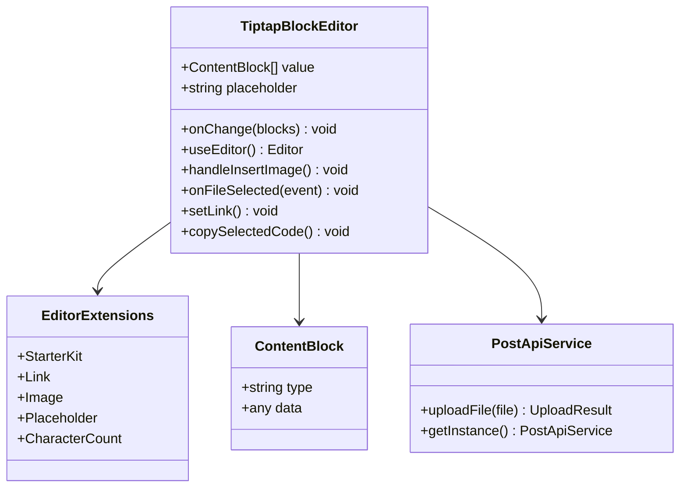
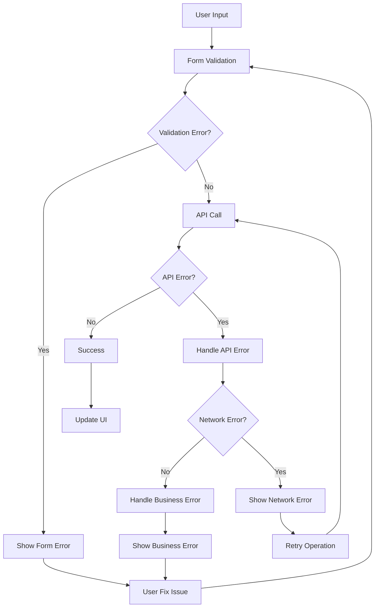

# Content Management System Documentation

<cite>
**Referenced Files in This Document**
- [PostContext.tsx](file://src/features/posts/context/PostContext.tsx)
- [postApi.ts](file://src/features/posts/services/postApi.ts)
- [post.types.ts](file://src/features/posts/types/post.types.ts)
- [CreatePost.tsx](file://src/features/posts/pages/CreatePost.tsx)
- [StablePostForm.tsx](file://src/features/posts/components/PostForm/StablePostForm.tsx)
- [PostForm/index.tsx](file://src/features/posts/components/PostForm/index.tsx)
- [useAutoSave.ts](file://src/features/posts/hooks/useAutoSave.ts)
- [TiptapBlockEditor.tsx](file://src/features/posts/components/BlockEditor/TiptapBlockEditor.tsx)
- [post.controller.ts](file://api-fastify/src/controllers/post.controller.ts)
- [post.service.ts](file://api-fastify/src/services/post.service.ts)
</cite>

## Table of Contents
1. [Introduction](#introduction)
2. [System Architecture](#system-architecture)
3. [Domain Model](#domain-model)
4. [Post Creation Workflow](#post-creation-workflow)
5. [Post Editing and Publishing](#post-editing-and-publishing)
6. [State Management](#state-management)
7. [Auto-Save Functionality](#auto-save-functionality)
8. [Tiptap Block Editor](#tiptap-block-editor)
9. [Error Handling and Validation](#error-handling-and-validation)
10. [Performance Considerations](#performance-considerations)
11. [Troubleshooting Guide](#troubleshooting-guide)
12. [Best Practices](#best-practices)

## Introduction

The MERN_chatai_blog content management system provides a comprehensive solution for creating, editing, and managing blog posts with advanced features including real-time collaboration, auto-save functionality, and a sophisticated block-based editor powered by Tiptap. The system is built using React for the frontend with TypeScript for type safety, and Fastify for the backend API, utilizing MongoDB for data persistence.

The content management system focuses on providing an intuitive user experience while maintaining robust data integrity and performance. It supports both draft and published states, with automatic content normalization and comprehensive error handling throughout the workflow.

## System Architecture

The content management system follows a layered architecture with clear separation of concerns:



**Diagram sources**
- [PostContext.tsx](file://src/features/posts/context/PostContext.tsx#L1-L501)
- [postApi.ts](file://src/features/posts/services/postApi.ts#L1-L200)
- [post.controller.ts](file://api-fastify/src/controllers/post.controller.ts#L1-L100)

## Domain Model

The content management system is built around several key interfaces that define the data structures and relationships:



**Diagram sources**
- [post.types.ts](file://src/features/posts/types/post.types.ts#L1-L263)

**Section sources**
- [post.types.ts](file://src/features/posts/types/post.types.ts#L1-L263)

## Post Creation Workflow

The post creation process involves multiple steps with comprehensive validation and state management:



**Diagram sources**
- [PostContext.tsx](file://src/features/posts/context/PostContext.tsx#L150-L190)
- [postApi.ts](file://src/features/posts/services/postApi.ts#L130-L180)
- [post.service.ts](file://api-fastify/src/services/post.service.ts#L180-L280)

### Implementation Details

The `createPost` method in PostContext demonstrates comprehensive error handling and state management:

```typescript
const createPost = useCallback(async (data: CreatePostInput): Promise<PostData | null> => {
  try {
    setLoading({ isCreating: true });
    clearErrors();

    const result = await apiService.createPost(data);
    
    if (result.success && result.data) {
      dispatch({ type: 'ADD_POST', payload: result.data });
      
      // Notify global state manager about the creation
      globalStateManager.notifyPostCreation(result.data);
      
      // Force immediate cache invalidation
      globalStateManager.notifyCacheInvalidation('all', 'post-created');
      
      return result.data;
    } else {
      setError({
        code: 'CREATE_ERROR',
        message: result.error || 'Failed to create post',
      });
      return null;
    }
  } catch (error) {
    setError({
      code: 'CREATE_ERROR',
      message: error instanceof Error ? error.message : 'Failed to create post',
    });
    return null;
  } finally {
    setLoading({ isCreating: false });
  }
}, [apiService, setLoading, clearErrors, setError]);
```

**Section sources**
- [PostContext.tsx](file://src/features/posts/context/PostContext.tsx#L150-L190)
- [postApi.ts](file://src/features/posts/services/postApi.ts#L130-L180)

## Post Editing and Publishing

The editing workflow supports both draft and published states with automatic content normalization:



**Diagram sources**
- [PostForm/index.tsx](file://src/features/posts/components/PostForm/index.tsx#L1-L100)
- [useAutoSave.ts](file://src/features/posts/hooks/useAutoSave.ts#L1-L100)

**Section sources**
- [PostForm/index.tsx](file://src/features/posts/components/PostForm/index.tsx#L1-L662)
- [useAutoSave.ts](file://src/features/posts/hooks/useAutoSave.ts#L1-L168)

## State Management

The PostContext provides centralized state management with comprehensive action types and reducer logic:



**Diagram sources**
- [PostContext.tsx](file://src/features/posts/context/PostContext.tsx#L25-L100)

The context manages various state slices including posts, current post, filters, pagination, loading states, and error handling. The reducer handles complex state transitions with proper error propagation and state normalization.

**Section sources**
- [PostContext.tsx](file://src/features/posts/context/PostContext.tsx#L1-L501)

## Auto-Save Functionality

The auto-save system ensures data integrity by automatically saving changes at regular intervals:



**Diagram sources**
- [useAutoSave.ts](file://src/features/posts/hooks/useAutoSave.ts#L1-L168)
- [postApi.ts](file://src/features/posts/services/postApi.ts#L200-L300)

### Auto-Save Implementation

The useAutoSave hook provides robust auto-save functionality with retry mechanisms:

```typescript
export function useAutoSave(
  postId: string | null,
  content: string,
  title?: string,
  summary?: string,
  options: UseAutoSaveOptions = {
    enabled: true,
    interval: 30000, // 30 seconds
    maxRetries: 3,
  }
): UseAutoSaveReturn {
  const saveContent = useCallback(async () => {
    if (!postId || !options.enabled || isAutoSaving) {
      return;
    }

    // Check if content has actually changed
    const contentChanged = content !== lastContentRef.current;
    const titleChanged = title !== lastTitleRef.current;
    const summaryChanged = summary !== lastSummaryRef.current;

    if (!contentChanged && !titleChanged && !summaryChanged) {
      return;
    }

    setIsAutoSaving(true);

    try {
      await apiService.autoSave({
        id: postId,
        content,
        metadata: {
          title,
          summary,
          lastEditedAt: new Date(),
        },
      });

      // Update refs with saved content
      lastContentRef.current = content;
      lastTitleRef.current = title || '';
      lastSummaryRef.current = summary || '';

      setLastSaved(new Date());
      setHasUnsavedChanges(false);
      setRetryCount(0);

      options.onSave?.(true);
    } catch (error) {
      console.error('Auto-save failed:', error);

      if (retryCount < options.maxRetries) {
        setRetryCount(prev => prev + 1);
        // Retry with exponential backoff
        setTimeout(() => {
          saveContent();
        }, Math.pow(2, retryCount) * 1000);
      } else {
        options.onSave?.(false, error instanceof Error ? error.message : 'Auto-save failed');
      }
    } finally {
      setIsAutoSaving(false);
    }
  }, [postId, content, title, summary, options, isAutoSaving, retryCount, apiService]);
}
```

**Section sources**
- [useAutoSave.ts](file://src/features/posts/hooks/useAutoSave.ts#L1-L168)

## Tiptap Block Editor

The Tiptap Block Editor provides a rich, extensible editing experience with real-time collaboration capabilities:



**Diagram sources**
- [TiptapBlockEditor.tsx](file://src/features/posts/components/BlockEditor/TiptapBlockEditor.tsx#L1-L218)

### Editor Features

The Tiptap editor supports:

- **Rich Text Formatting**: Bold, italic, strikethrough, code highlighting
- **Advanced Lists**: Bullet lists, ordered lists, and nested structures
- **Headings**: Multiple heading levels (H1-H4)
- **Code Blocks**: Syntax highlighting and copy functionality
- **Images**: Drag-and-drop image uploads with automatic resizing
- **Links**: Inline link creation and management
- **Character Count**: Real-time character and word counting
- **Undo/Redo**: Full editing history management

**Section sources**
- [TiptapBlockEditor.tsx](file://src/features/posts/components/BlockEditor/TiptapBlockEditor.tsx#L1-L218)

## Error Handling and Validation

The system implements comprehensive error handling at multiple levels:



### Validation Strategies

The system employs multiple validation strategies:

1. **Client-side Validation**: Immediate feedback for form fields
2. **Content Filtering**: Automatic detection and replacement of inappropriate content
3. **Server-side Validation**: Comprehensive validation in the backend service layer
4. **Error Boundaries**: React error boundaries for graceful error handling
5. **Toast Notifications**: User-friendly error messaging

**Section sources**
- [PostForm/index.tsx](file://src/features/posts/components/PostForm/index.tsx#L200-L300)
- [PostContext.tsx](file://src/features/posts/context/PostContext.tsx#L200-L300)

## Performance Considerations

The content management system incorporates several performance optimization strategies:

### Frontend Optimizations

- **Memoization**: StablePostForm uses React.memo to prevent unnecessary re-renders
- **Lazy Loading**: Components are loaded on demand to reduce initial bundle size
- **Virtual Scrolling**: Large post lists use virtual scrolling for optimal rendering
- **Debounced Content Filtering**: Content filtering is debounced to avoid excessive API calls
- **Efficient State Updates**: Selective state updates to minimize re-renders

### Backend Optimizations

- **Indexing**: Proper MongoDB indexing on frequently queried fields
- **Caching**: Redis caching for frequently accessed posts and metadata
- **Batch Operations**: Bulk operations for multiple post updates
- **Connection Pooling**: Efficient database connection management
- **Compression**: Response compression for reduced bandwidth usage

### Memory Management

- **WeakMap References**: Using WeakMap for temporary references to avoid memory leaks
- **Cleanup Functions**: Proper cleanup of event listeners and timers
- **Reference Tracking**: Careful tracking of component references to prevent stale closures

## Troubleshooting Guide

### Common Issues and Solutions

#### Auto-Save Failures

**Problem**: Auto-save not triggering or failing silently
**Solution**: 
1. Check network connectivity
2. Verify user authentication
3. Review browser console for JavaScript errors
4. Ensure proper initialization of useAutoSave hook

#### Content Synchronization Issues

**Problem**: Editor content not updating after external changes
**Solution**:
1. Verify proper prop drilling from PostContext
2. Check for proper useEffect dependencies
3. Ensure content normalization between Tiptap and legacy formats

#### Form Validation Errors

**Problem**: Validation not working or showing incorrect messages
**Solution**:
1. Check form field keys match validation rules
2. Verify error state clearing on user input
3. Ensure proper error boundary implementation

#### Performance Issues

**Problem**: Slow rendering or high memory usage
**Solution**:
1. Profile component renders using React DevTools
2. Check for unnecessary re-renders in StablePostForm
3. Optimize image uploads and processing
4. Review cache invalidation strategies

**Section sources**
- [useAutoSave.ts](file://src/features/posts/hooks/useAutoSave.ts#L50-L100)
- [StablePostForm.tsx](file://src/features/posts/components/PostForm/StablePostForm.tsx#L1-L112)

## Best Practices

### Development Guidelines

1. **Type Safety**: Always use TypeScript interfaces for data structures
2. **Error Handling**: Implement comprehensive error boundaries and user-friendly error messages
3. **State Normalization**: Maintain consistent state structure across the application
4. **Performance**: Use memoization and lazy loading for optimal performance
5. **Accessibility**: Ensure all components are keyboard-navigable and screen-reader friendly

### Security Considerations

1. **Input Sanitization**: Always sanitize user inputs before storage
2. **Content Filtering**: Implement robust content filtering for inappropriate material
3. **Authentication**: Verify user permissions for all CRUD operations
4. **Rate Limiting**: Implement rate limiting for API endpoints
5. **CORS Configuration**: Proper CORS configuration for cross-origin requests

### Testing Strategies

1. **Unit Tests**: Test individual components and hooks in isolation
2. **Integration Tests**: Test component interactions and state management
3. **End-to-End Tests**: Test complete user workflows
4. **Performance Tests**: Monitor rendering performance and memory usage
5. **Accessibility Tests**: Automated accessibility testing for compliance

### Maintenance Recommendations

1. **Code Reviews**: Regular code reviews for quality assurance
2. **Dependency Updates**: Keep dependencies updated for security patches
3. **Monitoring**: Implement application monitoring for performance and errors
4. **Documentation**: Maintain up-to-date documentation for all components
5. **Backward Compatibility**: Ensure backward compatibility when making changes

The MERN_chatai_blog content management system provides a robust, scalable solution for modern blogging needs. Its comprehensive feature set, combined with thoughtful error handling and performance optimizations, makes it suitable for both personal blogs and enterprise-level applications.