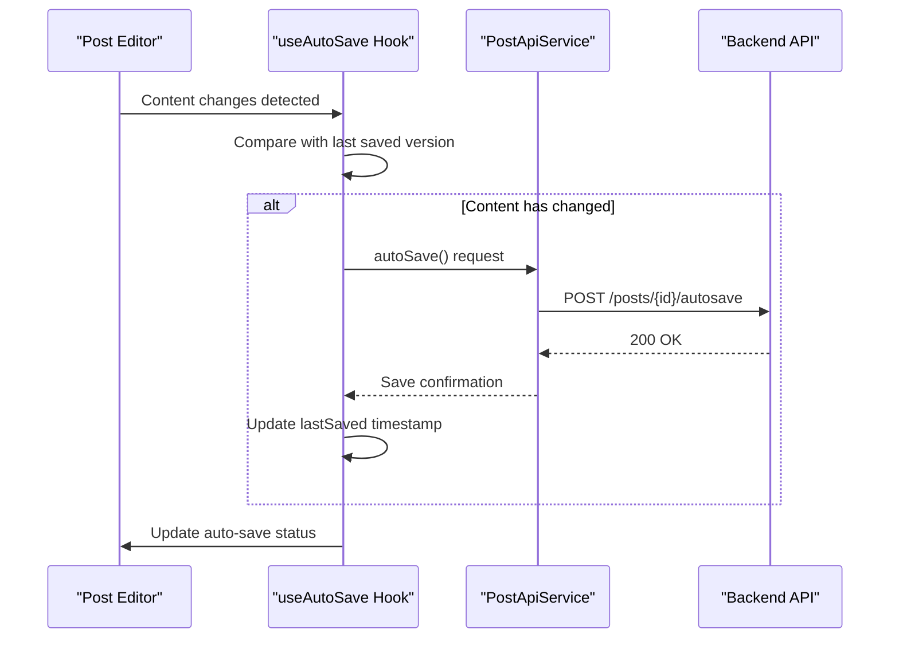
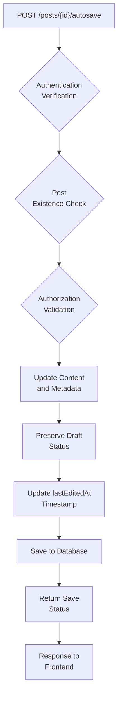
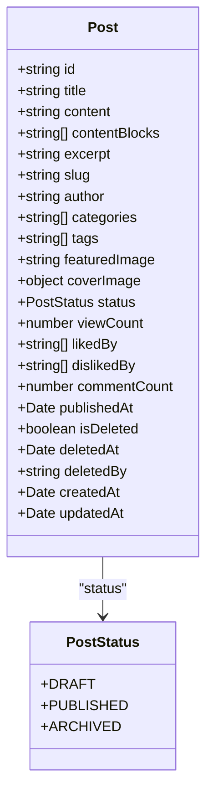
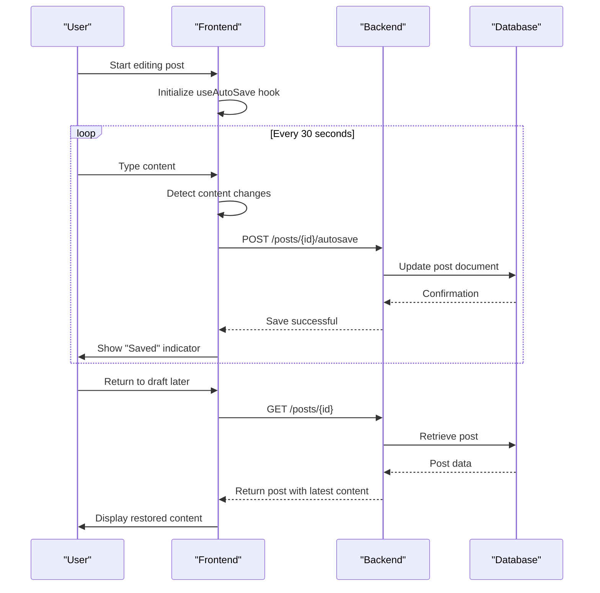
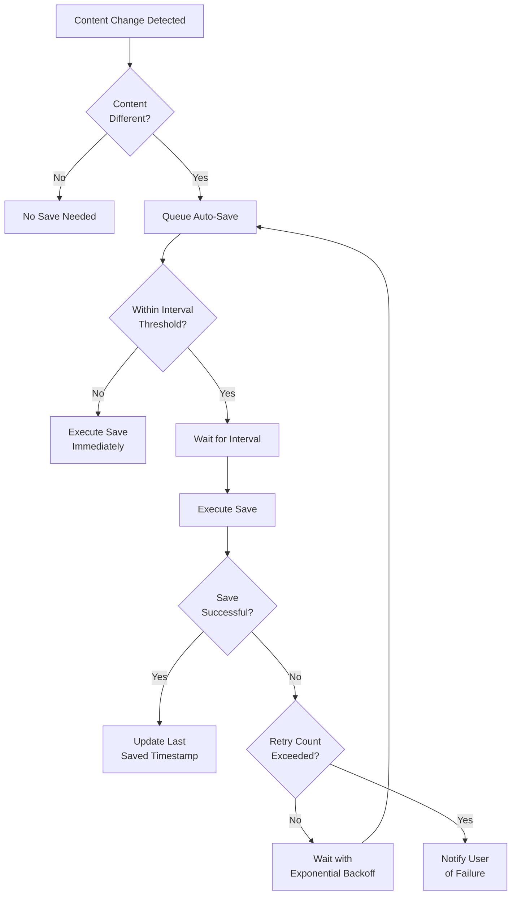
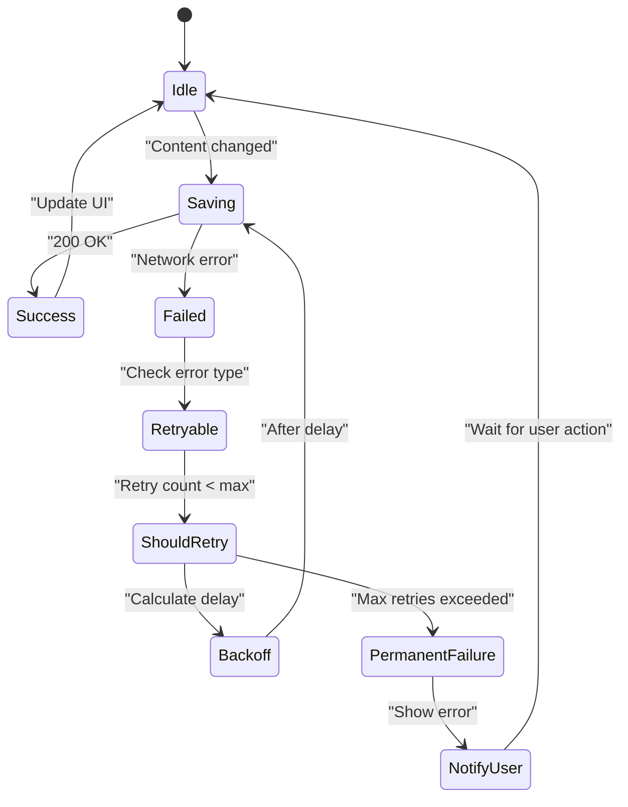

# Draft Management

<cite>
**Referenced Files in This Document**   
- [useAutoSave.ts](file://src/features/posts/hooks/useAutoSave.ts)
- [postApi.ts](file://src/features/posts/services/postApi.ts)
- [api.types.ts](file://src/features/posts/types/api.types.ts)
- [post.model.ts](file://api-fastify/src/models/post.model.ts)
- [post.service.ts](file://api-fastify/src/services/post.service.ts)
- [post.controller.ts](file://api-fastify/src/controllers/post.controller.ts)
- [post.routes.ts](file://api-fastify/src/routes/post.routes.ts)
</cite>

## Table of Contents
1. [Introduction](#introduction)
2. [Auto-Save Implementation](#auto-save-implementation)
3. [Frontend Auto-Save Hook](#frontend-auto-save-hook)
4. [Backend Auto-Save Endpoint](#backend-auto-save-endpoint)
5. [Draft Persistence and Status Management](#draft-persistence-and-status-management)
6. [Data Flow and Synchronization](#data-flow-and-synchronization)
7. [Conflict Resolution and Versioning](#conflict-resolution-and-versioning)
8. [Performance and Optimization](#performance-and-optimization)
9. [Error Handling and Offline Scenarios](#error-handling-and-offline-scenarios)
10. [Conclusion](#conclusion)

## Introduction
The draft management system in MERN_chatai_blog provides robust auto-save functionality to prevent content loss during post creation and editing. This system ensures that users' work is automatically saved at regular intervals while maintaining optimal performance and data consistency. The implementation spans both frontend and backend components, creating a seamless experience for users who are writing blog posts. The system is designed to handle various scenarios including network interruptions, concurrent edits, and the transition from draft to published status.

## Auto-Save Implementation
The auto-save system in MERN_chatai_blog is designed to periodically save content changes without disrupting the user's writing flow. This implementation prevents data loss due to accidental page refreshes, browser crashes, or other interruptions. The system operates by detecting content changes and automatically transmitting them to the server at configurable intervals. The auto-save functionality is specifically optimized to send only the necessary data, reducing bandwidth usage and server load. This approach ensures that users can focus on content creation without worrying about manually saving their work.

**Section sources**
- [useAutoSave.ts](file://src/features/posts/hooks/useAutoSave.ts#L0-L167)
- [postApi.ts](file://src/features/posts/services/postApi.ts#L430-L450)

## Frontend Auto-Save Hook
The `useAutoSave` hook is a custom React hook that manages the auto-save functionality on the frontend. It tracks content changes and automatically saves them to the backend at regular intervals. The hook accepts configuration options including the auto-save interval (default 30 seconds), retry attempts, and callback functions for save events. It compares the current content with the last saved version to determine if changes have occurred, preventing unnecessary save operations. When changes are detected, the hook triggers an auto-save request containing the content and metadata such as title, summary, and the last edited timestamp.

**Diagram sources**
- [useAutoSave.ts](file://src/features/posts/hooks/useAutoSave.ts#L0-L167)
- [postApi.ts](file://src/features/posts/services/postApi.ts#L430-L450)

**Section sources**
- [useAutoSave.ts](file://src/features/posts/hooks/useAutoSave.ts#L0-L167)

## Backend Auto-Save Endpoint
The backend auto-save endpoint is implemented as a POST route at `/posts/{id}/autosave` which accepts content and metadata for draft posts. This endpoint is specifically designed to handle auto-save requests efficiently by bypassing full validation that would normally occur during manual saves. The implementation focuses on quickly persisting the content to ensure minimal latency. The endpoint updates the post document with the new content and metadata while preserving the draft status. It returns a response containing the save status, version number, and timestamp of the last save, allowing the frontend to provide feedback to the user.

**Diagram sources**
- [post.controller.ts](file://api-fastify/src/controllers/post.controller.ts#L0-L199)
- [post.service.ts](file://api-fastify/src/services/post.service.ts#L0-L199)

**Section sources**
- [postApi.ts](file://src/features/posts/services/postApi.ts#L430-L450)
- [api.types.ts](file://src/features/posts/types/api.types.ts#L370-L380)

## Draft Persistence and Status Management
Draft persistence in MERN_chatai_blog is managed through the post model's status field, which has a default value of 'DRAFT'. The system maintains draft status until the user explicitly chooses to publish the post. When a post is created, it is automatically assigned a draft status and stored in the database with minimal required fields. The auto-save functionality updates the draft content without changing its status. The draft management system also handles metadata such as the last edited timestamp, which helps users identify recently worked-on drafts. Users can access their drafts through a dedicated interface that filters posts by status, allowing them to resume editing at any time.

**Diagram sources**
- [post.model.ts](file://api-fastify/src/models/post.model.ts#L0-L135)
- [post.service.ts](file://api-fastify/src/services/post.service.ts#L0-L199)

**Section sources**
- [post.model.ts](file://api-fastify/src/models/post.model.ts#L0-L135)

## Data Flow and Synchronization
The data flow between the frontend and backend in the draft management system follows a structured pattern that ensures consistency and reliability. When a user begins editing a post, the `useAutoSave` hook initializes and establishes a connection with the `PostApiService`. As the user types, the hook detects changes and queues them for auto-save. At the configured interval, the hook sends the updated content and metadata to the backend via the auto-save endpoint. The backend processes the request, updates the database, and returns a confirmation. The frontend then updates its state to reflect the successful save, providing visual feedback to the user. This synchronization ensures that the latest content is always available, even if the user navigates away and returns later.

**Diagram sources**
- [useAutoSave.ts](file://src/features/posts/hooks/useAutoSave.ts#L0-L167)
- [postApi.ts](file://src/features/posts/services/postApi.ts#L430-L450)
- [post.controller.ts](file://api-fastify/src/controllers/post.controller.ts#L0-L199)

**Section sources**
- [useAutoSave.ts](file://src/features/posts/hooks/useAutoSave.ts#L0-L167)
- [postApi.ts](file://src/features/posts/services/postApi.ts#L430-L450)

## Conflict Resolution and Versioning
The draft management system handles potential conflicts through a combination of timestamp-based detection and user interface feedback. When a user opens a draft, the system records the last edited timestamp. If another session modifies the same draft, the auto-save operations will update this timestamp. When a user attempts to save changes to a draft that has been modified elsewhere, the system can detect the discrepancy through the timestamp comparison. The implementation includes retry logic with exponential backoff to handle temporary conflicts. While the current system doesn't implement full version history, it preserves the most recent auto-saved content, ensuring that the latest changes are not lost. Users can manually save versions by creating copies of their drafts before making significant changes.

**Section sources**
- [useAutoSave.ts](file://src/features/posts/hooks/useAutoSave.ts#L0-L167)
- [post.service.ts](file://api-fastify/src/services/post.service.ts#L0-L199)

## Performance and Optimization
The auto-save system is optimized to balance data protection with performance considerations. The default 30-second interval strikes a balance between frequent saves and minimizing server load. The implementation uses content comparison to avoid unnecessary save operations when no changes have occurred. The auto-save endpoint is designed to be lightweight, bypassing extensive validation that would slow down the process. The system implements exponential backoff for retry attempts, preventing server overload during network issues. Additionally, the frontend debounces save operations, ensuring that rapid successive changes are batched into a single save request. These optimizations ensure that the auto-save functionality operates efficiently without impacting the user's editing experience.

**Diagram sources**
- [useAutoSave.ts](file://src/features/posts/hooks/useAutoSave.ts#L0-L167)
- [postApi.ts](file://src/features/posts/services/postApi.ts#L430-L450)

**Section sources**
- [useAutoSave.ts](file://src/features/posts/hooks/useAutoSave.ts#L0-L167)

## Error Handling and Offline Scenarios
The draft management system includes comprehensive error handling to address various failure scenarios, including offline conditions. When an auto-save attempt fails, the system implements a retry mechanism with exponential backoff, giving the connection time to recover. The `useAutoSave` hook tracks retry attempts and notifies the user if saving continues to fail after the maximum retry count. In offline scenarios, the system continues to track changes locally and attempts to save once connectivity is restored. The implementation includes error callbacks that allow the parent component to respond to save failures, potentially displaying notifications to the user. This robust error handling ensures that content is preserved even in challenging network conditions.

**Diagram sources**
- [useAutoSave.ts](file://src/features/posts/hooks/useAutoSave.ts#L0-L167)
- [postApi.ts](file://src/features/posts/services/postApi.ts#L430-L450)

**Section sources**
- [useAutoSave.ts](file://src/features/posts/hooks/useAutoSave.ts#L0-L167)

## Conclusion
The draft management system in MERN_chatai_blog provides a reliable and user-friendly auto-save functionality that effectively prevents content loss during post creation. By implementing a well-designed combination of frontend hooks and backend endpoints, the system ensures that users' work is automatically preserved at regular intervals. The architecture balances data protection with performance optimization, using intelligent change detection and efficient data transmission. The system's robust error handling and conflict management ensure reliability even in challenging conditions. This comprehensive approach to draft management enhances the user experience by allowing writers to focus on content creation without the distraction of manual saving, while ensuring their work is securely persisted.