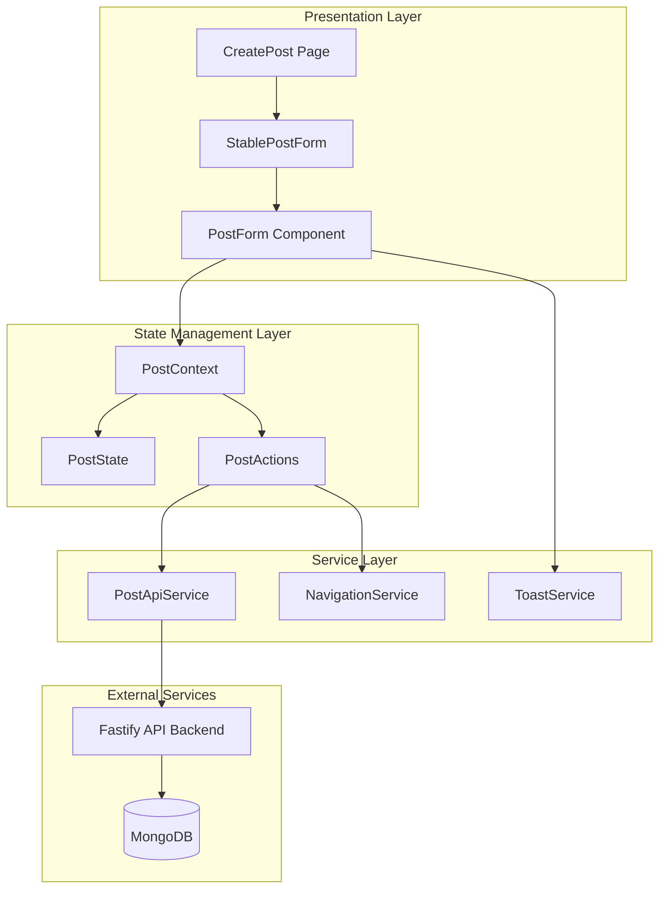
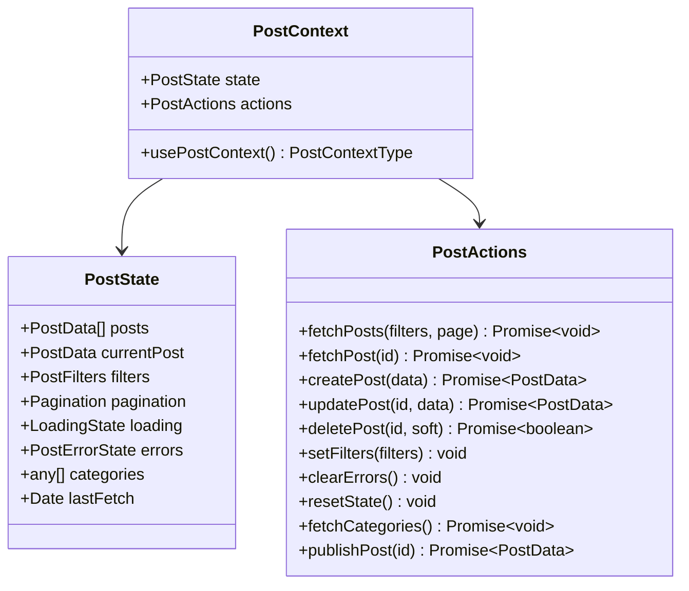
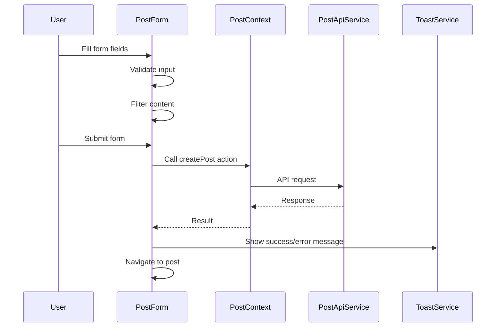
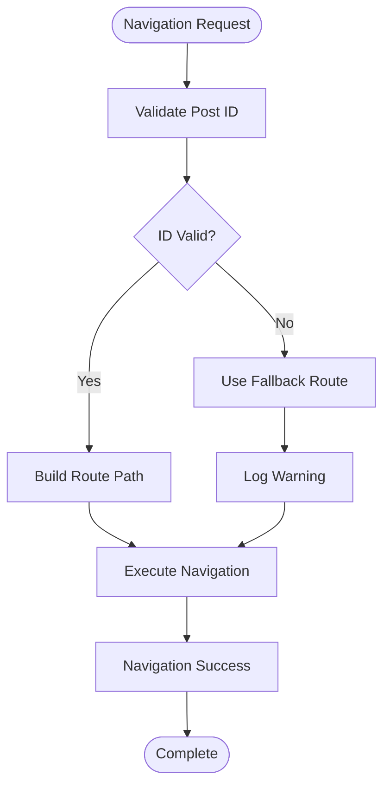
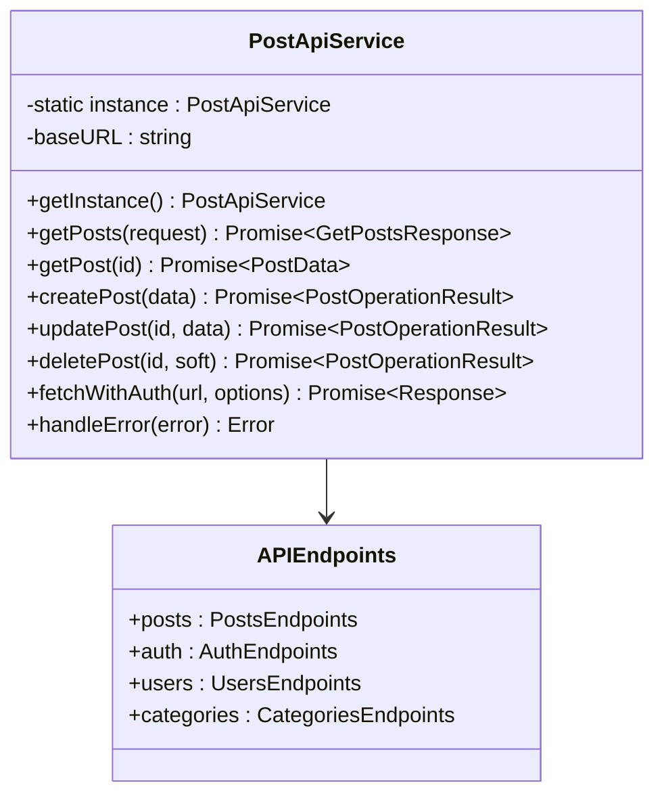

# Post Creation Feature Documentation

<cite>
**Referenced Files in This Document**
- [CreatePost.tsx](file://src/features/posts/pages/CreatePost.tsx)
- [PostContext.tsx](file://src/features/posts/context/PostContext.tsx)
- [StablePostForm.tsx](file://src/features/posts/components/PostForm/StablePostForm.tsx)
- [PostForm/index.tsx](file://src/features/posts/components/PostForm/index.tsx)
- [postApi.ts](file://src/features/posts/services/postApi.ts)
- [useNavigation.ts](file://src/features/posts/hooks/useNavigation.ts)
- [navigationService.ts](file://src/features/posts/services/navigationService.ts)
- [post.types.ts](file://src/features/posts/types/post.types.ts)
- [toast-helpers.ts](file://src/lib/toast-helpers.ts)
- [api.config.ts](file://src/config/api.config.ts)
</cite>

## Table of Contents
1. [Introduction](#introduction)
2. [Architecture Overview](#architecture-overview)
3. [Core Components](#core-components)
4. [State Management](#state-management)
5. [Form Implementation](#form-implementation)
6. [Navigation System](#navigation-system)
7. [API Integration](#api-integration)
8. [Error Handling](#error-handling)
9. [Performance Optimizations](#performance-optimizations)
10. [Common Issues and Solutions](#common-issues-and-solutions)
11. [Best Practices](#best-practices)

## Introduction

The post creation feature in MERN_chatai_blog is a sophisticated system designed to provide authors with a seamless experience for creating and publishing blog posts. Built with React and TypeScript, it implements modern patterns including context-based state management, memoization strategies, and robust error handling.

The system consists of several interconnected components that work together to provide a smooth user experience while maintaining performance and reliability. From the initial form rendering to the final post publication, every aspect of the process is carefully orchestrated to minimize user frustration and maximize productivity.

## Architecture Overview

The post creation system follows a layered architecture pattern with clear separation of concerns:



**Diagram sources**
- [CreatePost.tsx](file://src/features/posts/pages/CreatePost.tsx#L1-L105)
- [PostContext.tsx](file://src/features/posts/context/PostContext.tsx#L1-L501)
- [postApi.ts](file://src/features/posts/services/postApi.ts#L1-L605)

## Core Components

### CreatePost Page Component

The `CreatePost` component serves as the main entry point for the post creation workflow. It implements a provider pattern to wrap the entire form with centralized state management:

```typescript
export function CreatePost() {
  return (
    <PostProvider>
      <CreatePostContent />
    </PostProvider>
  );
}
```

The component handles three distinct states:
- **Loading State**: Displays a spinner while the post is being created
- **Error State**: Shows error messages with retry options
- **Normal State**: Renders the actual post creation form

**Section sources**
- [CreatePost.tsx](file://src/features/posts/pages/CreatePost.tsx#L10-L105)

### StablePostForm Wrapper

The `StablePostForm` component is a crucial optimization that prevents unnecessary re-renders and cursor jumping issues:

```typescript
const StablePostForm = memo(function StablePostForm({
  mode,
  initialData,
  onSubmit,
  onCancel,
  className = '',
}: StablePostFormProps) {
  const memoizedInitialData = useMemo(() => {
    if (!initialData) return undefined;
    
    return {
      id: initialData.id,
      title: initialData.title || '',
      summary: initialData.summary || '',
      content: initialData.content || '',
      coverImage: initialData.coverImage,
      categories: initialData.categories || [],
      tags: initialData.tags || [],
      status: initialData.status,
      visibility: initialData.visibility,
      contentBlocks: initialData.contentBlocks || [],
    };
  }, [
    initialData?.id,
    initialData?.title,
    initialData?.summary,
    initialData?.content,
    initialData?.coverImage,
    initialData?.status,
    initialData?.visibility,
  ]);
  
  return (
    <PostForm
      mode={mode}
      initialData={memoizedInitialData}
      onSubmit={onSubmit}
      onCancel={onCancel}
      className={className}
    />
  );
}, (prevProps, nextProps) => {
  // Custom comparison function to prevent unnecessary re-renders
  if (prevProps.mode !== nextProps.mode) return false;
  if (prevProps.className !== nextProps.className) return false;
  
  // Compare initial data more carefully
  const prevData = prevProps.initialData;
  const nextData = nextProps.initialData;
  
  if (!prevData && !nextData) return true;
  if (!prevData || !nextData) return false;
  
  const keyFields = ['id', 'title', 'summary', 'content', 'status', 'visibility'];
  for (const field of keyFields) {
    if (prevData[field as keyof typeof prevData] !== nextData[field as keyof typeof nextData]) {
      return false;
    }
  }
  
  return true;
});
```

**Section sources**
- [StablePostForm.tsx](file://src/features/posts/components/PostForm/StablePostForm.tsx#L1-L112)

## State Management

### PostContext Implementation

The `PostContext` provides centralized state management for all post-related operations. It implements a reducer pattern with comprehensive action types:



**Diagram sources**
- [PostContext.tsx](file://src/features/posts/context/PostContext.tsx#L1-L501)

The context manages several critical aspects:

1. **Loading States**: Tracks various loading states (`isLoading`, `isCreating`, `isUpdating`, etc.)
2. **Error Management**: Centralized error handling with detailed error objects
3. **Global State Synchronization**: Integrates with `globalStateManager` for cross-component communication
4. **Cache Management**: Implements intelligent caching with automatic invalidation

**Section sources**
- [PostContext.tsx](file://src/features/posts/context/PostContext.tsx#L1-L501)

### Form Submission Flow

The form submission process involves several steps with comprehensive error handling:

```typescript
const handleSubmit = async (data: CreatePostInput | UpdatePostInput) => {
  try {
    const createData = data as CreatePostInput;
    const result = await actions.createPost(createData);
    
    if (result && result.id) {
      if (validatePostId(result.id)) {
        showSuccess('Article créé avec succès!');
        navigateToPost(result.id, { fallbackRoute: '/' });
      } else {
        console.error('Invalid post ID returned from API:', result.id);
        showSuccess('Article créé avec succès!');
        navigateToHome({ replace: true });
      }
    } else {
      showError('Échec de la création de l\'article. Veuillez réessayer.');
      console.error('Post creation failed - no result or ID:', result);
    }
  } catch (error) {
    console.error('Create post error:', error);
    showError('Une erreur inattendue s\'est produite.');
  }
};
```

**Section sources**
- [CreatePost.tsx](file://src/features/posts/pages/CreatePost.tsx#L24-L54)

## Form Implementation

### PostForm Component Architecture

The `PostForm` component is the heart of the post creation system, implementing comprehensive form validation, content filtering, and user feedback mechanisms:



**Diagram sources**
- [PostForm/index.tsx](file://src/features/posts/components/PostForm/index.tsx#L1-L662)
- [postApi.ts](file://src/features/posts/services/postApi.ts#L1-L605)

### Validation System

The form implements multi-layered validation:

1. **Client-Side Validation**: Real-time field validation with immediate feedback
2. **Content Filtering**: Automatic detection and warning of inappropriate content
3. **Server-Side Validation**: Final validation performed by the backend API

```typescript
const validateForm = useCallback(() => {
  const newErrors: Record<string, string> = {};

  if (!formData.title.trim()) {
    newErrors.title = 'Le titre est requis';
  } else if (formData.title.length < 3) {
    newErrors.title = 'Le titre doit contenir au moins 3 caractères';
  } else if (formData.title.length > 200) {
    newErrors.title = 'Le titre doit contenir moins de 200 caractères';
  }

  if (!formData.summary.trim()) {
    newErrors.summary = 'Le résumé est requis';
  } else if (formData.summary.length < 10) {
    newErrors.summary = 'Le résumé doit contenir au moins 10 caractères';
  } else if (formData.summary.length > 500) {
    newErrors.summary = 'Le résumé doit contenir moins de 500 caractères';
  }

  if (!contentBlocks || contentBlocks.length === 0) {
    newErrors.content = 'Le contenu est requis';
  }

  if (!formData.category) {
    newErrors.category = 'La catégorie est requise';
  }

  if (!formData.coverImage || !formData.coverImage.trim()) {
    newErrors.coverImage = 'L\'image de couverture est requise';
  }

  setErrors(newErrors);
  return Object.keys(newErrors).length === 0;
}, [formData, contentBlocks]);
```

**Section sources**
- [PostForm/index.tsx](file://src/features/posts/components/PostForm/index.tsx#L200-L230)

### Content Blocks System

The form uses a sophisticated content blocks system that allows for rich, structured content creation:

```typescript
interface ContentBlock {
  type: string;
  data: any;
}

const [contentBlocks, setContentBlocks] = useState<ContentBlock[]>(initialData?.contentBlocks || []);
```

This system enables:
- **Structured Content**: Organized content with different block types
- **Rich Formatting**: Support for various content formats
- **Dynamic Rendering**: Flexible content display based on block types

**Section sources**
- [post.types.ts](file://src/features/posts/types/post.types.ts#L40-L45)

## Navigation System

### Safe Navigation Pattern

The navigation system implements a safe navigation pattern to prevent common issues like broken links and invalid post IDs:



**Diagram sources**
- [navigationService.ts](file://src/features/posts/services/navigationService.ts#L1-L208)

### Navigation Service Implementation

The `NavigationService` provides robust navigation capabilities:

```typescript
public navigateToPost(
  postId: string | undefined | null, 
  options: NavigationOptions = {}
): boolean {
  if (!this.navigate) {
    console.error('NavigationService not initialized');
    return false;
  }

  const { replace = false, fallbackRoute = '/', validateId = true } = options;

  // Validate post ID if required
  if (validateId && !this.validatePostId(postId)) {
    console.warn(`Invalid post ID: ${postId}, navigating to fallback route`);
    this.navigate(fallbackRoute, { replace });
    return false;
  }

  try {
    const route = `/Post/${postId}`;
    this.navigate(route, { replace });
    return true;
  } catch (error) {
    console.error('Navigation error:', error);
    this.navigate(fallbackRoute, { replace });
    return false;
  }
}
```

**Section sources**
- [navigationService.ts](file://src/features/posts/services/navigationService.ts#L40-L65)

## API Integration

### PostApiService Architecture

The `PostApiService` provides a comprehensive interface for all post-related API operations:



**Diagram sources**
- [postApi.ts](file://src/features/posts/services/postApi.ts#L1-L605)
- [api.config.ts](file://src/config/api.config.ts#L1-L273)

### API Request Flow

The API integration follows a standardized pattern:

```typescript
async createPost(data: CreatePostInput): Promise<PostOperationResult> {
  try {
    const response = await this.fetchWithAuth(API_ENDPOINTS.posts.create, {
      method: 'POST',
      headers: {
        'Content-Type': 'application/json',
      },
      body: JSON.stringify(data),
    });

    const result = await response.json();

    if (!response.ok) {
      return {
        success: false,
        error: result.message || 'Failed to create post',
        validationErrors: result.errors
      };
    }

    const postData = result.post || result.data;
    
    // Transform _id to id for frontend compatibility
    if (postData && postData._id) {
      postData.id = postData._id;
    }
    
    return {
      success: true,
      data: postData
    };
  } catch (error) {
    console.error('Error creating post:', error);
    return {
      success: false,
      error: error instanceof Error ? error.message : 'Failed to create post'
    };
  }
}
```

**Section sources**
- [postApi.ts](file://src/features/posts/services/postApi.ts#L150-L200)

## Error Handling

### Comprehensive Error Management

The system implements multiple layers of error handling:

1. **Form Validation Errors**: Immediate client-side validation with user-friendly messages
2. **API Error Handling**: Robust error handling for network failures and server errors
3. **Navigation Error Recovery**: Automatic fallback routing when navigation fails
4. **User Feedback**: Consistent toast notifications for all error scenarios

```typescript
const showError = (message: string, title = "Erreur") => {
  toast({
    variant: "destructive",
    title,
    description: message,
  })
}

const showSuccess = (message: string, title = "Succès") => {
  toast({
    title,
    description: message,
  })
}
```

**Section sources**
- [toast-helpers.ts](file://src/lib/toast-helpers.ts#L1-L23)

### Error Recovery Strategies

The system implements several error recovery strategies:

```typescript
// Navigation with fallback
const navigateWithFallback = useCallback((primaryRoute: string, fallbackRoute?: string, options?: NavigationOptions) => {
  navigationService.navigateWithFallback(primaryRoute, fallbackRoute, options);
}, []);

// Error clearing and retry
<button
  onClick={() => {
    actions.clearErrors();
    navigateToHome();
  }}
  className="px-4 py-2 bg-primary-600 text-white rounded-md hover:bg-primary-700 transition-colors"
>
  Go Back
</button>
```

**Section sources**
- [CreatePost.tsx](file://src/features/posts/pages/CreatePost.tsx#L75-L95)

## Performance Optimizations

### Memoization Strategies

The system employs several memoization strategies to optimize performance:

1. **StablePostForm**: Prevents unnecessary re-renders through custom comparison functions
2. **useMemo for Initial Data**: Creates stable references for initial form data
3. **useCallback for Handlers**: Stabilizes callback functions to prevent re-renders

```typescript
// Memoized initial data to prevent re-renders
const memoizedInitialData = useMemo(() => {
  if (!initialData) return undefined;
  
  return {
    id: initialData.id,
    title: initialData.title || '',
    summary: initialData.summary || '',
    content: initialData.content || '',
    coverImage: initialData.coverImage,
    categories: initialData.categories || [],
    tags: initialData.tags || [],
    status: initialData.status,
    visibility: initialData.visibility,
    contentBlocks: initialData.contentBlocks || [],
  };
}, [
  initialData?.id,
  initialData?.title,
  initialData?.summary,
  initialData?.content,
  initialData?.coverImage,
  initialData?.status,
  initialData?.visibility,
]);
```

**Section sources**
- [StablePostForm.tsx](file://src/features/posts/components/PostForm/StablePostForm.tsx#L20-L45)

### Loading State Management

The system provides comprehensive loading state management:

```typescript
// Loading state display
if (state.loading.isCreating) {
  return (
    <div className="min-h-screen flex items-center justify-center">
      <div className="text-center">
        <div className="animate-spin rounded-full h-12 w-12 border-b-2 border-primary-600 mx-auto"></div>
        <p className="mt-4 text-gray-600 dark:text-gray-400">Creating your post...</p>
      </div>
    </div>
  );
}
```

**Section sources**
- [CreatePost.tsx](file://src/features/posts/pages/CreatePost.tsx#L56-L65)

## Common Issues and Solutions

### Form Validation Issues

**Problem**: Form validation not triggering immediately
**Solution**: Ensure proper event handlers and state updates:

```typescript
onChange={useCallback((e: React.ChangeEvent<HTMLInputElement>) => {
  updateFormData('title', e.target.value);
}, [updateFormData])}
```

**Problem**: Content filtering causing performance issues
**Solution**: Implement debounced content checking:

```typescript
const checkContentFilter = useCallback((field: string, content: string) => {
  const testResult = testContent(content);
  setContentWarnings(prev => ({
    ...prev,
    [field]: testResult.flaggedWords,
  }));
}, [testContent]);

// Debounce content filtering
const timeoutId = setTimeout(() => {
  checkContentFilter(field, value);
}, 300);
```

### Navigation Safety Issues

**Problem**: Broken navigation after post creation
**Solution**: Implement robust post ID validation:

```typescript
if (validatePostId(result.id)) {
  showSuccess('Article créé avec succès!');
  navigateToPost(result.id, { fallbackRoute: '/' });
} else {
  console.error('Invalid post ID returned from API:', result.id);
  showSuccess('Article créé avec succès!');
  navigateToHome({ replace: true });
}
```

**Section sources**
- [CreatePost.tsx](file://src/features/posts/pages/CreatePost.tsx#L30-L45)

### Memory Leaks and Performance

**Problem**: Memory leaks from uncanceled timeouts
**Solution**: Proper cleanup in effect hooks:

```typescript
return () => clearTimeout(timeoutId);
```

**Problem**: Unnecessary re-renders
**Solution**: Use proper memoization and stable callbacks:

```typescript
const updateFormData = useCallback((field: string, value: any) => {
  setFormData(prev => {
    if (prev[field as keyof typeof prev] === value) {
      return prev;
    }
    return { ...prev, [field]: value };
  });
}, []);
```

**Section sources**
- [PostForm/index.tsx](file://src/features/posts/components/PostForm/index.tsx#L150-L170)

## Best Practices

### Form Design Patterns

1. **Progressive Disclosure**: Show essential fields first, advanced options later
2. **Real-time Validation**: Provide immediate feedback on form input
3. **Clear Error Messages**: Use specific, actionable error messages
4. **Accessibility**: Ensure keyboard navigation and screen reader support

### State Management Guidelines

1. **Immutable Updates**: Always create new state objects rather than modifying existing ones
2. **Centralized State**: Keep related state in a single context or reducer
3. **Async Operations**: Handle loading states and error conditions consistently
4. **Cleanup**: Properly clean up resources and subscriptions

### API Integration Standards

1. **Error Handling**: Always handle both success and error responses
2. **Validation**: Perform client-side validation before API calls
3. **Caching**: Implement intelligent caching with appropriate invalidation
4. **Rate Limiting**: Respect API rate limits and implement exponential backoff

### Performance Optimization

1. **Memoization**: Use `React.memo` and `useMemo` appropriately
2. **Stable Callbacks**: Use `useCallback` for event handlers
3. **Debouncing**: Implement debouncing for expensive operations
4. **Lazy Loading**: Load heavy components only when needed

This comprehensive documentation provides both technical depth for experienced developers and accessibility for beginners, covering all aspects of the post creation feature from basic usage to advanced optimization techniques.