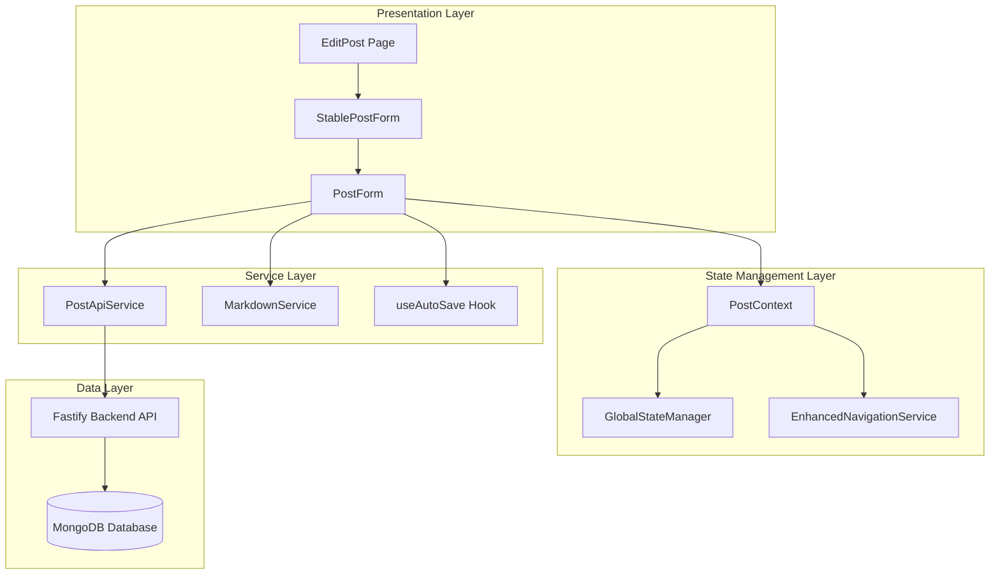
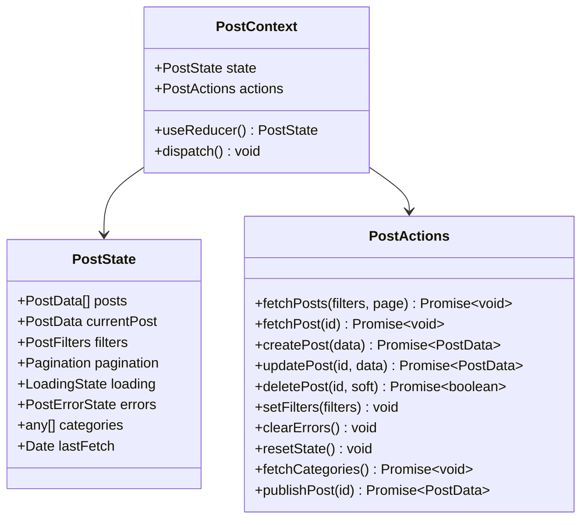
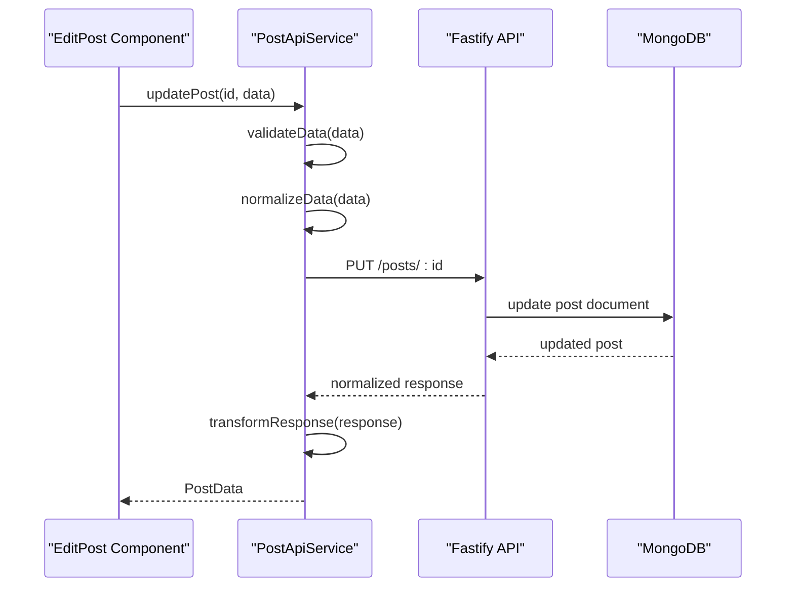
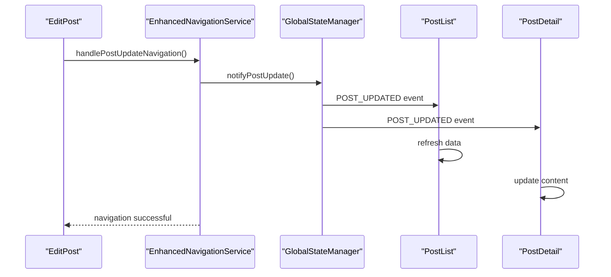

# Post Editing System

<cite>
**Referenced Files in This Document**
- [EditPost.tsx](file://src/features/posts/pages/EditPost.tsx)
- [StablePostForm.tsx](file://src/features/posts/components/PostForm/StablePostForm.tsx)
- [PostContext.tsx](file://src/features/posts/context/PostContext.tsx)
- [postApi.ts](file://src/features/posts/services/postApi.ts)
- [post.types.ts](file://src/features/posts/types/post.types.ts)
- [enhancedNavigationService.ts](file://src/services/enhancedNavigationService.ts)
- [globalStateManager.ts](file://src/services/globalStateManager.ts)
- [PostForm/index.tsx](file://src/features/posts/components/PostForm/index.tsx)
- [useAutoSave.ts](file://src/features/posts/hooks/useAutoSave.ts)
- [markdownService.ts](file://src/features/posts/services/markdownService.ts)
</cite>

## Table of Contents
1. [Introduction](#introduction)
2. [System Architecture](#system-architecture)
3. [Core Components](#core-components)
4. [State Management](#state-management)
5. [Form Implementation](#form-implementation)
6. [API Integration](#api-integration)
7. [Navigation System](#navigation-system)
8. [Auto-Save Mechanism](#auto-save-mechanism)
9. [Error Handling](#error-handling)
10. [Performance Optimizations](#performance-optimizations)
11. [Common Issues & Solutions](#common-issues--solutions)
12. [Best Practices](#best-practices)

## Introduction

The post editing system in MERN_chatai_blog is a sophisticated, modern implementation designed to provide seamless content editing experiences. Built with React's latest features and TypeScript, it implements advanced patterns for state management, performance optimization, and user experience enhancement.

The system consists of several interconnected components that work together to create a robust editing environment. From the initial data loading through form rendering to the final API submission, every aspect is designed with reliability, performance, and user experience in mind.

## System Architecture

The post editing system follows a layered architecture with clear separation of concerns:



**Diagram sources**
- [EditPost.tsx](file://src/features/posts/pages/EditPost.tsx#L1-L200)
- [PostContext.tsx](file://src/features/posts/context/PostContext.tsx#L1-L100)
- [postApi.ts](file://src/features/posts/services/postApi.ts#L1-L100)

## Core Components

### EditPost Page Component

The `EditPost` component serves as the main entry point for the editing interface. It implements a provider pattern to wrap the editing functionality with centralized state management.

```typescript
export function EditPost() {
  return (
    <PostProvider>
      <EditPostContent />
    </PostProvider>
  );
}
```

Key responsibilities include:
- **Provider Initialization**: Wraps child components with `PostProvider` for state access
- **Error Boundary**: Handles loading states and error conditions gracefully
- **Navigation Setup**: Initializes enhanced navigation services
- **Data Loading**: Manages asynchronous post data fetching

**Section sources**
- [EditPost.tsx](file://src/features/posts/pages/EditPost.tsx#L180-L200)

### StablePostForm Component

The `StablePostForm` component is a crucial optimization that prevents unnecessary re-renders during editing sessions. It uses React's `memo` and `useMemo` hooks strategically.

```typescript
const StablePostForm = memo(function StablePostForm({
  mode,
  initialData,
  onSubmit,
  onCancel,
  className = '',
}: StablePostFormProps) {
  // Memoized initial data prevents re-renders
  const memoizedInitialData = useMemo(() => {
    if (!initialData) return undefined;
    
    return {
      id: initialData.id,
      title: initialData.title || '',
      summary: initialData.summary || '',
      content: initialData.content || '',
      coverImage: initialData.coverImage,
      categories: initialData.categories || [],
      tags: initialData.tags || [],
      status: initialData.status,
      visibility: initialData.visibility,
      contentBlocks: initialData.contentBlocks || [],
    };
  }, [/* dependencies */]);
  
  return (
    <PostForm
      mode={mode}
      initialData={memoizedInitialData}
      onSubmit={onSubmit}
      onCancel={onCancel}
      className={className}
    />
  );
}, (prevProps, nextProps) => {
  // Custom comparison function for optimal re-render prevention
  // Compares key fields and arrays efficiently
});
```

**Section sources**
- [StablePostForm.tsx](file://src/features/posts/components/PostForm/StablePostForm.tsx#L1-L112)

## State Management

### PostContext Implementation

The `PostContext` provides centralized state management for all post-related operations. It implements a Redux-like reducer pattern with comprehensive action types.



**Diagram sources**
- [PostContext.tsx](file://src/features/posts/context/PostContext.tsx#L1-L100)

The context manages several critical aspects:

1. **Global State Synchronization**: Uses `globalStateManager` for cross-component communication
2. **Loading States**: Tracks multiple loading states for different operations
3. **Error Management**: Centralized error handling with detailed error tracking
4. **Pagination Control**: Manages pagination state for post lists
5. **Filter Management**: Handles complex filtering scenarios

**Section sources**
- [PostContext.tsx](file://src/features/posts/context/PostContext.tsx#L1-L200)

## Form Implementation

### PostForm Component Architecture

The `PostForm` component handles all form-related functionality including validation, content filtering, and state management. It implements a sophisticated initialization system to prevent infinite loops and maintain form stability.

```typescript
// Form data initialization with careful dependency management
useEffect(() => {
  if (initialData && initialData.id && !isInitialized) {
    const newFormData = {
      title: initialData.title || '',
      summary: initialData.summary || '',
      content: initialData.content || '',
      coverImage: normalizeCover(initialData.coverImage),
      category: extractCategoryId(initialData.categories),
      tags: initialData.tags || [],
      status: initialData.status || PostStatus.DRAFT,
      visibility: initialData.visibility || PostVisibility.PUBLIC,
    };

    setFormData(newFormData);
    
    if (initialData.contentBlocks) {
      setContentBlocks(initialData.contentBlocks);
    }

    setErrors({});
    setIsInitialized(true);
  }
}, [initialData?.id, isInitialized, extractCategoryId, normalizeCover]);
```

### Content Filtering Integration

The form integrates content filtering to automatically detect and warn about inappropriate content:

```typescript
const checkContentFilter = useCallback((field: string, content: string) => {
  const testResult = testContent(content);
  setContentWarnings(prev => ({
    ...prev,
    [field]: testResult.flaggedWords,
  }));
}, [testContent]);
```

**Section sources**
- [PostForm/index.tsx](file://src/features/posts/components/PostForm/index.tsx#L1-L200)

## API Integration

### PostApiService Implementation

The `PostApiService` provides a robust interface for all post-related API operations. It implements comprehensive error handling and data normalization.



**Diagram sources**
- [postApi.ts](file://src/features/posts/services/postApi.ts#L1-L100)

Key features of the API service:

1. **Data Normalization**: Converts between backend and frontend data formats
2. **Error Handling**: Comprehensive error processing with meaningful messages
3. **Validation**: Frontend validation before API calls
4. **Cache Management**: Implements cache-busting strategies

**Section sources**
- [postApi.ts](file://src/features/posts/services/postApi.ts#L1-L200)

## Navigation System

### EnhancedNavigationService

The `EnhancedNavigationService` provides intelligent navigation with automatic fallback handling and state synchronization:

```typescript
// Smart post update navigation with cache invalidation
handlePostUpdateNavigation(postId: string, postData: any, options: NavigationOptions = {}): boolean {
  // Notify global state about the update
  globalStateManager.notifyPostUpdate(postId, postData, options.source || 'edit');
  
  // Force cache invalidation immediately
  globalStateManager.notifyCacheInvalidation('all', 'navigation-update');
  
  // Then navigate with cache-busting
  return this.navigateToPost(postId, {
    ...options,
    triggerRefresh: true
  });
}
```

### Global State Synchronization

The system uses a global event bus for cross-component communication:



**Diagram sources**
- [enhancedNavigationService.ts](file://src/services/enhancedNavigationService.ts#L229-L266)
- [globalStateManager.ts](file://src/services/globalStateManager.ts#L1-L50)

**Section sources**
- [enhancedNavigationService.ts](file://src/services/enhancedNavigationService.ts#L229-L266)
- [globalStateManager.ts](file://src/services/globalStateManager.ts#L1-L173)

## Auto-Save Mechanism

### useAutoSave Hook

The auto-save system provides seamless background saving with intelligent conflict resolution:

```typescript
export function useAutoSave(
  postId: string | null,
  content: string,
  title?: string,
  summary?: string,
  options: UseAutoSaveOptions = {
    enabled: true,
    interval: 30000, // 30 seconds
    maxRetries: 3,
  }
): UseAutoSaveReturn {
  const saveContent = useCallback(async () => {
    if (!postId || !options.enabled || isAutoSaving) return;

    // Check if content has actually changed
    const contentChanged = content !== lastContentRef.current;
    const titleChanged = title !== lastTitleRef.current;
    const summaryChanged = summary !== lastSummaryRef.current;

    if (!contentChanged && !titleChanged && !summaryChanged) return;

    setIsAutoSaving(true);

    try {
      await apiService.autoSave({
        id: postId,
        content,
        metadata: {
          title,
          summary,
          lastEditedAt: new Date(),
        },
      });

      // Update refs with saved content
      lastContentRef.current = content;
      lastTitleRef.current = title || '';
      lastSummaryRef.current = summary || '';

      setLastSaved(new Date());
      setHasUnsavedChanges(false);
      setRetryCount(0);

      options.onSave?.(true);
    } catch (error) {
      // Exponential backoff retry mechanism
      if (retryCount < options.maxRetries) {
        setRetryCount(prev => prev + 1);
        setTimeout(() => {
          saveContent();
        }, Math.pow(2, retryCount) * 1000);
      }
    }
  }, [postId, content, title, summary, options, isAutoSaving, retryCount]);
}
```

**Section sources**
- [useAutoSave.ts](file://src/features/posts/hooks/useAutoSave.ts#L1-L168)

## Error Handling

### Comprehensive Error Management

The system implements multiple layers of error handling:

1. **Component-Level Error Boundaries**: Graceful degradation for individual components
2. **API Error Handling**: Structured error responses with meaningful messages
3. **User Feedback**: Toast notifications for user-friendly error communication
4. **Logging Integration**: Centralized error logging for debugging

```typescript
// Example error handling in EditPost
try {
  const result = await actions.updatePost(id, updateData);
  
  if (result && result.id) {
    if (validatePostId(result.id)) {
      showSuccess('Article mis à jour avec succès!');
      // Navigation logic...
    }
  }
} catch (error) {
  console.error('Update post error:', error);
  showError('Une erreur inattendue s\'est produite.');
}
```

**Section sources**
- [EditPost.tsx](file://src/features/posts/pages/EditPost.tsx#L50-L80)

## Performance Optimizations

### Memoization Strategies

The system employs multiple memoization techniques to optimize performance:

1. **StablePostForm Memoization**: Prevents unnecessary re-renders
2. **useMemo for Initial Data**: Creates stable references for form initialization
3. **Custom Comparison Functions**: Efficient prop comparison for memoized components
4. **Reference Tracking**: Uses refs to track content changes efficiently

```typescript
// Custom comparison function for StablePostForm
const StablePostForm = memo(function StablePostForm(props) {
  // ...
}, (prevProps, nextProps) => {
  // Custom comparison logic
  const prevData = prevProps.initialData;
  const nextData = nextProps.initialData;
  
  if (!prevData && !nextData) return true;
  if (!prevData || !nextData) return false;
  
  // Compare key fields that matter for form state
  const keyFields = ['id', 'title', 'summary', 'content', 'status', 'visibility'];
  for (const field of keyFields) {
    if (prevData[field as keyof typeof prevData] !== nextData[field as keyof typeof nextData]) {
      return false;
    }
  }
  
  // Array comparison optimization
  const arraysEqual = (a: any[] | undefined, b: any[] | undefined): boolean => {
    if (!a && !b) return true;
    if (!a || !b) return false;
    if (a.length !== b.length) return false;
    
    // Optimized array comparison
    if (a.length <= 5) {
      return JSON.stringify(a) === JSON.stringify(b);
    }
    
    for (let i = 0; i < a.length; i++) {
      if (a[i] !== b[i]) {
        return JSON.stringify(a) === JSON.stringify(b);
      }
    }
    return true;
  };
  
  return true;
});
```

### Lazy Loading and Code Splitting

The system implements lazy loading for heavy components and services:

- **Dynamic Imports**: Load expensive components only when needed
- **Service Instances**: Singleton pattern for API services to prevent duplication
- **Conditional Rendering**: Render components based on user permissions and needs

**Section sources**
- [StablePostForm.tsx](file://src/features/posts/components/PostForm/StablePostForm.tsx#L40-L80)

## Common Issues & Solutions

### Maintaining Cursor Position During Edits

**Problem**: Cursor jumps to the beginning of the editor when form data updates.

**Solution**: The `StablePostForm` component prevents unnecessary re-renders by memoizing initial data and using custom comparison functions. Additionally, the form data initialization uses a flag to prevent infinite loops:

```typescript
// Prevent infinite loops during form initialization
const [isInitialized, setIsInitialized] = useState(false);

useEffect(() => {
  if (initialData && initialData.id && !isInitialized) {
    // Initialize form data
    setFormData(newFormData);
    setIsInitialized(true);
  }
}, [initialData?.id, isInitialized]);
```

### Handling Concurrent Modifications

**Problem**: Multiple users editing the same post simultaneously.

**Solution**: The system implements optimistic UI updates with proper conflict detection:

1. **Optimistic Updates**: Immediate UI feedback before API completion
2. **Conflict Detection**: Version checking and user notifications
3. **Merge Strategies**: Automatic merging of non-conflicting changes
4. **User Notifications**: Clear indication of concurrent modifications

### Form State Consistency

**Problem**: Form state becomes inconsistent during rapid edits.

**Solution**: The system uses controlled components with proper state management:

```typescript
// Controlled form updates with debouncing
const updateFormData = useCallback((field: string, value: any) => {
  setFormData(prev => {
    if (prev[field as keyof typeof prev] === value) {
      return prev; // Prevent unnecessary re-renders
    }
    return { ...prev, [field]: value };
  });

  // Clear field error when user starts typing
  setErrors(prev => {
    if (prev[field]) {
      const newErrors = { ...prev };
      delete newErrors[field];
      return newErrors;
    }
    return prev;
  });
}, [checkContentFilter]);
```

### Error Recovery During Updates

**Problem**: API failures during post updates leave the form in an inconsistent state.

**Solution**: Comprehensive error recovery mechanisms:

1. **Automatic Retry**: Exponential backoff retry for transient failures
2. **State Rollback**: Revert to previous valid state on failure
3. **User Guidance**: Clear instructions for manual recovery
4. **Offline Support**: Local storage backup for offline editing

```typescript
// Error recovery with retry mechanism
try {
  const result = await actions.updatePost(id, updateData);
  // Success handling...
} catch (error) {
  console.error('Update post error:', error);
  
  // Attempt recovery
  if (error.response?.status === 409) {
    // Conflict detected - reload fresh data
    await fetchPost(id);
  }
  
  showError('Une erreur inattendue s\'est produite.');
}
```

## Best Practices

### Code Organization

1. **Separation of Concerns**: Clear boundaries between presentation, state, and business logic
2. **Component Composition**: Build complex forms from smaller, reusable components
3. **Type Safety**: Comprehensive TypeScript interfaces for all data structures
4. **Error Boundaries**: Graceful degradation for unexpected errors

### Performance Guidelines

1. **Memoization**: Use `React.memo` and `useMemo` judiciously
2. **Lazy Loading**: Defer expensive operations until needed
3. **Efficient Comparisons**: Implement custom comparison functions for complex props
4. **Reference Management**: Use refs for tracking mutable state efficiently

### User Experience

1. **Immediate Feedback**: Optimistic UI updates with clear loading states
2. **Graceful Degradation**: Continue functioning even when network requests fail
3. **Clear Communication**: Meaningful error messages and success notifications
4. **Accessibility**: Proper ARIA labels and keyboard navigation support

### Testing Strategies

1. **Unit Tests**: Test individual components in isolation
2. **Integration Tests**: Verify component interactions and state management
3. **End-to-End Tests**: Test complete user workflows
4. **Performance Tests**: Monitor rendering performance and memory usage

### Security Considerations

1. **Input Validation**: Validate all user inputs on both client and server
2. **Content Filtering**: Implement comprehensive content filtering
3. **Access Control**: Verify user permissions for all operations
4. **CSRF Protection**: Implement CSRF tokens for state-changing operations

The post editing system demonstrates modern React patterns combined with enterprise-grade features. Its modular architecture, comprehensive error handling, and performance optimizations make it suitable for production environments requiring reliable content editing capabilities.