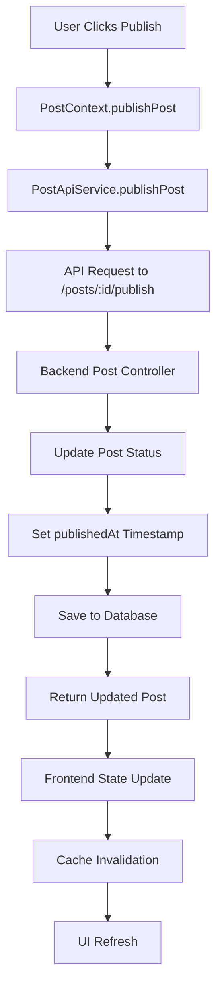
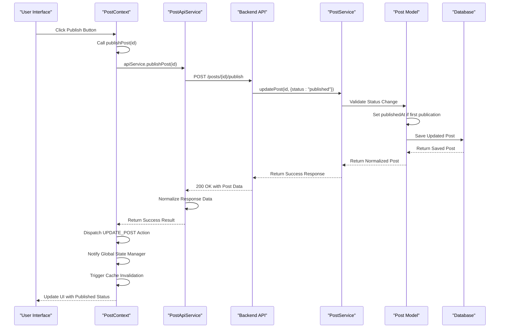

# Publishing Workflow

<cite>
**Referenced Files in This Document**   
- [PostContext.tsx](file://src/features/posts/context/PostContext.tsx)
- [postApi.ts](file://src/features/posts/services/postApi.ts)
- [post.controller.ts](file://api-fastify/src/controllers/post.controller.ts)
- [post.service.ts](file://api-fastify/src/services/post.service.ts)
- [post.model.ts](file://api-fastify/src/models/post.model.ts)
- [post.routes.ts](file://api-fastify/src/routes/post.routes.ts)
- [api.config.ts](file://src/config/api.config.ts)
</cite>

## Table of Contents
1. [Introduction](#introduction)
2. [Publishing Workflow Overview](#publishing-workflow-overview)
3. [Frontend Implementation](#frontend-implementation)
4. [Backend Implementation](#backend-implementation)
5. [Domain Model Changes](#domain-model-changes)
6. [State Management and Cache Invalidation](#state-management-and-cache-invalidation)
7. [Error Handling and Edge Cases](#error-handling-and-edge-cases)
8. [Sequence Diagram](#sequence-diagram)

## Introduction
The publishing workflow in MERN_chatai_blog enables users to transition a post from draft to published status through a coordinated frontend-backend process. This document details the implementation of the publishPost function across both client and server components, explaining how domain model changes are applied, state is synchronized, and potential issues are handled. The workflow ensures content integrity while providing real-time updates to the user interface.

## Publishing Workflow Overview
The publishing workflow consists of a coordinated process between frontend and backend components that transitions a post from draft to published status. When a user initiates publication, the frontend PostContext triggers a publishPost function that communicates with the backend API endpoint. The backend validates the request, updates the post's status field from "draft" to "published", sets the publishedAt timestamp, and returns the updated post data. The frontend then updates its global state and invalidates relevant caches to ensure consistency across the application.

**Diagram sources**
- [PostContext.tsx](file://src/features/posts/context/PostContext.tsx)
- [postApi.ts](file://src/features/posts/services/postApi.ts)
- [post.controller.ts](file://api-fastify/src/controllers/post.controller.ts)
- [post.service.ts](file://api-fastify/src/services/post.service.ts)

## Frontend Implementation
The frontend implementation of the publishing workflow is centered around the publishPost function in the PostContext component. This function serves as the primary interface for publishing posts and coordinates communication between the UI and backend services. When called with a post ID, it delegates to the PostApiService to make the actual API request, handling the response by updating the local state and notifying global state managers.

The PostApiService implements the publishPost method that makes a POST request to the publish endpoint specified in the API configuration. It uses the fetchWithAuth method to include authentication credentials and properly normalizes the response data by transforming MongoDB's _id field to id for frontend compatibility and ensuring the author object has an id property. The service handles various response scenarios, distinguishing between successful publications and different types of failures.

**Section sources**
- [PostContext.tsx](file://src/features/posts/context/PostContext.tsx#L443-L499)
- [postApi.ts](file://src/features/posts/services/postApi.ts#L534-L573)

## Backend Implementation
The backend implementation of the publishing workflow leverages the existing updatePost functionality in the post.service.ts file, as there is no dedicated publish endpoint. When a post's status is changed to "published" through the standard update operation, the system automatically handles the publication logic. The updatePost service method checks if the post is transitioning from draft to published status, and if so, sets the publishedAt field to the current timestamp.

The post.model.ts file contains a pre-save middleware that automatically sets the publishedAt timestamp when a post's status is modified to "published" and no publication date has been set. This ensures that the publication timestamp is consistently applied regardless of which API endpoint modifies the post status. The model also defines the PostStatus enum with "draft" and "published" values, providing type safety for status transitions.

Although the routes file (post.routes.ts) does not contain a dedicated publish endpoint, the existing PUT /posts/:id route handles publication through status updates. The controller layer (post.controller.ts) processes these requests, validating user permissions and forwarding the update to the service layer. This design follows the principle of using a single endpoint for post modifications, with the specific action determined by the data in the request body.

**Section sources**
- [post.controller.ts](file://api-fastify/src/controllers/post.controller.ts)
- [post.service.ts](file://api-fastify/src/services/post.service.ts#L428-L430)
- [post.model.ts](file://api-fastify/src/models/post.model.ts#L120-L127)
- [post.routes.ts](file://api-fastify/src/routes/post.routes.ts)

## Domain Model Changes
During the publishing transition, several domain model changes occur to capture the post's new state. The most significant change is the update of the status field from "draft" to "published", which triggers a cascade of related updates. The publishedAt field is set to the current timestamp when a post is published for the first time, providing an immutable record of when the content became publicly available.

The post model includes several fields that support the publishing workflow: status (with enum values for draft and published), publishedAt (date when the post was published), and timestamps (automatically managed createdAt and updatedAt fields). When a post is published, the system ensures content integrity by validating that all required fields are present and that referenced categories exist in the database.

The domain model also supports soft deletion through the isDeleted field, allowing posts to be unpublished without permanent data loss. This enables features like post restoration and maintains referential integrity with related entities such as comments and user interactions. The viewCount field is initialized when a post is published and incremented each time the post is viewed by non-authors.

**Section sources**
- [post.model.ts](file://api-fastify/src/models/post.model.ts)
- [post.types.ts](file://api-fastify/src/types/post.types.ts)

## State Management and Cache Invalidation
The publishing workflow includes comprehensive state management and cache invalidation to ensure consistency across the application. When a post is successfully published, the PostContext dispatches an UPDATE_POST action to update the local state with the published post data. This immediate state update provides visual feedback to the user without requiring a full page refresh.

The system notifies the global state manager (globalStateManager) of the publication event, allowing other components to react to the change. This notification pattern enables real-time updates to related components such as post lists, navigation menus, and user dashboards. The global state manager also triggers cache invalidation for all post-related data, ensuring that subsequent requests retrieve the most current information.

Cache invalidation is particularly important for maintaining data consistency across different parts of the application. By invalidating caches when a post is published, the system prevents stale data from being displayed to users. This is especially crucial for search results, category pages, and user profile pages that may display the post in various contexts.

**Section sources**
- [PostContext.tsx](file://src/features/posts/context/PostContext.tsx#L443-L499)
- [globalStateManager.ts](file://src/services/globalStateManager.ts)

## Error Handling and Edge Cases
The publishing workflow includes robust error handling to address common issues and edge cases. To prevent double-publishing, the system validates the post's current status before allowing publication. If a post is already published, the update operation will not modify the publishedAt timestamp, preserving the original publication date.

Failed publication attempts are handled gracefully by returning descriptive error messages to the frontend. Common failure scenarios include invalid post IDs, insufficient user permissions, and database connectivity issues. The frontend displays appropriate error notifications to inform users of the problem without exposing sensitive system details.

Content integrity is maintained through validation at multiple levels. The backend verifies that required fields such as title and content are present before publication. Category references are validated to ensure they point to existing categories in the database. The system also handles network interruptions by implementing retry logic and providing feedback on the publication status.

The workflow accommodates edge cases such as publishing posts with incomplete metadata by generating default values where appropriate. For example, if an excerpt is not provided, the system extracts one from the post content. Similarly, if a slug is not specified, it is generated from the post title using the generateSlug utility function.

**Section sources**
- [post.service.ts](file://api-fastify/src/services/post.service.ts)
- [PostContext.tsx](file://src/features/posts/context/PostContext.tsx#L443-L499)
- [postApi.ts](file://src/features/posts/services/postApi.ts#L534-L573)

## Sequence Diagram

**Diagram sources**
- [PostContext.tsx](file://src/features/posts/context/PostContext.tsx)
- [postApi.ts](file://src/features/posts/services/postApi.ts)
- [post.controller.ts](file://api-fastify/src/controllers/post.controller.ts)
- [post.service.ts](file://api-fastify/src/services/post.service.ts)
- [post.model.ts](file://api-fastify/src/models/post.model.ts)