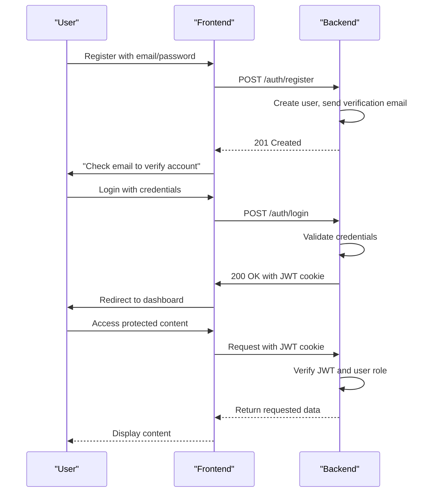
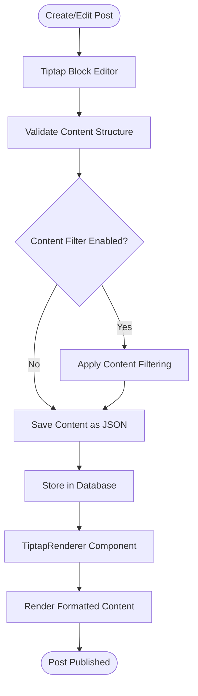
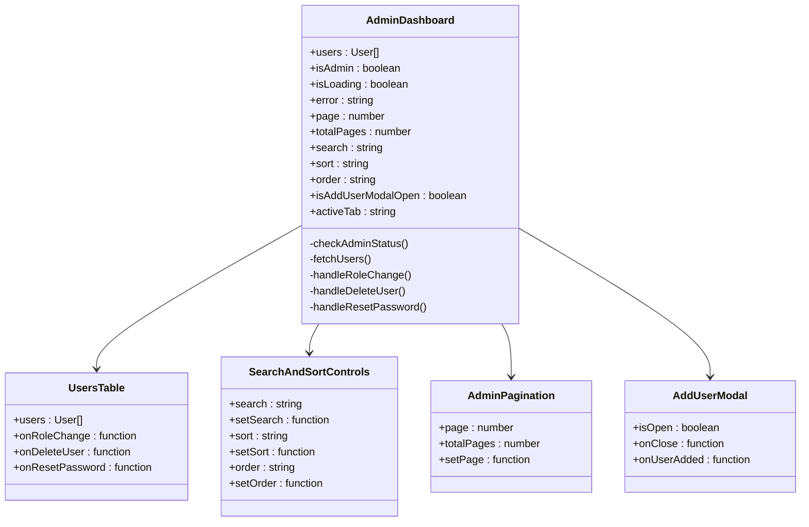
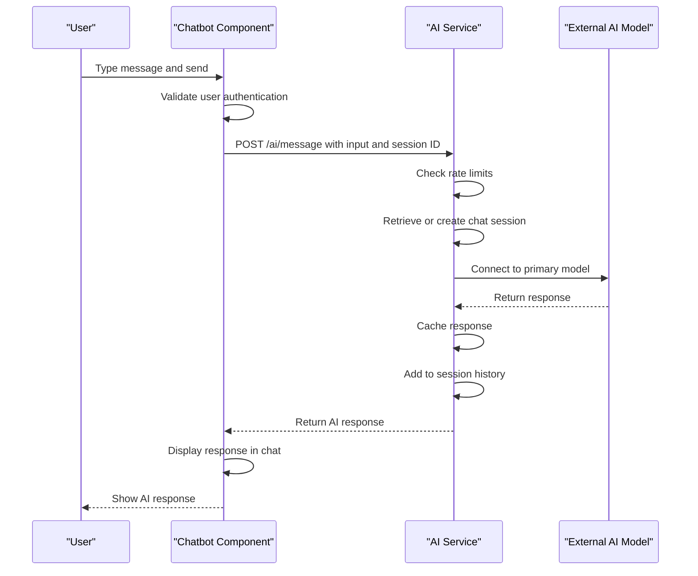
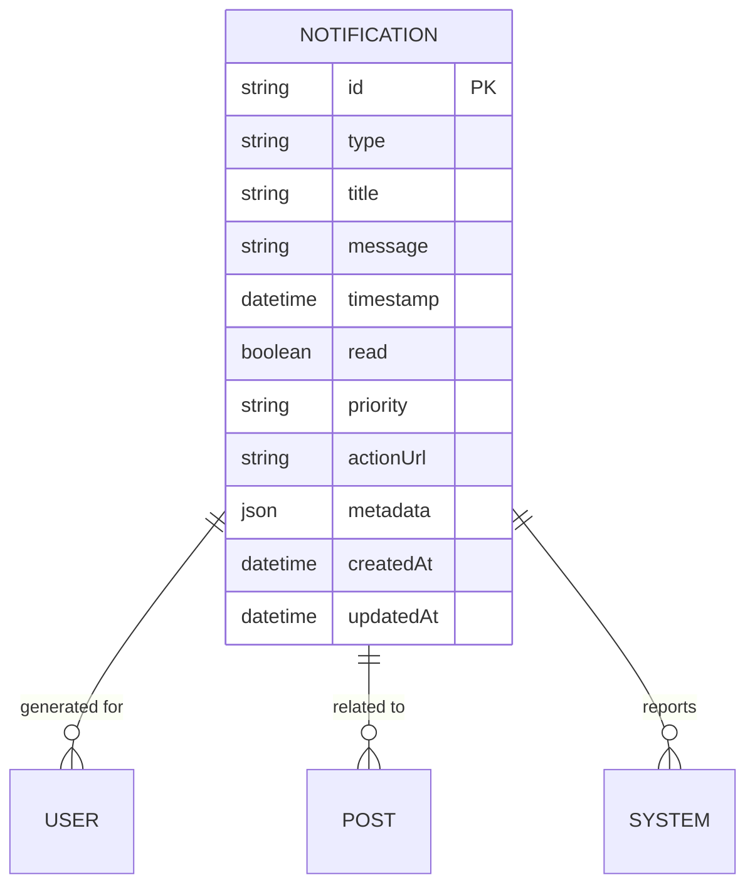

# Feature Modules

<cite>
**Referenced Files in This Document**   
- [auth.controller.ts](file://api-fastify/src/controllers/auth.controller.ts)
- [auth.routes.ts](file://api-fastify/src/routes/auth.routes.ts)
- [notification.service.ts](file://api-fastify/src/services/notification.service.ts)
- [notification.model.ts](file://api-fastify/src/models/notification.model.ts)
- [ai.controller.ts](file://api-fastify/src/controllers/ai.controller.ts)
- [ai.service.ts](file://api-fastify/src/services/ai.service.ts)
- [Chatbot.tsx](file://src/components/Chatbot.tsx)
- [AdminDashboard.tsx](file://src/pages/AdminDashboard.tsx)
- [TiptapRenderer.tsx](file://src/components/TiptapRenderer.tsx)
- [CreatePost.tsx](file://src/features/posts/pages/CreatePost.tsx)
- [contentFilter.ts](file://src/services/contentFilter.ts)
- [useContentFilter.ts](file://src/hooks/useContentFilter.ts)
- [api.config.ts](file://src/config/api.config.ts)
- [NotificationPanel.tsx](file://src/components/admin/NotificationPanel.tsx)
</cite>

## Table of Contents
1. [Authentication System](#authentication-system)
2. [Content Management](#content-management)
3. [Admin Dashboard](#admin-dashboard)
4. [AI Features](#ai-features)
5. [Notification System](#notification-system)

## Authentication System

The authentication system in MERN_chatai_blog provides secure user registration, login, and role-based access control. It uses JWT tokens for session management with HTTP-only cookies for enhanced security. The system supports multiple user roles including user, author, editor, and admin, enabling granular permission control across the application.

The authentication flow begins with user registration through the `/auth/register` endpoint, which creates a new user account and sends a verification email. Users must verify their email before logging in. The login process at `/auth/login` authenticates credentials and returns a JWT token stored in an HTTP-only cookie, preventing XSS attacks. The system implements password reset functionality with token-based verification and rate limiting to prevent abuse.

Role-based access is enforced through middleware that validates user permissions for protected routes. Admin-level endpoints require admin privileges, while author functions are available to authors, editors, and admins. The system includes comprehensive error handling with appropriate HTTP status codes and user-friendly messages.

**Diagram sources**
- [auth.controller.ts](file://api-fastify/src/controllers/auth.controller.ts)
- [auth.routes.ts](file://api-fastify/src/routes/auth.routes.ts)

**Section sources**
- [auth.controller.ts](file://api-fastify/src/controllers/auth.controller.ts#L1-L330)
- [auth.routes.ts](file://api-fastify/src/routes/auth.routes.ts#L1-L73)

## Content Management

The content management system centers around the Tiptap editor, a powerful rich text editor that provides structured content creation with support for headings, lists, code blocks, images, and other formatting options. Content is stored as JSON structures that preserve formatting information, enabling consistent rendering across the application.

When creating or editing posts, users interact with the Tiptap editor through the `TiptapBlockEditor` component. The editor content is stored in a structured format that includes node types, attributes, and nested content. This structure is rendered on the frontend using the `TiptapRenderer` component, which processes the JSON content and generates appropriate HTML elements with proper styling.

The system includes content filtering capabilities through the `contentFilterService`, which scans text for inappropriate language and automatically replaces flagged words according to predefined rules. This service supports configurable filter lists, custom replacements, and whitelisting, allowing administrators to customize the filtering behavior. The filtering process occurs both client-side for immediate feedback and server-side for security.

**Diagram sources**
- [TiptapRenderer.tsx](file://src/components/TiptapRenderer.tsx)
- [contentFilter.ts](file://src/services/contentFilter.ts)

**Section sources**
- [CreatePost.tsx](file://src/features/posts/pages/CreatePost.tsx#L1-L105)
- [TiptapRenderer.tsx](file://src/components/TiptapRenderer.tsx#L1-L191)
- [contentFilter.ts](file://src/services/contentFilter.ts#L1-L353)
- [useContentFilter.ts](file://src/hooks/useContentFilter.ts#L1-L184)

## Admin Dashboard

The admin dashboard provides comprehensive user management and site administration capabilities. Accessible only to authenticated administrators, the dashboard displays user statistics and enables management of user accounts, roles, and permissions. The interface is built with React components that fetch data from backend APIs and provide interactive controls for administrative tasks.

The dashboard features a tabbed interface with user management and statistics views. The user management tab displays a paginated table of all users with search, sorting, and filtering capabilities. Administrators can change user roles, delete accounts, and trigger password reset emails directly from the interface. The statistics tab provides insights into user distribution across different roles.

Key components include `UsersTable` for displaying user data, `SearchAndSortControls` for filtering functionality, and `AdminPagination` for navigating through user pages. The dashboard implements error handling with retry mechanisms and displays appropriate feedback for user actions. Keyboard shortcuts enhance usability, with F5 for refresh and Ctrl+N for adding new users.

**Diagram sources**
- [AdminDashboard.tsx](file://src/pages/AdminDashboard.tsx)
- [UsersTable.tsx](file://src/components/UsersTable.tsx)

**Section sources**
- [AdminDashboard.tsx](file://src/pages/AdminDashboard.tsx#L1-L657)
- [UsersTable.tsx](file://src/components/UsersTable.tsx#L1-L100)

## AI Features

The AI features in MERN_chatai_blog provide an interactive chatbot that leverages large language models to assist users with blog-related queries. The system connects to external AI models through the Gradio client, enabling natural language interactions. The chatbot is accessible from any page via a floating button in the bottom-right corner.

The AI service implements a multi-model fallback strategy, attempting to generate responses from multiple models (Qwen/Qwen2-72B-Instruct and Qwen/Qwen1.5-110B-Chat-demo) in sequence. If the primary model fails, the system automatically attempts the secondary model, ensuring high availability. The service maintains chat sessions with a 24-hour TTL, preserving conversation history for context-aware responses.

The chatbot interface includes message history persistence using localStorage, allowing users to resume conversations across sessions. The component handles authentication requirements, displaying appropriate messages when users are not logged in. Rate limiting is implemented on the backend to prevent abuse, with client-side feedback when limits are exceeded.

**Diagram sources**
- [Chatbot.tsx](file://src/components/Chatbot.tsx)
- [ai.service.ts](file://api-fastify/src/services/ai.service.ts)

**Section sources**
- [Chatbot.tsx](file://src/components/Chatbot.tsx#L1-L355)
- [ai.controller.ts](file://api-fastify/src/controllers/ai.controller.ts#L1-L70)
- [ai.service.ts](file://api-fastify/src/services/ai.service.ts#L1-L131)

## Notification System

The notification system provides real-time alerts for important events such as user registrations, post publications, and system errors. Notifications are stored in MongoDB with metadata for context and actionability. The system supports different notification types and priorities, enabling appropriate user attention based on urgency.

The backend notification service handles CRUD operations for notifications, including retrieval with pagination, marking as read, and cleanup of old notifications. The service automatically generates notifications for key events through dedicated functions like `generateUserRegistrationNotification` and `generatePostPublishedNotification`. Notifications are categorized by type and priority, with high-priority alerts for critical system issues.

The frontend NotificationPanel component displays notifications in a dropdown panel accessible from the admin interface. The panel shows unread counts, supports marking notifications as read individually or in bulk, and provides visual indicators for priority levels. The component implements smooth animations and keyboard navigation for enhanced usability.

**Diagram sources**
- [notification.model.ts](file://api-fastify/src/models/notification.model.ts)
- [notification.service.ts](file://api-fastify/src/services/notification.service.ts)

**Section sources**
- [notification.service.ts](file://api-fastify/src/services/notification.service.ts#L1-L261)
- [notification.model.ts](file://api-fastify/src/models/notification.model.ts#L1-L97)
- [NotificationPanel.tsx](file://src/components/admin/NotificationPanel.tsx#L1-L455)