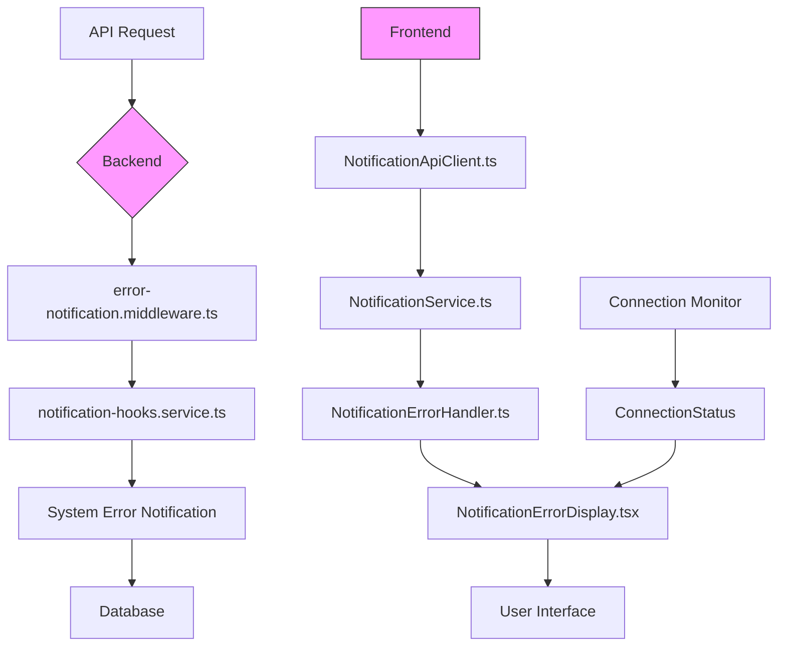
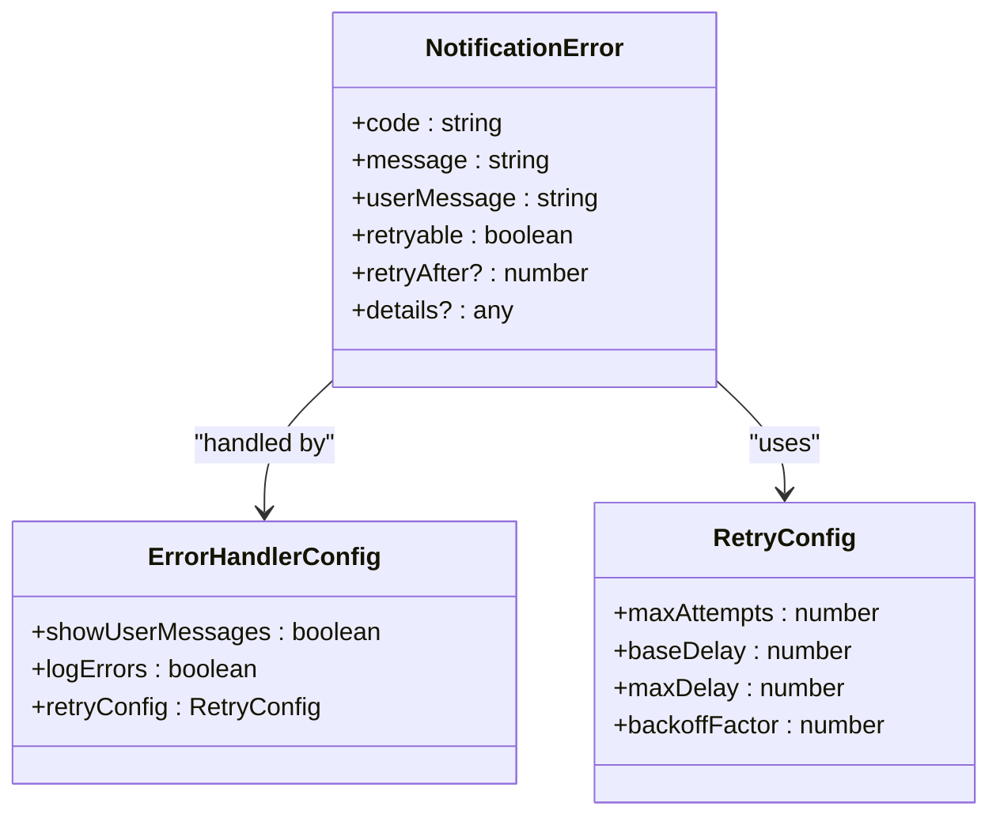
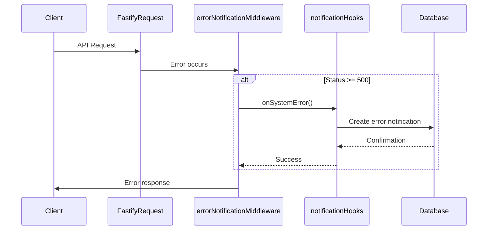
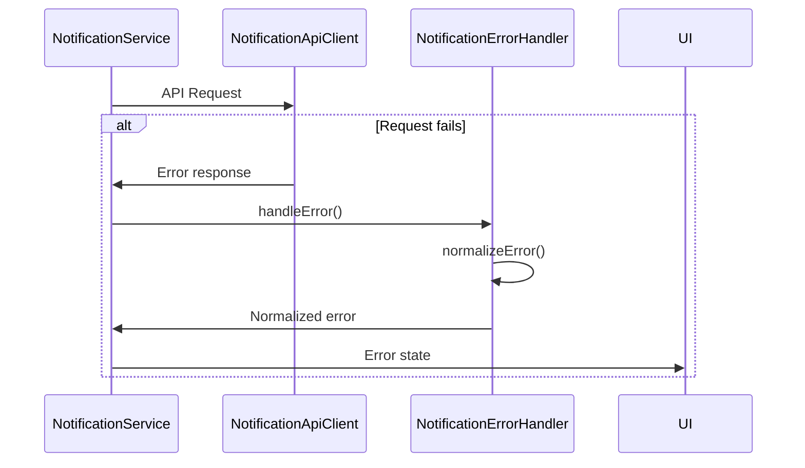
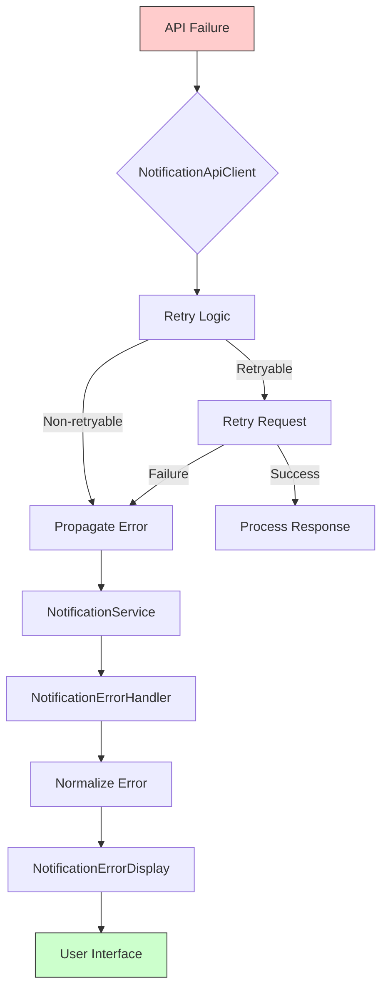
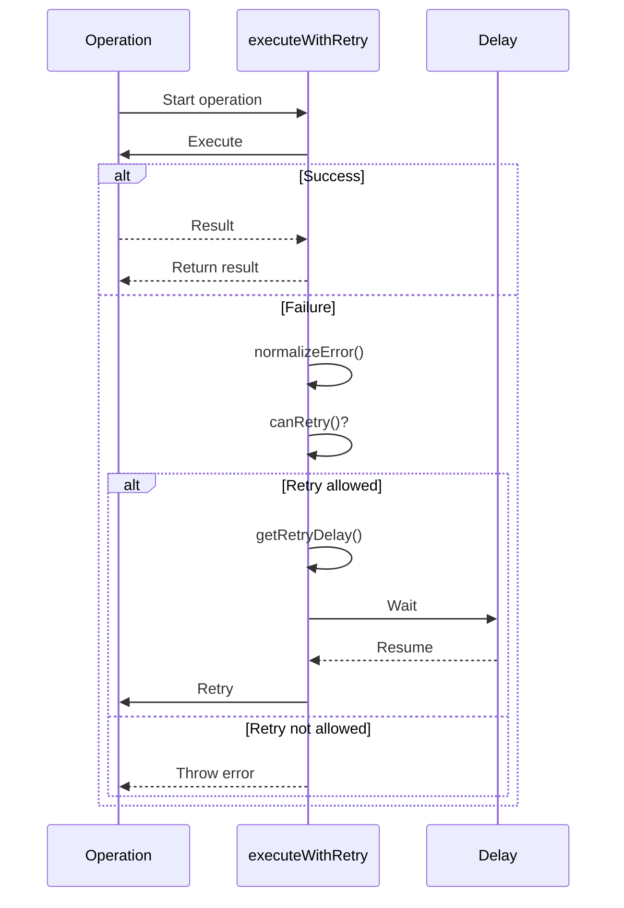
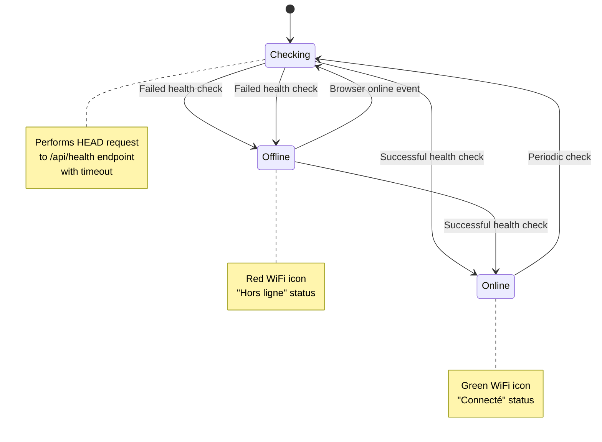
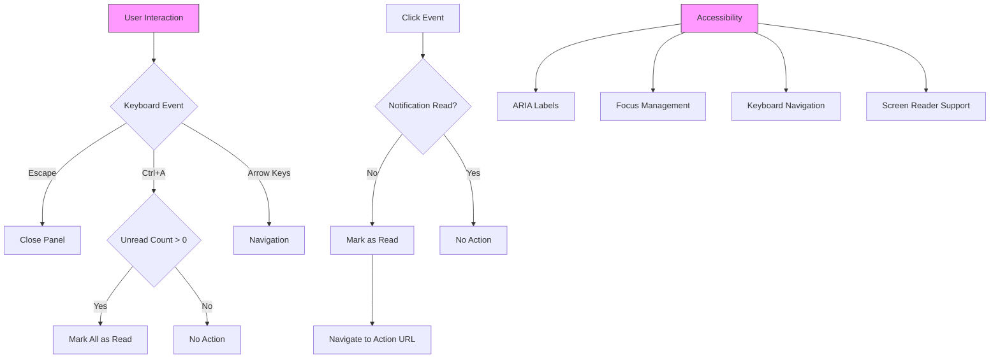

# Error Handling and Display

<cite>
**Referenced Files in This Document**   
- [error-notification.middleware.ts](file://api-fastify/src/middlewares/error-notification.middleware.ts)
- [NotificationErrorDisplay.tsx](file://src/components/admin/NotificationErrorDisplay.tsx)
- [NotificationService.ts](file://src/services/NotificationService.ts)
- [NotificationErrorHandler.ts](file://src/services/NotificationErrorHandler.ts)
- [NotificationApiClient.ts](file://src/services/NotificationApiClient.ts)
- [ConnectionMonitor.ts](file://src/services/ConnectionMonitor.ts)
- [EnhancedNotificationService.ts](file://src/services/EnhancedNotificationService.ts)
- [AdminNotification.ts](file://src/types/AdminNotification.ts)
- [NotificationApi.ts](file://src/types/NotificationApi.ts)
</cite>

## Table of Contents
1. [Introduction](#introduction)
2. [Error Handling Architecture](#error-handling-architecture)
3. [Notification Error Type Structure](#notification-error-type-structure)
4. [Backend Error Interception](#backend-error-interception)
5. [Frontend Error Handling](#frontend-error-handling)
6. [Error Propagation Flow](#error-propagation-flow)
7. [Retry Mechanisms](#retry-mechanisms)
8. [Connection Status Visualization](#connection-status-visualization)
9. [Common Error Scenarios](#common-error-scenarios)
10. [User Feedback and Accessibility](#user-feedback-and-accessibility)
11. [Best Practices](#best-practices)

## Introduction
The MERN_chatai_blog application implements a comprehensive error handling system for notifications that spans both frontend and backend components. This system ensures that errors are properly captured, normalized, and presented to users in a meaningful way while providing appropriate recovery mechanisms. The architecture follows a layered approach with specialized components for error handling at different levels of the application stack.

**Section sources**
- [error-notification.middleware.ts](file://api-fastify/src/middlewares/error-notification.middleware.ts#L1-L31)
- [NotificationErrorDisplay.tsx](file://src/components/admin/NotificationErrorDisplay.tsx#L1-L107)

## Error Handling Architecture
The error handling system in MERN_chatai_blog follows a multi-layered architecture that captures errors at various points in the application flow. The system is designed to provide consistent error handling across both frontend and backend components while maintaining separation of concerns.



**Diagram sources**
- [error-notification.middleware.ts](file://api-fastify/src/middlewares/error-notification.middleware.ts#L1-L31)
- [NotificationService.ts](file://src/services/NotificationService.ts#L1-L199)
- [NotificationApiClient.ts](file://src/services/NotificationApiClient.ts#L1-L199)

**Section sources**
- [error-notification.middleware.ts](file://api-fastify/src/middlewares/error-notification.middleware.ts#L1-L31)
- [NotificationService.ts](file://src/services/NotificationService.ts#L1-L199)

## Notification Error Type Structure
The NotificationError type provides a standardized structure for error objects across the application. This interface ensures consistency in error representation and enables predictable error handling patterns.



**Diagram sources**
- [NotificationErrorHandler.ts](file://src/services/NotificationErrorHandler.ts#L0-L56)
- [NotificationApi.ts](file://src/types/NotificationApi.ts#L100-L192)

**Section sources**
- [NotificationErrorHandler.ts](file://src/services/NotificationErrorHandler.ts#L0-L56)

## Backend Error Interception
The backend error interception system is implemented through the error-notification.middleware.ts file, which captures errors at the Fastify framework level. This middleware specifically handles server errors (5xx status codes) by creating system error notifications.

When an error occurs in the backend, the errorNotificationMiddleware captures the error, extracts relevant information such as the HTTP status code, request method, and URL, and creates a system error notification through the onSystemError hook. This process happens asynchronously to ensure that the error response is not delayed.



**Diagram sources**
- [error-notification.middleware.ts](file://api-fastify/src/middlewares/error-notification.middleware.ts#L1-L31)
- [notification-hooks.service.ts](file://api-fastify/src/services/notification-hooks.service.ts#L114-L138)

**Section sources**
- [error-notification.middleware.ts](file://api-fastify/src/middlewares/error-notification.middleware.ts#L1-L31)

## Frontend Error Handling
The frontend error handling system is centered around the NotificationService and NotificationErrorHandler classes. These components work together to capture, normalize, and handle errors that occur during API interactions.

The NotificationService implements various methods for notification operations (fetching, creating, updating, deleting) with comprehensive error handling in each method. When an error occurs, it is passed to the handleError method, which logs the error and preserves it for potential display to the user.



**Diagram sources**
- [NotificationService.ts](file://src/services/NotificationService.ts#L1-L199)
- [NotificationErrorHandler.ts](file://src/services/NotificationErrorHandler.ts#L0-L56)

**Section sources**
- [NotificationService.ts](file://src/services/NotificationService.ts#L1-L199)

## Error Propagation Flow
The error propagation flow in the notification system follows a well-defined path from API failure to user interface presentation. This flow ensures that errors are properly transformed and presented at each level of the application.

When an API call fails, the error is first captured by the NotificationApiClient, which determines whether to retry the request based on the error type and retry configuration. If retries are exhausted or not applicable, the error is propagated to the NotificationService, which normalizes it using the NotificationErrorHandler. Finally, the error is passed to the NotificationErrorDisplay component for user presentation.



**Diagram sources**
- [NotificationApiClient.ts](file://src/services/NotificationApiClient.ts#L200-L298)
- [NotificationService.ts](file://src/services/NotificationService.ts#L1-L199)
- [NotificationErrorDisplay.tsx](file://src/components/admin/NotificationErrorDisplay.tsx#L1-L107)

**Section sources**
- [NotificationApiClient.ts](file://src/services/NotificationApiClient.ts#L200-L298)

## Retry Mechanisms
The system implements sophisticated retry mechanisms at multiple levels to improve reliability and user experience. The NotificationErrorHandler class provides a generic executeWithRetry method that can wrap any operation with automatic retry capabilities.

Retry behavior is configurable through the RetryConfig interface, which defines parameters such as maximum attempts, base delay, maximum delay, and backoff factor. The system uses exponential backoff to prevent overwhelming the server during periods of high load or temporary failures.



**Diagram sources**
- [NotificationErrorHandler.ts](file://src/services/NotificationErrorHandler.ts#L213-L264)
- [NotificationApiClient.ts](file://src/services/NotificationApiClient.ts#L200-L298)

**Section sources**
- [NotificationErrorHandler.ts](file://src/services/NotificationErrorHandler.ts#L213-L264)

## Connection Status Visualization
The connection status visualization system provides users with real-time feedback about their network connectivity. This is implemented through the ConnectionMonitor service, which tracks the application's connection status and provides this information to UI components.

The ConnectionMonitor uses multiple strategies to determine connection status, including browser online/offline events and periodic HTTP requests to a health endpoint. This dual approach ensures accurate status detection even in cases where the browser's network detection is unreliable.



**Diagram sources**
- [ConnectionMonitor.ts](file://src/services/ConnectionMonitor.ts#L1-L138)
- [NotificationErrorDisplay.tsx](file://src/components/admin/NotificationErrorDisplay.tsx#L1-L107)

**Section sources**
- [ConnectionMonitor.ts](file://src/services/ConnectionMonitor.ts#L1-L138)

## Common Error Scenarios
The system handles several common error scenarios with specific error codes and user messages. These scenarios include network failures, authentication errors, rate limiting, and server errors.

```mermaid
erDiagram
ERROR_TYPES {
string code PK
string message
string userMessage
boolean retryable
number retryAfter
}
ERROR_TYPES ||--o{ NETWORK_ERROR : "is"
ERROR_TYPES ||--o{ AUTHENTICATION_ERROR : "is"
ERROR_TYPES ||--o{ RATE_LIMIT_ERROR : "is"
ERROR_TYPES ||--o{ SERVER_ERROR : "is"
NETWORK_ERROR {
string NETWORK_ERROR
string "Erreur réseau"
string "Problème de connexion. Vérifiez votre réseau."
boolean true
number null
}
AUTHENTICATION_ERROR {
string AUTHENTICATION_ERROR
string "Non authentifié"
string "Vous devez vous reconnecter."
boolean false
number null
}
RATE_LIMIT_ERROR {
string RATE_LIMIT_ERROR
string "Trop de requêtes"
string "Trop de requêtes. Attendez un moment."
boolean true
number 60000
}
SERVER_ERROR {
string SERVER_ERROR
string "Erreur serveur"
string "Problème temporaire du serveur. Réessayez."
boolean true
number null
}
```

**Diagram sources**
- [NotificationErrorHandler.ts](file://src/services/NotificationErrorHandler.ts#L104-L156)
- [NotificationApi.ts](file://src/types/NotificationApi.ts#L100-L192)

**Section sources**
- [NotificationErrorHandler.ts](file://src/services/NotificationErrorHandler.ts#L104-L156)

## User Feedback and Accessibility
The user feedback system is designed with accessibility as a primary consideration. The NotificationErrorDisplay component provides clear visual indicators of errors and connection status, with appropriate icons and color coding.

Keyboard navigation is fully supported, with the NotificationPanel component handling keyboard shortcuts such as Escape to close the panel and Ctrl+A to mark all notifications as read. The component also manages focus states and prevents multiple rapid clicks on notification items.



**Diagram sources**
- [NotificationPanel.tsx](file://src/components/admin/NotificationPanel.tsx#L1-L199)
- [NotificationErrorDisplay.tsx](file://src/components/admin/NotificationErrorDisplay.tsx#L1-L107)

**Section sources**
- [NotificationPanel.tsx](file://src/components/admin/NotificationPanel.tsx#L1-L199)

## Best Practices
The error handling system in MERN_chatai_blog follows several best practices for error recovery, user feedback, and monitoring:

1. **Consistent Error Normalization**: All errors are normalized into a standard format with user-friendly messages.
2. **Appropriate Retry Strategies**: Retry logic is applied selectively based on error type, with exponential backoff.
3. **Offline Support**: The EnhancedNotificationService provides offline capabilities with local caching and action queuing.
4. **Comprehensive Logging**: Errors are logged both locally and remotely for monitoring and debugging.
5. **Accessibility First**: All error displays are designed with keyboard navigation and screen reader support.
6. **Clear User Guidance**: Error messages provide actionable guidance for users to resolve issues.

These practices ensure that the application remains usable even in adverse conditions while providing developers with the information needed to diagnose and fix issues.

**Section sources**
- [EnhancedNotificationService.ts](file://src/services/EnhancedNotificationService.ts#L1-L160)
- [NotificationErrorHandler.ts](file://src/services/NotificationErrorHandler.ts#L0-L56)
- [ConnectionMonitor.ts](file://src/services/ConnectionMonitor.ts#L1-L138)