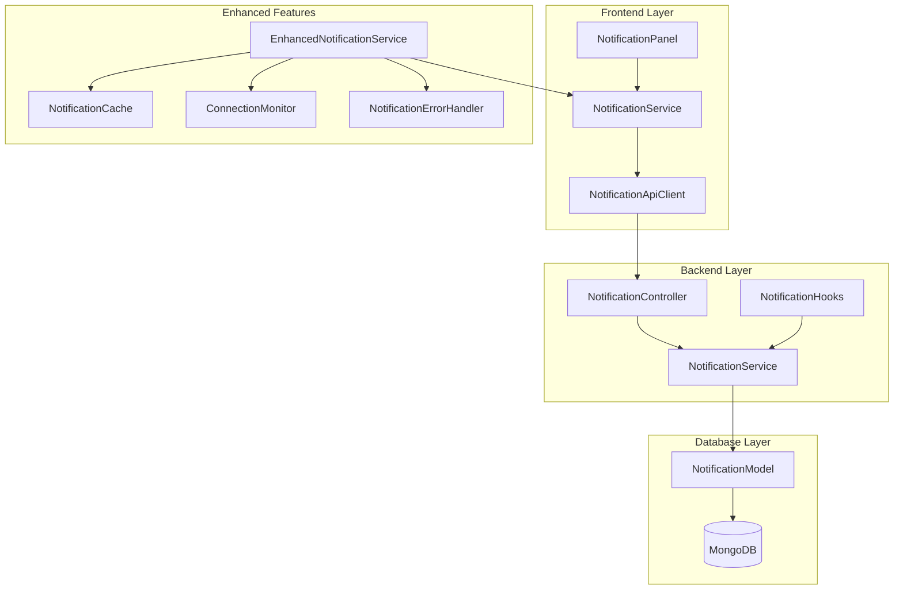
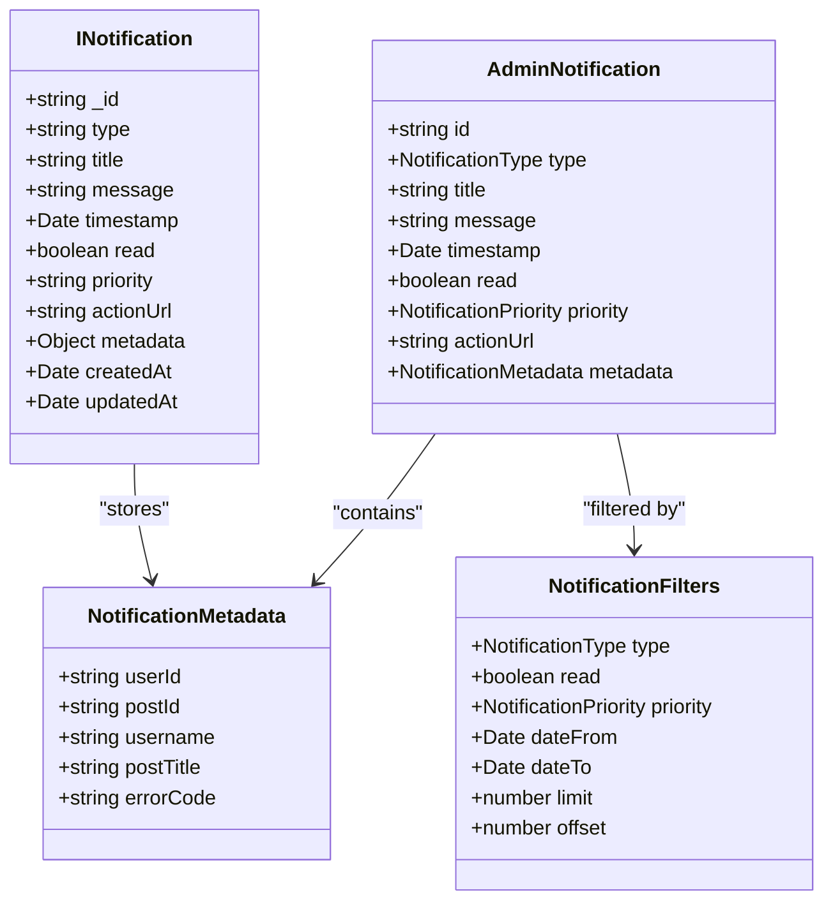
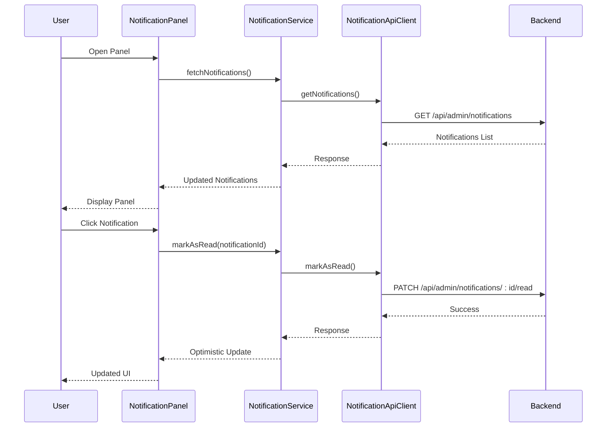
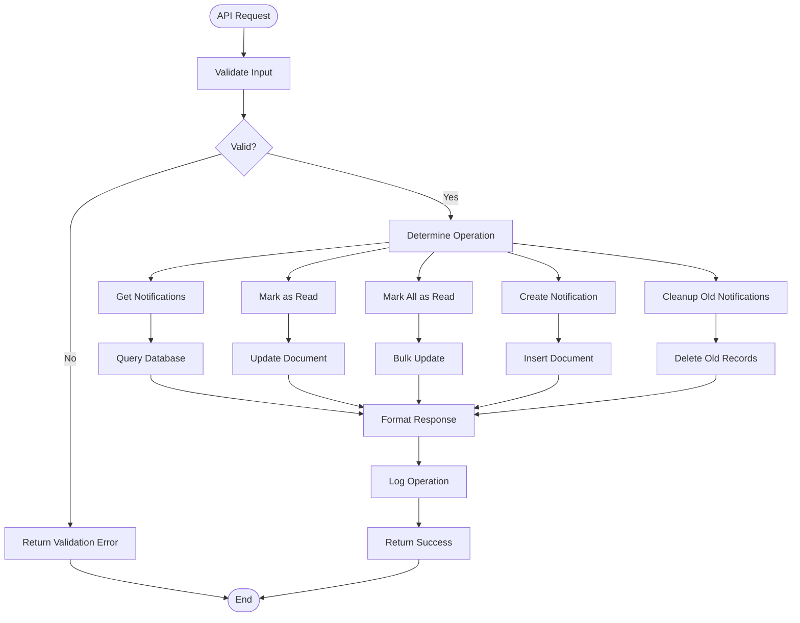
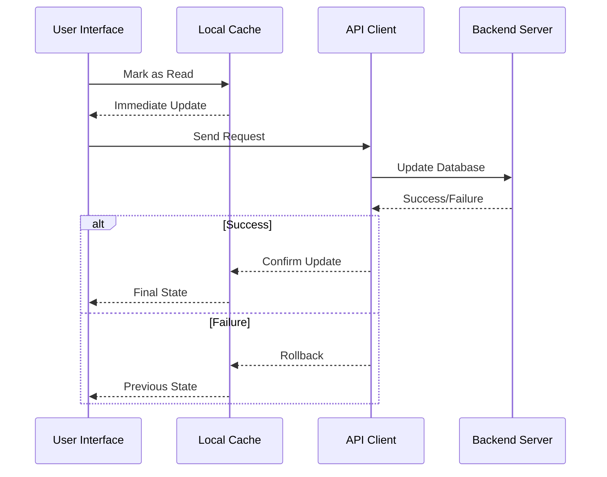
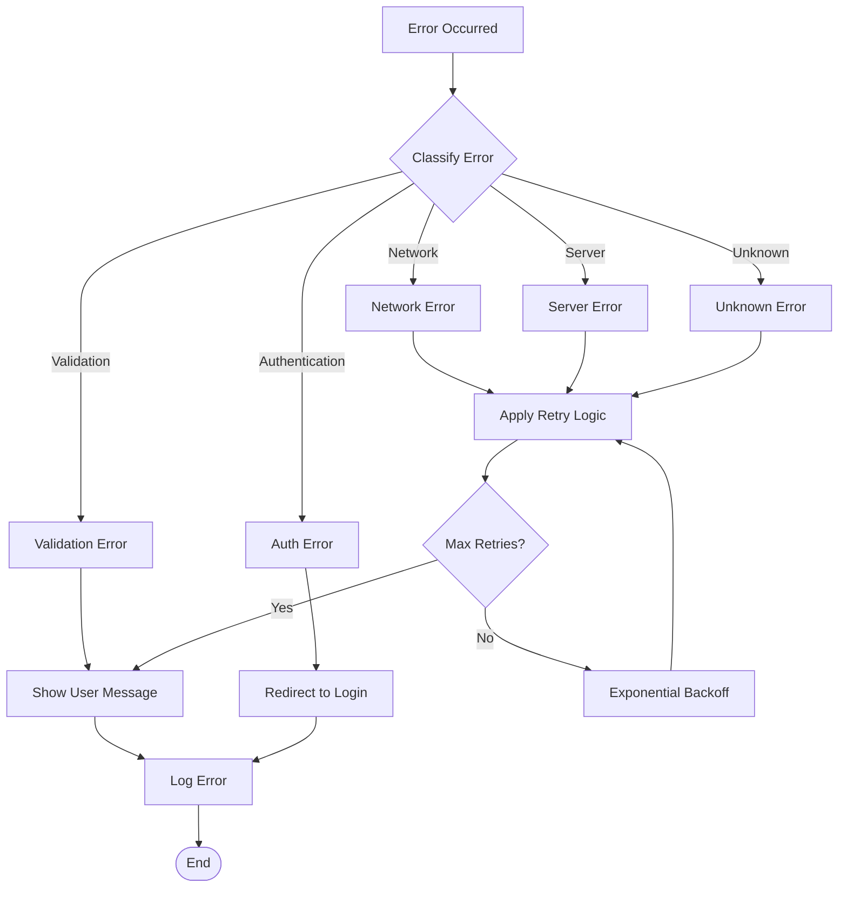

# Notification Management System

<cite>
**Referenced Files in This Document**
- [NotificationPanel.tsx](file://src/components/admin/NotificationPanel.tsx)
- [AdminNotification.ts](file://src/types/AdminNotification.ts)
- [notification.controller.ts](file://api-fastify/src/controllers/notification.controller.ts)
- [notification.service.ts](file://api-fastify/src/services/notification.service.ts)
- [notification.model.ts](file://api-fastify/src/models/notification.model.ts)
- [NotificationService.ts](file://src/services/NotificationService.ts)
- [NotificationApiClient.ts](file://src/services/NotificationApiClient.ts)
- [EnhancedNotificationService.ts](file://src/services/EnhancedNotificationService.ts)
- [NotificationCache.ts](file://src/services/NotificationCache.ts)
- [ConnectionMonitor.ts](file://src/services/ConnectionMonitor.ts)
- [NotificationErrorHandler.ts](file://src/services/NotificationErrorHandler.ts)
- [NotificationApi.ts](file://src/types/NotificationApi.ts)
</cite>

## Table of Contents
1. [Introduction](#introduction)
2. [System Architecture](#system-architecture)
3. [Data Model](#data-model)
4. [Frontend Components](#frontend-components)
5. [Backend Services](#backend-services)
6. [API Endpoints](#api-endpoints)
7. [Enhanced Features](#enhanced-features)
8. [Performance Considerations](#performance-considerations)
9. [Error Handling](#error-handling)
10. [Troubleshooting Guide](#troubleshooting-guide)
11. [Best Practices](#best-practices)

## Introduction

The MERN_chatai_blog notification management system provides a comprehensive solution for handling administrative notifications across the platform. This system enables real-time communication of important events, automated alerts, and efficient user engagement through a sophisticated frontend panel and robust backend services.

The notification system supports multiple notification types including user registrations, post publications, system errors, user activities, and content moderation alerts. It implements advanced features such as optimistic UI updates, offline support, intelligent caching, and keyboard shortcuts for enhanced user experience.

## System Architecture

The notification management system follows a layered architecture with clear separation of concerns between frontend components, backend services, and database operations.



**Diagram sources**
- [NotificationPanel.tsx](file://src/components/admin/NotificationPanel.tsx#L1-L455)
- [NotificationService.ts](file://src/services/NotificationService.ts#L1-L657)
- [notification.controller.ts](file://api-fastify/src/controllers/notification.controller.ts#L1-L217)

## Data Model

The notification system uses a comprehensive data model designed for scalability and flexibility.



**Diagram sources**
- [AdminNotification.ts](file://src/types/AdminNotification.ts#L1-L143)
- [notification.model.ts](file://api-fastify/src/models/notification.model.ts#L1-L97)

**Section sources**
- [AdminNotification.ts](file://src/types/AdminNotification.ts#L1-L143)
- [notification.model.ts](file://api-fastify/src/models/notification.model.ts#L1-L97)

## Frontend Components

### NotificationPanel Component

The NotificationPanel is the primary frontend component responsible for displaying and managing notifications. It implements advanced features including keyboard shortcuts, optimistic updates, and responsive design.



**Diagram sources**
- [NotificationPanel.tsx](file://src/components/admin/NotificationPanel.tsx#L100-L150)
- [NotificationService.ts](file://src/services/NotificationService.ts#L100-L150)

#### Key Features

1. **Keyboard Shortcuts**: Supports `Ctrl+A` (Cmd+A on Mac) to mark all unread notifications as read
2. **Optimistic Updates**: Immediate UI feedback before server confirmation
3. **Accessibility**: Full keyboard navigation and screen reader support
4. **Responsive Design**: Adapts to different screen sizes and orientations
5. **Visual Feedback**: Priority-based styling with color-coded icons

#### Implementation Details

The NotificationPanel implements several advanced features:

- **Scroll Management**: Automatic scrolling to top when opening and scroll-to-top button
- **State Management**: Handles loading, error, and success states gracefully
- **Click Prevention**: Prevents multiple clicks on the same notification
- **Action URLs**: Supports both internal navigation and external links

**Section sources**
- [NotificationPanel.tsx](file://src/components/admin/NotificationPanel.tsx#L1-L455)

## Backend Services

### Notification Service Layer

The backend notification service handles all database operations and business logic for notification management.



**Diagram sources**
- [notification.service.ts](file://api-fastify/src/services/notification.service.ts#L20-L100)
- [notification.controller.ts](file://api-fastify/src/controllers/notification.controller.ts#L15-L50)

#### Core Operations

1. **Notification Retrieval**: Paginated queries with filtering and sorting
2. **Mark as Read**: Individual and bulk marking operations
3. **Notification Creation**: Automated generation for system events
4. **Cleanup Operations**: Automatic removal of old notifications

**Section sources**
- [notification.service.ts](file://api-fastify/src/services/notification.service.ts#L1-L261)
- [notification.controller.ts](file://api-fastify/src/controllers/notification.controller.ts#L1-L217)

## API Endpoints

The notification system exposes RESTful endpoints for comprehensive CRUD operations and specialized functions.

### Endpoint Specifications

| Endpoint | Method | Description | Authentication |
|----------|--------|-------------|----------------|
| `/api/admin/notifications` | GET | Retrieve paginated notifications | JWT |
| `/api/admin/notifications` | POST | Create new notification | JWT |
| `/api/admin/notifications/:id` | GET | Get specific notification | JWT |
| `/api/admin/notifications/:id` | PATCH | Update notification | JWT |
| `/api/admin/notifications/:id` | DELETE | Delete notification | JWT |
| `/api/admin/notifications/:id/read` | PATCH | Mark as read | JWT |
| `/api/admin/notifications/read-all` | PATCH | Mark all as read | JWT |
| `/api/admin/notifications/stats` | GET | Get notification statistics | JWT |

### Request/Response Formats

```typescript
// Get Notifications Request
interface GetNotificationsRequest {
  filters?: NotificationFilters
  page?: number
  limit?: number
  sortBy?: 'timestamp' | 'priority' | 'type'
  sortOrder?: 'asc' | 'desc'
}

// Create Notification Request
interface CreateNotificationRequest {
  type: NotificationType
  title: string
  message: string
  priority: NotificationPriority
  actionUrl?: string
  metadata?: NotificationMetadata
}
```

**Section sources**
- [NotificationApi.ts](file://src/types/NotificationApi.ts#L1-L193)
- [notification.controller.ts](file://api-fastify/src/controllers/notification.controller.ts#L15-L50)

## Enhanced Features

### Optimistic UI Updates

The system implements optimistic updates to provide immediate feedback to users while maintaining data consistency.



**Diagram sources**
- [NotificationService.ts](file://src/services/NotificationService.ts#L120-L150)
- [EnhancedNotificationService.ts](file://src/services/EnhancedNotificationService.ts#L50-L80)

### Offline Support

The enhanced notification service provides comprehensive offline support through intelligent caching and synchronization.

#### Cache Management

- **TTL-based Caching**: Automatic expiration of cached data
- **Offline Queue**: Actions queued when offline and synced when online
- **Conflict Resolution**: Intelligent handling of concurrent updates

#### Connection Monitoring

The system continuously monitors network connectivity and adjusts behavior accordingly:

- **Online Mode**: Full functionality with real-time updates
- **Offline Mode**: Cached data with queued actions
- **Checking Mode**: Transition state during connectivity checks

**Section sources**
- [EnhancedNotificationService.ts](file://src/services/EnhancedNotificationService.ts#L1-L161)
- [NotificationCache.ts](file://src/services/NotificationCache.ts#L1-L110)
- [ConnectionMonitor.ts](file://src/services/ConnectionMonitor.ts#L1-L139)

## Performance Considerations

### Database Optimization

The notification system implements several performance optimizations:

1. **Indexing Strategy**: Multiple indexes on frequently queried fields
2. **Pagination**: Efficient handling of large notification lists
3. **Query Optimization**: Selective field projection and filtering
4. **Connection Pooling**: Optimized database connections

### Caching Strategies

- **Memory Cache**: In-memory storage for frequently accessed notifications
- **TTL Management**: Automatic cleanup of expired cache entries
- **Selective Updates**: Only cache relevant notification data

### Memory Efficiency

- **Weak References**: Prevent memory leaks in long-running applications
- **Lazy Loading**: Load notifications on demand
- **Batch Operations**: Group multiple operations for efficiency

**Section sources**
- [notification.model.ts](file://api-fastify/src/models/notification.model.ts#L70-L97)
- [NotificationCache.ts](file://src/services/NotificationCache.ts#L80-L110)

## Error Handling

### Comprehensive Error Management

The notification system implements a sophisticated error handling mechanism that provides graceful degradation and user-friendly error messages.



**Diagram sources**
- [NotificationErrorHandler.ts](file://src/services/NotificationErrorHandler.ts#L100-L150)

### Error Categories

1. **Network Errors**: Connection timeouts, DNS failures, unreachable servers
2. **Validation Errors**: Invalid input data, missing required fields
3. **Authentication Errors**: Expired tokens, insufficient permissions
4. **Server Errors**: Internal server errors, database failures
5. **Rate Limiting**: Too many requests, temporary service unavailability

### Retry Mechanism

The system implements exponential backoff with jitter for automatic retry of transient failures:

- **Base Delay**: 1 second for first retry
- **Backoff Factor**: 2x multiplier for subsequent retries
- **Maximum Delay**: 10 seconds cap
- **Jitter**: Random variation to prevent thundering herd

**Section sources**
- [NotificationErrorHandler.ts](file://src/services/NotificationErrorHandler.ts#L1-L265)

## Troubleshooting Guide

### Common Issues and Solutions

#### Inconsistent Read States

**Symptoms**: Notifications appear as unread when they should be read
**Causes**: 
- Network latency affecting optimistic updates
- Browser tab switching causing cache inconsistencies
- Concurrent edits from multiple sessions

**Solutions**:
1. Refresh the notification panel to synchronize with server state
2. Clear browser cache and local storage
3. Check for multiple browser tabs or windows
4. Verify network connectivity and retry failed operations

#### Duplicate Notifications

**Symptoms**: Same notification appears multiple times
**Causes**:
- Race conditions in notification creation
- Duplicate API calls from frontend
- Database indexing issues

**Solutions**:
1. Implement deduplication logic in notification creation
2. Add unique constraints to database records
3. Review frontend event handlers for duplicate triggers
4. Monitor notification creation logs for patterns

#### Synchronization Delays

**Symptoms**: Notifications take time to appear or update
**Causes**:
- Network connectivity issues
- Database query performance problems
- Cache invalidation timing

**Solutions**:
1. Enable offline mode and check pending actions
2. Increase polling interval temporarily
3. Optimize database indexes and queries
4. Review cache TTL settings

### Debugging Tools

#### Console Logging

Enable debug logging to track notification lifecycle:

```javascript
// Enable debug mode
localStorage.setItem('notificationDebug', 'true')

// Check cache state
console.log('Cache entries:', notificationCache.get('notifications_default'))

// Monitor connection status
console.log('Connection status:', connectionMonitor.getStatus())
```

#### Network Monitoring

Use browser developer tools to monitor API requests:

- Check request/response times
- Verify authentication headers
- Monitor for rate limiting errors
- Inspect WebSocket connections (if applicable)

**Section sources**
- [NotificationErrorHandler.ts](file://src/services/NotificationErrorHandler.ts#L200-L265)
- [ConnectionMonitor.ts](file://src/services/ConnectionMonitor.ts#L100-L139)

## Best Practices

### Development Guidelines

1. **Consistent Naming**: Use descriptive names for notification types and priorities
2. **Error Boundaries**: Wrap notification operations in try-catch blocks
3. **Loading States**: Always show appropriate loading indicators
4. **User Feedback**: Provide clear success/error messages
5. **Accessibility**: Ensure keyboard navigation and screen reader support

### Performance Optimization

1. **Lazy Loading**: Load notifications on demand rather than preloading
2. **Efficient Queries**: Use appropriate filters and limits
3. **Cache Management**: Implement proper cache invalidation
4. **Resource Cleanup**: Dispose of event listeners and timers appropriately

### Security Considerations

1. **Input Validation**: Sanitize all user inputs and metadata
2. **Access Control**: Implement proper authentication and authorization
3. **Rate Limiting**: Protect against abuse and denial-of-service attacks
4. **Data Protection**: Encrypt sensitive metadata when necessary

### Maintenance Tasks

1. **Regular Cleanup**: Schedule periodic cleanup of old notifications
2. **Performance Monitoring**: Track response times and error rates
3. **Cache Monitoring**: Monitor cache hit rates and memory usage
4. **Backup Verification**: Ensure database backups include notification data

The notification management system in MERN_chatai_blog provides a robust, scalable, and user-friendly solution for handling administrative notifications. Its comprehensive feature set, including offline support, intelligent caching, and sophisticated error handling, ensures reliable operation across various network conditions and use cases.