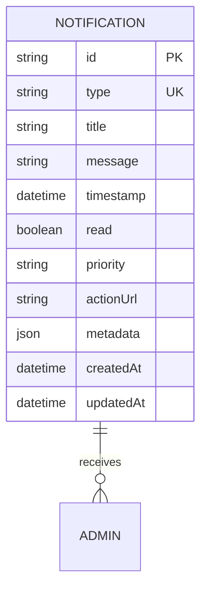
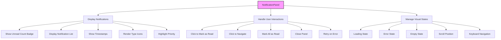
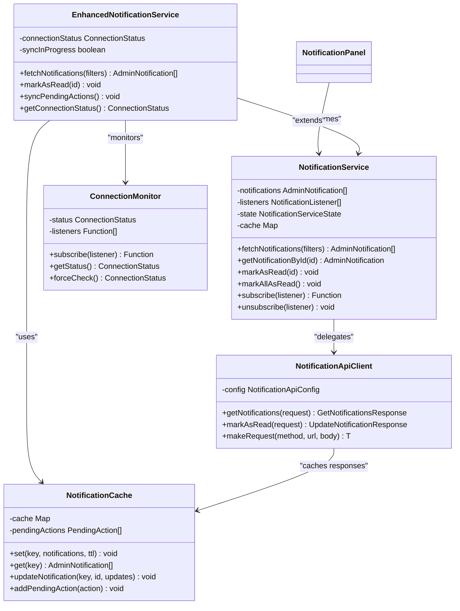
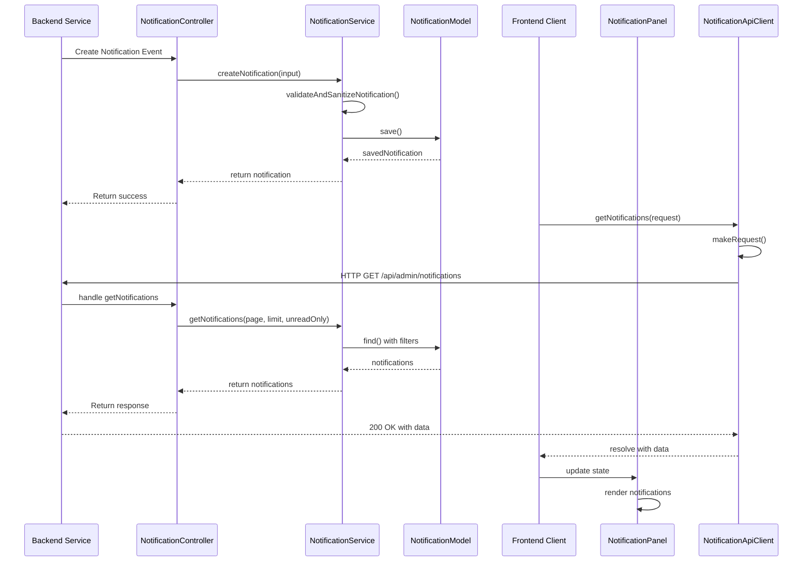
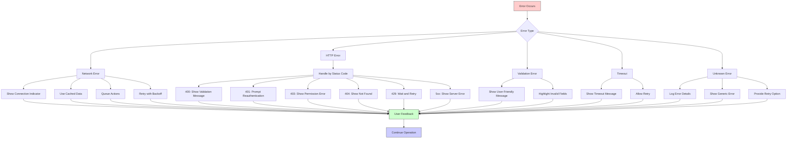
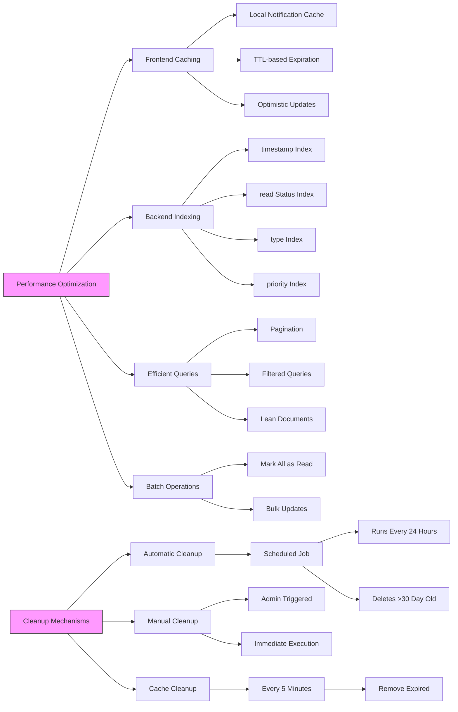
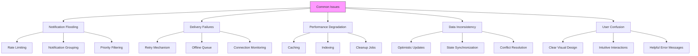

# Notification System

<cite>
**Referenced Files in This Document**   
- [notification.controller.ts](file://api-fastify/src/controllers/notification.controller.ts)
- [notification.service.ts](file://api-fastify/src/services/notification.service.ts)
- [notification.model.ts](file://api-fastify/src/models/notification.model.ts)
- [notification.types.ts](file://api-fastify/src/types/notification.types.ts)
- [notification-cleanup.service.ts](file://api-fastify/src/services/notification-cleanup.service.ts)
- [notification-audit.service.ts](file://api-fastify/src/services/notification-audit.service.ts)
- [NotificationPanel.tsx](file://src/components/admin/NotificationPanel.tsx)
- [NotificationApiClient.ts](file://src/services/NotificationApiClient.ts)
- [NotificationService.ts](file://src/services/NotificationService.ts)
- [EnhancedNotificationService.ts](file://src/services/EnhancedNotificationService.ts)
- [NotificationCache.ts](file://src/services/NotificationCache.ts)
- [ConnectionMonitor.ts](file://src/services/ConnectionMonitor.ts)
- [NotificationErrorHandler.ts](file://src/services/NotificationErrorHandler.ts)
- [AdminNotification.ts](file://src/types/AdminNotification.ts)
</cite>

## Table of Contents
1. [Introduction](#introduction)
2. [Domain Model and Data Structure](#domain-model-and-data-structure)
3. [Backend Notification Services](#backend-notification-services)
4. [Frontend Notification Management](#frontend-notification-management)
5. [State Management and Context Providers](#state-management-and-context-providers)
6. [Real-time Notification Flow](#real-time-notification-flow)
7. [Error Handling and Resilience](#error-handling-and-resilience)
8. [Performance Optimization and Cleanup](#performance-optimization-and-cleanup)
9. [Security and Audit Logging](#security-and-audit-logging)
10. [Common Issues and Solutions](#common-issues-and-solutions)

## Introduction
The notification system in MERN_chatai_blog provides a comprehensive solution for managing administrative notifications across the platform. This system enables real-time communication between backend events and frontend users, with robust error handling, state management, and performance optimization. The architecture follows a clean separation between server-side notification generation and client-side notification display, ensuring reliability and scalability. This document explains the implementation details of the notification system, covering both frontend and backend components, their interactions, and the patterns used for state management, error handling, and performance optimization.

## Domain Model and Data Structure
The notification system is built around a well-defined domain model that represents administrative notifications with rich metadata and contextual information. The core data structure is designed to support various notification types, priorities, and actions while maintaining data integrity and query performance.



**Diagram sources**
- [notification.model.ts](file://api-fastify/src/models/notification.model.ts#L1-L97)

The AdminNotification interface defines the structure of notifications with specific types and priorities:

- **Notification Types**: user_registered, post_published, system_error, user_activity, content_moderation
- **Priorities**: low, medium, high
- **Metadata**: Contextual data including userId, postId, username, postTitle, and errorCode
- **Action URLs**: Optional navigation targets for user interaction

The model includes validation rules and sanitization to prevent injection attacks and ensure data consistency. Indexes are implemented on key fields (timestamp, read, type, priority) to optimize query performance for common access patterns like retrieving unread notifications or filtering by type.

**Section sources**
- [notification.model.ts](file://api-fastify/src/models/notification.model.ts#L1-L97)
- [AdminNotification.ts](file://src/types/AdminNotification.ts#L1-L143)

## Backend Notification Services
The backend notification services form the core of the notification system, handling CRUD operations, business logic, and integration with other system components. These services are implemented in a modular fashion with clear separation of concerns.

```mermaid
classDiagram
class NotificationService {
+getNotifications(page, limit, unreadOnly) GetNotificationsResponse
+markNotificationAsRead(notificationId) AdminNotification
+markAllNotificationsAsRead() {modifiedCount}
+createNotification(input) AdminNotification
+cleanupOldNotifications() {deletedCount}
}
class NotificationController {
+getNotifications(request, reply)
+markNotificationAsRead(request, reply)
+markAllNotificationsAsRead(request, reply)
+cleanupOldNotifications(request, reply)
+getCleanupServiceStatus(request, reply)
}
class NotificationAuditService {
+logNotificationAccess(userId, ip, userAgent, success, error, metadata)
+logMarkAsRead(userId, notificationId, ip, success, error)
+logMarkAllAsRead(userId, ip, success, modifiedCount, error)
+logNotificationCreation(notificationId, type, success, error, metadata)
+detectSuspiciousActivity(userId, action, ip)
}
class NotificationCleanupService {
+startNotificationCleanup(intervalHours)
+stopNotificationCleanup()
+performCleanup()
+manualCleanup()
+getCleanupStatus()
}
NotificationController --> NotificationService : "delegates"
NotificationController --> NotificationAuditService : "audits"
NotificationService --> NotificationModel : "persists"
NotificationCleanupService --> NotificationService : "cleans"
```

**Diagram sources**
- [notification.service.ts](file://api-fastify/src/services/notification.service.ts#L1-L261)
- [notification.controller.ts](file://api-fastify/src/controllers/notification.controller.ts#L1-L217)
- [notification-audit.service.ts](file://api-fastify/src/services/notification-audit.service.ts#L1-L149)
- [notification-cleanup.service.ts](file://api-fastify/src/services/notification-cleanup.service.ts#L1-L83)

The NotificationService provides the core business logic for managing notifications, including retrieval with pagination, marking as read, and creation of new notifications. The service implements comprehensive error handling and logging to ensure reliability and traceability. Input validation is performed to prevent invalid data from being stored, with specific rules for notification types, priorities, and content length.

The NotificationController exposes these services through REST endpoints, handling HTTP requests and responses. Each controller method includes detailed error handling and audit logging to track access patterns and potential security issues. The controller validates user authentication and authorization before processing requests, ensuring that only authorized users can access notification data.

**Section sources**
- [notification.service.ts](file://api-fastify/src/services/notification.service.ts#L1-L261)
- [notification.controller.ts](file://api-fastify/src/controllers/notification.controller.ts#L1-L217)

## Frontend Notification Management
The frontend notification management system provides a user-friendly interface for administrators to view and interact with notifications. The core component is the NotificationPanel, which displays notifications in a visually appealing and accessible manner.



**Diagram sources**
- [NotificationPanel.tsx](file://src/components/admin/NotificationPanel.tsx#L1-L455)

The NotificationPanel component implements several key features to enhance user experience:

- **Visual Design**: Clean, modern interface with appropriate spacing, typography, and color coding based on notification priority
- **Interaction Patterns**: Click to mark as read, click to navigate to related content, keyboard navigation support
- **State Management**: Loading, error, and empty states with appropriate feedback
- **Accessibility**: Keyboard shortcuts (Escape to close, Ctrl+A to mark all as read), ARIA labels, and focus management
- **Performance**: Virtualized rendering for long lists, smooth animations, and efficient re-renders

The component uses framer-motion for smooth animations when opening and closing, providing visual feedback to users. Notification icons are displayed based on the notification type, helping users quickly identify the nature of each notification. Priority levels are indicated through left border colors and badges for high-priority notifications.

**Section sources**
- [NotificationPanel.tsx](file://src/components/admin/NotificationPanel.tsx#L1-L455)

## State Management and Context Providers
The notification system employs a sophisticated state management architecture that combines service classes, caching, and reactive patterns to ensure efficient data flow and synchronization between components.



**Diagram sources**
- [NotificationService.ts](file://src/services/NotificationService.ts#L1-L657)
- [EnhancedNotificationService.ts](file://src/services/EnhancedNotificationService.ts#L1-L161)
- [NotificationApiClient.ts](file://src/services/NotificationApiClient.ts#L1-L299)
- [NotificationCache.ts](file://src/services/NotificationCache.ts#L1-L110)
- [ConnectionMonitor.ts](file://src/services/ConnectionMonitor.ts#L1-L139)

The NotificationService acts as the central state manager, maintaining a local cache of notifications and providing methods to interact with them. It implements the observer pattern through the subscribe/unsubscribe methods, allowing components to react to changes in notification state. The service handles both local state updates and synchronization with the backend API.

The EnhancedNotificationService extends the base service with additional resilience features, including offline support and automatic synchronization. When the application is offline, user actions like marking notifications as read are queued and synchronized when connectivity is restored. This ensures a seamless user experience even in unstable network conditions.

The NotificationCache service provides local caching of notification data with time-to-live (TTL) management, reducing the number of API calls and improving performance. The ConnectionMonitor service tracks the application's network status, enabling appropriate UI feedback and triggering synchronization when connectivity is restored.

**Section sources**
- [NotificationService.ts](file://src/services/NotificationService.ts#L1-L657)
- [EnhancedNotificationService.ts](file://src/services/EnhancedNotificationService.ts#L1-L161)
- [NotificationCache.ts](file://src/services/NotificationCache.ts#L1-L110)
- [ConnectionMonitor.ts](file://src/services/ConnectionMonitor.ts#L1-L139)

## Real-time Notification Flow
The real-time notification flow connects backend events with frontend display through a well-defined sequence of operations that ensure timely delivery and consistent state.



**Diagram sources**
- [notification.controller.ts](file://api-fastify/src/controllers/notification.controller.ts#L1-L217)
- [notification.service.ts](file://api-fastify/src/services/notification.service.ts#L1-L261)
- [NotificationApiClient.ts](file://src/services/NotificationApiClient.ts#L1-L299)
- [NotificationPanel.tsx](file://src/components/admin/NotificationPanel.tsx#L1-L455)

The notification flow begins when a backend service (such as user registration or post publishing) triggers a notification creation event. The NotificationService validates and sanitizes the notification data before persisting it to the database. Once stored, the notification becomes available for retrieval by authorized users.

On the frontend, the NotificationService periodically polls the backend API to retrieve the latest notifications. The NotificationApiClient handles HTTP communication with retry logic and error handling. When new notifications are received, the service updates its internal state and notifies all subscribed components, including the NotificationPanel.

The NotificationPanel re-renders to display the updated notifications, using animations to draw attention to new items. Users can interact with notifications by clicking on them, which triggers the markAsRead operation and potentially navigates to related content. These user actions are communicated back to the backend through the API client, completing the bidirectional flow.

**Section sources**
- [notification.controller.ts](file://api-fastify/src/controllers/notification.controller.ts#L1-L217)
- [notification.service.ts](file://api-fastify/src/services/notification.service.ts#L1-L261)
- [NotificationApiClient.ts](file://src/services/NotificationApiClient.ts#L1-L299)
- [NotificationPanel.tsx](file://src/components/admin/NotificationPanel.tsx#L1-L455)

## Error Handling and Resilience
The notification system implements comprehensive error handling and resilience patterns to ensure reliability and a good user experience even in adverse conditions.



**Diagram sources**
- [NotificationErrorHandler.ts](file://src/services/NotificationErrorHandler.ts#L1-L265)
- [NotificationPanel.tsx](file://src/components/admin/NotificationPanel.tsx#L1-L455)
- [NotificationApiClient.ts](file://src/services/NotificationApiClient.ts#L1-L299)

The NotificationErrorHandler service provides centralized error handling with user-friendly messages and appropriate retry strategies. It categorizes errors into types such as network errors, HTTP errors, validation errors, and timeouts, providing specific handling for each category.

For network errors and timeouts, the system displays a connection indicator and falls back to cached data when available. User actions are queued and synchronized when connectivity is restored. The retry mechanism uses exponential backoff with jitter to avoid overwhelming the server during outages.

HTTP errors are handled according to their status codes:
- 400 (Bad Request): Validation errors with specific messages about invalid data
- 401 (Unauthorized): Prompts for reauthentication
- 403 (Forbidden): Shows permission errors
- 404 (Not Found): Indicates that requested resources no longer exist
- 429 (Too Many Requests): Implements rate limiting with retry-after guidance
- 5xx (Server Errors): Treats as retryable with appropriate backoff

The NotificationPanel displays error states with clear messages and retry options, allowing users to attempt the operation again. Connection status is displayed to help users understand the context of errors.

**Section sources**
- [NotificationErrorHandler.ts](file://src/services/NotificationErrorHandler.ts#L1-L265)
- [NotificationPanel.tsx](file://src/components/admin/NotificationPanel.tsx#L1-L455)

## Performance Optimization and Cleanup
The notification system includes several performance optimization and cleanup mechanisms to ensure efficient operation and prevent data bloat.



**Diagram sources**
- [notification-cleanup.service.ts](file://api-fastify/src/services/notification-cleanup.service.ts#L1-L83)
- [NotificationCache.ts](file://src/services/NotificationCache.ts#L1-L110)
- [notification.service.ts](file://api-fastify/src/services/notification.service.ts#L1-L261)

On the frontend, the NotificationCache service implements local caching with a 5-minute TTL, reducing the number of API calls and improving perceived performance. The cache stores notifications by query key, allowing quick retrieval of previously fetched data. Expired entries are automatically removed during periodic cleanup.

The backend employs database indexing on key fields (timestamp, read status, type, and priority) to optimize query performance. Pagination is implemented to limit the amount of data transferred in each request, with a maximum limit of 100 notifications per page. The service uses MongoDB's lean() method to return plain JavaScript objects instead of Mongoose documents, reducing memory usage and improving serialization performance.

Automatic cleanup of old notifications is handled by the notification-cleanup.service, which runs every 24 hours to remove notifications older than 30 days. This prevents the notification collection from growing indefinitely while maintaining a reasonable history for administrative purposes. Administrators can also trigger manual cleanup when needed.

The system implements optimistic updates for user interactions, immediately reflecting state changes in the UI while asynchronously updating the backend. This creates a responsive user experience even when network latency is present.

**Section sources**
- [notification-cleanup.service.ts](file://api-fastify/src/services/notification-cleanup.service.ts#L1-L83)
- [NotificationCache.ts](file://src/services/NotificationCache.ts#L1-L110)
- [notification.service.ts](file://api-fastify/src/services/notification.service.ts#L1-L261)

## Security and Audit Logging
The notification system incorporates comprehensive security measures and audit logging to protect sensitive data and provide accountability for all operations.

```mermaid
flowchart TD
A[Security Measures] --> B[Authentication]
A --> C[Authorization]
A --> D[Input Validation]
A --> E[Data Sanitization]
A --> F[Rate Limiting]
B --> B1[JWT Verification]
B --> B2[User Session]
C --> C1[Role-Based Access]
C --> C2[User Ownership]
D --> D1[Type Validation]
D --> D2[Priority Validation]
D --> D3[Length Limits]
D --> D4[Required Fields]
E --> E1[HTML Stripping]
E --> E2[Special Character Removal]
F --> F1[Request Throttling]
F --> F2[IP Tracking]
G[Audit Logging] --> H[Access Logging]
G --> I[Operation Logging]
G --> J[Error Logging]
G --> K[Suspicious Activity]
H --> H1[User ID]
H --> H2[IP Address]
H --> H3[User Agent]
H --> H4[Timestamp]
H --> H5[Query Parameters]
I --> I1[Mark as Read]
I --> I2[Mark All as Read]
I --> I3[Create Notification]
J --> J1[Failure Reasons]
J --> J2[Error Messages]
K --> K1[Pattern Detection]
K --> K2[Alert Generation]
style A fill:#f9f,stroke:#333
style G fill:#f9f,stroke:#333
```



**Diagram sources**
- [notification.controller.ts](file://api-fastify/src/controllers/notification.controller.ts#L1-L217)
- [notification.service.ts](file://api-fastify/src/services/notification.service.ts#L1-L261)
- [notification-audit.service.ts](file://api-fastify/src/services/notification-audit.service.ts#L1-L149)
- [notification-validation.middleware.ts](file://api-fastify/src/middlewares/notification-validation.middleware.ts)

Security is enforced at multiple levels, starting with authentication through JWT tokens that verify user identity. Authorization ensures that users can only access their own notifications and perform actions they are permitted to do. Input validation and data sanitization prevent injection attacks and ensure data integrity.

The notification-audit.service logs all significant operations, including notification access, marking as read, and creation of new notifications. Each log entry includes the user ID, IP address, user agent, timestamp, and operation details. Success and failure events are both logged, providing a complete audit trail for security analysis.

The system implements rate limiting to prevent abuse, with configurable limits on the number of requests a user can make within a given time period. This protects against denial-of-service attacks and ensures fair resource usage.

Data sanitization removes potentially dangerous characters and HTML tags from notification content, preventing cross-site scripting (XSS) attacks. Field length limits prevent excessively large inputs that could impact performance or storage.

**Section sources**
- [notification.controller.ts](file://api-fastify/src/controllers/notification.controller.ts#L1-L217)
- [notification.service.ts](file://api-fastify/src/services/notification.service.ts#L1-L261)
- [notification-audit.service.ts](file://api-fastify/src/services/notification-audit.service.ts#L1-L149)

## Common Issues and Solutions
The notification system addresses several common issues that can arise in real-world usage, providing solutions that enhance reliability and user experience.



**Diagram sources**
- [notification-cleanup.service.ts](file://api-fastify/src/services/notification-cleanup.service.ts#L1-L83)
- [NotificationCache.ts](file://src/services/NotificationCache.ts#L1-L110)
- [EnhancedNotificationService.ts](file://src/services/EnhancedNotificationService.ts#L1-L161)
- [NotificationErrorHandler.ts](file://src/services/NotificationErrorHandler.ts#L1-L265)
- [NotificationPanel.tsx](file://src/components/admin/NotificationPanel.tsx#L1-L455)

**Notification Flooding**: When many notifications are generated in a short period, the system could overwhelm users. This is mitigated through rate limiting on notification creation, automatic cleanup of old notifications, and the ability to filter by priority or type. The UI also groups notifications visually and provides bulk actions to manage multiple items efficiently.

**Delivery Failures**: Network issues or server outages can prevent notifications from being delivered. The system handles this through a robust retry mechanism with exponential backoff, local caching of notifications, and an offline queue for user actions. The ConnectionMonitor service detects connectivity changes and triggers synchronization when the connection is restored.

**Performance Degradation**: As the number of notifications grows, performance could degrade. This is addressed through database indexing, pagination, efficient queries, and regular cleanup of old notifications. The frontend uses local caching and virtualized rendering to maintain smooth performance even with large numbers of notifications.

**Data Inconsistency**: Differences between frontend and backend state can lead to confusion. The system uses optimistic updates to provide immediate feedback, while ensuring eventual consistency through background synchronization. Conflict resolution strategies handle cases where the same notification is modified from multiple sources.

**User Confusion**: Complex notification systems can be difficult to understand. The UI addresses this with clear visual design, intuitive interactions, and helpful error messages. Keyboard shortcuts, accessibility features, and consistent behavior patterns make the system easy to learn and use.

**Section sources**
- [notification-cleanup.service.ts](file://api-fastify/src/services/notification-cleanup.service.ts#L1-L83)
- [NotificationCache.ts](file://src/services/NotificationCache.ts#L1-L110)
- [EnhancedNotificationService.ts](file://src/services/EnhancedNotificationService.ts#L1-L161)
- [NotificationErrorHandler.ts](file://src/services/NotificationErrorHandler.ts#L1-L265)
- [NotificationPanel.tsx](file://src/components/admin/NotificationPanel.tsx#L1-L455)