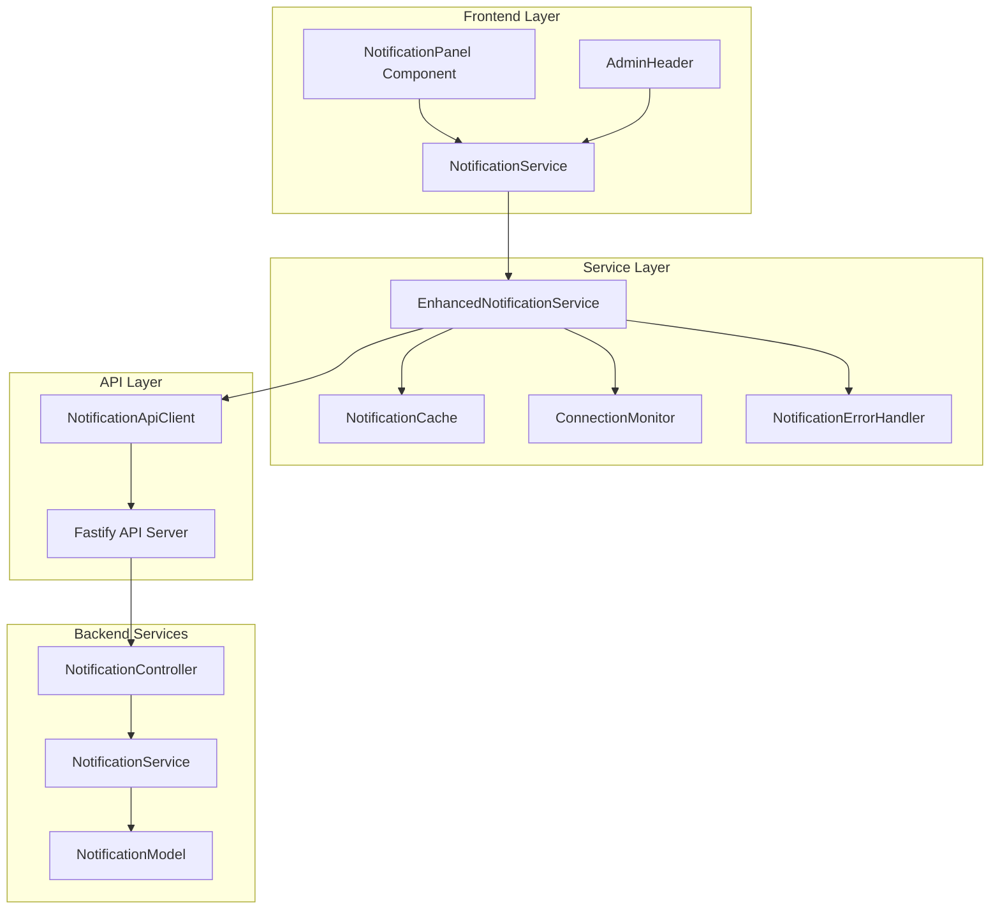
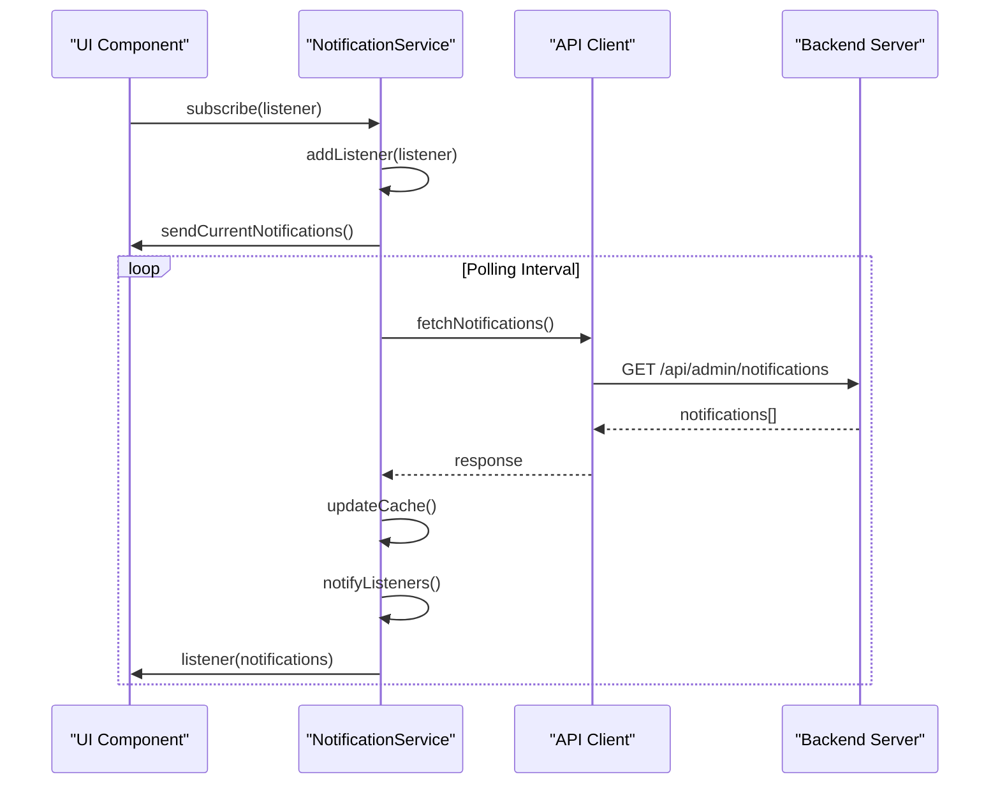
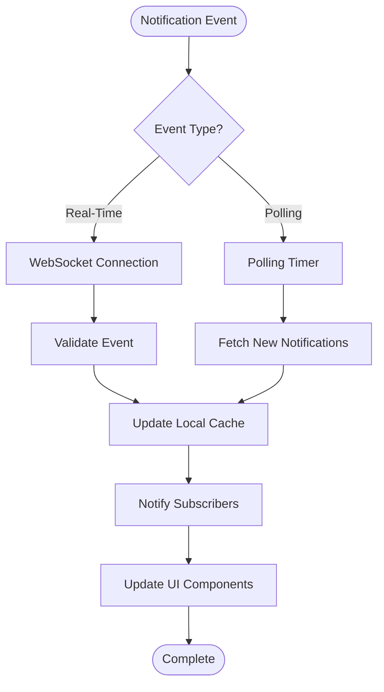
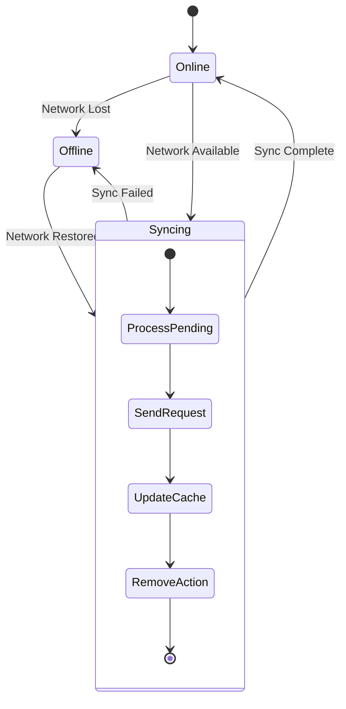
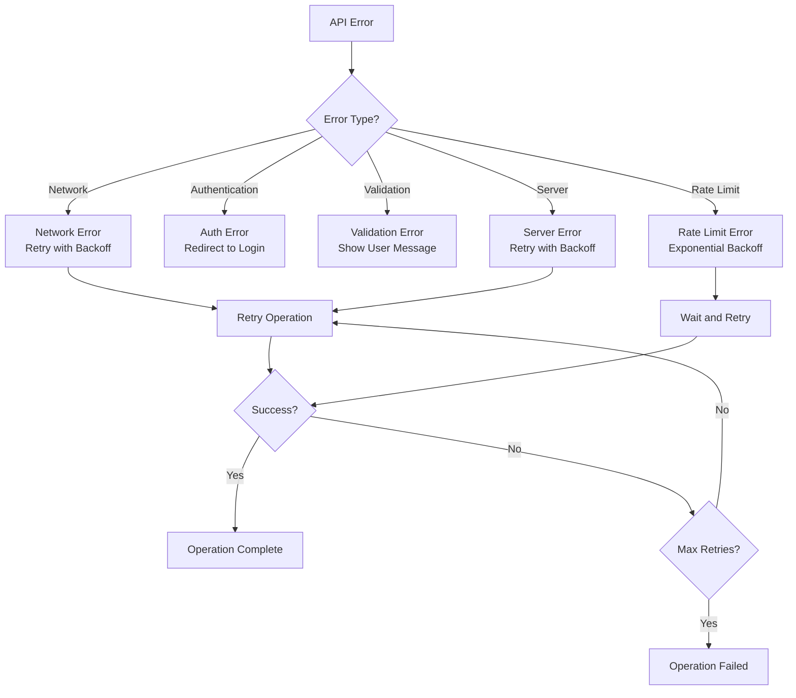

# Real-Time Notifications System

<cite>
**Referenced Files in This Document**
- [NotificationService.ts](file://src/services/NotificationService.ts)
- [EnhancedNotificationService.ts](file://src/services/EnhancedNotificationService.ts)
- [NotificationApiClient.ts](file://src/services/NotificationApiClient.ts)
- [NotificationCache.ts](file://src/services/NotificationCache.ts)
- [ConnectionMonitor.ts](file://src/services/ConnectionMonitor.ts)
- [NotificationErrorHandler.ts](file://src/services/NotificationErrorHandler.ts)
- [AdminHeader.tsx](file://src/components/AdminHeader.tsx)
- [NotificationPanel.tsx](file://src/components/AdminNotificationPanel.tsx)
- [notification.controller.ts](file://api-fastify/src/controllers/notification.controller.ts)
- [notification.routes.ts](file://api-fastify/src/routes/notification.routes.ts)
- [AdminNotification.ts](file://src/types/AdminNotification.ts)
- [NotificationApi.ts](file://src/types/NotificationApi.ts)
</cite>

## Table of Contents
1. [Introduction](#introduction)
2. [System Architecture](#system-architecture)
3. [Core Components](#core-components)
4. [Notification Service Implementation](#notification-service-implementation)
5. [Real-Time Updates Mechanism](#real-time-updates-mechanism)
6. [Cache Management](#cache-management)
7. [Error Handling and Resilience](#error-handling-and-resilience)
8. [UI Integration](#ui-integration)
9. [Performance Considerations](#performance-considerations)
10. [Troubleshooting Guide](#troubleshooting-guide)
11. [Best Practices](#best-practices)

## Introduction

The MERN_chatai_blog real-time notification system provides a comprehensive solution for delivering timely updates to administrators through both polling and optimistic update mechanisms. Built on a reactive architecture, the system ensures reliable notification delivery while maintaining excellent user experience even under network constraints.

The system consists of several interconnected components that work together to provide real-time notifications, offline support, automatic retry mechanisms, and seamless UI integration. It follows modern web development patterns with TypeScript, React hooks, and advanced caching strategies.

## System Architecture

The notification system follows a layered architecture with clear separation of concerns:



**Diagram sources**
- [NotificationService.ts](file://src/services/NotificationService.ts#L1-L50)
- [EnhancedNotificationService.ts](file://src/services/EnhancedNotificationService.ts#L1-L33)
- [NotificationApiClient.ts](file://src/services/NotificationApiClient.ts#L1-L50)

## Core Components

### NotificationService

The core service implements the primary notification management functionality with subscription patterns and polling mechanisms.

```typescript
// Basic service initialization
const apiClient = new NotificationApiClient({
  baseUrl: '/api',
  timeout: 10000,
  retryAttempts: 3,
  retryDelay: 1000
})

const service = new NotificationService({
  pollingInterval: 30000, // 30 seconds
  maxNotifications: 50,
  enableRealTimeUpdates: true,
  apiBaseUrl: '/api'
}, apiClient)
```

### EnhancedNotificationService

Extends the basic service with advanced features like offline support, optimistic updates, and automatic synchronization.

```typescript
// Enhanced service with offline capabilities
const enhancedService = new EnhancedNotificationService({
  pollingInterval: 30000,
  maxNotifications: 50,
  enableRealTimeUpdates: true
}, apiClient)
```

**Section sources**
- [NotificationService.ts](file://src/services/NotificationService.ts#L50-L74)
- [EnhancedNotificationService.ts](file://src/services/EnhancedNotificationService.ts#L15-L33)

## Notification Service Implementation

### Subscription Mechanism

The service implements a publish-subscribe pattern for real-time updates:



**Diagram sources**
- [NotificationService.ts](file://src/services/NotificationService.ts#L222-L266)
- [AdminHeader.tsx](file://src/components/AdminHeader.tsx#L71-L118)

### Polling Strategy

The system uses configurable polling intervals for background updates:

```typescript
// Automatic polling configuration
private startPolling(): void {
  if (this.config.pollingInterval && this.config.pollingInterval > 0) {
    this.pollingInterval = setInterval(() => {
      this.fetchNotifications().catch(error => {
        console.error('Error during polling:', error)
      })
    }, this.config.pollingInterval)
  }
}
```

### Optimistic Updates

The service implements optimistic updates for immediate UI feedback:

```typescript
async markAsRead(notificationId: string): Promise<void> {
  // Optimistic update - immediate UI feedback
  this.updateNotificationInCache(notificationId, { read: true })
  this.notifyListeners()

  try {
    const request: MarkAsReadRequest = { notificationId }
    const response = await this.apiClient.markAsRead(request)
    
    if (!response.success) {
      // Rollback on failure
      this.updateNotificationInCache(notificationId, { read: false })
      this.notifyListeners()
      throw new Error('Failed to mark notification as read')
    }
  } catch (error) {
    this.handleError('MARK_AS_READ_ERROR', `Erreur lors du marquage de la notification ${notificationId}`, error)
    throw error
  }
}
```

**Section sources**
- [NotificationService.ts](file://src/services/NotificationService.ts#L569-L625)
- [NotificationService.ts](file://src/services/NotificationService.ts#L120-L170)

## Real-Time Updates Mechanism

### Event-Driven Architecture

The system supports both polling-based and event-driven updates:



**Diagram sources**
- [NotificationService.ts](file://src/services/NotificationService.ts#L222-L266)
- [EnhancedNotificationService.ts](file://src/services/EnhancedNotificationService.ts#L65-L112)

### Connection Monitoring

The system continuously monitors network connectivity:

```typescript
// Connection monitoring implementation
export class ConnectionMonitor {
  private status: ConnectionStatus = 'checking'
  private listeners: ((status: ConnectionStatus) => void)[] = []

  constructor(config: Partial<ConnectionMonitorConfig> = {}) {
    this.config = {
      checkInterval: 30000, // 30 seconds
      timeout: 5000, // 5 seconds
      endpoint: '/api/health',
      ...config
    }
    
    this.initializeMonitoring()
  }

  private async checkConnection(): Promise<void> {
    try {
      const controller = new AbortController()
      const timeoutId = setTimeout(() => controller.abort(), this.config.timeout)

      const response = await fetch(this.config.endpoint, {
        method: 'HEAD',
        signal: controller.signal,
        cache: 'no-cache'
      })

      clearTimeout(timeoutId)
      this.updateStatus(response.ok ? 'online' : 'offline')
    } catch {
      this.updateStatus('offline')
    }
  }
}
```

**Section sources**
- [ConnectionMonitor.ts](file://src/services/ConnectionMonitor.ts#L1-L50)
- [ConnectionMonitor.ts](file://src/services/ConnectionMonitor.ts#L50-L100)

## Cache Management

### Local Caching Strategy

The system implements sophisticated caching with TTL and offline support:

```typescript
export class NotificationCache {
  private cache = new Map<string, CacheEntry>()
  private pendingActions: PendingAction[] = []
  private defaultTTL = 5 * 60 * 1000 // 5 minutes

  set(key: string, notifications: AdminNotification[], ttl?: number): void {
    this.cache.set(key, {
      data: [...notifications],
      timestamp: Date.now(),
      ttl: ttl || this.defaultTTL
    })
  }

  get(key: string): AdminNotification[] | null {
    const entry = this.cache.get(key)
    if (!entry) return null

    if (Date.now() - entry.timestamp > entry.ttl) {
      this.cache.delete(key)
      return null
    }

    return [...entry.data]
  }
}
```

### Offline Synchronization

The enhanced service handles offline scenarios gracefully:



**Diagram sources**
- [EnhancedNotificationService.ts](file://src/services/EnhancedNotificationService.ts#L114-L160)
- [NotificationCache.ts](file://src/services/NotificationCache.ts#L58-L109)

**Section sources**
- [NotificationCache.ts](file://src/services/NotificationCache.ts#L1-L50)
- [EnhancedNotificationService.ts](file://src/services/EnhancedNotificationService.ts#L65-L112)

## Error Handling and Resilience

### Comprehensive Error Management

The system implements robust error handling with retry mechanisms:

```typescript
export class NotificationErrorHandler {
  async executeWithRetry<T>(
    operationId: string,
    operation: () => Promise<T>,
    onRetry?: (attempt: number, error: NotificationError) => void
  ): Promise<T> {
    this.resetRetryAttempts(operationId)

    while (true) {
      try {
        const result = await operation()
        this.resetRetryAttempts(operationId)
        return result
      } catch (error) {
        const normalizedError = this.handleError(error, operationId)
        
        if (!this.canRetry(operationId, normalizedError)) {
          throw normalizedError
        }

        const delay = this.getRetryDelay(operationId, normalizedError)
        this.recordRetryAttempt(operationId)
        
        const attempt = this.retryAttempts.get(operationId) || 0
        onRetry?.(attempt, normalizedError)

        await this.delay(delay)
      }
    }
  }
}
```

### Error Classification

The system categorizes errors for appropriate handling:



**Diagram sources**
- [NotificationErrorHandler.ts](file://src/services/NotificationErrorHandler.ts#L1-L50)
- [NotificationErrorHandler.ts](file://src/services/NotificationErrorHandler.ts#L100-L150)

**Section sources**
- [NotificationErrorHandler.ts](file://src/services/NotificationErrorHandler.ts#L1-L100)
- [NotificationErrorHandler.ts](file://src/services/NotificationErrorHandler.ts#L150-L200)

## UI Integration

### NotificationPanel Component

The UI component integrates seamlessly with the service layer:

```typescript
const NotificationPanel: React.FC<NotificationPanelProps> = ({
  notifications,
  isOpen,
  onClose,
  onMarkAsRead,
  onMarkAllAsRead,
  onNotificationClick,
  isLoading = false,
  error = null,
  onRetry,
  connectionStatus = 'online'
}) => {
  const unreadCount = notifications.filter(n => !n.read).length
  
  // Keyboard navigation support
  useEffect(() => {
    if (!isOpen) return

    const handleKeyDown = (e: KeyboardEvent) => {
      switch (e.key) {
        case 'Escape':
          onClose()
          break
        case 'a':
          if (e.ctrlKey || e.metaKey) {
            e.preventDefault()
            if (unreadCount > 0) {
              handleMarkAllAsRead()
            }
          }
          break
      }
    }

    document.addEventListener('keydown', handleKeyDown)
    return () => document.removeEventListener('keydown', handleKeyDown)
  }, [isOpen, unreadCount, onClose])
}
```

### Motion Animations

The component uses framer-motion for smooth transitions:

```typescript
<motion.div 
  className="fixed top-16 right-4 w-[480px] bg-white dark:bg-gray-800 rounded-lg shadow-xl border border-gray-200 dark:border-gray-700 z-50 origin-top-right"
  initial={{ opacity: 0, scale: 0.95, y: -10 }}
  animate={{ opacity: 1, scale: 1, y: 0 }}
  exit={{ opacity: 0, scale: 0.95, y: -10 }}
  transition={{ duration: 0.2, ease: "easeOut" }}
>
```

**Section sources**
- [NotificationPanel.tsx](file://src/components/admin/NotificationPanel.tsx#L1-L100)
- [NotificationPanel.tsx](file://src/components/admin/NotificationPanel.tsx#L200-L300)

## Performance Considerations

### Polling Intervals

The system uses configurable polling intervals to balance responsiveness with resource usage:

- **Default Polling Interval**: 30 seconds
- **Optimal Range**: 15-60 seconds depending on use case
- **Minimum Interval**: 5 seconds for critical notifications
- **Maximum Interval**: 120 seconds for low-frequency updates

### Memory Management

The cache implements automatic cleanup to prevent memory leaks:

```typescript
// Periodic cache cleanup
setInterval(() => {
  notificationCache.cleanup()
}, 5 * 60 * 1000) // 5 minutes

// Cache cleanup implementation
cleanup(): void {
  const now = Date.now()
  for (const [key, entry] of this.cache.entries()) {
    if (now - entry.timestamp > entry.ttl) {
      this.cache.delete(key)
    }
  }
}
```

### Batch Operations

The system supports batch operations for improved performance:

```typescript
async bulkUpdate(request: BulkUpdateNotificationsRequest): Promise<{ success: boolean; updatedCount: number }> {
  const url = '/api/admin/notifications/bulk-update'
  return this.makeRequest<{ success: boolean; updatedCount: number }>('PATCH', url, request)
}
```

**Section sources**
- [NotificationService.ts](file://src/services/NotificationService.ts#L569-L625)
- [NotificationCache.ts](file://src/services/NotificationCache.ts#L100-L110)

## Troubleshooting Guide

### Common Issues and Solutions

#### Missed Updates

**Symptoms**: Notifications appear outdated or missing
**Causes**: 
- Polling interval too long
- Network connectivity issues
- Cache corruption

**Solutions**:
1. Reduce polling interval: `pollingInterval: 15000`
2. Clear cache: `notificationCache.clear()`
3. Force refresh: `await service.fetchNotifications()`

#### Stale Cache

**Symptoms**: Old notifications shown despite new ones available
**Causes**:
- Cache TTL exceeded
- Manual cache clearing
- Network timeout

**Solutions**:
1. Adjust TTL: `ttl: 300000` (5 minutes)
2. Implement cache warming
3. Add cache validation

#### Connection Loss

**Symptoms**: No notifications received during offline periods
**Causes**:
- Network disconnection
- Server downtime
- Firewall blocking requests

**Solutions**:
1. Enable offline mode: Check connection status
2. Queue pending actions: `notificationCache.addPendingAction()`
3. Automatic retry: `notificationErrorHandler.executeWithRetry()`

### Debugging Tools

#### Service State Monitoring

```typescript
// Get current service state
const state = service.getState()
console.log('Service state:', state)

// Get last error
const lastError = service.getLastError()
console.log('Last error:', lastError)
```

#### Cache Inspection

```typescript
// Inspect cache contents
const cacheKeys = Array.from(notificationCache.cache.keys())
console.log('Cache keys:', cacheKeys)

// Check pending actions
const pendingActions = notificationCache.getPendingActions()
console.log('Pending actions:', pendingActions)
```

**Section sources**
- [NotificationService.ts](file://src/services/NotificationService.ts#L620-L656)
- [NotificationCache.ts](file://src/services/NotificationCache.ts#L58-L109)

## Best Practices

### Configuration Guidelines

1. **Polling Intervals**: 
   - High-priority: 15-30 seconds
   - Medium-priority: 30-60 seconds
   - Low-priority: 60-120 seconds

2. **Cache Settings**:
   - TTL: 300-600 seconds
   - Max notifications: 50-100
   - Retry attempts: 3-5

3. **Error Handling**:
   - Always implement retry logic
   - Provide user-friendly error messages
   - Log errors appropriately

### Security Considerations

1. **Authentication**: All API calls require valid JWT tokens
2. **Authorization**: Role-based access control for notification endpoints
3. **Input Validation**: Sanitize all user inputs
4. **Rate Limiting**: Prevent abuse of notification endpoints

### Accessibility Features

1. **Keyboard Navigation**: Full keyboard support for all interactive elements
2. **ARIA Labels**: Proper labeling for screen readers
3. **Focus Management**: Logical tab order and focus indicators
4. **Color Contrast**: Adequate contrast ratios for readability

### Testing Strategies

1. **Unit Tests**: Test individual service methods
2. **Integration Tests**: Test service-API integration
3. **E2E Tests**: Test complete user workflows
4. **Offline Testing**: Verify offline functionality

The MERN_chatai_blog real-time notification system provides a robust, scalable solution for delivering timely updates to administrators. Its combination of polling, optimistic updates, comprehensive error handling, and offline support ensures reliable operation across various network conditions while maintaining excellent user experience.