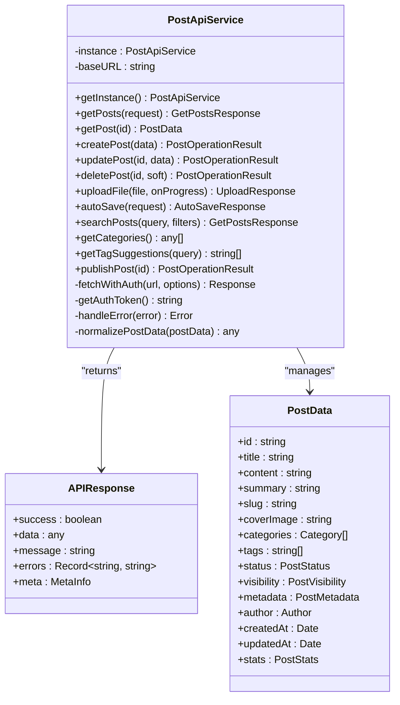
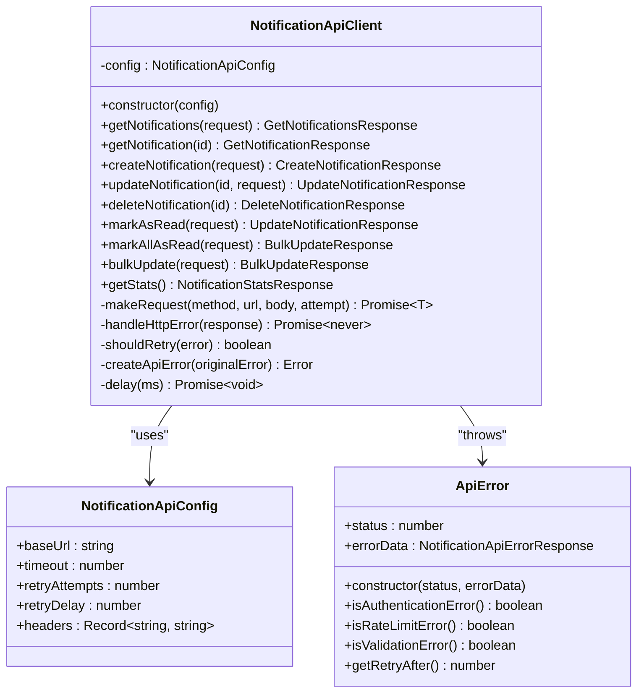
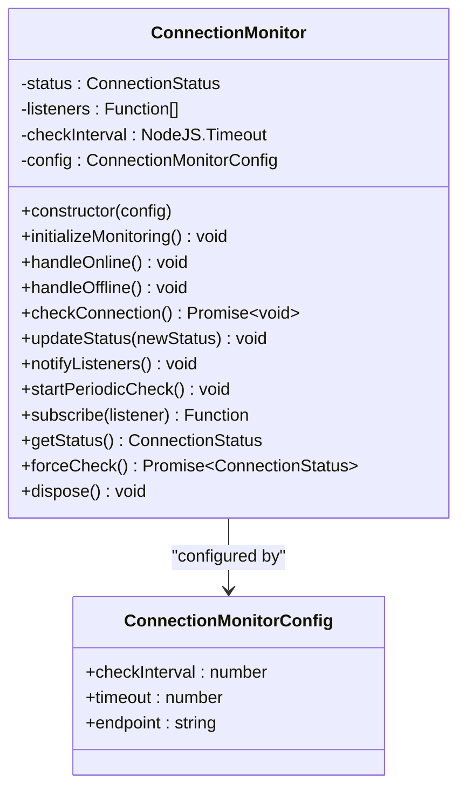
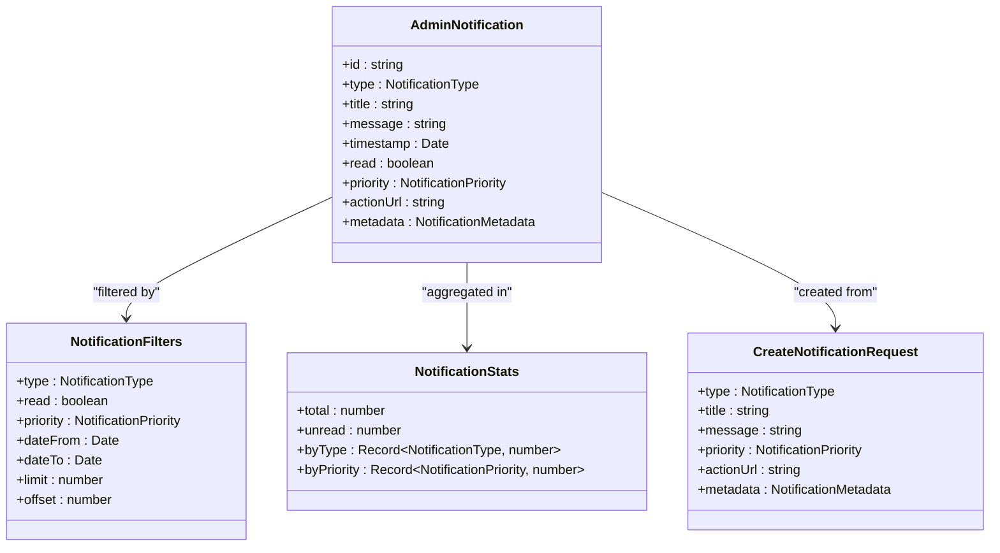
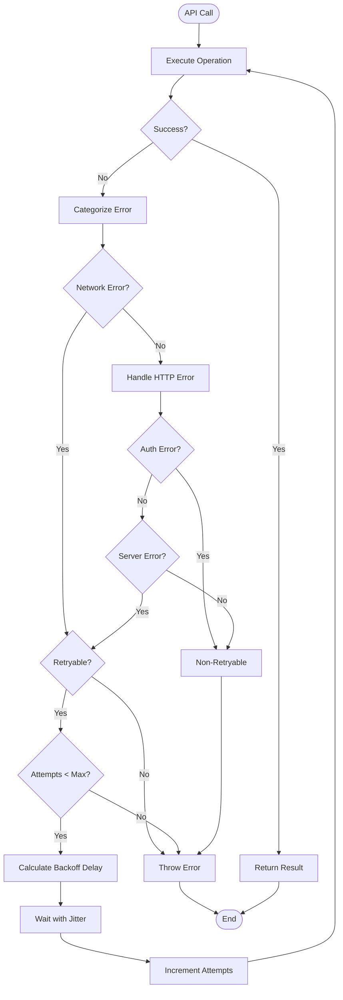
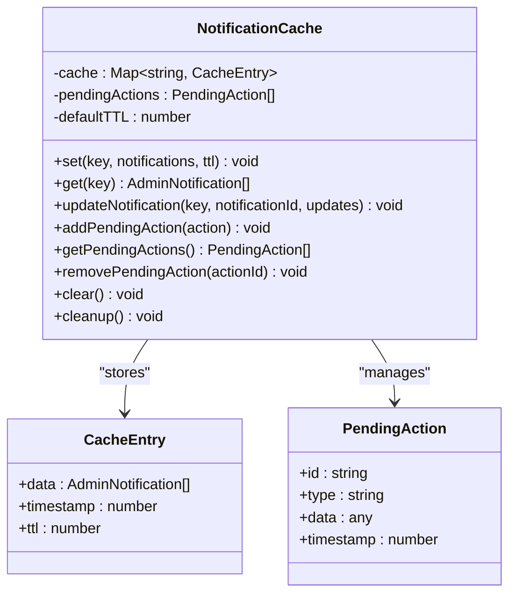
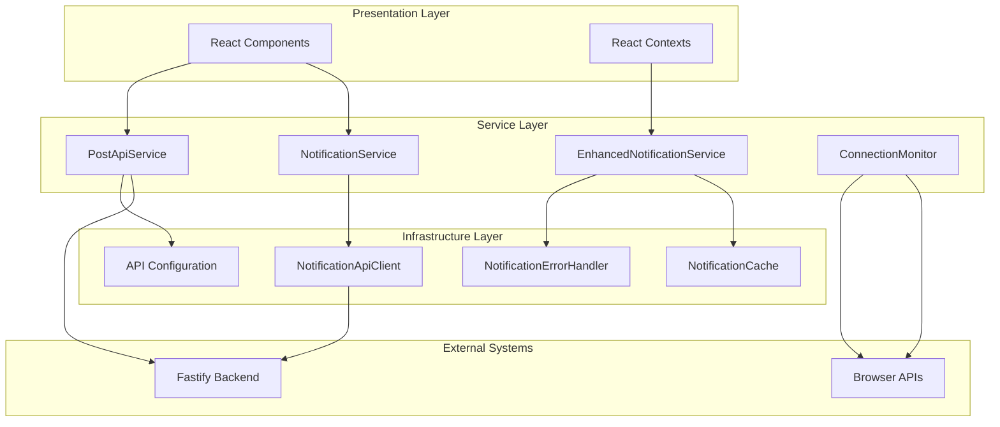
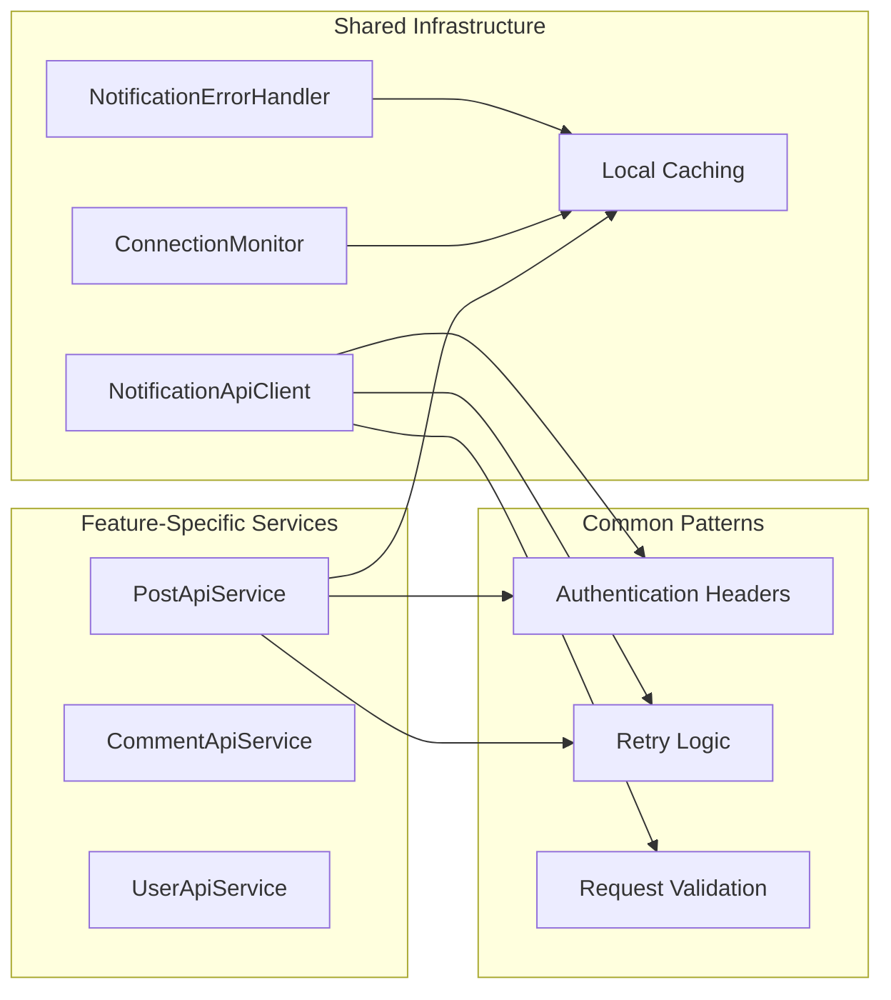

# API Integration Layer

<cite>
**Referenced Files in This Document**
- [api.config.ts](file://src/config/api.config.ts)
- [postApi.ts](file://src/features/posts/services/postApi.ts)
- [NotificationApiClient.ts](file://src/services/NotificationApiClient.ts)
- [NotificationApi.ts](file://src/types/NotificationApi.ts)
- [ConnectionMonitor.ts](file://src/services/ConnectionMonitor.ts)
- [api.types.ts](file://src/features/posts/types/api.types.ts)
- [post.types.ts](file://src/features/posts/types/post.types.ts)
- [EnhancedNotificationService.ts](file://src/services/EnhancedNotificationService.ts)
- [NotificationService.ts](file://src/services/NotificationService.ts)
- [AdminNotification.ts](file://src/types/AdminNotification.ts)
- [NotificationCache.ts](file://src/services/NotificationCache.ts)
- [NotificationErrorHandler.ts](file://src/services/NotificationErrorHandler.ts)
</cite>

## Table of Contents
1. [Introduction](#introduction)
2. [Configuration Management](#configuration-management)
3. [Core API Services](#core-api-services)
4. [Notification API Integration](#notification-api-integration)
5. [Connection Monitoring](#connection-monitoring)
6. [Type Safety and Validation](#type-safety-and-validation)
7. [Error Handling and Retry Mechanisms](#error-handling-and-retry-mechanisms)
8. [Caching Strategies](#caching-strategies)
9. [Performance Optimizations](#performance-optimizations)
10. [Architecture Overview](#architecture-overview)
11. [Best Practices](#best-practices)
12. [Troubleshooting Guide](#troubleshooting-guide)

## Introduction

The API Integration Layer in MERN_chatai_blog provides a comprehensive service-oriented architecture for managing all external API communications. This layer implements robust patterns for HTTP requests, error handling, caching, and real-time connectivity monitoring. It serves as the bridge between the frontend React application and the Fastify backend API, ensuring reliable data exchange with sophisticated retry mechanisms and offline support capabilities.

The architecture follows modern web development best practices, emphasizing type safety, performance optimization, and user experience. It handles complex scenarios including network failures, rate limiting, and offline-first functionality while maintaining data consistency and providing meaningful feedback to users.

## Configuration Management

### Environment-Based Endpoint Resolution

The API configuration system provides flexible endpoint management through environment variables and centralized configuration objects.

```typescript
// @ts-ignore
/**
 * Configuration des URLs de l'API
 */

// URL de base de l'API - utilise la variable d'environnement ou le proxy Vite
export const API_BASE_URL = import.meta.env.VITE_API_URL || '/api';

// URL de base du serveur (pour les fichiers statiques comme les images)
export const SERVER_BASE_URL = import.meta.env.VITE_IMAGE_BASE_URL || 'http://localhost:4200';
```

### Endpoint Organization

The configuration organizes endpoints by feature areas with dynamic URL construction:

```typescript
export const API_ENDPOINTS = {
  // Authentification
  auth: {
    login: `${API_BASE_URL}/auth/login`,
    register: `${API_BASE_URL}/auth/register`,
    logout: `${API_BASE_URL}/auth/logout`,
    forgotPassword: `${API_BASE_URL}/auth/forgot-password`,
    resetPassword: (token: string) => `${API_BASE_URL}/auth/reset-password/${token}`,
    verifyEmail: (token: string) => `${API_BASE_URL}/auth/verify-email/${token}`,
    me: `${API_BASE_URL}/auth/me`,
    checkAdmin: `${API_BASE_URL}/auth/check-admin`,
    checkAuthor: `${API_BASE_URL}/auth/check-author`,
  },

  // Articles
  posts: {
    list: `${API_BASE_URL}/posts`,
    detail: (idOrSlug: string) => `${API_BASE_URL}/posts/${idOrSlug}`,
    create: `${API_BASE_URL}/posts`,
    update: (id: string) => `${API_BASE_URL}/posts/${id}`,
    delete: (id: string) => `${API_BASE_URL}/posts/${id}`,
    search: `${API_BASE_URL}/posts/search`,
    like: (id: string) => `${API_BASE_URL}/posts/${id}/like`,
    dislike: (id: string) => `${API_BASE_URL}/posts/${id}/dislike`,
    unlike: (id: string) => `${API_BASE_URL}/posts/${id}/unlike`,
    stats: (id: string) => `${API_BASE_URL}/posts/${id}/stats`,
    drafts: `${API_BASE_URL}/posts?status=draft`,
    publish: (id: string) => `${API_BASE_URL}/posts/${id}/publish`,
  },
};
```

### Image URL Management

The configuration includes sophisticated image URL handling with fallback mechanisms:

```typescript
export function getImageUrl(imagePath?: string | null): string {
  // Si le chemin est vide, null ou undefined, retourner un placeholder
  if (!imagePath || imagePath.trim() === '') {
    return '/placeholder.svg';
  }
  
  // Si le chemin est déjà une URL complète, on le retourne tel quel
  if (imagePath.startsWith('http://') || imagePath.startsWith('https://')) {
    return imagePath;
  }
  
  // Si le chemin commence par 'data:', c'est une image base64
  if (imagePath.startsWith('data:')) {
    return imagePath;
  }
  
  // Si le chemin commence par 'blob:', c'est une URL d'objet temporaire
  if (imagePath.startsWith('blob:')) {
    return imagePath;
  }
  
  // Si le chemin commence par '/', c'est déjà un chemin absolu local
  if (imagePath.startsWith('/')) {
    // Spécial: servir les uploads depuis le backend (peut être sur un autre port/domaine)
    if (imagePath.startsWith('/uploads/')) {
      return `${SERVER_BASE_URL}${imagePath}`;
    }
    return imagePath;
  }
  
  // Nettoyer le chemin en supprimant les slashes en début
  const cleanPath = imagePath.replace(/^\/+/, '');
  
  // Si le chemin ne commence pas par 'uploads/', l'ajouter
  const finalPath = cleanPath.startsWith('uploads/') ? cleanPath : `uploads/${cleanPath}`;
  
  // Construit l'URL en fonction de l'environnement
  return `${SERVER_BASE_URL}/${finalPath}`;
}
```

**Section sources**
- [api.config.ts](file://src/config/api.config.ts#L1-L273)

## Core API Services

### PostApiService Implementation

The PostApiService demonstrates a comprehensive service-oriented approach to API communication with robust error handling and data normalization.



**Diagram sources**
- [postApi.ts](file://src/features/posts/services/postApi.ts#L1-L605)
- [api.types.ts](file://src/features/posts/types/api.types.ts#L1-L381)
- [post.types.ts](file://src/features/posts/types/post.types.ts#L1-L263)

### Request/Response Patterns

The service implements standardized request/response patterns with comprehensive error handling:

```typescript
async getPosts(request: GetPostsRequest = {}): Promise<GetPostsResponse> {
  try {
    const params = new URLSearchParams();

    if (request.page) params.append('page', request.page.toString());
    if (request.limit) params.append('limit', request.limit.toString());

    if (request.filters) {
      Object.entries(request.filters).forEach(([key, value]) => {
        if (value !== undefined && value !== null && value !== '') {
          params.append(key, value.toString());
        }
      });
    }

    if (request.sort) {
      params.append('sort', `${request.sort.field}:${request.sort.order}`);
    }

    const url = `${API_ENDPOINTS.posts.list}?${params.toString()}`;
    const response = await this.fetchWithAuth(url);

    if (!response.ok) {
      throw new Error(`Failed to fetch posts: ${response.status}`);
    }

    const raw = await response.json();

    // Extract posts array from either { posts, total, page, ... } or { data: { posts, ... } }
    const postsArray: any[] = (raw?.data?.posts ?? raw?.posts ?? []);
    const normalizedPosts = Array.isArray(postsArray)
      ? postsArray.map((post: any) => {
          if (post && post._id && !post.id) post.id = post._id;
          if (post && post.author && post.author._id && !post.author.id) {
            post.author.id = post.author._id;
          }
          return post;
        })
      : [];

    // Build pagination info from either nesting or top-level
    const page = raw?.data?.page ?? raw?.page ?? request.page ?? 1;
    const limit = raw?.data?.limit ?? raw?.limit ?? request.limit ?? 10;
    const total = raw?.data?.total ?? raw?.total ?? normalizedPosts.length;
    const totalPages = raw?.data?.totalPages ?? raw?.totalPages ?? Math.max(1, Math.ceil(total / limit));

    return {
      success: true,
      data: {
        posts: normalizedPosts,
        pagination: {
          total,
          page,
          limit,
          pages: totalPages,
          hasNext: page < totalPages,
          hasPrev: page > 1,
        },
        filters: request.filters || {},
      },
    };
  } catch (error) {
    console.error('Error fetching posts:', error);
    throw this.handleError(error);
  }
}
```

### Authentication Header Management

The service implements automatic authentication header injection:

```typescript
private async fetchWithAuth(url: string, options: RequestInit = {}): Promise<Response> {
  const token = this.getAuthToken();

  const headers = {
    ...options.headers,
    ...(token && { Authorization: `Bearer ${token}` }),
  };

  return fetch(url, {
    ...options,
    headers,
    credentials: 'include',
  });
}

private getAuthToken(): string | null {
  // This should integrate with your auth system
  // For now, we'll rely on cookies
  return null;
}
```

### Upload Operations

The service provides robust file upload capabilities with progress tracking:

```typescript
async uploadFile(
  file: File,
  onProgress?: (progress: { loaded: number; total: number; percentage: number }) => void
): Promise<UploadResponse> {
  try {
    const formData = new FormData();
    formData.append('file', file);

    const xhr = new XMLHttpRequest();

    return new Promise((resolve, reject) => {
      xhr.upload.addEventListener('progress', (event) => {
        if (event.lengthComputable && onProgress) {
          const percentage = Math.round((event.loaded / event.total) * 100);
          onProgress({
            loaded: event.loaded,
            total: event.total,
            percentage
          });
        }
      });

      xhr.addEventListener('load', () => {
        if (xhr.status >= 200 && xhr.status < 300) {
          try {
            const result = JSON.parse(xhr.responseText);
            resolve(result);
          } catch (error) {
            console.error('Réponse invalide:', xhr.responseText);
            reject(new Error(`Format de réponse invalide: ${xhr.responseText}`));
          }
        } else {
          reject(new Error(`Upload failed: ${xhr.status} - ${xhr.responseText}`));
        }
      });

      xhr.addEventListener('error', () => {
        reject(new Error('Upload failed'));
      });

      xhr.open('POST', API_ENDPOINTS.uploads.file);
      xhr.withCredentials = true; // Ajouté pour envoyer les cookies

      // Add auth headers
      const token = this.getAuthToken();
      if (token) {
        xhr.setRequestHeader('Authorization', `Bearer ${token}`);
      }

      xhr.send(formData);
    });
  } catch (error) {
    console.error('Error uploading file:', error);
    throw this.handleError(error);
  }
}
```

**Section sources**
- [postApi.ts](file://src/features/posts/services/postApi.ts#L1-L605)

## Notification API Integration

### Enhanced Notification Client

The NotificationApiClient provides a sophisticated wrapper around the backend API with built-in retry mechanisms, timeout handling, and comprehensive error management.



**Diagram sources**
- [NotificationApiClient.ts](file://src/services/NotificationApiClient.ts#L1-L299)
- [NotificationApi.ts](file://src/types/NotificationApi.ts#L1-L193)

### Advanced Retry Logic

The client implements exponential backoff with intelligent retry decisions:

```typescript
private async makeRequest<T>(
  method: string,
  url: string,
  body?: any,
  attempt: number = 1
): Promise<T> {
  const fullUrl = url.startsWith('http') ? url : `${this.config.baseUrl}${url}`
  
  try {
    const controller = new AbortController()
    const timeoutId = setTimeout(() => controller.abort(), this.config.timeout)

    const response = await fetch(fullUrl, {
      method,
      headers: this.config.headers,
      body: body ? JSON.stringify(body) : undefined,
      signal: controller.signal
    })

    clearTimeout(timeoutId)

    if (!response.ok) {
      await this.handleHttpError(response)
    }

    const data = await response.json()
    return data as T

  } catch (error) {
    // Retry logic
    if (attempt < (this.config.retryAttempts || 3) && this.shouldRetry(error)) {
      await this.delay((this.config.retryDelay || 1000) * attempt)
      return this.makeRequest<T>(method, url, body, attempt + 1)
    }

    throw this.createApiError(error)
  }
}

private shouldRetry(error: any): boolean {
  // Retry pour les erreurs réseau et les erreurs serveur temporaires
  if (error.name === 'AbortError') return false // Timeout, ne pas retry
  if (error instanceof ApiError) {
    const status = error.status
    return status >= 500 || status === 429 // Erreurs serveur ou rate limiting
  }
  return true // Erreurs réseau
}
```

### Real-Time WebSocket Integration

The API client supports WebSocket connections for real-time notifications:

```typescript
export interface NotificationWebSocketMessage {
  type: 'notification_created' | 'notification_updated' | 'notification_deleted' | 'bulk_update'
  data: AdminNotification | AdminNotification[]
  timestamp: string
}

export interface NotificationWebSocketError {
  type: 'error'
  error: {
    code: string
    message: string
  }
  timestamp: string
}
```

**Section sources**
- [NotificationApiClient.ts](file://src/services/NotificationApiClient.ts#L1-L299)
- [NotificationApi.ts](file://src/types/NotificationApi.ts#L1-L193)

## Connection Monitoring

### Network Status Detection

The ConnectionMonitor service provides comprehensive network connectivity detection with automatic reconnection capabilities.



**Diagram sources**
- [ConnectionMonitor.ts](file://src/services/ConnectionMonitor.ts#L1-L139)

### Automatic Connectivity Management

The service automatically responds to browser connectivity events:

```typescript
export type ConnectionStatus = 'online' | 'offline' | 'checking'

export interface ConnectionMonitorConfig {
  checkInterval: number
  timeout: number
  endpoint: string
}

export class ConnectionMonitor {
  private status: ConnectionStatus = 'checking'
  private listeners: ((status: ConnectionStatus) => void)[] = []
  private checkInterval?: NodeJS.Timeout
  private config: ConnectionMonitorConfig

  constructor(config: Partial<ConnectionMonitorConfig> = {}) {
    this.config = {
      checkInterval: 30000, // 30 secondes
      timeout: 5000, // 5 secondes
      endpoint: '/api/health',
      ...config
    }

    this.initializeMonitoring()
  }

  private initializeMonitoring(): void {
    // Écouter les événements de connexion du navigateur
    window.addEventListener('online', () => this.handleOnline())
    window.addEventListener('offline', () => this.handleOffline())

    // Vérification initiale
    this.checkConnection()

    // Vérification périodique
    this.startPeriodicCheck()
  }

  private handleOnline(): void {
    this.updateStatus('checking')
    this.checkConnection()
  }

  private handleOffline(): void {
    this.updateStatus('offline')
  }
}
```

### Periodic Health Checks

The service performs automated health checks to detect connectivity issues:

```typescript
private async checkConnection(): Promise<void> {
  try {
    const controller = new AbortController()
    const timeoutId = setTimeout(() => controller.abort(), this.config.timeout)

    const response = await fetch(this.config.endpoint, {
      method: 'HEAD',
      signal: controller.signal,
      cache: 'no-cache'
    })

    clearTimeout(timeoutId)
    this.updateStatus(response.ok ? 'online' : 'offline')
  } catch {
    this.updateStatus('offline')
  }
}
```

**Section sources**
- [ConnectionMonitor.ts](file://src/services/ConnectionMonitor.ts#L1-L139)

## Type Safety and Validation

### Comprehensive Type Definitions

The API integration layer provides extensive TypeScript interfaces ensuring data integrity and preventing runtime errors.



**Diagram sources**
- [AdminNotification.ts](file://src/types/AdminNotification.ts#L1-L143)
- [NotificationApi.ts](file://src/types/NotificationApi.ts#L1-L193)

### API Response Standardization

All API responses follow a consistent structure with success indicators and metadata:

```typescript
export interface APIResponse<T = any> {
  success: boolean;
  data?: T;
  message?: string;
  errors?: Record<string, string>;
  meta?: {
    total?: number;
    page?: number;
    limit?: number;
    hasMore?: boolean;
    timestamp?: Date;
  };
}
```

### Request Validation

The system validates all incoming requests with comprehensive error reporting:

```typescript
export interface ValidationError {
  field: string
  message: string
  code: string
}

export interface ValidationErrorResponse {
  success: false
  error: {
    code: 'VALIDATION_ERROR'
    message: string
    validationErrors: ValidationError[]
  }
  timestamp: string
}
```

**Section sources**
- [AdminNotification.ts](file://src/types/AdminNotification.ts#L1-L143)
- [NotificationApi.ts](file://src/types/NotificationApi.ts#L1-L193)
- [api.types.ts](file://src/features/posts/types/api.types.ts#L1-L381)

## Error Handling and Retry Mechanisms

### Enhanced Error Management

The NotificationErrorHandler provides sophisticated error categorization and retry strategies:



**Diagram sources**
- [NotificationErrorHandler.ts](file://src/services/NotificationErrorHandler.ts#L1-L265)

### Intelligent Retry Logic

The error handler implements exponential backoff with jitter:

```typescript
export class NotificationErrorHandler {
  private config: ErrorHandlerConfig
  private retryAttempts: Map<string, number> = new Map()

  constructor(config: Partial<ErrorHandlerConfig> = {}) {
    this.config = {
      showUserMessages: true,
      logErrors: true,
      retryConfig: {
        maxAttempts: 3,
        baseDelay: 1000,
        maxDelay: 10000,
        backoffFactor: 2
      },
      ...config
    }
  }

  /**
   * Exécute une opération avec retry automatique
   */
  async executeWithRetry<T>(
    operationId: string,
    operation: () => Promise<T>,
    onRetry?: (attempt: number, error: NotificationError) => void
  ): Promise<T> {
    this.resetRetryAttempts(operationId)

    while (true) {
      try {
        const result = await operation()
        this.resetRetryAttempts(operationId)
        return result
      } catch (error) {
        const normalizedError = this.handleError(error, operationId)
        
        if (!this.canRetry(operationId, normalizedError)) {
          throw normalizedError
        }

        const delay = this.getRetryDelay(operationId, normalizedError)
        this.recordRetryAttempt(operationId)
        
        const attempt = this.retryAttempts.get(operationId) || 0
        onRetry?.(attempt, normalizedError)

        await this.delay(delay)
      }
    }
  }
}
```

### Error Classification

The system provides detailed error classification for appropriate user feedback:

```typescript
private handleHttpError(error: any): NotificationError {
  const status = error.status
  const errorData = error.errorData

  switch (status) {
    case 400:
      return {
        code: 'VALIDATION_ERROR',
        message: 'Données invalides',
        userMessage: 'Les données envoyées sont invalides.',
        retryable: false,
        details: errorData
      }

    case 401:
      return {
        code: 'AUTHENTICATION_ERROR',
        message: 'Non authentifié',
        userMessage: 'Vous devez vous reconnecter.',
        retryable: false
      }

    case 403:
      return {
        code: 'AUTHORIZATION_ERROR',
        message: 'Non autorisé',
        userMessage: 'Vous n\'avez pas les permissions nécessaires.',
        retryable: false
      }

    case 429:
      return {
        code: 'RATE_LIMIT_ERROR',
        message: 'Trop de requêtes',
        userMessage: 'Trop de requêtes. Attendez un moment.',
        retryable: true,
        retryAfter: error.getRetryAfter?.() || 60000
      }

    case 500:
    case 502:
    case 503:
    case 504:
      return {
        code: 'SERVER_ERROR',
        message: 'Erreur serveur',
        userMessage: 'Problème temporaire du serveur. Réessayez.',
        retryable: true
      }

    default:
      return {
        code: 'HTTP_ERROR',
        message: `Erreur HTTP ${status}`,
        userMessage: 'Une erreur s\'est produite. Réessayez.',
        retryable: status >= 500,
        details: errorData
      }
  }
}
```

**Section sources**
- [NotificationErrorHandler.ts](file://src/services/NotificationErrorHandler.ts#L1-L265)

## Caching Strategies

### Local Storage Cache

The NotificationCache provides efficient local storage with TTL management:



**Diagram sources**
- [NotificationCache.ts](file://src/services/NotificationCache.ts#L1-L110)

### Offline-First Approach

The EnhancedNotificationService implements an offline-first strategy:

```typescript
async fetchNotifications(filters?: any): Promise<AdminNotification[]> {
  const cacheKey = `notifications_${JSON.stringify(filters || {})}`
  
  // Essayer le cache d'abord
  const cached = notificationCache.get(cacheKey)
  if (cached && this.connectionStatus === 'offline') {
    return cached
  }

  try {
    const result = await notificationErrorHandler.executeWithRetry(
      'fetch_notifications',
      () => super.fetchNotifications(filters)
    )
    
    // Mettre en cache le résultat
    notificationCache.set(cacheKey, result)
    return result
  } catch (error) {
    // Fallback sur le cache en cas d'erreur
    if (cached) {
      return cached
    }
    throw error
  }
}
```

### Optimistic Updates

The service implements optimistic updates for improved user experience:

```typescript
async markAsRead(notificationId: string): Promise<void> {
  const cacheKey = 'notifications_default'
  
  // Mise à jour optimiste du cache
  notificationCache.updateNotification(cacheKey, notificationId, { read: true })
  
  if (this.connectionStatus === 'offline') {
    // Ajouter à la queue de synchronisation
    notificationCache.addPendingAction({
      id: `mark_read_${notificationId}_${Date.now()}`,
      type: 'mark_read',
      data: { notificationId }
    })
    return
  }

  try {
    await notificationErrorHandler.executeWithRetry(
      `mark_read_${notificationId}`,
      () => super.markAsRead(notificationId)
    )
  } catch (error) {
    // Rollback en cas d'erreur
    notificationCache.updateNotification(cacheKey, notificationId, { read: false })
    
    // Ajouter à la queue si c'est une erreur réseau
    if (error instanceof Error && error.message.includes('réseau')) {
      notificationCache.addPendingAction({
        id: `mark_read_${notificationId}_${Date.now()}`,
        type: 'mark_read',
        data: { notificationId }
      })
    } else {
      throw error
    }
  }
}
```

**Section sources**
- [NotificationCache.ts](file://src/services/NotificationCache.ts#L1-L110)
- [EnhancedNotificationService.ts](file://src/services/EnhancedNotificationService.ts#L1-L161)

## Performance Optimizations

### Request Batching

The system implements intelligent request batching for improved performance:

```typescript
async bulkUpdate(request: BulkUpdateNotificationsRequest): Promise<{ success: boolean; updatedCount: number }> {
  const url = '/api/admin/notifications/bulk-update'
  return this.makeRequest<{ success: boolean; updatedCount: number }>('PATCH', url, request)
}
```

### Lazy Loading and Pagination

Post API services support efficient pagination:

```typescript
async getPosts(request: GetPostsRequest = {}): Promise<GetPostsResponse> {
  const params = new URLSearchParams();

  if (request.page) params.append('page', request.page.toString());
  if (request.limit) params.append('limit', request.limit.toString());

  if (request.filters) {
    Object.entries(request.filters).forEach(([key, value]) => {
      if (value !== undefined && value !== null && value !== '') {
        params.append(key, value.toString());
      }
    });
  }

  if (request.sort) {
    params.append('sort', `${request.sort.field}:${request.sort.order}`);
  }

  const url = `${API_ENDPOINTS.posts.list}?${params.toString()}`;
  const response = await this.fetchWithAuth(url);
  
  // Efficient response parsing with minimal memory allocation
  const raw = await response.json();
  const postsArray: any[] = (raw?.data?.posts ?? raw?.posts ?? []);
  
  return {
    success: true,
    data: {
      posts: postsArray,
      pagination: {
        total: raw?.data?.total ?? raw?.total ?? postsArray.length,
        page: raw?.data?.page ?? raw?.page ?? request.page ?? 1,
        limit: raw?.data?.limit ?? raw?.limit ?? request.limit ?? 10,
        // Calculate derived properties efficiently
        pages: Math.max(1, Math.ceil(total / limit)),
        hasNext: page < totalPages,
        hasPrev: page > 1,
      },
      filters: request.filters || {},
    },
  };
}
```

### Image Optimization

The configuration system includes sophisticated image optimization:

```typescript
export function getOptimizedImageUrl(imagePath?: string | null, options?: ImageOptions): string {
  const baseUrl = getImageUrl(imagePath);
  
  // Si c'est un placeholder, retourner tel quel
  if (baseUrl === '/placeholder.svg') {
    return baseUrl;
  }
  
  // Si c'est une URL externe complète, retourner tel quel
  if (baseUrl.startsWith('http://') && !baseUrl.includes('localhost') || 
      baseUrl.startsWith('https://')) {
    return baseUrl;
  }
  
  // Pour les images locales, on peut ajouter des paramètres d'optimisation
  if (options && Object.keys(options).length > 0) {
    const params = new URLSearchParams();
    if (options.width) params.append('w', options.width.toString());
    if (options.height) params.append('h', options.height.toString());
    if (options.quality) params.append('q', options.quality.toString());
    if (options.format) params.append('f', options.format);
    
    const queryString = params.toString();
    return queryString ? `${baseUrl}?${queryString}` : baseUrl;
  }
  
  return baseUrl;
}
```

**Section sources**
- [postApi.ts](file://src/features/posts/services/postApi.ts#L1-L605)
- [api.config.ts](file://src/config/api.config.ts#L1-L273)

## Architecture Overview

### Service Layer Architecture

The API integration layer follows a layered architecture with clear separation of concerns:



**Diagram sources**
- [postApi.ts](file://src/features/posts/services/postApi.ts#L1-L605)
- [NotificationService.ts](file://src/services/NotificationService.ts#L1-L657)
- [EnhancedNotificationService.ts](file://src/services/EnhancedNotificationService.ts#L1-L161)
- [ConnectionMonitor.ts](file://src/services/ConnectionMonitor.ts#L1-L139)

### Feature-Specific vs Shared Infrastructure

The architecture separates feature-specific services from shared infrastructure:



**Diagram sources**
- [postApi.ts](file://src/features/posts/services/postApi.ts#L1-L605)
- [NotificationApiClient.ts](file://src/services/NotificationApiClient.ts#L1-L299)
- [ConnectionMonitor.ts](file://src/services/ConnectionMonitor.ts#L1-L139)

## Best Practices

### Error Handling Guidelines

1. **Consistent Error Responses**: All API calls return standardized error objects with appropriate HTTP status codes
2. **Graceful Degradation**: The system continues to function with cached data when network is unavailable
3. **User-Friendly Messages**: Technical errors are translated into actionable user messages
4. **Retry Logic**: Intelligent retry mechanisms with exponential backoff for transient failures

### Performance Optimization

1. **Lazy Loading**: Data is loaded on-demand to minimize initial payload sizes
2. **Caching Strategy**: Multi-layered caching with appropriate TTL values
3. **Request Batching**: Multiple operations are batched when possible to reduce API calls
4. **Image Optimization**: Automatic image resizing and format conversion based on device capabilities

### Security Considerations

1. **Authentication Headers**: Automatic injection of bearer tokens for protected endpoints
2. **Input Validation**: Comprehensive validation of all request parameters
3. **Output Sanitization**: Proper escaping of user-generated content
4. **Rate Limiting**: Built-in protection against abuse through configurable limits

## Troubleshooting Guide

### Common Issues and Solutions

#### Network Connectivity Problems

**Symptoms**: API calls fail with network errors, UI shows offline status

**Diagnosis**:
```typescript
// Check connection status
console.log(connectionMonitor.getStatus())

// Force connection check
const status = await connectionMonitor.forceCheck()
console.log('Current status:', status)
```

**Solutions**:
1. Verify network connectivity
2. Check firewall settings
3. Review CORS configuration on backend
4. Ensure API endpoints are accessible

#### Authentication Failures

**Symptoms**: 401 Unauthorized errors, login state inconsistencies

**Diagnosis**:
```typescript
// Check authentication state
const token = localStorage.getItem('auth_token')
console.log('Token exists:', !!token)

// Verify token validity
try {
  const response = await fetch('/api/auth/validate-token')
  console.log('Token validation:', response.ok)
} catch (error) {
  console.error('Validation failed:', error)
}
```

**Solutions**:
1. Clear expired tokens
2. Implement automatic refresh mechanism
3. Handle token expiration gracefully
4. Provide clear error messages

#### Cache Inconsistencies

**Symptoms**: Outdated data displayed, inconsistent state across components

**Diagnosis**:
```typescript
// Check cache contents
const cache = notificationCache.get('notifications_default')
console.log('Cached notifications:', cache)

// Monitor cache operations
notificationCache.set('test_key', [{ id: 'test', title: 'Test' }])
console.log('Cache set successfully')
```

**Solutions**:
1. Implement cache invalidation strategies
2. Use cache-busting techniques for critical updates
3. Provide manual cache clearing options
4. Monitor cache hit rates and adjust TTL values

#### Performance Issues

**Symptoms**: Slow API responses, UI freezing during data loading

**Diagnosis**:
```typescript
// Measure API response times
const startTime = performance.now()
await apiService.getPosts({})
const endTime = performance.now()
console.log('API response time:', endTime - startTime, 'ms')

// Check network conditions
navigator.connection?.addEventListener('change', (event) => {
  console.log('Network change:', event)
})
```

**Solutions**:
1. Implement request debouncing
2. Add loading states and progress indicators
3. Optimize query parameters and response sizes
4. Consider implementing server-side pagination

### Debugging Tools

#### API Request Logging

Enable comprehensive logging for API calls:

```typescript
// Enable debug mode
localStorage.setItem('api_debug', 'true')

// Log all API requests
const originalFetch = window.fetch
window.fetch = async function(...args) {
  console.log('API Request:', args[0], args[1])
  const response = await originalFetch.apply(this, args)
  console.log('API Response:', response.status, response.url)
  return response
}
```

#### Connection Monitoring

Monitor network status changes:

```typescript
// Subscribe to connection status changes
const unsubscribe = connectionMonitor.subscribe((status) => {
  console.log('Connection status changed:', status)
})

// Clean up subscription
unsubscribe()
```

#### Cache Inspection

Inspect cache contents and performance:

```typescript
// Get cache statistics
const cacheSize = notificationCache.get('notifications_default')?.length || 0
console.log('Cache size:', cacheSize)

// Monitor cache hits/misses
let cacheHits = 0
let cacheMisses = 0

const originalGet = notificationCache.get.bind(notificationCache)
notificationCache.get = function(key) {
  const result = originalGet(key)
  if (result) {
    cacheHits++
  } else {
    cacheMisses++
  }
  console.log('Cache stats:', { hits: cacheHits, misses: cacheMisses })
  return result
}
```

**Section sources**
- [ConnectionMonitor.ts](file://src/services/ConnectionMonitor.ts#L1-L139)
- [NotificationCache.ts](file://src/services/NotificationCache.ts#L1-L110)
- [NotificationErrorHandler.ts](file://src/services/NotificationErrorHandler.ts#L1-L265)