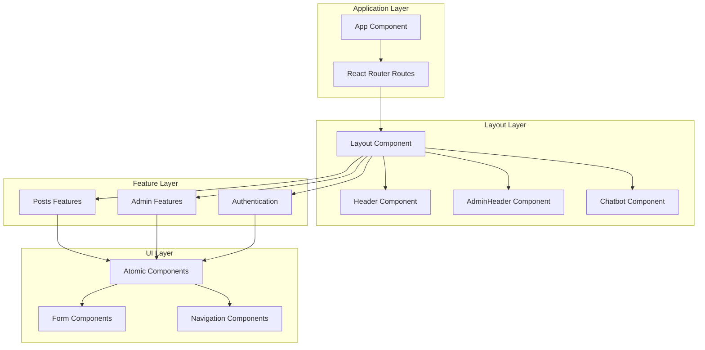
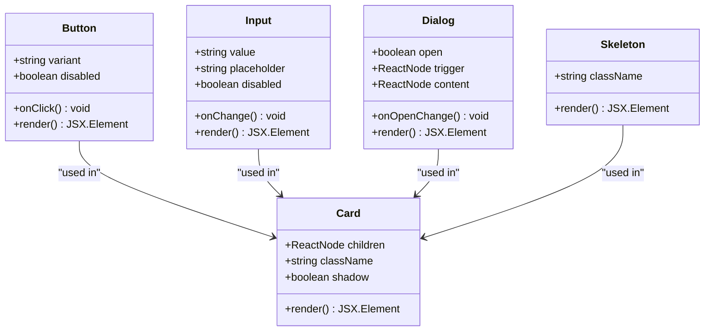
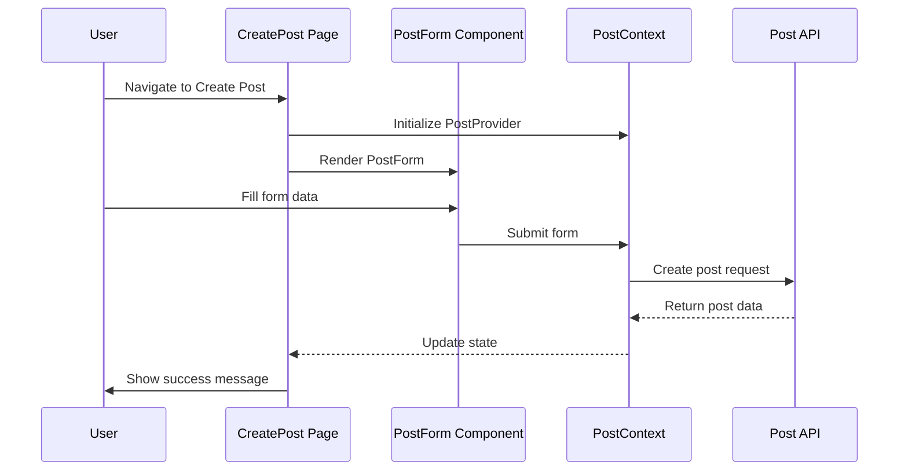
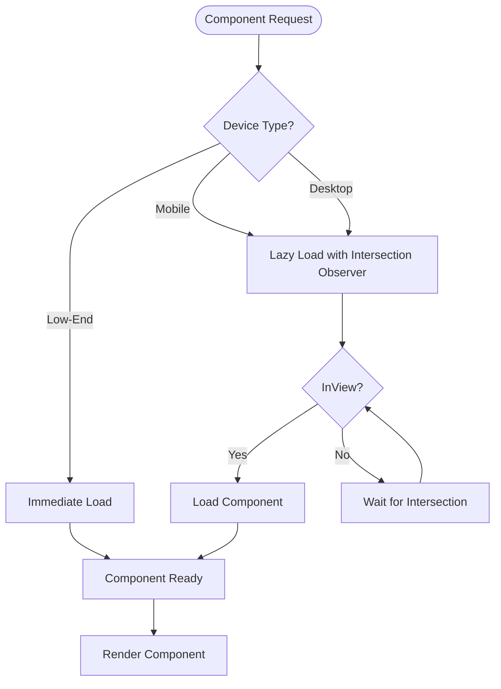
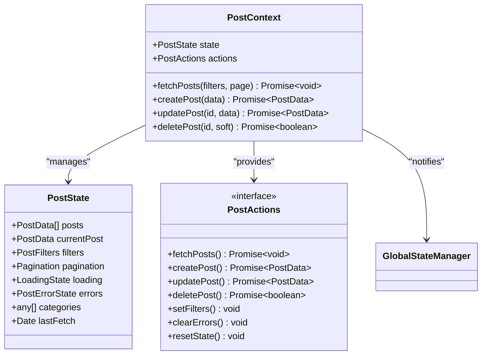
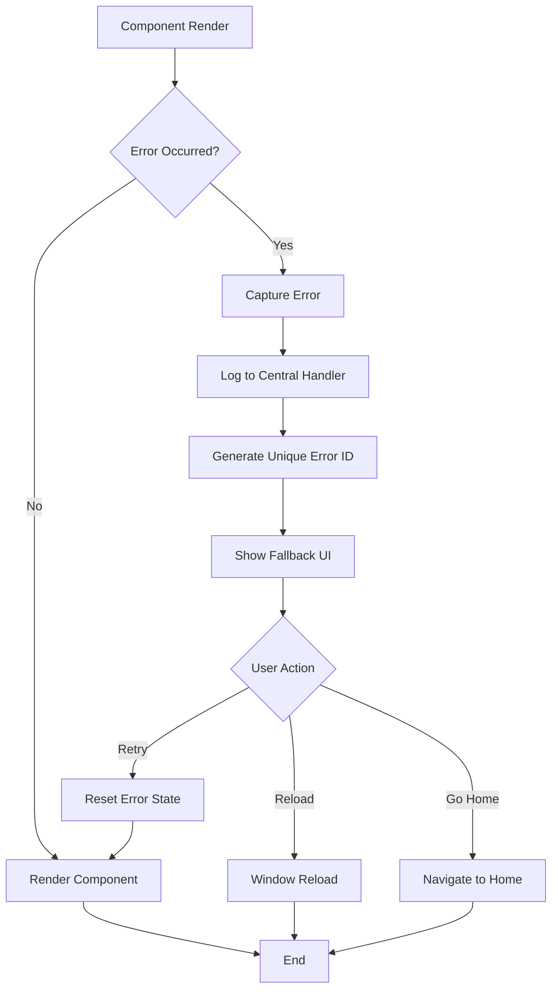

# Component Architecture

<cite>
**Referenced Files in This Document**
- [src/App.tsx](file://src/App.tsx)
- [src/components/Layout.tsx](file://src/components/Layout.tsx)
- [src/components/ErrorBoundary.tsx](file://src/components/ErrorBoundary.tsx)
- [src/utils/lazyComponents.ts](file://src/utils/lazyComponents.ts)
- [src/features/posts/pages/CreatePost.tsx](file://src/features/posts/pages/CreatePost.tsx)
- [src/features/posts/context/PostContext.tsx](file://src/features/posts/context/PostContext.tsx)
- [src/hooks/useLazyLoading.ts](file://src/hooks/useLazyLoading.ts)
- [src/components/ui/use-mobile.tsx](file://src/components/ui/use-mobile.tsx)
- [src/components/ui/LoadingSkeleton.tsx](file://src/components/ui/LoadingSkeleton.tsx)
- [src/components/ui/container.tsx](file://src/components/ui/container.tsx)
- [src/components/Featured.tsx](file://src/components/Featured.tsx)
- [src/components/LatestArticle.tsx](file://src/components/LatestArticle.tsx)
- [src/pages/AdminDashboard.tsx](file://src/pages/AdminDashboard.tsx)
- [src/types/PostType.ts](file://src/types/PostType.ts)
- [src/types/index.ts](file://src/types/index.ts)
</cite>

## Table of Contents
1. [Introduction](#introduction)
2. [Component Architecture Overview](#component-architecture-overview)
3. [Atomic UI Components](#atomic-ui-components)
4. [Feature-Specific Components](#feature-specific-components)
5. [Layout Components](#layout-components)
6. [Higher-Order Components](#higher-order-components)
7. [Routing and Navigation](#routing-and-navigation)
8. [Performance Optimization](#performance-optimization)
9. [State Management](#state-management)
10. [Error Handling](#error-handling)
11. [Component Organization Patterns](#component-organization-patterns)
12. [Best Practices](#best-practices)

## Introduction

The MERN_chatai_blog frontend follows a sophisticated component-based architecture built on React with TypeScript, emphasizing modularity, performance, and maintainability. The architecture is designed around three primary component categories: atomic UI components, feature-specific components, and layout components, each serving distinct purposes in the application's structure.

The component system leverages modern React patterns including context APIs, hooks, lazy loading, and error boundaries to create a robust, scalable, and user-friendly interface. The architecture prioritizes mobile-first design principles and implements comprehensive performance optimizations for diverse device capabilities.

## Component Architecture Overview

The application's component architecture is structured around a hierarchical system that promotes code reuse, separation of concerns, and maintainability. The architecture consists of three main layers:



**Diagram sources**
- [src/App.tsx](file://src/App.tsx#L1-L98)
- [src/components/Layout.tsx](file://src/components/Layout.tsx#L1-L22)

**Section sources**
- [src/App.tsx](file://src/App.tsx#L1-L98)
- [src/components/Layout.tsx](file://src/components/Layout.tsx#L1-L22)

## Atomic UI Components

Atomic UI components represent the foundational building blocks of the application, providing reusable, self-contained UI elements that handle specific visual and functional aspects. These components follow the atomic design principles and are designed to be highly composable and customizable.

### Core Atomic Components

The atomic component library includes essential UI primitives such as buttons, forms, navigation elements, and interactive components:



**Diagram sources**
- [src/components/ui/Button/Button.tsx](file://src/components/ui/Button/Button.tsx)
- [src/components/ui/input.tsx](file://src/components/ui/input.tsx)
- [src/components/ui/card.tsx](file://src/components/ui/card.tsx)
- [src/components/ui/dialog.tsx](file://src/components/ui/dialog.tsx)
- [src/components/ui/skeleton.tsx](file://src/components/ui/skeleton.tsx)

### Loading and Skeleton Components

The application implements sophisticated loading states through skeleton components that provide immediate feedback during data fetching operations:

```typescript
// Example of PostSkeleton variants
interface PostSkeletonProps {
  variant?: "default" | "featured" | "compact" | "list"
  className?: string
}

export function PostSkeleton({ variant = "default", className }: PostSkeletonProps) {
  // Implementation handles different layout variants
  // with appropriate skeleton animations
}
```

**Section sources**
- [src/components/ui/LoadingSkeleton.tsx](file://src/components/ui/LoadingSkeleton.tsx#L1-L207)

## Feature-Specific Components

Feature-specific components encapsulate complex functionality related to specific application domains, such as post management, user administration, and content creation. These components leverage the feature-based architecture pattern to organize related functionality.

### Post Management System

The post management system demonstrates advanced component composition and state management:



**Diagram sources**
- [src/features/posts/pages/CreatePost.tsx](file://src/features/posts/pages/CreatePost.tsx#L1-L105)
- [src/features/posts/context/PostContext.tsx](file://src/features/posts/context/PostContext.tsx#L1-L501)

### Post Creation Flow

The post creation process exemplifies the component hierarchy and state management patterns:

```typescript
// CreatePost.tsx - Enhanced post creation flow
export function CreatePost() {
  return (
    <PostProvider>
      <CreatePostContent />
    </PostProvider>
  );
}

function CreatePostContent() {
  const { navigateToPost, navigateToHome, validatePostId } = useNavigation();
  const { state, actions } = usePostContext();

  const handleSubmit = async (data: CreatePostInput | UpdatePostInput) => {
    try {
      const createData = data as CreatePostInput;
      const result = await actions.createPost(createData);
      
      if (result && result.id) {
        if (validatePostId(result.id)) {
          showSuccess('Article créé avec succès!');
          navigateToPost(result.id, { fallbackRoute: '/' });
        }
      }
    } catch (error) {
      console.error('Create post error:', error);
      showError('Une erreur inattendue s\'est produite.');
    }
  };
}
```

**Section sources**
- [src/features/posts/pages/CreatePost.tsx](file://src/features/posts/pages/CreatePost.tsx#L1-L105)
- [src/features/posts/context/PostContext.tsx](file://src/features/posts/context/PostContext.tsx#L1-L501)

## Layout Components

Layout components manage the overall structure and navigation flow of the application, providing consistent spacing, responsive design, and container management across different screen sizes.

### Container Component

The Container component serves as the primary layout wrapper, implementing responsive design principles:

```typescript
interface ContainerProps {
  children: React.ReactNode
  className?: string
  size?: "sm" | "md" | "lg" | "xl" | "full"
}

export function Container({ children, className, size = "lg" }: ContainerProps) {
  return (
    <div className={cn(
      "mx-auto w-full",
      "px-4 sm:px-6 lg:px-8",
      {
        "max-w-screen-sm": size === "sm",
        "max-w-screen-md": size === "md", 
        "max-w-screen-lg": size === "lg",
        "max-w-screen-xl": size === "xl",
        "max-w-full": size === "full",
      },
      "max-w-[100vw] min-w-0",
      "box-border",
      className,
    )}>
      <div className="w-full min-w-0">
        {children}
      </div>
    </div>
  )
}
```

### Layout Structure

The Layout component provides the foundation for page structure using React Router's Outlet pattern:

```typescript
const Layout: React.FC = () => {
  return (
    <main>
      <Header />
      <Outlet />
    </main>
  )
}
```

**Section sources**
- [src/components/ui/container.tsx](file://src/components/ui/container.tsx#L1-L39)
- [src/components/Layout.tsx](file://src/components/Layout.tsx#L1-L22)

## Higher-Order Components

The application implements several higher-order components and patterns that enhance functionality and promote code reusability across different contexts.

### Mobile Detection and Optimization

The mobile detection system adapts component behavior based on device capabilities:

```typescript
export function useIsMobile() {
  const [isMobile, setIsMobile] = React.useState<boolean | undefined>(undefined)

  React.useEffect(() => {
    const mql = window.matchMedia(`(max-width: ${MOBILE_BREAKPOINT - 1}px)`)
    const onChange = () => {
      setIsMobile(window.innerWidth < MOBILE_BREAKPOINT)
    }
    mql.addEventListener("change", onChange)
    setIsMobile(window.innerWidth < MOBILE_BREAKPOINT)
    return () => mql.removeEventListener("change", onChange)
  }, [])

  return !!isMobile
}
```

### Lazy Loading Pattern

The lazy loading system optimizes performance through conditional loading strategies:



**Diagram sources**
- [src/utils/lazyComponents.ts](file://src/utils/lazyComponents.ts#L1-L197)
- [src/hooks/useLazyLoading.ts](file://src/hooks/useLazyLoading.ts#L1-L178)

**Section sources**
- [src/components/ui/use-mobile.tsx](file://src/components/ui/use-mobile.tsx#L1-L20)
- [src/utils/lazyComponents.ts](file://src/utils/lazyComponents.ts#L1-L197)
- [src/hooks/useLazyLoading.ts](file://src/hooks/useLazyLoading.ts#L1-L178)

## Routing and Navigation

The application uses React Router for client-side navigation, with the Layout component serving as the primary routing container and Outlet providing dynamic content rendering.

### Route Structure

The main App component defines the routing structure with error boundaries for each major section:

```typescript
<Routes>
  <Route index element={<Home />} />
  <Route path="/category/:categoryId" element={<CategoryPage />} />
  <Route path="/Post/:id" element={<PostPage />} />
  <Route path="/create_post" element={<CreatePost />} />
  
  {/* New enhanced post management routes */}
  <Route path="/posts/create" element={<NewCreatePost />} />
  <Route path="/posts/edit/:id" element={<NewEditPost />} />
  <Route path="/posts/drafts" element={<Drafts />} />
  
  <Route path="/admin" element={<AdminDashboard />} />
  <Route path="/admin/content-filter" element={<ContentFilterAdmin />} />
</Routes>
```

### Navigation Context

The navigation system provides safe navigation with error handling and validation:

```typescript
const { navigateToPost, navigateToHome, validatePostId } = useNavigation();

const handleSubmit = async (data: CreatePostInput) => {
  const result = await actions.createPost(createData);
  
  if (result && result.id) {
    if (validatePostId(result.id)) {
      navigateToPost(result.id, { fallbackRoute: '/' });
    } else {
      navigateToHome({ replace: true });
    }
  }
};
```

**Section sources**
- [src/App.tsx](file://src/App.tsx#L1-L98)
- [src/features/posts/pages/CreatePost.tsx](file://src/features/posts/pages/CreatePost.tsx#L20-L40)

## Performance Optimization

The application implements comprehensive performance optimization strategies through lazy loading, mobile-specific optimizations, and resource management.

### Mobile-First Optimizations

The lazy loading system adapts to different device capabilities:

```typescript
export const createLazyComponent = <T extends ComponentType<any>>(
  importFn: () => Promise<{ default: T }>,
  fallback?: ComponentType
): ComponentType<any> => {
  // For low-end devices, load components immediately
  if (isLowEndDevice()) {
    let Component: T | null = null;
    importFn().then(module => {
      Component = module.default;
    });

    return (props: any) => {
      if (Component) {
        return React.createElement(Component, props);
      }
      return fallback ? React.createElement(fallback, props) : null;
    };
  }

  return lazy(importFn);
};
```

### Preloading Strategies

The system implements intelligent preloading for critical components:

```typescript
export const preloadCriticalComponents = () => {
  if (isMobileDevice()) {
    // Preload essential components for mobile users
    import('../components/SafeImage').catch(console.error);
    import('../features/posts/components/PostList/PostCard').catch(console.error);
    import('../components/ui/container').catch(console.error);
  }
};
```

### Performance Monitoring

The system includes comprehensive performance monitoring:

```typescript
export const initPerformanceOptimizations = () => {
  // Add resource hints
  addResourceHints();

  // Preload critical components
  preloadCriticalComponents();

  // Performance monitoring with proper type casting
  if ('performance' in window && 'PerformanceObserver' in window) {
    const observer = new PerformanceObserver(list => {
      const entries = list.getEntries();
      entries.forEach(entry => {
        if (entry.entryType === 'largest-contentful-paint') {
          console.log('LCP:', entry.startTime);
        }
        if (entry.entryType === 'first-input') {
          const fidEntry = entry as any;
          if (fidEntry.processingStart) {
            console.log('FID:', fidEntry.processingStart - entry.startTime);
          }
        }
      });
    });

    observer.observe({ 
      entryTypes: ['largest-contentful-paint', 'first-input', 'layout-shift'] 
    });
  }
};
```

**Section sources**
- [src/utils/lazyComponents.ts](file://src/utils/lazyComponents.ts#L1-L197)

## State Management

The application employs a sophisticated state management system using React Context APIs and custom hooks to handle complex state scenarios across different features.

### Post Context Architecture

The PostContext demonstrates advanced state management with global state synchronization:



**Diagram sources**
- [src/features/posts/context/PostContext.tsx](file://src/features/posts/context/PostContext.tsx#L1-L501)

### State Synchronization

The context integrates with global state management for cross-component synchronization:

```typescript
const createPost = useCallback(async (data: CreatePostInput): Promise<PostData | null> => {
  try {
    setLoading({ isCreating: true });
    clearErrors();

    const result = await apiService.createPost(data);
    
    if (result.success && result.data) {
      dispatch({ type: 'ADD_POST', payload: result.data });
      
      // Notify global state manager about the creation
      globalStateManager.notifyPostCreation(result.data);
      
      // Force immediate cache invalidation
      globalStateManager.notifyCacheInvalidation('all', 'post-created');
      
      return result.data;
    }
  } finally {
    setLoading({ isCreating: false });
  }
}, [apiService, setLoading, clearErrors, setError]);
```

**Section sources**
- [src/features/posts/context/PostContext.tsx](file://src/features/posts/context/PostContext.tsx#L1-L501)

## Error Handling

The application implements a comprehensive error handling system through ErrorBoundary components that provide graceful degradation and user-friendly error experiences.

### ErrorBoundary Implementation

The ErrorBoundary component captures React errors and provides fallback UI:



**Diagram sources**
- [src/components/ErrorBoundary.tsx](file://src/components/ErrorBoundary.tsx#L1-L183)

### Error Context and Reporting

The error handling system includes comprehensive context capture:

```typescript
componentDidCatch(error: Error, errorInfo: ErrorInfo) {
  const context: ErrorContext = {
    component: errorInfo.componentStack?.split('\n')[1]?.trim() || 'Unknown',
    action: 'react_error',
    timestamp: new Date(),
    userAgent: navigator.userAgent,
    ...this.props.context
  };

  const userFriendlyError = errorHandler.handleError(error, 'UNKNOWN_ERROR', {
    context,
    logToConsole: true,
    showToUser: true
  });
}
```

### Error Recovery Options

The ErrorBoundary provides multiple recovery options for users:

```typescript
handleRetry = () => {
  this.setState({
    hasError: false,
    error: null,
    errorId: null
  })
}

handleReload = () => {
  window.location.reload()
}

handleGoHome = () => {
  window.location.href = '/'
}
```

**Section sources**
- [src/components/ErrorBoundary.tsx](file://src/components/ErrorBoundary.tsx#L1-L183)

## Component Organization Patterns

The application follows established patterns for organizing components, promoting consistency and maintainability across the codebase.

### Feature-Based Organization

Components are organized by feature domains, with clear separation of concerns:

```
src/
├── components/           # Atomic UI components
│   ├── ui/             # Reusable UI primitives
│   ├── admin/          # Admin-specific components
│   └── contexts/       # Context providers
├── features/           # Feature-specific components
│   ├── posts/          # Post management features
│   │   ├── components/ # Post-related components
│   │   ├── pages/      # Feature pages
│   │   ├── context/    # Feature context
│   │   └── hooks/      # Feature-specific hooks
│   └── users/          # User management features
├── pages/              # Top-level pages
└── hooks/              # Generic hooks
```

### Naming Conventions

The application follows consistent naming patterns:

- **Components**: PascalCase (e.g., `PostForm`, `AdminDashboard`)
- **Files**: PascalCase for components, kebab-case for utilities (e.g., `post-form.tsx`, `lazy-loading.ts`)
- **Contexts**: Descriptive names ending with `Context` (e.g., `PostContext`, `ErrorContext`)
- **Hooks**: Descriptive names starting with `use` (e.g., `useLazyLoading`, `usePostContext`)

### Component Composition Patterns

The application demonstrates several composition patterns:

```typescript
// Provider pattern for state management
export function CreatePost() {
  return (
    <PostProvider>
      <CreatePostContent />
    </PostProvider>
  );
}

// Higher-order component pattern
const Layout: React.FC = () => {
  return (
    <main>
      <Header />
      <Outlet />
    </main>
  )
}

// Conditional rendering pattern
{!isAdminRoute && (
  <ErrorBoundary context={{ component: 'Header', action: 'render' }}>
    <Header />
  </ErrorBoundary>
)}
```

**Section sources**
- [src/App.tsx](file://src/App.tsx#L1-L98)
- [src/features/posts/pages/CreatePost.tsx](file://src/features/posts/pages/CreatePost.tsx#L1-L10)
- [src/components/Layout.tsx](file://src/components/Layout.tsx#L1-L22)

## Best Practices

The component architecture incorporates several best practices that ensure maintainability, scalability, and developer experience.

### Component Design Principles

1. **Single Responsibility**: Each component has a clear, focused purpose
2. **Composition over Inheritance**: Components are composed rather than extended
3. **Props Interface**: All components define clear prop interfaces
4. **TypeScript Integration**: Comprehensive type safety across the component hierarchy

### Performance Guidelines

1. **Lazy Loading**: Heavy components are loaded on-demand
2. **Conditional Rendering**: Components are only rendered when needed
3. **Memoization**: Expensive computations are memoized using React.memo
4. **Intersection Observer**: Components are loaded when they become visible

### Accessibility Standards

The component system adheres to accessibility guidelines:

```typescript
// Example from Featured component
<Link to={`/Post/${_id}`} className="no-underline">
  <Button>
    Read Full Article
    <svg className="h-4 w-4 ml-2" viewBox="0 0 24 24" stroke="currentColor">
      <path strokeLinecap="round" strokeLinejoin="round" strokeWidth={2} d="M14 5l7 7m0 0l-7 7m7-7H3" />
    </svg>
  </Button>
</Link>
```

### Testing Strategy

Components are designed with testing in mind:

- **Pure Functions**: Business logic is separated from presentation
- **Props Interfaces**: Clear contract for component interaction
- **Hook Abstraction**: Custom hooks enable easy testing
- **Error Boundaries**: Graceful error handling for testing scenarios

### Code Organization

The architecture promotes clean code organization:

```typescript
// Clear import structure
import React, { useEffect } from 'react';
import { PostForm } from '../components/PostForm';
import { PostProvider, usePostContext } from '../context/PostContext';
import { CreatePostInput, UpdatePostInput } from '../types/post.types';

// Consistent export patterns
export function CreatePost() {
  return (
    <PostProvider>
      <CreatePostContent />
    </PostProvider>
  );
}
```

### Mobile-First Design

All components are designed with mobile-first principles:

- Responsive breakpoints are defined in the Container component
- Touch-friendly interaction areas
- Optimized touch targets
- Performance considerations for mobile devices

The component architecture of MERN_chatai_blog demonstrates a mature, well-structured approach to React development that balances functionality, performance, and maintainability. Through careful organization, thoughtful design patterns, and comprehensive optimization strategies, the application provides a robust foundation for future development and scaling.