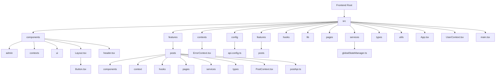
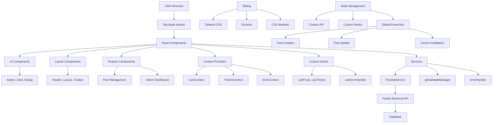
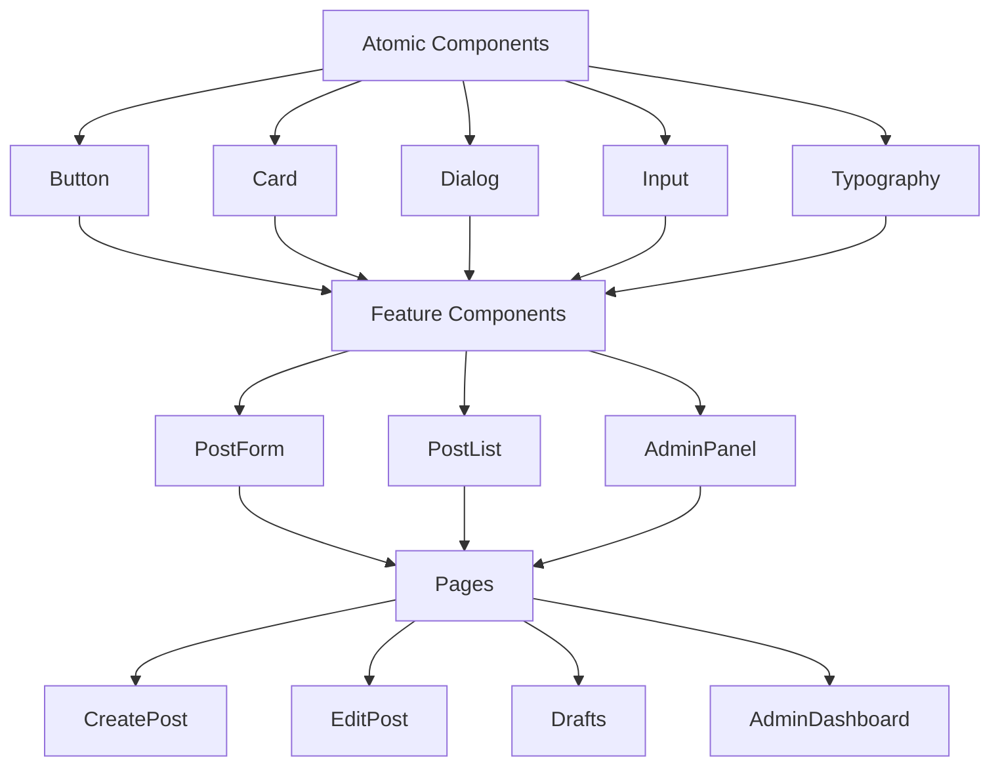
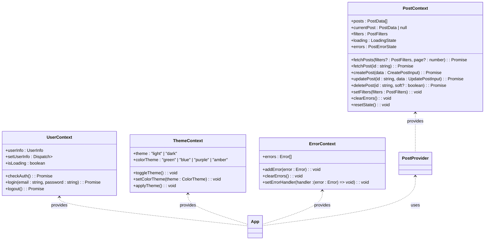
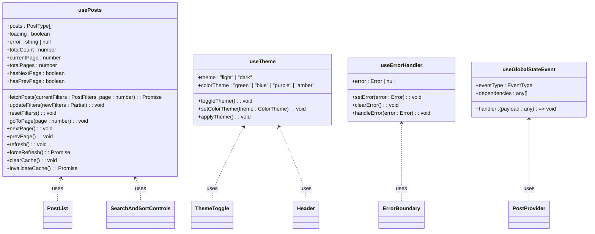
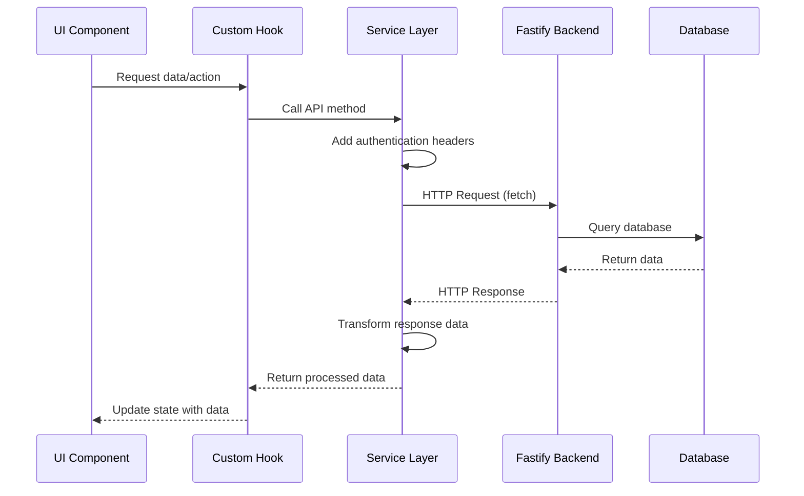
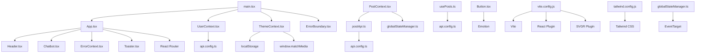

# Frontend Architecture

<cite>
**Referenced Files in This Document**   
- [main.tsx](file://src/main.tsx)
- [App.tsx](file://src/App.tsx)
- [UserContext.tsx](file://src/UserContext.tsx)
- [ThemeContext.tsx](file://src/components/contexts/ThemeContext.tsx)
- [api.config.ts](file://src/config/api.config.ts)
- [vite.config.js](file://vite.config.js)
- [tailwind.config.js](file://tailwind.config.js)
- [PostContext.tsx](file://src/features/posts/context/PostContext.tsx)
- [globalStateManager.ts](file://src/services/globalStateManager.ts)
- [postApi.ts](file://src/features/posts/services/postApi.ts)
- [usePosts.ts](file://src/hooks/usePosts.ts)
- [Layout.tsx](file://src/components/Layout.tsx)
- [Button.tsx](file://src/components/ui/button/Button.tsx)
</cite>

## Table of Contents
1. [Introduction](#introduction)
2. [Project Structure](#project-structure)
3. [Core Components](#core-components)
4. [Architecture Overview](#architecture-overview)
5. [Detailed Component Analysis](#detailed-component-analysis)
6. [Dependency Analysis](#dependency-analysis)
7. [Performance Considerations](#performance-considerations)
8. [Troubleshooting Guide](#troubleshooting-guide)
9. [Conclusion](#conclusion)

## Introduction
The MERN_chatai_blog frontend is a React-based application that implements a component-driven architecture with TypeScript for type safety and Vite as the build tool. The system follows modern React patterns including component composition, context API for state management, and custom hooks for reusable logic. The architecture is designed to provide a responsive, accessible user interface with robust error handling and theming capabilities. This document provides a comprehensive overview of the frontend architecture, detailing component interactions, data flows, and integration patterns with the Fastify backend API.

## Project Structure

**Diagram sources**
- [src](file://src)
- [components](file://src/components)
- [features/posts](file://src/features/posts)
- [hooks](file://src/hooks)
- [pages](file://src/pages)

**Section sources**
- [src](file://src)
- [vite.config.js](file://vite.config.js)

## Core Components

The frontend architecture is built around several core components that provide the foundation for the application's functionality. The main entry point is `main.tsx`, which initializes the React application with essential providers including theme, user context, and error boundary. The `App.tsx` component serves as the root component that defines the application's routing structure and layout. Key architectural components include context providers for user authentication and theme management, which enable global state access across the component tree. The system also implements a comprehensive UI component library in the `components/ui` directory, providing reusable, accessible components with consistent styling.

**Section sources**
- [main.tsx](file://src/main.tsx#L1-L98)
- [App.tsx](file://src/App.tsx#L1-L97)
- [UserContext.tsx](file://src/UserContext.tsx#L1-L311)
- [ThemeContext.tsx](file://src/components/contexts/ThemeContext.tsx#L1-L235)

## Architecture Overview

**Diagram sources**
- [main.tsx](file://src/main.tsx#L1-L98)
- [App.tsx](file://src/App.tsx#L1-L97)
- [globalStateManager.ts](file://src/services/globalStateManager.ts#L1-L172)
- [postApi.ts](file://src/features/posts/services/postApi.ts#L1-L604)

## Detailed Component Analysis

### Component Composition and Architecture

The application follows a component-based architecture with a clear separation of concerns. Components are organized into logical directories based on their functionality and scope. The architecture implements a hierarchical structure with atomic components in the `components/ui` directory that serve as building blocks for more complex feature components.

**Diagram sources**
- [Button.tsx](file://src/components/ui/button/Button.tsx#L1-L114)
- [PostContext.tsx](file://src/features/posts/context/PostContext.tsx#L1-L500)
- [Layout.tsx](file://src/components/Layout.tsx#L1-L21)

#### Context API for State Management
The application implements a context-based state management system using React's Context API. This approach provides global state access without the need for prop drilling. The architecture includes multiple context providers that manage different aspects of the application state.

**Diagram sources**
- [UserContext.tsx](file://src/UserContext.tsx#L1-L311)
- [ThemeContext.tsx](file://src/components/contexts/ThemeContext.tsx#L1-L235)
- [PostContext.tsx](file://src/features/posts/context/PostContext.tsx#L1-L500)

#### Custom Hooks for Reusable Logic
The application implements a comprehensive system of custom hooks that encapsulate reusable logic and state management patterns. These hooks provide a clean separation between presentation and logic, making components more focused and easier to test.

**Diagram sources**
- [usePosts.ts](file://src/hooks/usePosts.ts#L1-L274)
- [ThemeContext.tsx](file://src/components/contexts/ThemeContext.tsx#L1-L235)
- [globalStateManager.ts](file://src/services/globalStateManager.ts#L1-L172)

### System Boundaries and API Integration

The frontend application communicates with the Fastify backend through a well-defined API boundary. The integration is managed through a service layer that handles HTTP requests, authentication, and data transformation.

**Diagram sources**
- [postApi.ts](file://src/features/posts/services/postApi.ts#L1-L604)
- [api.config.ts](file://src/config/api.config.ts#L1-L272)

## Dependency Analysis

**Diagram sources**
- [main.tsx](file://src/main.tsx#L1-L98)
- [App.tsx](file://src/App.tsx#L1-L97)
- [UserContext.tsx](file://src/UserContext.tsx#L1-L311)
- [ThemeContext.tsx](file://src/components/contexts/ThemeContext.tsx#L1-L235)
- [PostContext.tsx](file://src/features/posts/context/PostContext.tsx#L1-L500)
- [postApi.ts](file://src/features/posts/services/postApi.ts#L1-L604)
- [usePosts.ts](file://src/hooks/usePosts.ts#L1-L274)
- [vite.config.js](file://vite.config.js#L1-L40)
- [tailwind.config.js](file://tailwind.config.js#L1-L170)

**Section sources**
- [package.json](file://package.json#L1-L114)
- [vite.config.js](file://vite.config.js#L1-L40)
- [tailwind.config.js](file://tailwind.config.js#L1-L170)

## Performance Considerations

The application implements several performance optimization strategies to ensure a responsive user experience. These include code splitting, lazy loading of components, and efficient state management. The Vite build tool provides fast development server startup and hot module replacement. The application uses React's memoization techniques to prevent unnecessary re-renders, and implements caching strategies for API responses to reduce network requests. Image optimization is handled through the `getImageUrl` and `getOptimizedImageUrl` functions in the `api.config.ts` file, which provide fallback mechanisms and optimized image delivery. The global state manager uses an event bus pattern to minimize direct component dependencies and reduce re-renders across the application.

**Section sources**
- [main.tsx](file://src/main.tsx#L1-L98)
- [utils/mobileOptimizations.ts](file://src/utils/mobileOptimizations.ts)
- [utils/lazyComponents.ts](file://src/utils/lazyComponents.ts)
- [api.config.ts](file://src/config/api.config.ts#L1-L272)

## Troubleshooting Guide

The application includes comprehensive error handling and debugging capabilities. The error boundary component wraps the entire application and individual critical components to catch and handle runtime errors. The `ErrorContext` provides a centralized mechanism for managing and displaying application errors. The `globalStateManager` includes debugging capabilities in development mode to track event listeners and state changes. API error handling is implemented in the service layer with detailed error logging and user-friendly error messages. The theme context includes error handling for localStorage access and theme application failures. The authentication system includes robust error handling for login, logout, and session verification operations.

**Section sources**
- [ErrorBoundary.tsx](file://src/components/ErrorBoundary.tsx)
- [errorHandler.ts](file://src/services/errorHandler.ts)
- [UserContext.tsx](file://src/UserContext.tsx#L1-L311)
- [ThemeContext.tsx](file://src/components/contexts/ThemeContext.tsx#L1-L235)
- [globalStateManager.ts](file://src/services/globalStateManager.ts#L1-L172)

## Conclusion

The MERN_chatai_blog frontend architecture demonstrates a well-structured React application with modern development practices. The component-based design, combined with TypeScript for type safety and Vite for efficient builds, creates a maintainable and scalable codebase. The context API and custom hooks provide effective state management without the complexity of external state management libraries. The integration with the Fastify backend is clean and well-defined, with proper error handling and data transformation. The theming system supports both light/dark mode and color theme customization, enhancing user experience. The application's performance optimizations and error handling mechanisms contribute to a robust and user-friendly interface. This architecture provides a solid foundation for future enhancements and feature additions.