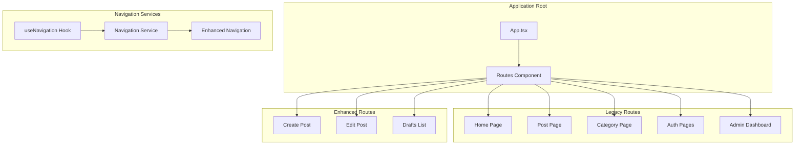
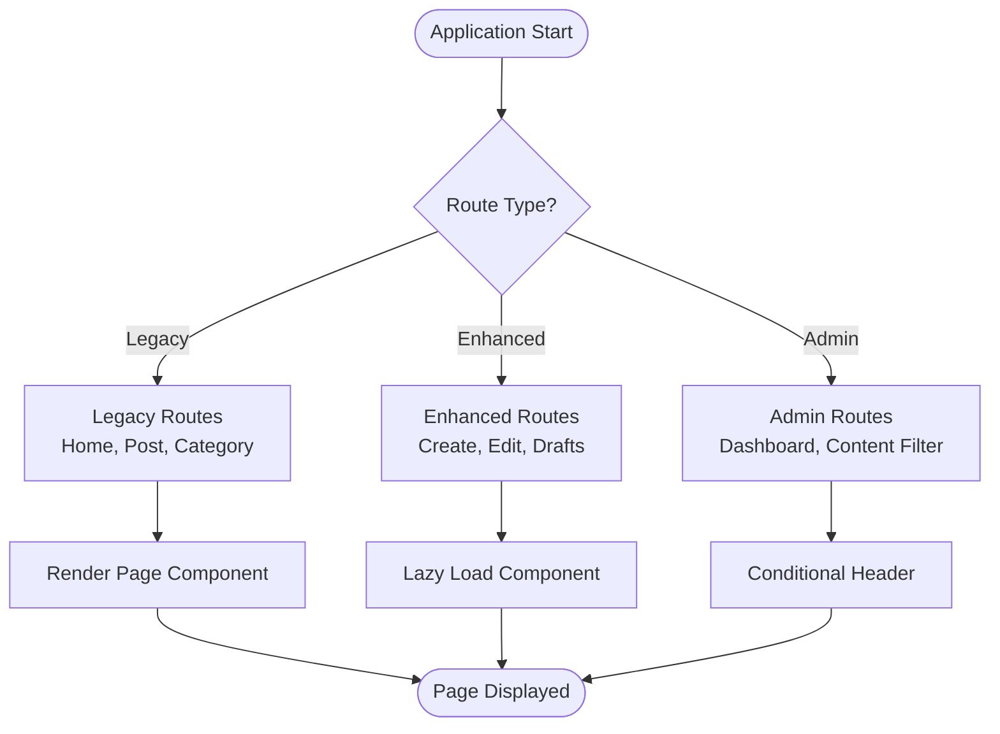
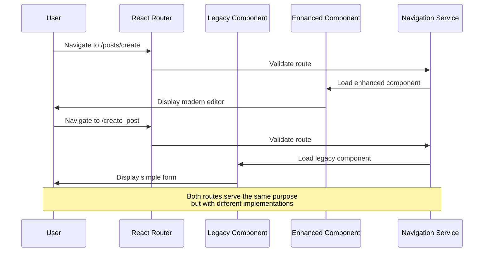
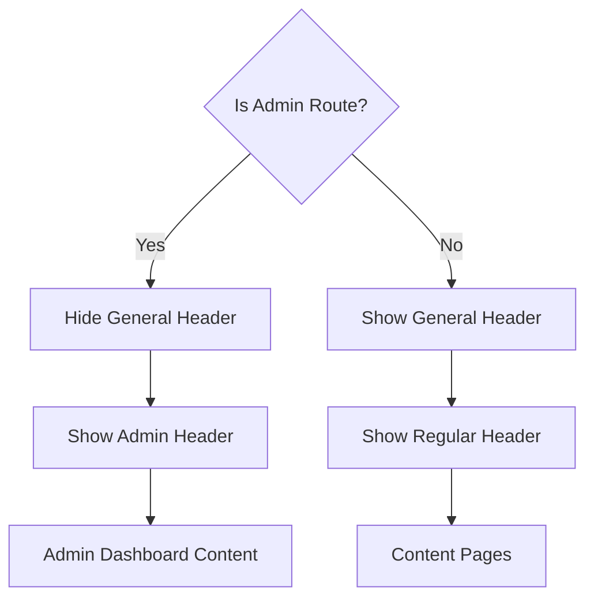
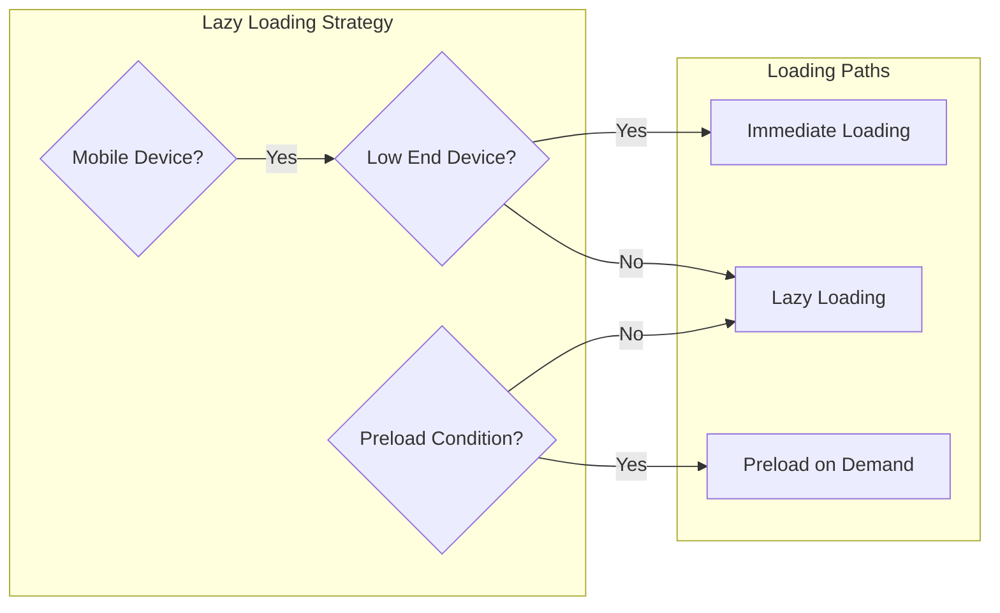
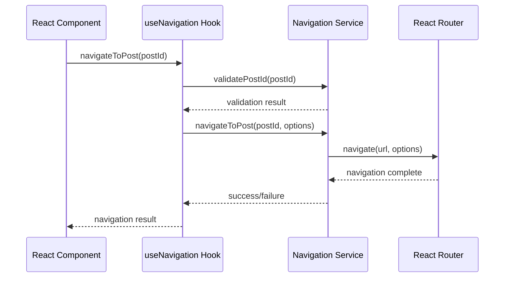
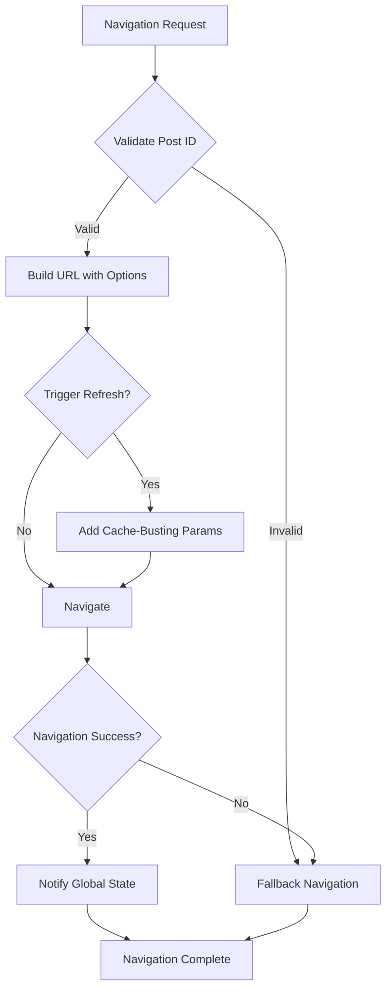
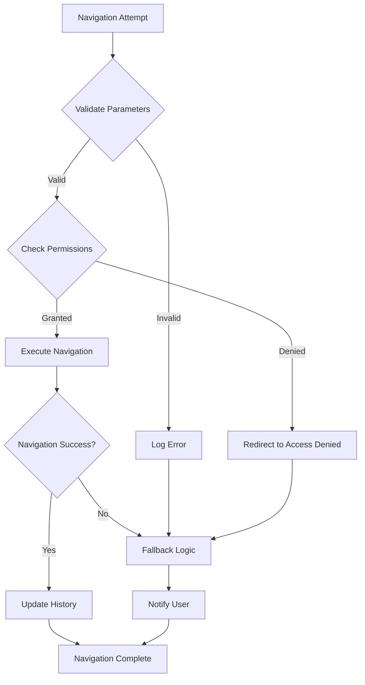

# Routing & Navigation System

<cite>
**Referenced Files in This Document**
- [src/App.tsx](file://src/App.tsx)
- [src/hooks/useNavigation.ts](file://src/hooks/useNavigation.ts)
- [src/utils/lazyComponents.ts](file://src/utils/lazyComponents.ts)
- [src/features/posts/services/navigationService.ts](file://src/features/posts/services/navigationService.ts)
- [src/features/posts/hooks/useNavigation.ts](file://src/features/posts/hooks/useNavigation.ts)
- [src/services/enhancedNavigationService.ts](file://src/services/enhancedNavigationService.ts)
- [src/pages/Post.tsx](file://src/pages/Post.tsx)
- [src/pages/Home.tsx](file://src/pages/Home.tsx)
- [src/types/PostType.ts](file://src/types/PostType.ts)
- [src/services/globalStateManager.ts](file://src/services/globalStateManager.ts)
</cite>

## Table of Contents
1. [Introduction](#introduction)
2. [React Router Implementation](#react-router-implementation)
3. [Route Definitions and Path Structures](#route-definitions-and-path-structures)
4. [Nested Routing Patterns](#nested-routing-patterns)
5. [Legacy vs Enhanced Post Management](#legacy-vs-enhanced-post-management)
6. [Conditional Header Rendering](#conditional-header-rendering)
7. [Route Protection and Access Control](#route-protection-and-access-control)
8. [Lazy Loading Implementation](#lazy-loading-implementation)
9. [Custom Navigation Hooks](#custom-navigation-hooks)
10. [Enhanced Navigation Services](#enhanced-navigation-services)
11. [Route Parameters and Usage](#route-parameters-and-usage)
12. [Navigation Guards and Error Handling](#navigation-guards-and-error-handling)
13. [Accessibility Considerations](#accessibility-considerations)
14. [Performance Optimizations](#performance-optimizations)
15. [Troubleshooting Guide](#troubleshooting-guide)
16. [Conclusion](#conclusion)

## Introduction

The MERN_chatai_blog application implements a sophisticated routing and navigation system built on React Router DOM. The system features a dual-route architecture that seamlessly transitions between legacy and modern post management interfaces while maintaining backward compatibility and providing enhanced user experiences through lazy loading and intelligent navigation services.

The routing system is designed with modularity and scalability in mind, featuring separate route configurations for traditional blog pages and modern React-based post management features. This architecture allows for gradual migration of functionality while ensuring smooth user experiences across all navigation scenarios.

## React Router Implementation

The application's routing infrastructure is centered around React Router DOM, utilizing modern routing patterns and advanced features to deliver a responsive and efficient navigation experience.



**Diagram sources**
- [src/App.tsx](file://src/App.tsx#L1-L98)
- [src/hooks/useNavigation.ts](file://src/hooks/useNavigation.ts#L1-L173)

The routing system is implemented in the main `App.tsx` component, which serves as the central hub for all application navigation. The component utilizes React Router's declarative routing approach to define all available routes and their corresponding page components.

**Section sources**
- [src/App.tsx](file://src/App.tsx#L1-L98)

## Route Definitions and Path Structures

The application defines a comprehensive set of routes that cater to different user needs and functional areas. The route structure follows a logical organization that separates content consumption from content creation and administration.

### Core Route Categories

The routing system organizes pages into several distinct categories:

**Content Consumption Routes:**
- `/` - Home page displaying featured and recent posts
- `/Post/:id` - Individual post viewing with dynamic ID parameter
- `/category/:categoryId` - Category-specific post listings
- `/search` - Advanced search functionality

**Authentication Routes:**
- `/register_page` - User registration interface
- `/login_page` - User authentication
- `/forgot_password` - Password recovery
- `/reset-password/:resetToken` - Password reset with token parameter

**Content Creation Routes:**
- `/create_post` - Legacy post creation interface
- `/posts/create` - Modern enhanced post creation
- `/posts/edit/:id` - Post editing with dynamic ID
- `/posts/drafts` - Draft management interface

**Administrative Routes:**
- `/admin` - Administrative dashboard
- `/admin/content-filter` - Content filtering administration
- `/create_category` - Category creation
- `/deleteCategory` - Category deletion



**Diagram sources**
- [src/App.tsx](file://src/App.tsx#L40-L75)

**Section sources**
- [src/App.tsx](file://src/App.tsx#L40-L75)

## Nested Routing Patterns

The application employs sophisticated nested routing patterns to organize related functionality and maintain clean URL structures. The routing system supports both flat and hierarchical navigation patterns depending on the complexity of the user journey.

### Route Hierarchy Structure

The routing system implements a clear hierarchy that reflects the application's functional organization:

1. **Root Level Routes** - Primary application sections
2. **Feature-Specific Routes** - Grouped by functional area
3. **Parameterized Routes** - Dynamic content identification
4. **Sub-Routes** - Secondary navigation within features

### Parameterized Route Patterns

The system extensively uses parameterized routes to enable dynamic content loading:

**Post Management Parameters:**
- `:id` - Unique identifier for posts and drafts
- `:categoryId` - Category association for filtering
- `:resetToken` - Authentication token for password resets

**Section sources**
- [src/App.tsx](file://src/App.tsx#L50-L65)

## Legacy vs Enhanced Post Management

One of the most significant architectural decisions in the routing system is the coexistence of legacy and enhanced post management interfaces. This dual-approach strategy enables gradual migration while maintaining backward compatibility.

### Legacy Post Management Routes

Traditional post management functionality remains accessible through dedicated legacy routes:

- **Create Post**: `/create_post` - Simple form-based creation
- **Post Viewing**: `/Post/:id` - Standard post display with comments
- **Category Management**: `/category/:categoryId` - Category-specific content

### Enhanced Post Management Routes

Modern React-based interfaces offer improved user experiences:

- **Enhanced Create**: `/posts/create` - Advanced editor with real-time preview
- **Advanced Editing**: `/posts/edit/:id` - Rich editing capabilities
- **Draft Management**: `/posts/drafts` - Comprehensive draft organization



**Diagram sources**
- [src/App.tsx](file://src/App.tsx#L55-L60)
- [src/features/posts/services/navigationService.ts](file://src/features/posts/services/navigationService.ts#L1-L50)

**Section sources**
- [src/App.tsx](file://src/App.tsx#L55-L60)
- [src/features/posts/services/navigationService.ts](file://src/features/posts/services/navigationService.ts#L1-L208)

## Conditional Header Rendering

The application implements intelligent conditional header rendering based on the current route. This approach optimizes user experience by displaying appropriate navigation elements for each section of the application.

### Admin Route Detection Logic

The header visibility logic is implemented through pathname analysis:

```typescript
const isAdminRoute = location.pathname.startsWith("/admin")
```

This simple yet effective approach ensures that:
- General navigation appears on content consumption pages
- Administrative controls are reserved for admin sections
- Consistent user experience across different application modes

### Conditional Rendering Implementation

The header rendering logic demonstrates the application's thoughtful approach to UI composition:



**Diagram sources**
- [src/App.tsx](file://src/App.tsx#L25-L35)

**Section sources**
- [src/App.tsx](file://src/App.tsx#L25-L35)

## Route Protection and Access Control

While the current implementation focuses on conditional rendering rather than strict route protection, the routing system provides the foundation for implementing access control mechanisms.

### Current Access Patterns

The application currently manages access through:
- **Conditional Rendering**: Based on route type and user context
- **Context-Based Logic**: User authentication state influences component behavior
- **Feature Flags**: Different functionality exposed based on route selection

### Future Enhancement Opportunities

The routing architecture supports future access control implementations through:
- **Middleware Integration**: React Router middleware for authentication checks
- **Protected Route Components**: Higher-order components for route protection
- **Role-Based Access**: Permission-based route availability

**Section sources**
- [src/App.tsx](file://src/App.tsx#L25-L35)

## Lazy Loading Implementation

The application implements sophisticated lazy loading strategies to optimize performance, particularly for mobile devices and less frequently accessed components.

### Lazy Component Factory

The `lazyComponents.ts` utility provides a factory pattern for creating optimized lazy-loaded components:

```typescript
export const createLazyComponent = <T extends ComponentType<any>>(
  importFn: () => Promise<{ default: T }>,
  fallback?: ComponentType
): ComponentType<any> => {
  // Mobile-specific optimizations
  if (isLowEndDevice()) {
    // Immediate loading for low-end devices
    let Component: T | null = null;
    importFn().then(module => {
      Component = module.default;
    });
    
    return (props: any) => {
      if (Component) {
        return React.createElement(Component, props);
      }
      return fallback ? React.createElement(fallback, props) : null;
    };
  }
  
  return lazy(importFn);
};
```

### Component-Specific Lazy Loading

Different components receive tailored lazy loading treatment:

**Critical Components**:
- Home page - Immediately loaded for optimal user experience
- Post components - Lazy loaded with mobile optimizations
- Essential forms - Preloaded based on user interaction patterns

**Admin Components**:
- Content filter admin - Lazy loaded only when needed
- User management - Loaded on demand for administrative tasks



**Diagram sources**
- [src/utils/lazyComponents.ts](file://src/utils/lazyComponents.ts#L10-L30)

**Section sources**
- [src/utils/lazyComponents.ts](file://src/utils/lazyComponents.ts#L1-L197)

## Custom Navigation Hooks

The application provides specialized navigation hooks that encapsulate complex navigation logic and provide consistent navigation patterns across the application.

### useNavigation Hook Architecture

The primary navigation hook offers comprehensive navigation capabilities:

```typescript
interface UseNavigationReturn {
  navigateTo: (path: string, options?: { replace?: boolean; state?: any }) => void
  navigateBack: () => void
  navigateToPost: (postId: string) => void
  navigateToCategory: (categoryId: string) => void
  navigateToHome: () => void
  navigateToLogin: () => void
  navigateToRegister: () => void
  navigateToAdmin: () => void
  navigateToCreatePost: () => void
  navigateToEditPost: (postId: string) => void
  navigateToDrafts: () => void
  currentPath: string
}
```

### Navigation Service Integration

The hook integrates with specialized navigation services for enhanced functionality:



**Diagram sources**
- [src/hooks/useNavigation.ts](file://src/hooks/useNavigation.ts#L20-L50)
- [src/features/posts/services/navigationService.ts](file://src/features/posts/services/navigationService.ts#L40-L80)

**Section sources**
- [src/hooks/useNavigation.ts](file://src/hooks/useNavigation.ts#L1-L173)
- [src/features/posts/services/navigationService.ts](file://src/features/posts/services/navigationService.ts#L1-L208)

## Enhanced Navigation Services

The application implements multiple navigation services that provide specialized functionality for different navigation scenarios.

### Navigation Service Features

The basic navigation service provides:
- **Post ID Validation**: Ensures valid identifiers before navigation
- **Route Validation**: Checks route format and prevents invalid navigation
- **Fallback Handling**: Graceful error recovery with fallback routes
- **Centralized Error Handling**: Consistent error management across navigation attempts

### Enhanced Navigation Service

The enhanced navigation service adds advanced features:

```typescript
export interface NavigationOptions {
  triggerRefresh?: boolean;
  replaceState?: boolean;
  source?: 'edit' | 'create' | 'publish';
  fallbackRoute?: string;
}

export interface HomeNavigationOptions {
  refreshPostList?: boolean;
  replaceState?: boolean;
}
```

### Smart Navigation Capabilities

The enhanced service provides:
- **Cache-Busting**: Automatic cache invalidation for fresh content
- **State Synchronization**: Maintains application state during navigation
- **Source Tracking**: Analytics and debugging support
- **Global State Integration**: Seamless coordination with application state



**Diagram sources**
- [src/services/enhancedNavigationService.ts](file://src/services/enhancedNavigationService.ts#L40-L80)

**Section sources**
- [src/services/enhancedNavigationService.ts](file://src/services/enhancedNavigationService.ts#L1-L267)

## Route Parameters and Usage

The application extensively uses route parameters to enable dynamic content loading and maintain clean, SEO-friendly URLs.

### Parameter Types and Usage Patterns

**Post ID Parameters**:
- Used in `/Post/:id` for individual post viewing
- Applied in `/posts/edit/:id` for post editing
- Integrated with navigation services for validation

**Category Parameters**:
- Implemented in `/category/:categoryId` for category filtering
- Supports both numeric and slug-based category identification

**Authentication Parameters**:
- Used in `/reset-password/:resetToken` for secure password resets
- Implements token-based authentication flows

### Parameter Validation Strategies

The navigation system implements robust parameter validation:

```typescript
private validatePostId(postId: string | undefined | null): boolean {
  if (!postId || typeof postId !== 'string') return false;
  
  const objectIdPattern = /^[0-9a-fA-F]{24}$/;
  const uuidPattern = /^[0-9a-f]{8}-[0-9a-f]{4}-[1-5][0-9a-f]{3}-[89ab][0-9a-f]{3}-[0-9a-f]{12}$/i;
  const shortIdPattern = /^[a-zA-Z0-9_-]{6,}$/;
  
  return objectIdPattern.test(postId) || uuidPattern.test(postId) || shortIdPattern.test(postId);
}
```

**Section sources**
- [src/services/enhancedNavigationService.ts](file://src/services/enhancedNavigationService.ts#L30-L50)
- [src/pages/Post.tsx](file://src/pages/Post.tsx#L1-L50)

## Navigation Guards and Error Handling

The routing system implements comprehensive error handling and navigation guards to ensure reliable user experiences even in failure scenarios.

### Error Handling Architecture

The navigation system provides multiple layers of error handling:

**Component-Level Error Handling**:
- Error boundaries around navigation components
- Graceful degradation for navigation failures
- User-friendly error messaging

**Service-Level Error Handling**:
- Centralized error management through navigation services
- Automatic retry mechanisms for transient failures
- Logging and monitoring integration

**Global Error Recovery**:
- Fallback navigation to safe routes
- State restoration after navigation failures
- User session preservation

### Navigation Guard Patterns

The system implements guard patterns through:



**Diagram sources**
- [src/hooks/useNavigation.ts](file://src/hooks/useNavigation.ts#L30-L70)

**Section sources**
- [src/hooks/useNavigation.ts](file://src/hooks/useNavigation.ts#L30-L100)

## Accessibility Considerations

The routing system incorporates several accessibility features to ensure inclusive user experiences across all navigation scenarios.

### Keyboard Navigation Support

The navigation system supports comprehensive keyboard navigation:
- Tab order optimization for all interactive elements
- Keyboard shortcuts for common navigation actions
- Focus management during route transitions
- Screen reader compatibility for dynamic content

### Semantic HTML Integration

Route components utilize semantic HTML elements:
- Proper heading hierarchy for content organization
- ARIA attributes for enhanced screen reader support
- Descriptive link text for navigation clarity
- Form accessibility standards for interactive elements

### Responsive Design Integration

The routing system adapts to different screen sizes:
- Mobile-optimized navigation patterns
- Touch-friendly interaction areas
- Progressive enhancement for varying device capabilities
- Performance optimization for mobile networks

## Performance Optimizations

The routing system implements multiple performance optimization strategies to ensure fast and responsive navigation experiences.

### Code Splitting and Lazy Loading

The application leverages React's built-in lazy loading capabilities:

```typescript
export const Pages = {
  Home: createLazyComponent(() => import('../pages/Home'), undefined),
  Post: createLazyComponent(() => import('../pages/Post'), undefined),
  CreatePost: createLazyComponent(
    () => import('../features/posts/pages/CreatePost').then(module => ({ default: module.CreatePost })),
    undefined
  ),
  // Additional lazy-loaded components...
};
```

### Mobile Performance Optimization

Special optimizations for mobile devices:
- **Device Detection**: Identifies low-end and mobile devices
- **Immediate Loading**: Critical components load immediately on low-end devices
- **Preloading**: Strategic preloading based on user interaction patterns
- **Resource Hints**: DNS prefetching and preconnect directives

### Caching Strategies

The system implements intelligent caching:
- **Route-level Caching**: Prevents unnecessary re-renders
- **Component Caching**: Maintains component state during navigation
- **State Persistence**: Preserves user input across navigation
- **Cache Invalidation**: Intelligent cache clearing for updated content

**Section sources**
- [src/utils/lazyComponents.ts](file://src/utils/lazyComponents.ts#L1-L100)

## Troubleshooting Guide

Common navigation issues and their solutions:

### Navigation Failures

**Issue**: Navigation fails silently or redirects to unexpected routes
**Solution**: Check route validation in navigation services and ensure proper parameter formatting

**Issue**: Lazy-loaded components fail to render
**Solution**: Verify import paths and ensure components export default correctly

### Performance Issues

**Issue**: Slow navigation on mobile devices
**Solution**: Review mobile optimization settings and consider immediate loading for critical components

**Issue**: Memory leaks during navigation
**Solution**: Ensure proper cleanup of event listeners and subscriptions in navigation hooks

### Route Conflicts

**Issue**: Duplicate routes causing conflicts
**Solution**: Review route definitions and ensure unique path patterns

**Section sources**
- [src/hooks/useNavigation.ts](file://src/hooks/useNavigation.ts#L30-L100)
- [src/services/enhancedNavigationService.ts](file://src/services/enhancedNavigationService.ts#L100-L150)

## Conclusion

The MERN_chatai_blog routing and navigation system represents a sophisticated implementation that balances modern web development practices with practical usability considerations. The system's dual-architecture approach successfully bridges legacy functionality with contemporary React-based enhancements, providing a seamless user experience across all application sections.

Key strengths of the implementation include:

- **Modular Architecture**: Clean separation between legacy and enhanced functionality
- **Performance Optimization**: Intelligent lazy loading and mobile-specific optimizations
- **Error Resilience**: Comprehensive error handling and fallback mechanisms
- **Extensibility**: Well-designed service architecture supporting future enhancements
- **Accessibility**: Built-in accessibility features for inclusive user experiences

The routing system serves as a solid foundation for the application's continued evolution, supporting both current requirements and future growth opportunities. Its thoughtful design ensures that navigation remains intuitive, reliable, and performant regardless of the user's device or network conditions.

Future enhancements could include stricter route protection mechanisms, advanced analytics integration, and expanded internationalization support, all of which would build naturally upon the existing routing infrastructure.