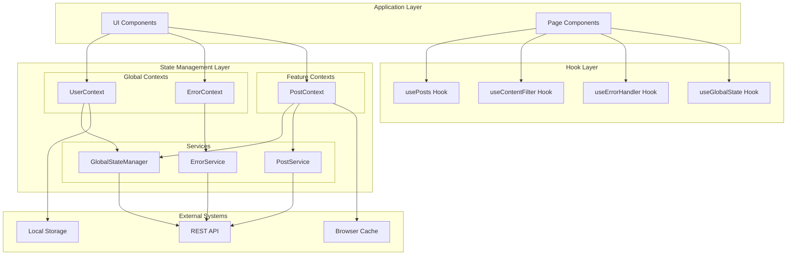
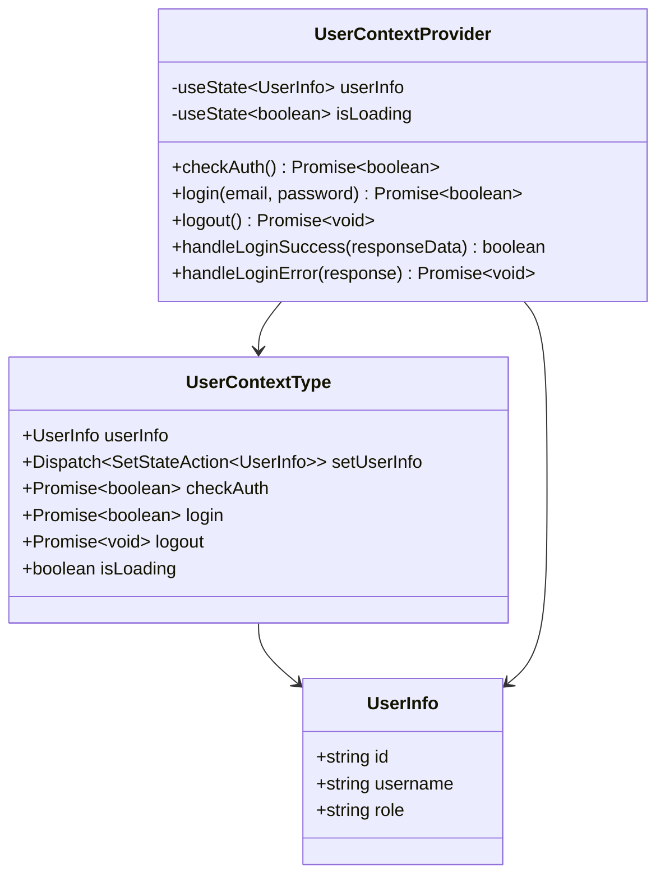
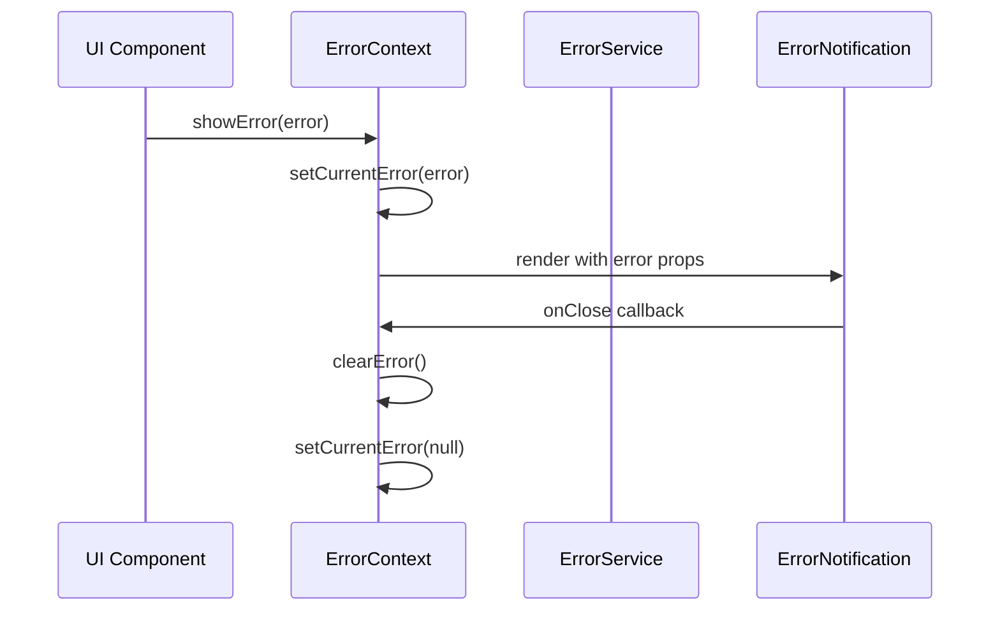
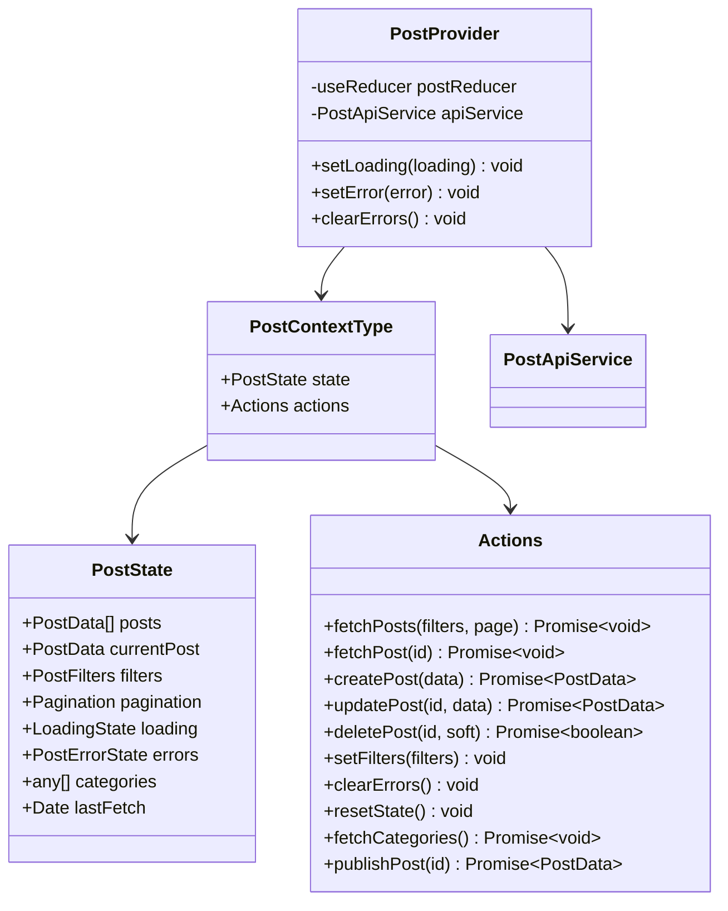
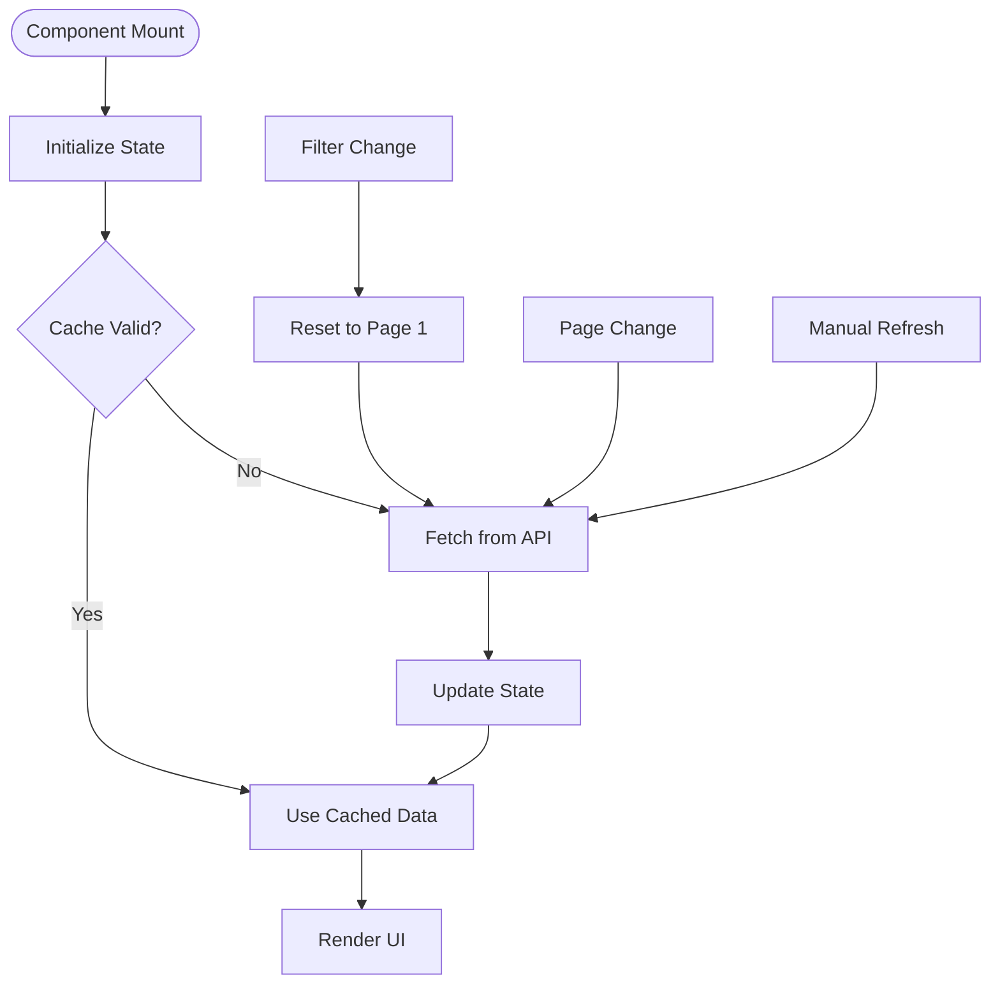
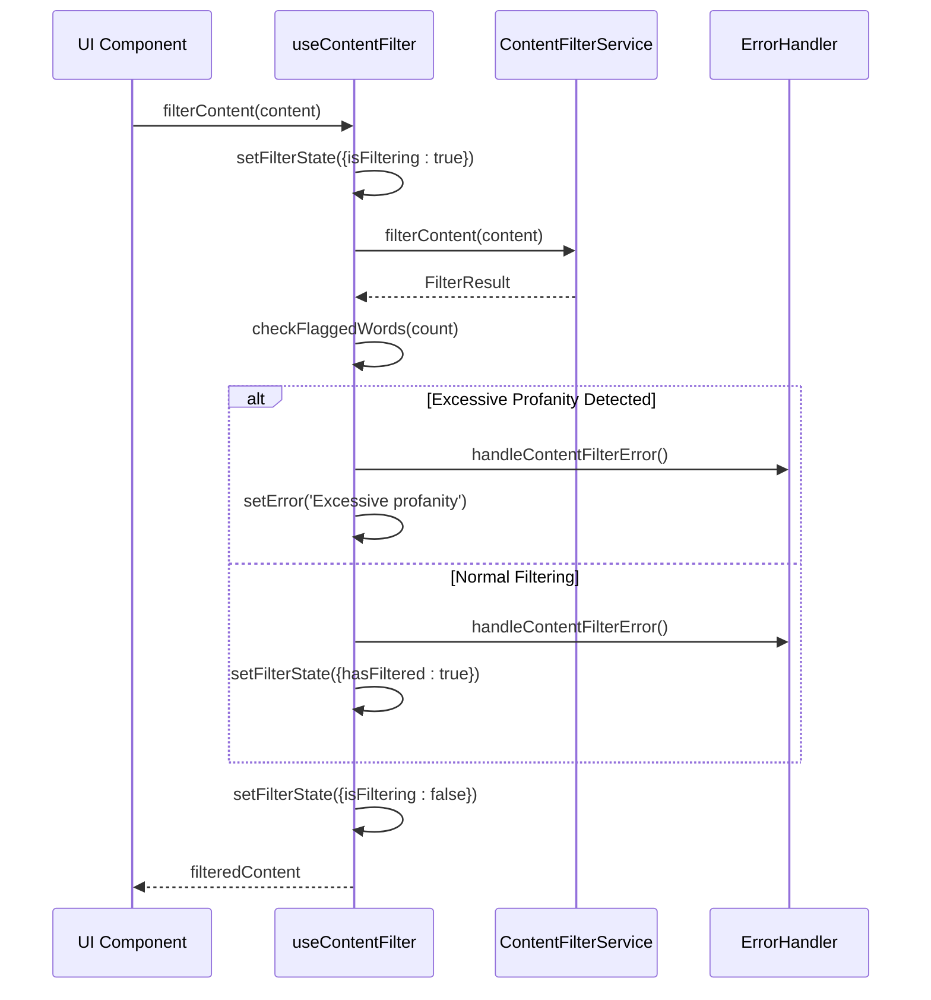
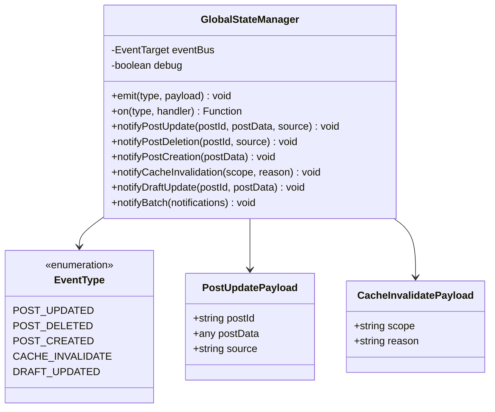
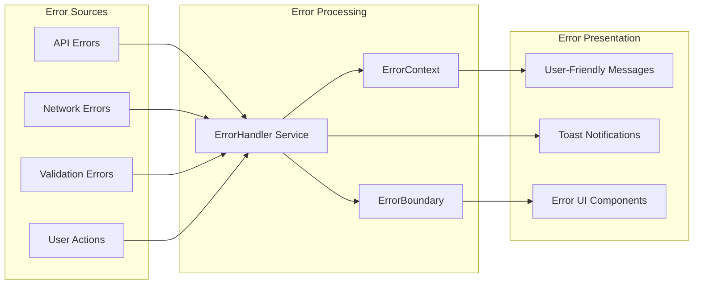
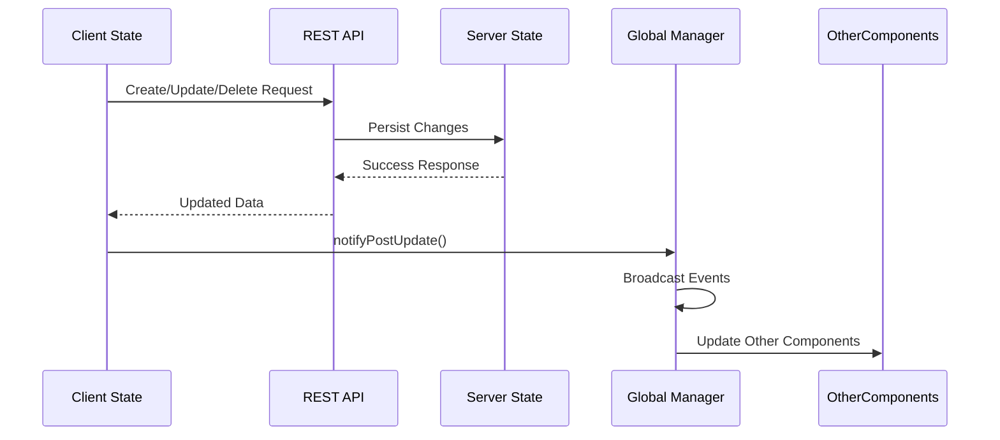

# State Management System Documentation

<cite>
**Referenced Files in This Document**
- [UserContext.tsx](file://src/UserContext.tsx)
- [ErrorContext.tsx](file://src/contexts/ErrorContext.tsx)
- [PostContext.tsx](file://src/features/posts/context/PostContext.tsx)
- [globalStateManager.ts](file://src/services/globalStateManager.ts)
- [usePosts.ts](file://src/hooks/usePosts.ts)
- [useContentFilter.ts](file://src/hooks/useContentFilter.ts)
- [ErrorBoundary.tsx](file://src/components/ErrorBoundary.tsx)
- [errorHandler.ts](file://src/services/errorHandler.ts)
- [useErrorHandler.ts](file://src/hooks/useErrorHandler.ts)
- [ErrorTypes.ts](file://src/types/ErrorTypes.ts)
- [CreatePost.tsx](file://src/features/posts/pages/CreatePost.tsx)
- [EditPost.tsx](file://src/features/posts/pages/EditPost.tsx)
</cite>

## Table of Contents
1. [Introduction](#introduction)
2. [Architecture Overview](#architecture-overview)
3. [Core Context Providers](#core-context-providers)
4. [Feature-Specific State Management](#feature-specific-state-management)
5. [Custom Hooks for State Logic](#custom-hooks-for-state-logic)
6. [Global State Synchronization](#global-state-synchronization)
7. [Error Handling State Management](#error-handling-state-management)
8. [Performance Considerations](#performance-considerations)
9. [Integration Patterns](#integration-patterns)
10. [Best Practices](#best-practices)

## Introduction

The MERN_chatai_blog application employs a sophisticated state management architecture that combines React Context API with custom hooks and a global state manager service. This system provides centralized state management across the entire application while maintaining separation of concerns and optimal performance.

The state management system is designed around several key principles:
- **Centralized Global State**: User authentication and application-wide state
- **Feature-Specific State**: Isolated state management for specific modules like posts
- **Cross-Cutting Concerns**: Shared state management for caching, navigation, and error handling
- **Performance Optimization**: Efficient context updates and selective re-rendering
- **Developer Experience**: Type-safe APIs and intuitive hook-based interfaces

## Architecture Overview

The state management architecture follows a layered approach with clear separation between global application state, feature-specific state, and cross-cutting concerns.

**Diagram sources**
- [UserContext.tsx](file://src/UserContext.tsx#L1-L50)
- [ErrorContext.tsx](file://src/contexts/ErrorContext.tsx#L1-L30)
- [PostContext.tsx](file://src/features/posts/context/PostContext.tsx#L1-L40)
- [globalStateManager.ts](file://src/services/globalStateManager.ts#L1-L50)

## Core Context Providers

### UserContext - Authentication State Management

The UserContext provides comprehensive authentication state management with automatic session persistence and secure API communication.

**Diagram sources**
- [UserContext.tsx](file://src/UserContext.tsx#L15-L30)
- [UserContext.tsx](file://src/UserContext.tsx#L40-L80)

The UserContext implements several advanced features:

**Automatic Session Management**: The context automatically checks authentication status on component mount and sets up periodic verification intervals to maintain session validity.

**Secure API Communication**: All API requests include credentials and appropriate headers for secure communication with the backend.

**Error Handling**: Comprehensive error handling with detailed logging and user-friendly error messages.

**Section sources**
- [UserContext.tsx](file://src/UserContext.tsx#L40-L150)
- [UserContext.tsx](file://src/UserContext.tsx#L180-L250)

### ErrorContext - Application-Wide Error State

The ErrorContext provides centralized error state management with automatic error notification and user-friendly error display.

**Diagram sources**
- [ErrorContext.tsx](file://src/contexts/ErrorContext.tsx#L15-L45)

The ErrorContext offers:

**Centralized Error State**: Single source of truth for error state across the application.

**Automatic Error Display**: Built-in error notification component that renders automatically when errors occur.

**Type Safety**: Strongly typed error handling with proper TypeScript interfaces.

**Section sources**
- [ErrorContext.tsx](file://src/contexts/ErrorContext.tsx#L1-L63)

## Feature-Specific State Management

### PostContext - Posts Module State Management

The PostContext provides comprehensive state management for the posts module, featuring advanced caching, optimistic updates, and global state synchronization.

**Diagram sources**
- [PostContext.tsx](file://src/features/posts/context/PostContext.tsx#L15-L50)
- [PostContext.tsx](file://src/features/posts/context/PostContext.tsx#L160-L180)

**Advanced Features**:

**Optimistic Updates**: The context implements optimistic updates for immediate UI feedback during CRUD operations.

**Global State Synchronization**: Automatic synchronization with the global state manager for real-time updates across components.

**Intelligent Caching**: Smart caching with cache invalidation triggers based on state changes.

**Section sources**
- [PostContext.tsx](file://src/features/posts/context/PostContext.tsx#L250-L350)
- [PostContext.tsx](file://src/features/posts/context/PostContext.tsx#L400-L450)

## Custom Hooks for State Logic

### usePosts - Unified Posts Management

The usePosts hook provides a powerful abstraction for managing posts with built-in caching, filtering, and pagination.

**Diagram sources**
- [usePosts.ts](file://src/hooks/usePosts.ts#L50-L100)

**Key Features**:

**Smart Caching**: Intelligent caching with configurable cache duration and automatic cache invalidation.

**Flexible Filtering**: Comprehensive filtering capabilities with support for multiple filter types.

**Pagination Support**: Built-in pagination with automatic page calculation and navigation.

**Section sources**
- [usePosts.ts](file://src/hooks/usePosts.ts#L1-L100)
- [usePosts.ts](file://src/hooks/usePosts.ts#L200-L275)

### useContentFilter - Content Moderation

The useContentFilter hook provides content moderation capabilities with centralized error handling and profanity filtering.

**Diagram sources**
- [useContentFilter.ts](file://src/hooks/useContentFilter.ts#L40-L100)

**Section sources**
- [useContentFilter.ts](file://src/hooks/useContentFilter.ts#L1-L100)
- [useContentFilter.ts](file://src/hooks/useContentFilter.ts#L150-L184)

## Global State Synchronization

### GlobalStateManager - Cross-Component Communication

The GlobalStateManager provides efficient event-driven communication between components without tight coupling.

**Diagram sources**
- [globalStateManager.ts](file://src/services/globalStateManager.ts#L1-L50)
- [globalStateManager.ts](file://src/services/globalStateManager.ts#L50-L100)

**Advanced Features**:

**Event-Driven Architecture**: Uses native CustomEvent API for efficient event handling with automatic cleanup.

**Type Safety**: Strongly typed event system with payload interfaces for compile-time safety.

**Memory Management**: Automatic cleanup of event listeners to prevent memory leaks.

**Debug Mode**: Development-friendly debugging with event logging and listener tracking.

**Section sources**
- [globalStateManager.ts](file://src/services/globalStateManager.ts#L1-L100)
- [globalStateManager.ts](file://src/services/globalStateManager.ts#L100-L173)

## Error Handling State Management

### Comprehensive Error Management System

The application implements a multi-layered error handling system that provides both technical error management and user-friendly error presentation.

**Diagram sources**
- [errorHandler.ts](file://src/services/errorHandler.ts#L1-L50)
- [ErrorBoundary.tsx](file://src/components/ErrorBoundary.tsx#L1-L50)

### ErrorBoundary - React Error Catching

The ErrorBoundary component provides comprehensive React error catching with graceful fallback UI and detailed error reporting.

**Key Features**:

**Automatic Error Detection**: Captures React rendering errors, lifecycle errors, and promise rejection errors.

**Graceful Fallback UI**: Provides user-friendly fallback UI with actionable buttons for retry, reload, and navigation.

**Error Reporting**: Comprehensive error reporting with component stack traces and user context.

**Development Support**: Enhanced error details in development mode with stack traces and component information.

**Section sources**
- [ErrorBoundary.tsx](file://src/components/ErrorBoundary.tsx#L1-L100)
- [ErrorBoundary.tsx](file://src/components/ErrorBoundary.tsx#L100-L183)

### useErrorHandler - Hook-Based Error Management

The useErrorHandler hook provides a convenient interface for components to handle errors with centralized error management.

**Section sources**
- [useErrorHandler.ts](file://src/hooks/useErrorHandler.ts#L1-L50)
- [useErrorHandler.ts](file://src/hooks/useErrorHandler.ts#L50-L109)

## Performance Considerations

### Optimizing Context Updates

The state management system implements several performance optimization strategies:

**Memoization**: Extensive use of `useMemo` and `useCallback` to prevent unnecessary re-renders.

**Selective State Updates**: Granular state updates to minimize re-rendering impact.

**Efficient Event Handling**: Native CustomEvent API for optimal event performance.

**Cache Management**: Intelligent caching with configurable TTL and automatic cleanup.

### Avoiding Unnecessary Re-renders

**Context Value Memoization**: The UserContext uses `useMemo` to memoize the context value, preventing unnecessary re-renders when the context value hasn't changed.

**Reducer Pattern**: The PostContext uses the reducer pattern to batch state updates and minimize re-renders.

**Event Cleanup**: Automatic cleanup of event listeners to prevent memory leaks and unnecessary re-renders.

## Integration Patterns

### Client-Server State Synchronization

The application implements sophisticated state synchronization between client-side state and server state:

**Diagram sources**
- [PostContext.tsx](file://src/features/posts/context/PostContext.tsx#L250-L300)
- [globalStateManager.ts](file://src/services/globalStateManager.ts#L70-L90)

### Navigation Integration

The state management system integrates seamlessly with the navigation system:

**Safe Navigation**: Navigation hooks validate post IDs and handle navigation failures gracefully.

**State Preservation**: Navigation preserves component state during route changes.

**Error Recovery**: Navigation includes error recovery mechanisms for failed operations.

**Section sources**
- [CreatePost.tsx](file://src/features/posts/pages/CreatePost.tsx#L20-L60)
- [EditPost.tsx](file://src/features/posts/pages/EditPost.tsx#L30-L80)

## Best Practices

### State Management Best Practices

**Separation of Concerns**: Clear separation between global application state, feature-specific state, and cross-cutting concerns.

**Type Safety**: Comprehensive TypeScript typing for all state interfaces and context values.

**Error Boundaries**: Strategic placement of ErrorBoundary components for comprehensive error coverage.

**Performance Optimization**: Careful consideration of performance implications with memoization and selective updates.

**Testing Support**: Well-structured state management that facilitates comprehensive testing.

### Developer Experience

**Intuitive APIs**: Hook-based APIs that provide clean, intuitive interfaces for state management.

**Clear Documentation**: Comprehensive documentation for all state management components and hooks.

**Consistent Patterns**: Consistent patterns across different state management modules for easier learning and maintenance.

**Extensibility**: Modular design that allows for easy extension and customization of state management behavior.

The MERN_chatai_blog state management system demonstrates a mature, production-ready approach to React state management that balances developer productivity with application performance and reliability. The combination of React Context API, custom hooks, and a global state manager service creates a robust foundation for building scalable web applications.