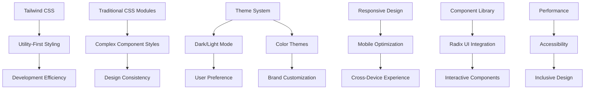
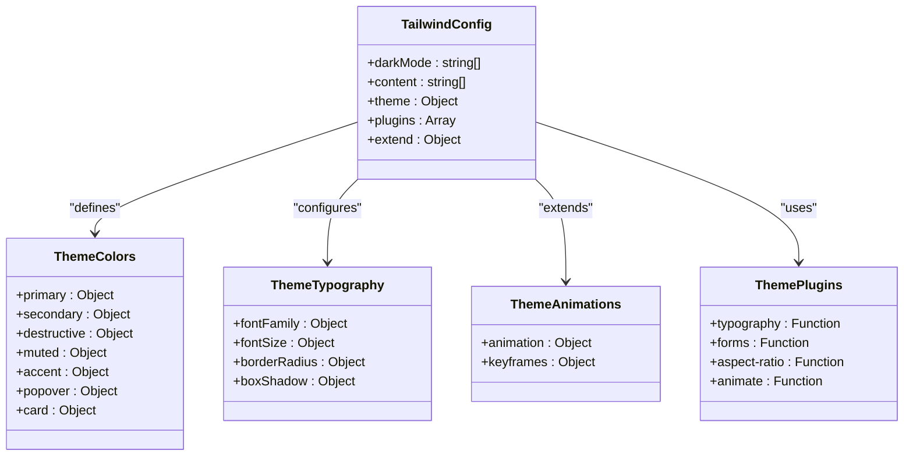
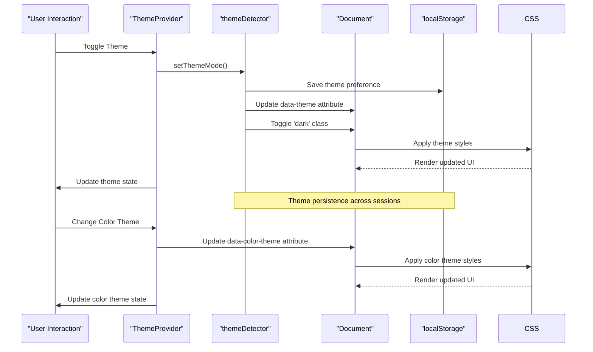
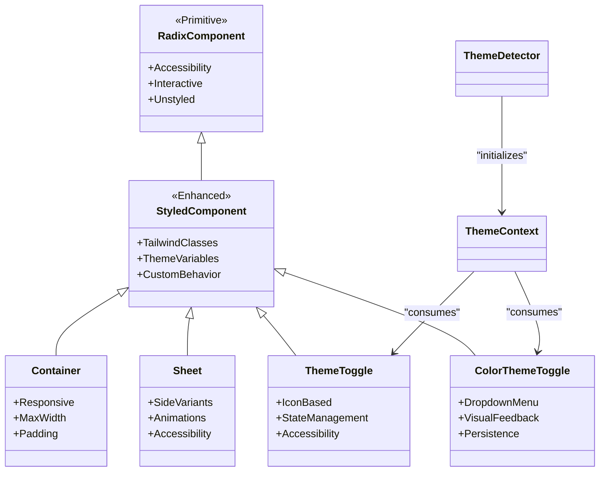
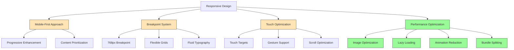
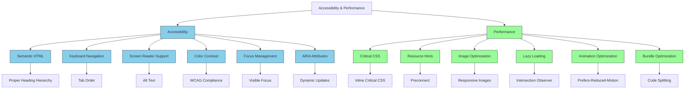

# Styling Strategy

<cite>
**Referenced Files in This Document**   
- [tailwind.config.js](file://tailwind.config.js)
- [global.css](file://src/css/global.css)
- [theme-overrides.css](file://src/css/theme-overrides.css)
- [dark-mode.css](file://src/css/dark-mode.css)
- [index.css](file://src/css/index.css)
- [App.css](file://src/css/App.css)
- [themeDetector.ts](file://src/lib/themeDetector.ts)
- [ThemeContext.tsx](file://src/components/contexts/ThemeContext.tsx)
- [theme-toggle.tsx](file://src/components/ui/theme-toggle.tsx)
- [color-theme-toggle.tsx](file://src/components/ui/color-theme-toggle.tsx)
- [container.tsx](file://src/components/ui/container.tsx)
- [sheet.tsx](file://src/components/ui/sheet.tsx)
- [mobileOptimizations.ts](file://src/utils/mobileOptimizations.ts)
- [use-mobile.tsx](file://src/hooks/use-mobile.tsx)
</cite>

## Table of Contents
1. [Introduction](#introduction)
2. [Styling Architecture Overview](#styling-architecture-overview)
3. [Tailwind CSS Integration](#tailwind-css-integration)
4. [Theme System Implementation](#theme-system-implementation)
5. [CSS File Organization](#css-file-organization)
6. [Component Library Integration](#component-library-integration)
7. [Responsive Design and Mobile Optimization](#responsive-design-and-mobile-optimization)
8. [Accessibility and Performance](#accessibility-and-performance)
9. [Design System Extension Guidelines](#design-system-extension-guidelines)
10. [Conclusion](#conclusion)

## Introduction
The MERN_chatai_blog application employs a sophisticated styling architecture that combines utility-first CSS with traditional CSS modules to achieve both development efficiency and design consistency. This document details the comprehensive styling strategy that enables the application to deliver a visually cohesive, accessible, and performant user experience across devices and user preferences. The system leverages Tailwind CSS for rapid UI development while maintaining traditional CSS for complex styling requirements and theme overrides. A robust theme system provides automatic dark/light mode detection and multiple color theme options, ensuring users can customize their experience according to their preferences and environmental conditions.

## Styling Architecture Overview

**Diagram sources**
- [tailwind.config.js](file://tailwind.config.js#L1-L170)
- [global.css](file://src/css/global.css#L1-L200)
- [ThemeContext.tsx](file://src/components/contexts/ThemeContext.tsx#L1-L235)

**Section sources**
- [tailwind.config.js](file://tailwind.config.js#L1-L170)
- [global.css](file://src/css/global.css#L1-L200)

## Tailwind CSS Integration

The application leverages Tailwind CSS as its primary styling solution, implementing a utility-first approach that enables rapid UI development and consistent design patterns. The Tailwind configuration is extensively customized to align with the application's design system, including custom color palettes, typography settings, and animation patterns. The configuration extends the default theme with semantic color variables that map to CSS custom properties, enabling seamless integration with the dynamic theming system.

**Diagram sources**
- [tailwind.config.js](file://tailwind.config.js#L1-L170)
- [global.css](file://src/css/global.css#L1-L200)

**Section sources**
- [tailwind.config.js](file://tailwind.config.js#L1-L170)
- [package.json](file://package.json#L1-L115)

## Theme System Implementation

The theme system in MERN_chatai_blog is a sophisticated implementation that combines client-side state management with persistent user preferences and system-level detection. The system supports both dark/light mode toggling and multiple color themes (green, blue, purple, amber), providing users with extensive customization options. The implementation uses a combination of CSS custom properties, data attributes, and class names to ensure maximum compatibility across different styling approaches and component libraries.

**Diagram sources**
- [ThemeContext.tsx](file://src/components/contexts/ThemeContext.tsx#L1-L235)
- [themeDetector.ts](file://src/lib/themeDetector.ts#L1-L160)
- [global.css](file://src/css/global.css#L1-L200)

**Section sources**
- [ThemeContext.tsx](file://src/components/contexts/ThemeContext.tsx#L1-L235)
- [themeDetector.ts](file://src/lib/themeDetector.ts#L1-L160)
- [theme-toggle.tsx](file://src/components/ui/theme-toggle.tsx#L1-L17)
- [color-theme-toggle.tsx](file://src/components/ui/color-theme-toggle.tsx#L1-L130)

## CSS File Organization

The CSS architecture follows a structured organization that separates concerns and enables maintainable styling patterns. The system combines global styles, component-specific styles, and theme overrides in a coherent hierarchy that ensures consistent application of design principles while allowing for necessary exceptions and special cases.

```mermaid
flowchart TD
A[CSS Organization] --> B[global.css]
A --> C[index.css]
A --> D[theme-overrides.css]
A --> E[dark-mode.css]
A --> F[App.css]
A --> G[Component-Specific CSS]
B --> H[Base Theme Variables]
B --> I[Global Reset Styles]
B --> J[System-wide Typography]
B --> K[Mobile Optimizations]
C --> L[Custom Utility Classes]
C --> M[Scrollbar Styles]
C --> N[Line Clamp Utilities]
D --> O[Markdown Theme Overrides]
D --> P[Badge Color Fixes]
D --> Q[Syntax Highlighting]
E --> R[ReactQuill Editor Styles]
E --> S[Chatbot Component Styles]
F --> T[Layout-specific Styles]
F --> U[Animation Keyframes]
F --> V[Component Visual Effects]
G --> W[Feature-specific Styling]
G --> X[Legacy Component Styles]
```

**Diagram sources**
- [global.css](file://src/css/global.css#L1-L200)
- [index.css](file://src/css/index.css#L1-L70)
- [theme-overrides.css](file://src/css/theme-overrides.css#L1-L55)
- [dark-mode.css](file://src/css/dark-mode.css#L1-L91)
- [App.css](file://src/css/App.css#L1-L176)

**Section sources**
- [global.css](file://src/css/global.css#L1-L200)
- [index.css](file://src/css/index.css#L1-L70)
- [theme-overrides.css](file://src/css/theme-overrides.css#L1-L55)
- [dark-mode.css](file://src/css/dark-mode.css#L1-L91)
- [App.css](file://src/css/App.css#L1-L176)

## Component Library Integration

The application integrates Radix UI components with the custom styling system, ensuring consistent visual presentation across both custom and third-party components. The integration approach uses Tailwind CSS classes and CSS custom properties to style Radix components while maintaining their accessibility features and interactive behaviors. The system also includes utility components that wrap Radix primitives with application-specific styling and behavior.

**Diagram sources**
- [container.tsx](file://src/components/ui/container.tsx#L1-L38)
- [sheet.tsx](file://src/components/ui/sheet.tsx#L1-L140)
- [theme-toggle.tsx](file://src/components/ui/theme-toggle.tsx#L1-L17)
- [color-theme-toggle.tsx](file://src/components/ui/color-theme-toggle.tsx#L1-L130)
- [ThemeContext.tsx](file://src/components/contexts/ThemeContext.tsx#L1-L235)

**Section sources**
- [container.tsx](file://src/components/ui/container.tsx#L1-L38)
- [sheet.tsx](file://src/components/ui/sheet.tsx#L1-L140)
- [theme-toggle.tsx](file://src/components/ui/theme-toggle.tsx#L1-L17)
- [color-theme-toggle.tsx](file://src/components/ui/color-theme-toggle.tsx#L1-L130)

## Responsive Design and Mobile Optimization

The application implements a comprehensive responsive design strategy that ensures optimal user experience across devices of all sizes. The system combines CSS media queries, mobile-first design principles, and JavaScript-based device detection to deliver appropriately optimized interfaces. Performance optimizations specifically target mobile devices to ensure smooth interactions and minimal resource consumption.

**Diagram sources**
- [use-mobile.tsx](file://src/hooks/use-mobile.tsx#L1-L19)
- [mobileOptimizations.ts](file://src/utils/mobileOptimizations.ts#L1-L207)
- [container.tsx](file://src/components/ui/container.tsx#L1-L38)
- [global.css](file://src/css/global.css#L1-L200)

**Section sources**
- [use-mobile.tsx](file://src/hooks/use-mobile.tsx#L1-L19)
- [mobileOptimizations.ts](file://src/utils/mobileOptimizations.ts#L1-L207)
- [global.css](file://src/css/global.css#L1-L200)

## Accessibility and Performance

The styling system prioritizes both accessibility and performance, ensuring that the application is usable by all users while maintaining optimal performance characteristics. Accessibility features are integrated at multiple levels, from semantic HTML structure to ARIA attributes and keyboard navigation support. Performance optimizations focus on reducing render-blocking resources, minimizing reflows, and optimizing asset delivery.

**Diagram sources**
- [global.css](file://src/css/global.css#L1-L200)
- [index.css](file://src/css/index.css#L1-L70)
- [mobileOptimizations.ts](file://src/utils/mobileOptimizations.ts#L1-L207)
- [themeDetector.ts](file://src/lib/themeDetector.ts#L1-L160)

**Section sources**
- [global.css](file://src/css/global.css#L1-L200)
- [index.css](file://src/css/index.css#L1-L70)
- [mobileOptimizations.ts](file://src/utils/mobileOptimizations.ts#L1-L207)

## Design System Extension Guidelines

To maintain consistency and scalability, the application follows specific guidelines for extending the design system with new components and styles. These guidelines ensure that new additions align with existing patterns and can be easily maintained and updated.

### Adding New Styles
When adding new styles to the application, follow these guidelines:
- Use Tailwind CSS utilities for simple styling needs
- Create CSS modules for complex component styles
- Extend the Tailwind configuration for new design tokens
- Use CSS custom properties for themeable values
- Avoid inline styles when possible

### Extending the Theme System
To add new color themes or modify existing ones:
- Define new CSS custom properties in global.css
- Update the Tailwind configuration with new color values
- Test theme changes across all components
- Ensure sufficient color contrast for accessibility
- Document new theme variables

### Creating New Components
When creating new UI components:
- Use Radix UI primitives when available
- Apply consistent naming conventions
- Implement responsive behavior
- Ensure accessibility compliance
- Document component props and usage

### Performance Considerations
For optimal performance:
- Minimize the use of expensive CSS properties
- Optimize animations for 60fps
- Use will-change appropriately
- Implement lazy loading for off-screen content
- Optimize image delivery

**Section sources**
- [tailwind.config.js](file://tailwind.config.js#L1-L170)
- [global.css](file://src/css/global.css#L1-L200)
- [themeDetector.ts](file://src/lib/themeDetector.ts#L1-L160)
- [ThemeContext.tsx](file://src/components/contexts/ThemeContext.tsx#L1-L235)

## Conclusion
The styling architecture of MERN_chatai_blog represents a balanced approach that combines the efficiency of utility-first CSS with the precision of traditional CSS modules. The system enables rapid development while maintaining design consistency and accessibility across the application. The sophisticated theme system provides users with extensive customization options, including automatic dark/light mode detection and multiple color themes. Responsive design principles and mobile optimizations ensure a seamless experience across devices, while performance considerations maintain smooth interactions even on lower-end hardware. By following the documented guidelines for extending the design system, developers can maintain consistency and scalability as the application evolves.