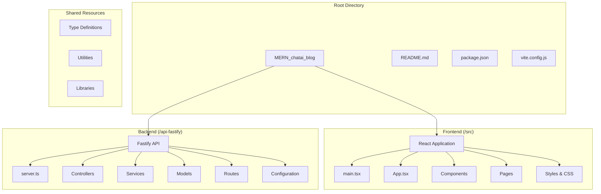

# Getting Started

<cite>
**Referenced Files in This Document**
- [README.md](file://README.md)
- [package.json](file://package.json)
- [api-fastify/package.json](file://api-fastify/package.json)
- [api-fastify/.env.example](file://api-fastify/.env.example)
- [api-fastify/src/server.ts](file://api-fastify/src/server.ts)
- [api-fastify/src/config/database.ts](file://api-fastify/src/config/database.ts)
- [src/main.tsx](file://src/main.tsx)
- [src/App.tsx](file://src/App.tsx)
- [vite.config.js](file://vite.config.js)
- [CONTRIBUTING.md](file://CONTRIBUTING.md)
</cite>

## Table of Contents
1. [Introduction](#introduction)
2. [Prerequisites](#prerequisites)
3. [Installation](#installation)
4. [Environment Configuration](#environment-configuration)
5. [Starting the Development Environment](#starting-the-development-environment)
6. [Project Structure Overview](#project-structure-overview)
7. [Basic Usage Examples](#basic-usage-examples)
8. [Platform-Specific Setup](#platform-specific-setup)
9. [Troubleshooting](#troubleshooting)
10. [Next Steps](#next-steps)

## Introduction

MERN ChatAI Blog is a modern blogging platform built with the MERN stack (MongoDB, Express, React, Node.js) and TypeScript. This comprehensive guide will walk you through setting up the development environment, configuring the application, and getting started with development.

The project features:
- **Full-stack architecture** with separate frontend and backend
- **AI-powered chatbot** integrated with Qwen models
- **Modern React frontend** with TypeScript and Tailwind CSS
- **Fastify backend** with robust middleware and authentication
- **Real-time notifications** and caching systems
- **Responsive design** with dark mode support

## Prerequisites

Before installing MERN ChatAI Blog, ensure your system meets the following requirements:

### Required Software
- **Node.js**: Version 14 or higher (recommended: v18+)
- **npm**: Version 6 or higher (or use pnpm)
- **pnpm**: Recommended package manager for optimal performance
- **MongoDB**: Local or remote database instance
- **Redis**: Optional but recommended for caching

### Operating System Support
- **macOS**: Tested on macOS 10.15+
- **Linux**: Ubuntu 18.04+, CentOS 7+, or equivalent distributions
- **Windows**: Windows 10/11 with WSL2 or Git Bash

**Section sources**
- [README.md](file://README.md#L15-L25)
- [package.json](file://package.json#L1-L10)

## Installation

### Step 1: Clone the Repository

First, clone the repository to your local machine:

```bash
# Using HTTPS
git clone https://github.com/yoricksenpai/MERN_chatai_blog.git

# Or using SSH
git clone git@github.com:yoricksenpai/MERN_chatai_blog.git

cd MERN_chatai_blog
```

### Step 2: Install Dependencies

The project uses pnpm as the preferred package manager for optimal performance and dependency management.

#### Option 1: Using pnpm (Recommended)

```bash
# Install pnpm globally (if not already installed)
npm install -g pnpm

# Install frontend dependencies
pnpm install

# Navigate to backend and install dependencies
cd api-fastify
pnpm install
```

#### Option 2: Using npm

```bash
# Install frontend dependencies
npm install

# Navigate to backend and install dependencies
cd api-fastify
npm install
```

### Step 3: Verify Installation

After installation, verify that all dependencies were installed correctly:

```bash
# Check pnpm version
pnpm --version

# Verify frontend build
pnpm run build

# Verify backend build
cd api-fastify
pnpm run build
```

**Section sources**
- [README.md](file://README.md#L26-L45)
- [package.json](file://package.json#L5-L15)
- [api-fastify/package.json](file://api-fastify/package.json#L5-L15)

## Environment Configuration

### Creating Environment Variables

The backend requires environment variables to be configured properly. Copy the example configuration file and customize it for your environment:

```bash
# Navigate to the backend directory
cd api-fastify

# Copy the example environment file
cp .env.example .env

# Open the .env file in your preferred editor
# nano .env  # or use VS Code, Sublime Text, etc.
```

### Essential Environment Variables

Edit the `.env` file with your specific configuration:

```bash
# Database Configuration
MONGODB_URI=mongodb://localhost:27017/mern_blog
DB_NAME=mern_blog

# Server Configuration
PORT=4200
NODE_ENV=development
API_PREFIX=/api/v1
APP_URL=http://localhost:5173

# JWT Authentication
JWT_SECRET=your_jwt_secret_key
JWT_EXPIRES_IN=30d

# Email Configuration (for password reset)
EMAIL_HOST=smtp.example.com
EMAIL_PORT=587
EMAIL_USER=your_email@example.com
EMAIL_PASS=your_email_password
EMAIL_FROM=your_email@example.com
EMAIL_SECURE=false

# AI API Configuration
AI_API_KEY=your_openai_api_key
AI_API_URL=https://api.openai.com/v1/chat/completions

# Qwen Model Configuration
QWEN_PROMPT=Tu es un assistant utile et amical pour un blog sur la technologie et l'IA.

# Frontend URL for redirects
FRONTEND_URL=http://localhost:5173

# Redis Configuration (optional)
REDIS_URL=redis://localhost:6379
```

### Environment Variable Reference

| Variable | Description | Default Value | Required |
|----------|-------------|---------------|----------|
| `MONGODB_URI` | MongoDB connection string | `mongodb://localhost:27017/mern_blog` | Yes |
| `PORT` | Backend server port | `4200` | Yes |
| `JWT_SECRET` | JWT signing secret | `your_jwt_secret_key` | Yes |
| `NODE_ENV` | Environment mode | `development` | Yes |
| `REDIS_URL` | Redis connection URL | `redis://localhost:6379` | No |
| `AI_API_KEY` | OpenAI API key | `your_openai_api_key` | Yes |

**Section sources**
- [api-fastify/.env.example](file://api-fastify/.env.example#L1-L35)
- [api-fastify/src/config/database.ts](file://api-fastify/src/config/database.ts#L1-L22)

## Starting the Development Environment

### Option 1: Start Both Servers Simultaneously

The project provides a convenient script to start both frontend and backend servers:

```bash
# From the root directory
pnpm run start
```

This command will:
- Start the backend server on port 4200
- Start the frontend development server on port 5173
- Enable automatic reloading for both applications

### Option 2: Start Servers Individually

#### Backend Server (Fastify)

```bash
# Navigate to backend directory
cd api-fastify

# Start development server
pnpm run dev

# Or using npm
npm run dev
```

The backend server will start on port 4200 with hot reload enabled.

#### Frontend Server (Vite)

```bash
# From the root directory
pnpm run dev

# Or using npm
npm run dev
```

The frontend server will start on port 5173 with hot reload enabled.

### Accessing the Application

Once both servers are running:

- **Frontend**: Open [http://localhost:5173](http://localhost:5173) in your browser
- **Backend API**: Available at [http://localhost:4200/api/v1](http://localhost:4200/api/v1)
- **Admin Dashboard**: Access at [http://localhost:5173/admin](http://localhost:5173/admin)

**Section sources**
- [package.json](file://package.json#L6-L15)
- [api-fastify/package.json](file://api-fastify/package.json#L6-L15)
- [vite.config.js](file://vite.config.js#L20-L30)

## Project Structure Overview

Understanding the project structure is crucial for effective development:



**Diagram sources**
- [src/main.tsx](file://src/main.tsx#L1-L20)
- [api-fastify/src/server.ts](file://api-fastify/src/server.ts#L1-L30)

### Key Entry Points

#### Frontend Entry Point
- **`src/main.tsx`**: The main React application entry point
- Initializes the React application with routing, themes, and context providers
- Sets up error boundaries and performance optimizations

#### Backend Entry Point
- **`api-fastify/src/server.ts`**: The Fastify server configuration
- Registers all middleware, routes, and services
- Handles CORS, authentication, and error management

### Directory Breakdown

| Directory | Purpose | Key Files |
|-----------|---------|-----------|
| `/src` | Frontend React application | `main.tsx`, `App.tsx`, components |
| `/src/components` | Reusable React components | UI components, layouts |
| `/src/pages` | Page-level components | Route handlers |
| `/src/features` | Feature-specific modules | Posts, comments, etc. |
| `/api-fastify` | Backend Fastify API | `server.ts`, controllers, services |
| `/api-fastify/src/controllers` | API controllers | Business logic handlers |
| `/api-fastify/src/services` | Business services | Database, AI, email services |
| `/api-fastify/src/models` | Mongoose models | Database schemas |

**Section sources**
- [src/main.tsx](file://src/main.tsx#L1-L99)
- [api-fastify/src/server.ts](file://api-fastify/src/server.ts#L1-L50)
- [src/App.tsx](file://src/App.tsx#L1-L50)

## Basic Usage Examples

### Running the Development Server

After completing the setup, you can start the development environment:

```bash
# Start both servers simultaneously
pnpm run start

# Or start individually
# Terminal 1: Start backend
cd api-fastify
pnpm run dev

# Terminal 2: Start frontend
pnpm run dev
```

### Accessing the Admin Dashboard

The admin dashboard provides comprehensive management capabilities:

1. Navigate to [http://localhost:5173/admin](http://localhost:5173/admin)
2. Log in with admin credentials (create admin user during initial setup)
3. Manage posts, categories, users, and system settings
4. Monitor real-time notifications and system health

### Creating a Test Post

1. **Log in** to the application
2. Navigate to the **Create Post** page
3. Fill in the post details:
   - Title
   - Content (supports rich text editing)
   - Category selection
   - Tags
4. Choose publication status (draft/published)
5. Click **Publish** to create the post

### Using the AI Chatbot

The integrated AI chatbot provides intelligent assistance:

1. Open the chat widget (usually in the bottom-right corner)
2. Type your question or request
3. The AI will respond with relevant information
4. Messages are automatically saved and can be resumed later

### Testing API Endpoints

Use tools like Postman or curl to test API endpoints:

```bash
# Test API health endpoint
curl http://localhost:4200/api/v1/health

# Test AI chat endpoint (requires authentication)
curl -X POST http://localhost:4200/api/v1/ai/message \
  -H "Content-Type: application/json" \
  -d '{"input": "Hello", "sessionId": "test-session"}'
```

**Section sources**
- [src/App.tsx](file://src/App.tsx#L40-L70)
- [api-fastify/src/routes/ai.routes.ts](file://api-fastify/src/routes/ai.routes.ts#L1-L41)

## Platform-Specific Setup

### macOS Setup

#### Prerequisites Installation

```bash
# Install Homebrew (if not already installed)
/bin/bash -c "$(curl -fsSL https://raw.githubusercontent.com/Homebrew/install/HEAD/install.sh)"

# Install Node.js
brew install node

# Install MongoDB
brew tap mongodb/brew
brew install mongodb-community

# Install Redis (optional)
brew install redis

# Start services
brew services start mongodb-community
brew services start redis
```

#### Additional macOS Considerations

- **File Permissions**: Ensure proper permissions for the project directory
- **Terminal**: Use iTerm2 or zsh for enhanced terminal experience
- **VS Code**: Install recommended extensions for TypeScript and React development

### Linux Setup

#### Ubuntu/Debian

```bash
# Update package list
sudo apt update

# Install Node.js
curl -fsSL https://deb.nodesource.com/setup_lts.x | sudo -E bash -
sudo apt-get install -y nodejs

# Install MongoDB
wget -qO - https://www.mongodb.org/static/pgp/server-6.0.asc | sudo apt-key add -
echo "deb [arch=amd64] https://repo.mongodb.org/apt/ubuntu focal/mongodb-org/6.0 multiverse" | sudo tee /etc/apt/sources.list.d/mongodb-org-6.0.list
sudo apt update
sudo apt install -y mongodb-org

# Install Redis
sudo apt install -y redis-server

# Start services
sudo systemctl start mongod
sudo systemctl enable mongod
sudo systemctl start redis
sudo systemctl enable redis
```

#### CentOS/RHEL

```bash
# Install Node.js
curl -fsSL https://rpm.nodesource.com/setup_lts.x | sudo bash -
sudo yum install -y nodejs

# Install MongoDB
sudo yum install -y mongodb-org

# Install Redis
sudo yum install -y redis

# Start services
sudo systemctl start mongod
sudo systemctl enable mongod
sudo systemctl start redis
sudo systemctl enable redis
```

### Windows Setup

#### Prerequisites

1. **Install Node.js**: Download from [nodejs.org](https://nodejs.org/)
2. **Install MongoDB**: Download from [mongodb.com](https://mongodb.com)
3. **Install Redis**: Download from [redis.io](https://redis.io)
4. **Install Git**: Download from [git-scm.com](https://git-scm.com)

#### Using Windows Subsystem for Linux (WSL2)

```bash
# Install WSL2
wsl --install

# Install Ubuntu distribution
wsl --install -d Ubuntu

# Follow Ubuntu setup instructions above
```

#### Native Windows Setup

```powershell
# Install Chocolatey (package manager)
Set-ExecutionPolicy Bypass -Scope Process -Force
[System.Net.ServicePointManager]::SecurityProtocol = [System.Net.ServicePointManager]::SecurityProtocol -bor 3072
iex ((New-Object System.Net.WebClient).DownloadString('https://community.chocolatey.org/install.ps1'))

# Install Node.js
choco install nodejs

# Install MongoDB
choco install mongodb

# Install Redis
choco install redis
```

**Section sources**
- [README.md](file://README.md#L15-L25)

## Troubleshooting

### Common Setup Issues

#### Database Connection Errors

**Problem**: MongoDB connection fails
```
MongoDB connection error: connect ECONNREFUSED 127.0.0.1:27017
```

**Solution**:
```bash
# Check if MongoDB is running
# macOS
brew services list | grep mongo

# Linux
sudo systemctl status mongod

# Windows
# Check MongoDB service in Task Manager or Services app

# Start MongoDB manually if not running
# macOS
brew services start mongodb-community

# Linux
sudo systemctl start mongod

# Windows
# Start MongoDB service from Services app
```

#### Port Conflicts

**Problem**: Port 4200 or 5173 already in use
```
Error: listen EADDRINUSE: address already in use :::4200
```

**Solution**:
```bash
# Find process using the port
# macOS/Linux
lsof -i :4200
kill -9 <PID>

# Windows
netstat -ano | findstr :4200
taskkill /PID <PID> /F

# Change ports in environment variables
echo "PORT=4201" >> .env
echo "VITE_PORT=5174" >> .env
```

#### Missing Dependencies

**Problem**: Module not found errors
```
Module not found: Can't resolve 'react'
```

**Solution**:
```bash
# Reinstall dependencies
rm -rf node_modules package-lock.json
pnpm install

# For backend
cd api-fastify
rm -rf node_modules package-lock.json
pnpm install
```

#### Environment Variable Issues

**Problem**: Environment variables not loading
```bash
# Check if .env file exists
ls -la api-fastify/.env

# Verify file permissions
chmod 644 api-fastify/.env
```

#### Memory Issues

**Problem**: Out of memory errors during build
```bash
# Increase Node.js memory limit
export NODE_OPTIONS="--max-old-space-size=4096"

# Or modify package.json scripts
"build": "node --max-old-space-size=4096 node_modules/.bin/vite build"
```

### Debugging Tips

#### Enable Verbose Logging

```bash
# Set debug mode
DEBUG=* pnpm run dev

# Enable Fastify logging
DEBUG=fastify:* pnpm run dev
```

#### Check Network Connectivity

```bash
# Test backend connectivity
curl http://localhost:4200/api/v1/health

# Test frontend connectivity
curl http://localhost:5173

# Test AI service connectivity
curl -X POST http://localhost:4200/api/v1/ai/test
```

#### Inspect Build Output

```bash
# Run build with verbose output
pnpm run build --verbose

# Check for TypeScript errors
pnpm run type-check
```

### Performance Optimization

#### Optimize Build Performance

```bash
# Use pnpm for better performance
pnpm install

# Enable Vite's experimental features
# Add to vite.config.js
optimizeDeps: {
  force: true,
  include: ['react', 'react-dom']
}
```

#### Memory Management

```bash
# Increase Node.js heap size
export NODE_OPTIONS="--max-old-space-size=8192"

# Use incremental builds
pnpm run dev -- --force
```

**Section sources**
- [api-fastify/src/config/database.ts](file://api-fastify/src/config/database.ts#L10-L22)
- [api-fastify/src/server.ts](file://api-fastify/src/server.ts#L150-L173)

## Next Steps

### Development Workflow

1. **Start Development Servers**: `pnpm run start`
2. **Create Features**: Develop new features in the appropriate directories
3. **Write Tests**: Ensure all new code includes proper testing
4. **Commit Changes**: Follow conventional commit format
5. **Submit Pull Request**: Create a PR against the main branch

### Learning Resources

- **React Documentation**: [reactjs.org](https://reactjs.org)
- **Fastify Documentation**: [fastify.dev](https://fastify.dev)
- **TypeScript Handbook**: [typescriptlang.org](https://typescriptlang.org)
- **Tailwind CSS**: [tailwindcss.com](https://tailwindcss.com)

### Contributing Guidelines

Follow the project's contributing guidelines:

- Use descriptive branch names
- Write clear commit messages
- Include tests for new features
- Document complex changes
- Follow the existing code style

### Production Deployment

When ready for production:

1. **Build for Production**:
   ```bash
   pnpm run build
   cd api-fastify
   pnpm run build
   ```

2. **Configure Production Environment**:
   - Set `NODE_ENV=production`
   - Use production database URI
   - Configure proper CORS origins
   - Set secure JWT secrets

3. **Deploy**:
   - Deploy frontend to Vercel/Netlify
   - Deploy backend to Heroku/AWS
   - Configure domain and SSL certificates

**Section sources**
- [CONTRIBUTING.md](file://CONTRIBUTING.md#L1-L30)
- [README.md](file://README.md#L100-L116)