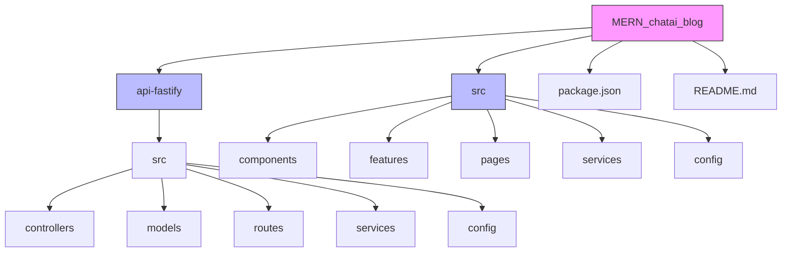
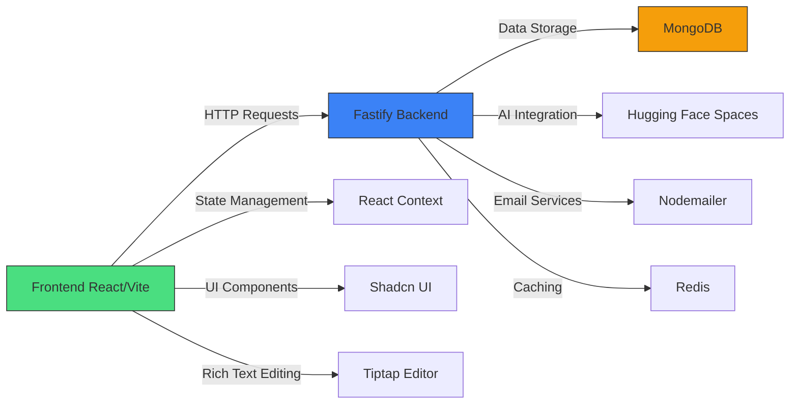
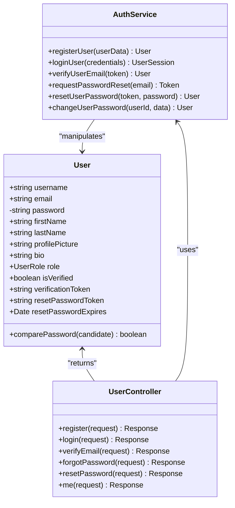
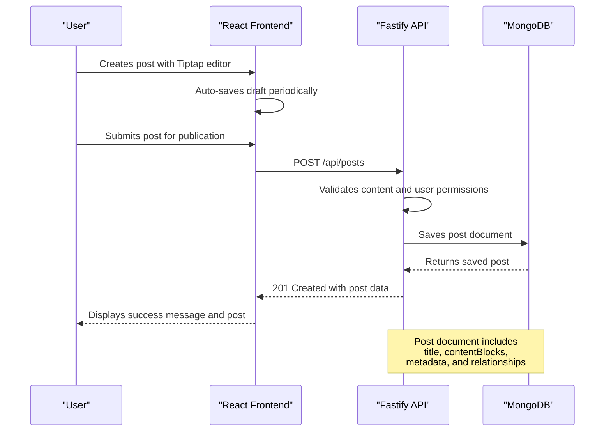
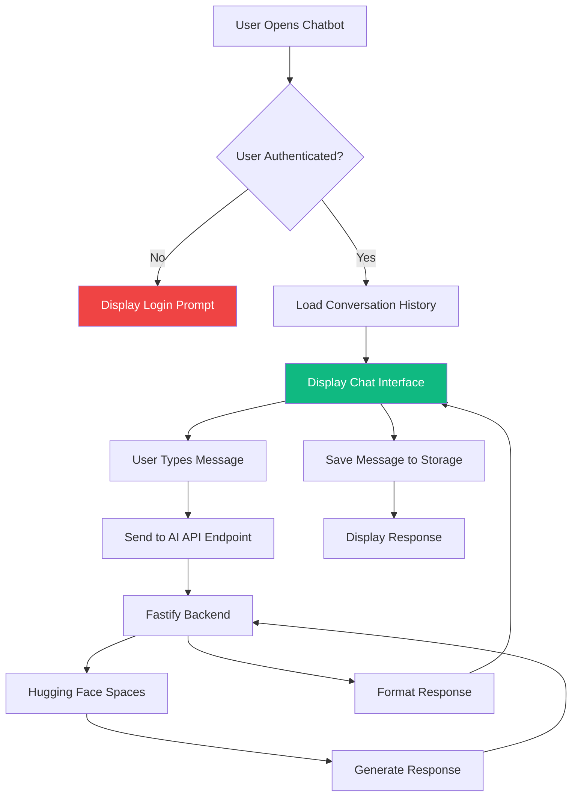
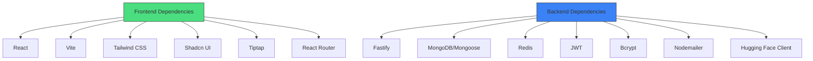

# System Overview

<cite>
**Referenced Files in This Document**   
- [README.md](file://README.md)
- [package.json](file://package.json)
- [api-fastify/package.json](file://api-fastify/package.json)
- [api-fastify/src/server.ts](file://api-fastify/src/server.ts)
- [api-fastify/src/controllers/post.controller.ts](file://api-fastify/src/controllers/post.controller.ts)
- [api-fastify/src/models/user.model.ts](file://api-fastify/src/models/user.model.ts)
- [api-fastify/src/services/auth.service.ts](file://api-fastify/src/services/auth.service.ts)
- [src/App.tsx](file://src/App.tsx)
- [src/main.tsx](file://src/main.tsx)
- [src/UserContext.tsx](file://src/UserContext.tsx)
- [src/config/api.config.ts](file://src/config/api.config.ts)
- [src/features/posts/services/postApi.ts](file://src/features/posts/services/postApi.ts)
- [src/components/Chatbot.tsx](file://src/components/Chatbot.tsx)
</cite>

## Table of Contents
1. [Introduction](#introduction)
2. [Project Structure](#project-structure)
3. [Core Components](#core-components)
4. [Architecture Overview](#architecture-overview)
5. [Detailed Component Analysis](#detailed-component-analysis)
6. [Dependency Analysis](#dependency-analysis)
7. [Performance Considerations](#performance-considerations)
8. [Troubleshooting Guide](#troubleshooting-guide)
9. [Conclusion](#conclusion)

## Introduction
The MERN_chatai_blog system is a full-stack AI-powered blog platform built with modern web technologies. This document provides a comprehensive overview of the system's architecture, components, and functionality. The platform features user authentication, content management, admin dashboard capabilities, and real-time notifications, all integrated within a monorepo structure that separates frontend and backend concerns while maintaining a unified codebase.

## Project Structure

The MERN_chatai_blog application follows a monorepo architecture with clear separation between frontend and backend components. The project is organized into two main directories: `api-fastify` for the backend services and `src` for the frontend application. This structure enables independent development of client and server components while maintaining shared configuration and tooling.

**Diagram sources**
- [README.md](file://README.md#L1-L115)
- [package.json](file://package.json#L1-L114)

**Section sources**
- [README.md](file://README.md#L1-L115)
- [package.json](file://package.json#L1-L114)

## Core Components

The MERN_chatai_blog system comprises several core components that work together to deliver a comprehensive blogging platform with AI capabilities. The backend, built with Fastify and Node.js, provides a robust API for content management, user authentication, and AI interactions. The frontend, developed with React and Vite, offers a modern user interface with rich text editing capabilities through the Tiptap editor. Key components include user authentication services, post management systems, category organization, comment functionality, and an integrated AI chatbot that enhances user engagement.

**Section sources**
- [README.md](file://README.md#L1-L115)
- [package.json](file://package.json#L1-L114)
- [api-fastify/package.json](file://api-fastify/package.json#L1-L57)

## Architecture Overview

The MERN_chatai_blog system follows a clean separation of concerns between frontend and backend components, communicating through a well-defined API layer. The architecture implements a monorepo pattern where both client and server code coexist in a single repository, facilitating coordinated development and deployment. The frontend React application interacts with the Fastify backend API through HTTP requests, with data flowing from user interface components to API endpoints and ultimately to the MongoDB database.

**Diagram sources**
- [api-fastify/src/server.ts](file://api-fastify/src/server.ts#L1-L173)
- [src/App.tsx](file://src/App.tsx#L1-L97)
- [src/config/api.config.ts](file://src/config/api.config.ts#L1-L199)

## Detailed Component Analysis

### Authentication System Analysis

The authentication system in MERN_chatai_blog provides secure user management with JWT-based token authentication. The system supports user registration, login, password recovery, and email verification workflows. Authentication is implemented through dedicated controllers and services that handle user data validation, password hashing with bcrypt, and token generation.

**Diagram sources**
- [api-fastify/src/services/auth.service.ts](file://api-fastify/src/services/auth.service.ts#L1-L199)
- [api-fastify/src/models/user.model.ts](file://api-fastify/src/models/user.model.ts#L1-L96)

**Section sources**
- [api-fastify/src/services/auth.service.ts](file://api-fastify/src/services/auth.service.ts#L1-L243)
- [api-fastify/src/models/user.model.ts](file://api-fastify/src/models/user.model.ts#L1-L97)

### Content Management Analysis

The content management system in MERN_chatai_blog provides comprehensive post creation, editing, and publishing capabilities. The system uses the Tiptap editor for rich text content creation, allowing users to create structured content with various block types. Posts can be saved as drafts, published, or scheduled for future publication.

**Diagram sources**
- [api-fastify/src/controllers/post.controller.ts](file://api-fastify/src/controllers/post.controller.ts#L1-L199)
- [src/features/posts/services/postApi.ts](file://src/features/posts/services/postApi.ts#L1-L199)

**Section sources**
- [api-fastify/src/controllers/post.controller.ts](file://api-fastify/src/controllers/post.controller.ts#L1-L483)
- [src/features/posts/services/postApi.ts](file://src/features/posts/services/postApi.ts#L1-L605)

### AI Chatbot Integration

The AI chatbot feature enhances user engagement by providing an interactive assistant powered by a Qwen model hosted on Hugging Face Spaces. The chatbot maintains conversation history, supports message formatting, and requires user authentication to prevent abuse.

**Diagram sources**
- [src/components/Chatbot.tsx](file://src/components/Chatbot.tsx#L1-L199)
- [api-fastify/src/controllers/ai.controller.ts](file://api-fastify/src/controllers/ai.controller.ts#L1-L50)

**Section sources**
- [src/components/Chatbot.tsx](file://src/components/Chatbot.tsx#L1-L355)
- [src/UserContext.tsx](file://src/UserContext.tsx#L1-L199)

## Dependency Analysis

The MERN_chatai_blog system has a well-defined dependency structure that separates concerns between frontend and backend components. The backend relies on Fastify for the server framework, MongoDB for data persistence, Redis for caching, and external services for AI and email functionality. The frontend uses React for UI rendering, Vite for build tooling, and various UI component libraries for consistent design.

**Diagram sources**
- [package.json](file://package.json#L1-L114)
- [api-fastify/package.json](file://api-fastify/package.json#L1-L57)

**Section sources**
- [package.json](file://package.json#L1-L114)
- [api-fastify/package.json](file://api-fastify/package.json#L1-L57)

## Performance Considerations

The MERN_chatai_blog system incorporates several performance optimizations to ensure responsive user experiences. The backend implements Redis caching for frequently accessed data, reducing database load and improving response times. The frontend leverages React's virtual DOM and code splitting to minimize initial load times and optimize rendering performance. Image optimization is handled through server-side processing with the Sharp library, ensuring efficient delivery of media content.

**Section sources**
- [api-fastify/src/server.ts](file://api-fastify/src/server.ts#L1-L173)
- [api-fastify/src/middlewares/cache.middleware.ts](file://api-fastify/src/middlewares/cache.middleware.ts#L1-L24)
- [src/utils/lazyComponents.ts](file://src/utils/lazyComponents.ts#L1-L10)

## Troubleshooting Guide

Common issues in the MERN_chatai_blog system typically relate to authentication, API connectivity, and environment configuration. Authentication problems often stem from incorrect JWT secret configuration or CORS policy violations. API connectivity issues may occur when the frontend and backend are running on different ports without proper proxy configuration. Environment-specific problems can arise from missing or incorrect environment variables, particularly for database connections and third-party service integrations.

**Section sources**
- [api-fastify/src/server.ts](file://api-fastify/src/server.ts#L1-L173)
- [src/config/api.config.ts](file://src/config/api.config.ts#L1-L199)
- [README.md](file://README.md#L1-L115)

## Conclusion

The MERN_chatai_blog system represents a modern full-stack blog platform with integrated AI capabilities. Its monorepo architecture provides a cohesive development experience while maintaining clear separation between frontend and backend concerns. The system's modular design, with well-defined components for authentication, content management, and AI interactions, enables scalable development and maintenance. By leveraging contemporary technologies like Fastify, React, and Tiptap, the platform delivers a robust and user-friendly blogging experience with advanced features like real-time notifications and AI-powered assistance.