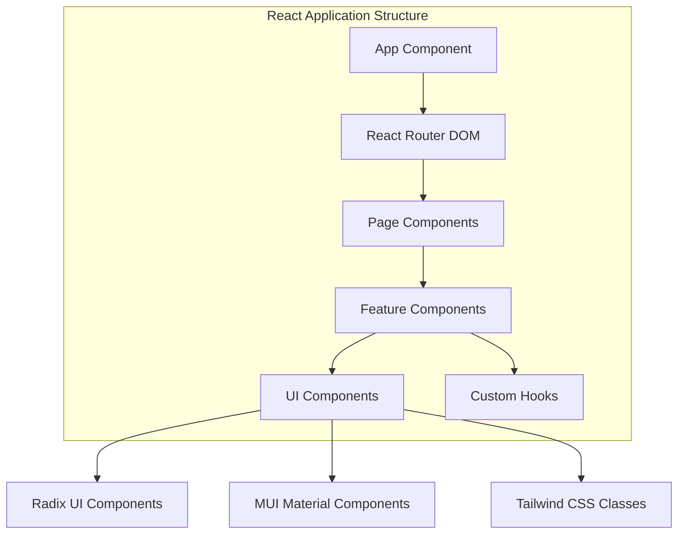
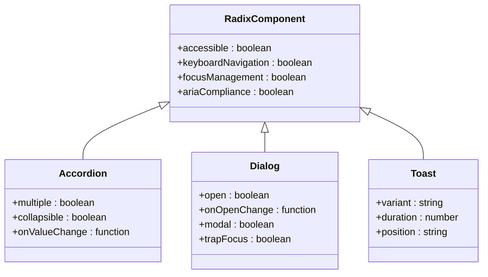
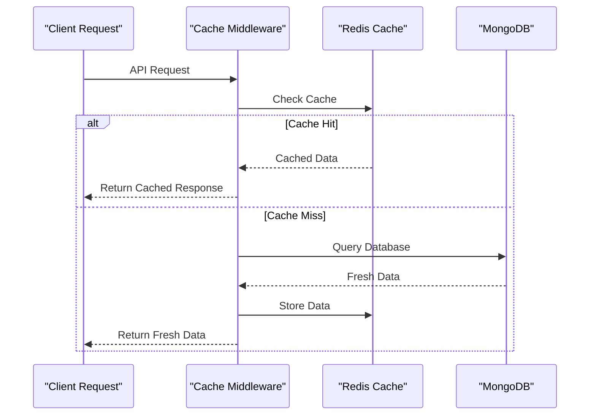
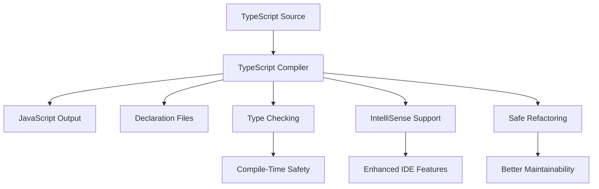
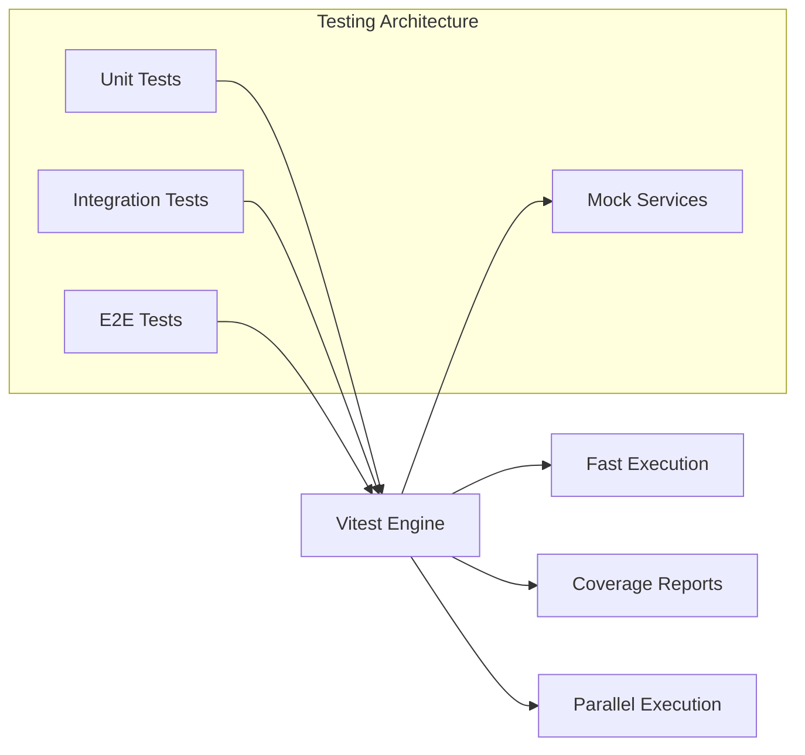
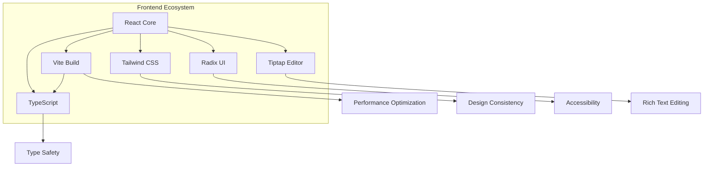
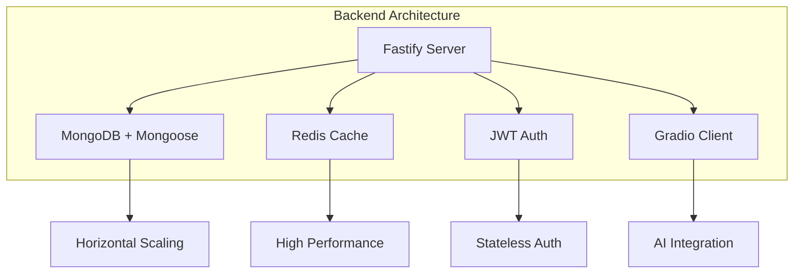
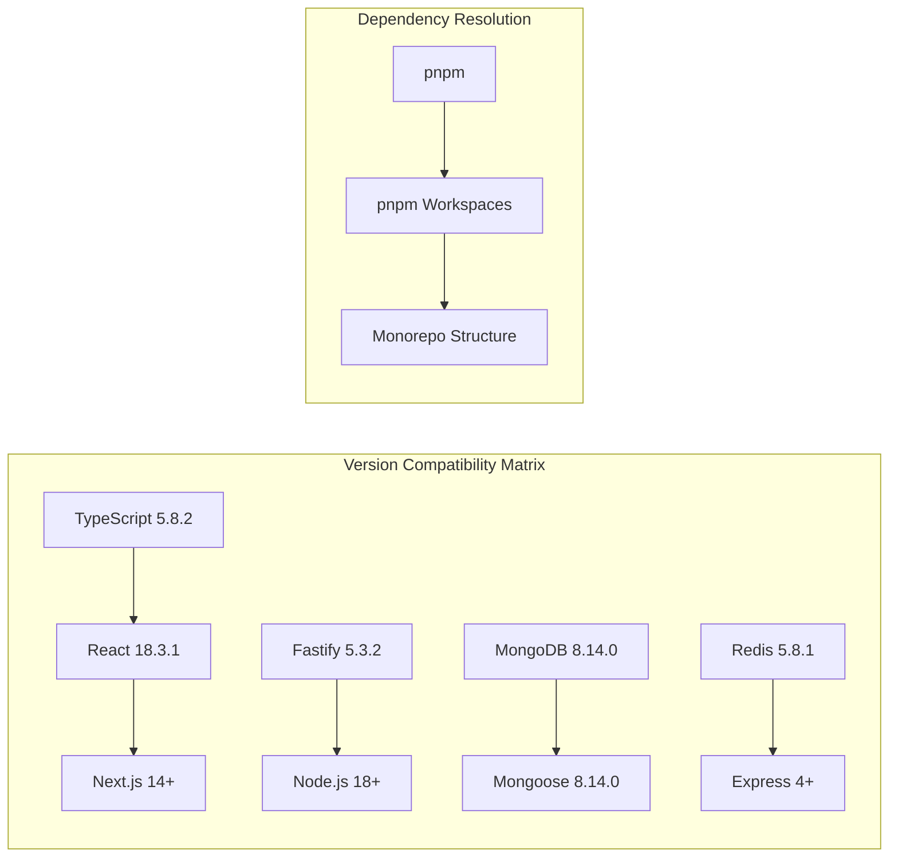

# Technology Stack

<cite>
**Referenced Files in This Document**
- [package.json](file://package.json)
- [api-fastify/package.json](file://api-fastify/package.json)
- [vite.config.js](file://vite.config.js)
- [tailwind.config.js](file://tailwind.config.js)
- [api-fastify/src/server.ts](file://api-fastify/src/server.ts)
- [api-fastify/src/routes/index.ts](file://api-fastify/src/routes/index.ts)
- [src/main.tsx](file://src/main.tsx)
- [src/App.tsx](file://src/App.tsx)
- [src/features/posts/components/BlockEditor/TiptapBlockEditor.tsx](file://src/features/posts/components/BlockEditor/TiptapBlockEditor.tsx)
- [api-fastify/src/services/ai.service.ts](file://api-fastify/src/services/ai.service.ts)
- [api-fastify/src/models/user.model.ts](file://api-fastify/src/models/user.model.ts)
- [api-fastify/src/controllers/auth.controller.ts](file://api-fastify/src/controllers/auth.controller.ts)
</cite>

## Frontend Technologies

### React - Component Architecture Foundation

The frontend is built on React 18.3.1, utilizing modern React patterns including hooks, context providers, and concurrent features. The application follows a component-based architecture with clear separation of concerns:



**Key Implementation Examples:**
- **Component Composition**: The main App component orchestrates routing and layout while delegating specific functionality to specialized components
- **Context Providers**: User authentication state is managed through UserContextProvider, enabling centralized state management across the application
- **Custom Hooks**: Extensive use of custom hooks like `usePosts`, `useComments`, and `useNavigation` for reusable business logic

### Vite - Build Tooling and Development Experience

Vite serves as the primary build tool, providing lightning-fast development server and optimized production builds:

```javascript
// Vite configuration demonstrates modern build tooling
export default defineConfig(({ command, mode }) => {
  const env = loadEnv(mode, process.cwd(), '');
  
  return {
    plugins: [
      react(),
      svgr()
    ],
    resolve: {
      alias: {
        '@': path.resolve(__dirname, './src'),
      },
    },
    server: {
      proxy: {
        '/api': {
          target: 'http://localhost:4200',
          changeOrigin: true,
          secure: false,
          rewrite: (path) => path
        }
      }
    }
  };
});
```

**Benefits:**
- **Fast Development**: Instant hot module replacement (HMR) for rapid iteration
- **ES Modules**: Native ES module support for optimal tree-shaking
- **TypeScript Integration**: Seamless TypeScript compilation and type checking
- **Production Optimization**: Rollup-based bundling with advanced optimizations

### TypeScript - Type Safety and Developer Experience

TypeScript 5.8.2 provides comprehensive type safety throughout the application:

```typescript
// Example from auth controller showing strong typing
export const login = async (
  request: FastifyRequest<{ Body: LoginInput }>,
  reply: FastifyReply
) => {
  try {
    const user = await AuthService.loginUser(request.body);
    // Strongly typed user object with compile-time validation
  } catch (error) {
    // Type-safe error handling
  }
};
```

**Implementation Benefits:**
- **Compile-Time Safety**: Catch type errors before runtime
- **Better IDE Support**: Enhanced autocompletion and refactoring capabilities
- **Documentation**: Types serve as living documentation for the codebase
- **Maintainability**: Easier to refactor and maintain large codebases

### Tailwind CSS - Utility-First Styling Framework

Tailwind CSS 3.4.1 provides a utility-first approach to styling with extensive customization:

```javascript
// Tailwind configuration demonstrates comprehensive theming
module.exports = {
  darkMode: ["class"],
  theme: {
    extend: {
      colors: {
        primary: {
          DEFAULT: "hsl(var(--primary))",
          foreground: "hsl(var(--primary-foreground))",
          50: "#f0fdf4",
          100: "#dcfce7",
          // ... additional color variants
        },
        // Custom animations and transitions
        animation: {
          "fade-in": "fadeIn 0.5s ease-out",
          "slide-up": "slideUp 0.5s ease-out",
        }
      }
    }
  }
};
```

**Architectural Advantages:**
- **Consistency**: Uniform design system across the entire application
- **Performance**: Minimal CSS bundle size through purging unused styles
- **Customization**: Easy theme customization through CSS variables
- **Responsive Design**: Built-in responsive utilities for mobile-first development

### Radix UI - Accessible Component Library

Radix UI 1.2.8 provides low-level, accessible primitives for building accessible user interfaces:



**Accessibility Features:**
- **Keyboard Navigation**: Full keyboard accessibility for all interactive elements
- **Screen Reader Support**: Comprehensive ARIA labels and roles
- **Focus Management**: Automatic focus trapping and restoration
- **Color Contrast**: Ensures WCAG AA compliance for all components

### Tiptap - Rich Text Editing Platform

Tiptap 3.2.0 provides a powerful, extensible rich text editor with React integration:

```typescript
// Tiptap editor configuration demonstrates extensibility
const editor = useEditor({
  extensions: [
    StarterKit.configure({
      heading: { levels: [1, 2, 3, 4] },
    }),
    Link.configure({ openOnClick: true }),
    Image.configure({ inline: false, allowBase64: true }),
    Placeholder.configure({
      placeholder,
      includeChildren: true,
    }),
    CharacterCount.configure({
      limit: 0, // Flexible character counting
    }),
  ],
  content: initialJSON ?? '<p></p>',
  onUpdate: ({ editor }) => {
    const json = editor.getJSON();
    onChange?.([{ type: 'tiptap', data: { doc: json } }]);
  },
});
```

**Technical Implementation:**
- **Modular Architecture**: Extensions for headings, links, images, and more
- **JSON Serialization**: Complete document state preservation
- **Custom Extensions**: Character counting, placeholder support, and more
- **Performance**: Efficient rendering with minimal DOM manipulation

**Section sources**
- [package.json](file://package.json#L1-L115)
- [vite.config.js](file://vite.config.js#L1-L41)
- [tailwind.config.js](file://tailwind.config.js#L1-L171)
- [src/main.tsx](file://src/main.tsx#L1-L99)
- [src/App.tsx](file://src/App.tsx#L1-L98)
- [src/features/posts/components/BlockEditor/TiptapBlockEditor.tsx](file://src/features/posts/components/BlockEditor/TiptapBlockEditor.tsx#L1-L218)

## Backend Technologies

### Fastify - High-Performance REST API Framework

Fastify 5.3.2 serves as the foundation for the backend API, providing exceptional performance and scalability:

```typescript
// Fastify server configuration demonstrates enterprise-grade setup
export async function buildServer(): Promise<FastifyInstance> {
  const server = Fastify({
    logger: {
      level: process.env.NODE_ENV === 'production' ? 'info' : 'debug',
      transport: {
        target: 'pino-pretty',
        options: {
          translateTime: 'HH:MM:ss Z',
          ignore: 'pid,hostname',
        },
      },
    },
    bodyLimit: 10 * 1024 * 1024, // 10MB for base64 images
  });

  // CORS configuration with multiple origins
  await server.register(cors, {
    origin: (origin, cb) => {
      const allowedOrigins = [
        'https://iwomi-blog.netlify.app',
        'http://localhost:5173',
        'http://localhost:4200',
        // ... additional origins
      ];
      // Origin validation logic
    },
    credentials: true,
    methods: ['GET', 'POST', 'PUT', 'DELETE', 'OPTIONS'],
  });
}
```

**Performance Characteristics:**
- **Speed**: Fastify is one of the fastest web frameworks in Node.js
- **Low Overhead**: Minimal abstraction layers for maximum performance
- **Schema Validation**: Built-in validation for request/response schemas
- **Plugin Architecture**: Extensible through a rich ecosystem of plugins

### MongoDB/Mongoose - Data Persistence Layer

MongoDB 8.14.0 with Mongoose 8.14.0 provides flexible, schema-less data storage:

```typescript
// User model demonstrates Mongoose schema definition
const userSchema = new Schema<IUser>({
  username: {
    type: String,
    required: true,
    unique: true,
    trim: true,
    minlength: 3,
    maxlength: 30,
  },
  email: {
    type: String,
    required: true,
    unique: true,
    trim: true,
    lowercase: true,
    match: [/^\S+@\S+\.\S+$/, 'Please provide a valid email address'],
  },
  password: {
    type: String,
    required: true,
    minlength: 6,
  },
  // Additional fields...
}, {
  timestamps: true,
  toJSON: {
    transform: (_, ret) => {
      delete ret.password; // Security: never expose passwords
      delete ret.verificationToken;
      return ret;
    },
  },
});
```

**Data Model Architecture:**
- **Flexible Schema**: Dynamic field addition without migrations
- **Indexing**: Automatic indexing for query optimization
- **Validation**: Built-in validation with custom validators
- **Security**: Automatic sanitization and protection against injection attacks

### Redis - Caching and Session Management

Redis 5.8.1 provides high-performance caching and session storage:



**Implementation Benefits:**
- **Performance**: Sub-millisecond response times for cached data
- **Scalability**: Horizontal scaling with distributed caching
- **Session Storage**: Secure, scalable session management
- **Real-time Features**: Support for real-time notifications and chat

### JWT - Authentication and Authorization

JSON Web Tokens 9.0.2 provide stateless authentication:

```typescript
// JWT configuration demonstrates security best practices
await server.register(jwt, {
  secret: process.env.JWT_SECRET || 'default_secret_change_in_production',
  sign: {
    expiresIn: process.env.JWT_EXPIRES_IN || '30d',
  },
  cookie: {
    cookieName: 'token',
    signed: false
  },
  messages: {
    badRequestErrorMessage: 'Invalid token format',
    noAuthorizationInHeaderMessage: 'Missing authentication token',
    authorizationTokenExpiredMessage: 'Token expired',
    authorizationTokenInvalid: 'Invalid token',
    authorizationTokenUntrusted: 'Untrusted token'
  }
});
```

**Security Features:**
- **Stateless Authentication**: No server-side session storage
- **Expiration Control**: Configurable token lifetimes
- **Secure Transmission**: Encrypted tokens with HMAC signatures
- **Multi-Factor Support**: Role-based access control

### @gradio/client - AI Integration Platform

@gradio/client 1.14.2 enables seamless integration with machine learning models:

```typescript
// AI service demonstrates multi-model fallback architecture
const generateResponse = async (messages: IMessage[]): Promise<string> => {
  const models = [
    "Qwen/Qwen2-72B-Instruct",
    "Qwen/Qwen1.5-110B-Chat-demo"
  ];

  for (const model of models) {
    try {
      const client = await Client.connect(model);
      const result = await client.predict("/model_chat", {
        query: lastUserMessage,
        history: history,
        system: process.env.QWEN_PROMPT || "You are a helpful assistant..."
      });
      
      // Extract response from complex API structure
      const resultData = result.data as any;
      const aiResponse = resultData[1][resultData[1].length - 1][1];
      return aiResponse;
    } catch (error) {
      // Fallback to next model
      if (model === models[models.length - 1]) {
        throw error;
      }
    }
  }
};
```

**AI Integration Architecture:**
- **Model Flexibility**: Support for multiple AI models with automatic fallback
- **Session Management**: Maintains conversation context across requests
- **Error Resilience**: Graceful degradation when models fail
- **Scalable Architecture**: Handles multiple concurrent AI requests

**Section sources**
- [api-fastify/package.json](file://api-fastify/package.json#L1-L58)
- [api-fastify/src/server.ts](file://api-fastify/src/server.ts#L1-L174)
- [api-fastify/src/routes/index.ts](file://api-fastify/src/routes/index.ts#L1-L53)
- [api-fastify/src/services/ai.service.ts](file://api-fastify/src/services/ai.service.ts#L1-L131)
- [api-fastify/src/models/user.model.ts](file://api-fastify/src/models/user.model.ts#L1-L97)
- [api-fastify/src/controllers/auth.controller.ts](file://api-fastify/src/controllers/auth.controller.ts#L1-L330)

## Development Tools and Infrastructure

### TypeScript - Development Environment Enhancement

TypeScript 5.8.2 provides comprehensive type checking and development assistance:



**Development Workflow Benefits:**
- **IDE Integration**: Full IntelliSense support with VS Code
- **Refactoring Safety**: Safe code modifications with confidence
- **Documentation**: Living documentation through type definitions
- **Error Prevention**: Catch bugs early in the development cycle

### ESLint - Code Quality and Consistency

ESLint 8.57.1 with TypeScript integration ensures code quality:

```javascript
// ESLint configuration demonstrates comprehensive linting
{
  "plugins": [
    "@typescript-eslint",
    "react",
    "react-hooks",
    "react-refresh"
  ],
  "rules": {
    "react-hooks/rules-of-hooks": "error",
    "react-hooks/exhaustive-deps": "warn",
    "@typescript-eslint/explicit-function-return-type": "off",
    "@typescript-eslint/no-unused-vars": "error"
  }
}
```

**Quality Assurance Features:**
- **Code Style**: Consistent formatting across the team
- **Best Practices**: Enforces React and TypeScript best practices
- **Bug Prevention**: Identifies potential runtime errors
- **Performance**: Detects performance anti-patterns

### Prettier - Automated Code Formatting

Prettier 3.2.5 ensures consistent code formatting:

```javascript
// Prettier configuration integrated with ESLint
{
  "semi": true,
  "singleQuote": true,
  "tabWidth": 2,
  "trailingComma": "es5",
  "printWidth": 100
}
```

**Formatting Benefits:**
- **Consistency**: Eliminates formatting debates
- **Automation**: Automatic formatting on save
- **Team Collaboration**: Standardized code appearance
- **Readability**: Improved code readability across teams

### Vitest - Modern Testing Framework

Vitest 1.4.0 provides fast, modern testing capabilities:



**Testing Advantages:**
- **Speed**: Lightning-fast test execution with Vite integration
- **Modern APIs**: Familiar Jest-like syntax with improved performance
- **Coverage**: Built-in coverage reporting and analysis
- **Developer Experience**: Hot reloading during test development

### pnpm Workspaces - Monorepo Management

pnpm workspaces enable efficient monorepo management:

```json
{
  "workspaces": [
    "packages/*",
    "apps/*"
  ],
  "pnpm": {
    "ignoredBuiltDependencies": [
      "esbuild"
    ]
  }
}
```

**Monorepo Benefits:**
- **Dependency Sharing**: Shared dependencies across packages
- **Workspace Linking**: Automatic linking of local packages
- **Efficient Storage**: Deduplicated package storage
- **Build Optimization**: Parallel builds across workspaces

## Technology Rationale and Integration

### Frontend Technology Synergy

The frontend technologies work together to create a cohesive, maintainable application:



**Integration Benefits:**
- **Unified Development Experience**: Consistent tooling across the stack
- **Performance Optimization**: Vite's native ES modules and React's concurrent features
- **Type Safety**: End-to-end type safety from API to UI
- **Accessibility**: Radix UI's commitment to accessibility standards
- **Developer Productivity**: Seamless integration between tools

### Backend Technology Integration

The backend technologies form a robust, scalable foundation:



**Architectural Strengths:**
- **Performance**: Fastify's speed combined with Redis caching
- **Scalability**: MongoDB's horizontal scaling capabilities
- **Security**: JWT-based authentication with secure token management
- **Extensibility**: Gradio client enables easy AI model integration

### Version Compatibility and Dependency Management

The technology stack maintains careful version compatibility:



**Compatibility Strategies:**
- **Long-term Support**: Selection of LTS-compatible versions
- **Incremental Updates**: Gradual migration paths for major updates
- **Dependency Isolation**: Prevents version conflicts between packages
- **Automated Testing**: Ensures compatibility across all technology combinations

## Conclusion

The MERN_chatai_blog technology stack represents a modern, well-architected approach to full-stack development. The combination of React for frontend architecture, Fastify for backend performance, and comprehensive tooling creates a robust platform capable of supporting complex features like AI integration, rich text editing, and real-time communication.

The technology choices reflect a balance between performance, developer experience, and maintainability. Each component serves a specific purpose while integrating seamlessly with the others to create a cohesive, scalable application architecture.

**Key Architectural Principles:**
- **Performance First**: Every technology is chosen for its performance characteristics
- **Developer Experience**: Tools that enhance productivity and reduce cognitive load
- **Maintainability**: Clear separation of concerns and modular architecture
- **Scalability**: Technologies designed to grow with the application's needs

This technology stack positions the application for continued growth and feature expansion while maintaining high standards for code quality, security, and user experience.