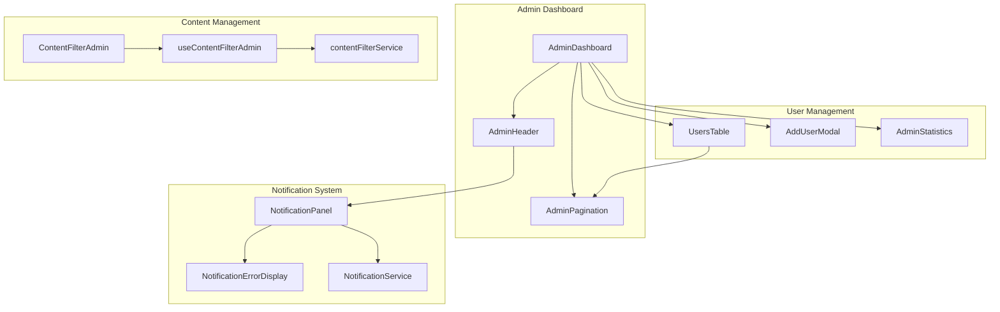
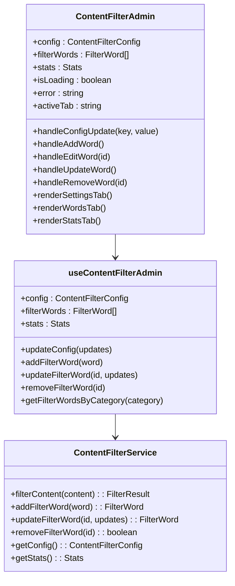
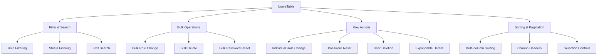
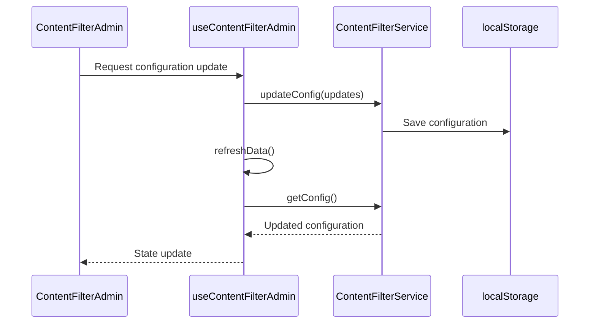

# Admin Components Documentation

<cite>
**Referenced Files in This Document**
- [ContentFilterAdmin.tsx](file://src/components/admin/ContentFilterAdmin.tsx)
- [NotificationPanel.tsx](file://src/components/admin/NotificationPanel.tsx)
- [NotificationErrorDisplay.tsx](file://src/components/admin/NotificationErrorDisplay.tsx)
- [AdminHeader.tsx](file://src/components/AdminHeader.tsx)
- [AdminPagination.tsx](file://src/components/AdminPagination.tsx)
- [AdminStatistics.tsx](file://src/components/AdminStatistics.tsx)
- [UsersTable.tsx](file://src/components/UsersTable.tsx)
- [AddUserModal.tsx](file://src/components/AddUserModal.tsx)
- [AdminDashboard.tsx](file://src/pages/AdminDashboard.tsx)
- [useContentFilterAdmin.ts](file://src/hooks/useContentFilterAdmin.ts)
- [contentFilter.ts](file://src/services/contentFilter.ts)
</cite>

## Table of Contents
1. [Introduction](#introduction)
2. [Component Architecture](#component-architecture)
3. [Core Admin Components](#core-admin-components)
4. [Content Management Components](#content-management-components)
5. [User Management Components](#user-management-components)
6. [Notification System](#notification-system)
7. [State Management](#state-management)
8. [Integration Patterns](#integration-patterns)
9. [Accessibility Features](#accessibility-features)
10. [Performance Considerations](#performance-considerations)
11. [Extension Guidelines](#extension-guidelines)
12. [Troubleshooting](#troubleshooting)

## Introduction

The MERN_chatai_blog admin system provides a comprehensive suite of UI components designed for administrative tasks including user management, content filtering, notifications, and statistics display. These components are built with modern React patterns, TypeScript support, and focus on accessibility and performance.

The admin interface consists of specialized components that handle different aspects of blog administration:
- **ContentFilterAdmin**: Manages content filtering settings and filter words
- **NotificationPanel**: Displays real-time notifications with advanced error handling
- **AdminHeader**: Provides navigation and user management functionality
- **UsersTable**: Handles user data display with pagination and bulk operations
- **AdminStatistics**: Visualizes user and content statistics
- **AddUserModal**: Streamlined user creation interface

## Component Architecture

The admin components follow a modular architecture with clear separation of concerns:

**Diagram sources**
- [AdminDashboard.tsx](file://src/pages/AdminDashboard.tsx#L1-L50)
- [AdminHeader.tsx](file://src/components/AdminHeader.tsx#L1-L50)
- [ContentFilterAdmin.tsx](file://src/components/admin/ContentFilterAdmin.tsx#L1-L50)

## Core Admin Components

### AdminHeader Component

The AdminHeader serves as the primary navigation interface for the admin dashboard, providing:

- **Tab Navigation**: Switch between Users and Statistics views
- **Real-time Notifications**: Integrated notification panel with unread counts
- **User Profile Management**: Logout functionality and user information display
- **Responsive Design**: Mobile-friendly hamburger menu
- **Theme Toggle**: Dark/light mode switching

**Key Features:**
- Real-time notification polling (30-second intervals)
- Keyboard shortcuts for accessibility
- Click-outside detection for dropdown menus
- Animated transitions using Framer Motion

**Section sources**
- [AdminHeader.tsx](file://src/components/AdminHeader.tsx#L1-L415)

### AdminPagination Component

A sophisticated pagination component designed for large datasets:

**Features:**
- Intelligent page numbering with ellipsis for long lists
- Keyboard navigation support
- Responsive design for mobile devices
- Accessibility compliance with ARIA labels
- Smooth animations using Framer Motion

**Implementation Details:**
- Dynamic page calculation based on total pages
- Configurable page size limits
- Disabled state handling for boundary conditions
- Visual feedback for current page selection

**Section sources**
- [AdminPagination.tsx](file://src/components/AdminPagination.tsx#L1-L134)

## Content Management Components

### ContentFilterAdmin Component

The ContentFilterAdmin provides comprehensive content moderation capabilities:

**Diagram sources**
- [ContentFilterAdmin.tsx](file://src/components/admin/ContentFilterAdmin.tsx#L1-L50)
- [useContentFilterAdmin.ts](file://src/hooks/useContentFilterAdmin.ts#L1-L30)
- [contentFilter.ts](file://src/services/contentFilter.ts#L1-L50)

**Key Features:**

**1. Configuration Management:**
- Enable/disable content filtering globally
- Strict vs lenient matching modes
- Custom replacement text configuration
- Whitelist management for bypass words

**2. Filter Word Management:**
- Comprehensive CRUD operations
- Category-based organization (profanity, hate-speech, spam, adult)
- Severity classification (mild, moderate, severe)
- Active/inactive status control
- Bulk operations and search functionality

**3. Statistics and Analytics:**
- Real-time word count statistics
- Category distribution analysis
- Severity level breakdown
- Active vs inactive word ratios

**4. Testing and Validation:**
- Live content filtering simulation
- Flagged word highlighting
- Filter result visualization
- Performance monitoring

**Section sources**
- [ContentFilterAdmin.tsx](file://src/components/admin/ContentFilterAdmin.tsx#L1-L741)
- [useContentFilterAdmin.ts](file://src/hooks/useContentFilterAdmin.ts#L1-L238)

### Notification System Components

The notification system provides real-time communication between admins and the platform:

#### NotificationPanel Component

**Advanced Features:**
- Real-time notification polling with configurable intervals
- Mark-all-as-read functionality
- Keyboard navigation support (arrow keys, escape)
- Scroll position preservation
- Automatic scroll-to-top button
- Focus management for accessibility

**Error Handling:**
- Network error detection and recovery
- Connection status indicators
- Retry mechanisms with exponential backoff
- User-friendly error messages

#### NotificationErrorDisplay Component

**Enhanced Error Experience:**
- Visual error categorization by type
- Connection status visualization
- Retry buttons with loading states
- Animated transitions for better UX
- Responsive design for various screen sizes

**Section sources**
- [NotificationPanel.tsx](file://src/components/admin/NotificationPanel.tsx#L1-L455)
- [NotificationErrorDisplay.tsx](file://src/components/admin/NotificationErrorDisplay.tsx#L1-L108)

## User Management Components

### UsersTable Component

The UsersTable provides comprehensive user data management with advanced features:

**Diagram sources**
- [UsersTable.tsx](file://src/components/UsersTable.tsx#L1-L100)

**Key Features:**

**1. Advanced Filtering:**
- Multi-criteria filtering (role, status, search text)
- Real-time filter application
- Clear filter functionality
- Responsive filter dropdown

**2. Bulk Operations:**
- Select all/none functionality
- Bulk role assignment
- Bulk deletion with confirmation
- Bulk password reset
- Visual feedback for selected items

**3. Row Interactions:**
- Expandable user details
- Individual role modification
- Password reset triggers
- User deletion with confirmation
- Action menu with dropdown

**4. Data Presentation:**
- Responsive table layout
- Color-coded role badges
- Verified/unverified status indicators
- Date formatting and localization
- Hover effects and transitions

**Section sources**
- [UsersTable.tsx](file://src/components/UsersTable.tsx#L1-L616)

### AddUserModal Component

A streamlined user creation interface with comprehensive validation:

**Features:**
- Complete user registration form
- Real-time field validation
- Role-based user creation
- Error handling and user feedback
- Loading states and success confirmation
- Accessibility compliance

**Validation Rules:**
- Required field validation
- Email format validation
- Password strength requirements (minimum 6 characters)
- Unique username enforcement
- Proper form submission handling

**Section sources**
- [AddUserModal.tsx](file://src/components/AddUserModal.tsx#L1-L230)

### AdminStatistics Component

Visual representation of user and content statistics:

**Charts and Visualizations:**
- Monthly user registration trends
- Role distribution pie charts
- Statistical cards with icons
- Recent user activity display
- Interactive tooltips and legends

**Data Processing:**
- Historical data aggregation
- Trend calculations
- Role-based statistics
- Verification rate calculations
- Recent user extraction

**Section sources**
- [AdminStatistics.tsx](file://src/components/AdminStatistics.tsx#L1-L378)

## State Management

### useContentFilterAdmin Hook

Centralized state management for content filtering operations:

**Diagram sources**
- [useContentFilterAdmin.ts](file://src/hooks/useContentFilterAdmin.ts#L69-L115)
- [contentFilter.ts](file://src/services/contentFilter.ts#L235-L293)

**State Properties:**
- **Configuration**: Global filtering settings
- **Filter Words**: Complete word list with metadata
- **Statistics**: Real-time analytics data
- **Loading States**: Operation progress indication
- **Error Handling**: Centralized error management

**Section sources**
- [useContentFilterAdmin.ts](file://src/hooks/useContentFilterAdmin.ts#L1-L238)

### Global Error Handling

Centralized error management across admin components:

**Error Types:**
- Network connectivity issues
- Authentication failures
- Data validation errors
- Service operation failures
- User interaction errors

**Error Recovery:**
- Automatic retry mechanisms
- User-friendly error messages
- Graceful degradation
- Logging for debugging
- Progress indication during retries

## Integration Patterns

### Backend Integration

Admin components integrate with the Fastify backend through well-defined APIs:

**API Endpoints:**
- `/api/users/list`: User management operations
- `/api/users/change-role/:id`: Role modification
- `/api/users/delete/:id`: User deletion
- `/api/auth/forgot-password`: Password reset
- `/api/auth/check-admin`: Admin privilege verification

**Communication Patterns:**
- HTTP requests with credential inclusion
- JSON payload serialization
- Error response parsing
- Loading state management
- Retry logic implementation

### Service Layer Integration

**Content Filter Service:**
- Singleton pattern implementation
- Local storage persistence
- Real-time configuration updates
- Filter word lifecycle management
- Statistical data computation

**Notification Service:**
- WebSocket integration (when available)
- Polling mechanism for fallback
- Real-time data synchronization
- Connection status monitoring
- Error recovery strategies

**Section sources**
- [AdminDashboard.tsx](file://src/pages/AdminDashboard.tsx#L50-L150)

## Accessibility Features

### Keyboard Navigation

All admin components support comprehensive keyboard navigation:

**Global Shortcuts:**
- `F5` or `Ctrl/Cmd + R`: Refresh data
- `Ctrl/Cmd + N`: Open add user modal
- `Escape`: Close modals and menus
- `Arrow Up/Down`: Navigate notification list
- `A + Ctrl/Cmd`: Mark all notifications as read

**Component-Specific:**
- Tab navigation through interactive elements
- Enter/Space activation of buttons
- Arrow key navigation in dropdowns
- Focus management for modals and panels

### Screen Reader Support

**ARIA Implementation:**
- Proper landmark navigation
- Descriptive button labels
- ARIA-expanded states for dropdowns
- ARIA-selected states for table rows
- Live regions for dynamic content

**Visual Accessibility:**
- High contrast color schemes
- Focus indicators for keyboard navigation
- Clear visual hierarchy
- Consistent button styling
- Responsive design for various screen sizes

### Semantic HTML

**Proper Element Usage:**
- Semantic table markup for data presentation
- Correct heading hierarchy
- Appropriate button semantics
- Form element labeling
- List item organization

**Section sources**
- [NotificationPanel.tsx](file://src/components/admin/NotificationPanel.tsx#L100-L150)
- [UsersTable.tsx](file://src/components/UsersTable.tsx#L200-L300)

## Performance Considerations

### Lazy Loading and Code Splitting

**Component Optimization:**
- Dynamic imports for heavy components
- Virtual scrolling for large datasets
- Debounced search functionality
- Memoized calculations for expensive operations
- Efficient re-rendering strategies

### Memory Management

**State Optimization:**
- Proper cleanup of event listeners
- Unsubscribing from services
- Garbage collection of unused data
- Efficient array and object manipulation
- Preventing memory leaks in long-running sessions

### Network Optimization

**Request Management:**
- Request deduplication
- Caching strategies for static data
- Batch operations for bulk actions
- Progressive loading for large datasets
- Optimistic updates with rollback capabilities

### Rendering Performance

**UI Optimization:**
- React.memo for pure components
- useCallback for expensive functions
- useMemo for computed values
- Efficient DOM updates
- Minimal re-renders through proper state management

## Extension Guidelines

### Adding New Admin Components

**Development Workflow:**
1. **Define Component Interface**: Create TypeScript interfaces for props and state
2. **Implement Business Logic**: Develop hooks for data management
3. **Create UI Components**: Build React components with proper styling
4. **Integrate with Services**: Connect to backend APIs and services
5. **Add Testing**: Implement unit and integration tests
6. **Documentation**: Update component documentation

**Best Practices:**
- Follow established naming conventions
- Implement proper error handling
- Support responsive design
- Include accessibility features
- Provide clear user feedback
- Optimize for performance

### Extending Existing Components

**ContentFilterAdmin Extensions:**
- Additional filter categories
- Custom severity levels
- Advanced search and filtering
- Export/import functionality
- Audit trail for modifications

**NotificationPanel Extensions:**
- Custom notification types
- Rich media support
- Notification scheduling
- Template management
- Analytics integration

**UsersTable Extensions:**
- Custom user attributes
- Advanced reporting features
- Integration with external systems
- Bulk export capabilities
- Custom filtering criteria

### Service Layer Extensions

**Content Filter Service Enhancements:**
- Machine learning integration
- Context-aware filtering
- Dynamic threshold adjustment
- Collaborative filtering
- Performance metrics collection

**Notification Service Enhancements:**
- Push notification support
- Multi-channel delivery
- Priority-based routing
- Delivery confirmation
- Analytics and reporting

## Troubleshooting

### Common Issues and Solutions

**1. Content Filtering Not Working:**
- Verify content filter service initialization
- Check browser localStorage availability
- Review filter word configurations
- Test with different content samples
- Monitor network requests for errors

**2. Notification Panel Issues:**
- Confirm WebSocket connection status
- Check polling interval settings
- Verify authentication tokens
- Review notification service configuration
- Test with different browsers

**3. User Management Problems:**
- Validate API endpoint accessibility
- Check user role permissions
- Verify database connectivity
- Review request/response formats
- Test with different user accounts

**4. Performance Issues:**
- Monitor component rendering times
- Check for memory leaks
- Optimize data fetching strategies
- Review bundle sizes
- Implement caching where appropriate

### Debugging Tools

**Development Utilities:**
- React DevTools for component inspection
- Redux DevTools for state management
- Network tab for API monitoring
- Console logging for error tracking
- Performance tab for optimization

**Production Monitoring:**
- Error tracking services
- Performance monitoring tools
- User session analysis
- Feature flag management
- A/B testing capabilities

### Support Resources

**Documentation:**
- Component API references
- Integration guides
- Best practice guidelines
- Migration procedures
- FAQ sections

**Community Support:**
- GitHub issue tracking
- Discussion forums
- Stack Overflow tags
- Community examples
- Contributing guidelines

**Professional Support:**
- Commercial support options
- Training programs
- Consulting services
- Custom development
- Maintenance agreements