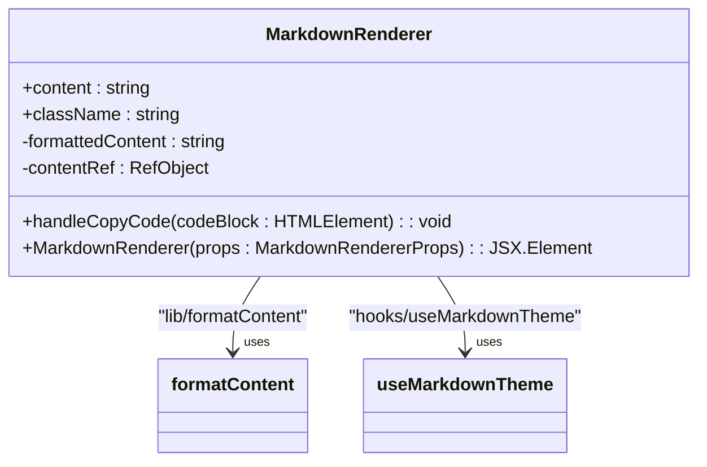
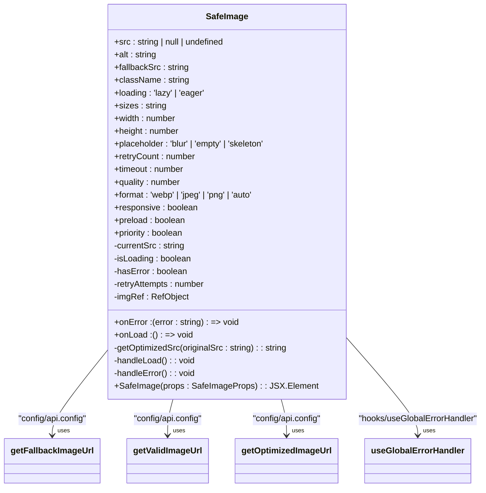
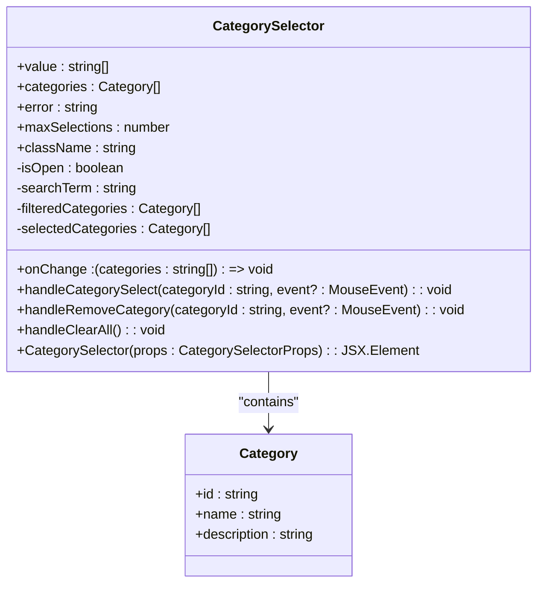
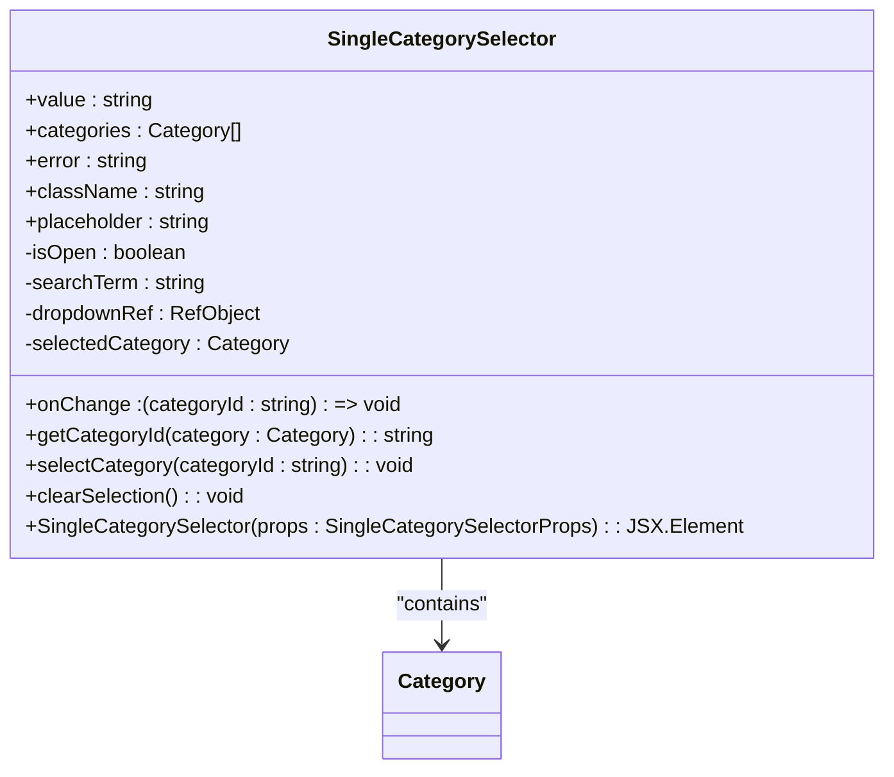
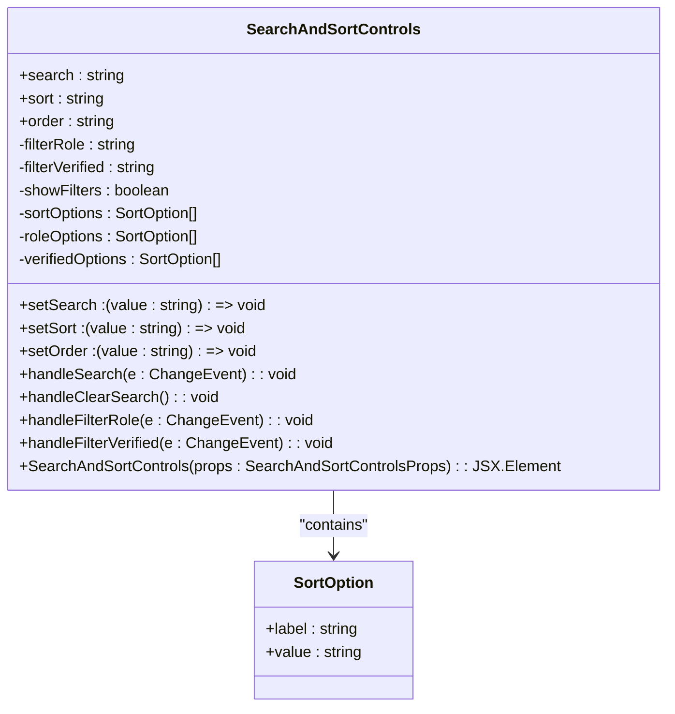

# Blog-Specific Components

<cite>
**Referenced Files in This Document**   
- [Post.tsx](file://src/components/Post.tsx)
- [MarkdownRenderer.tsx](file://src/components/MarkdownRenderer.tsx)
- [TiptapRenderer.tsx](file://src/components/TiptapRenderer.tsx)
- [PostImage.tsx](file://src/components/PostImage.tsx)
- [SafeImage.tsx](file://src/components/SafeImage.tsx)
- [Featured.tsx](file://src/components/Featured.tsx)
- [LatestArticle.tsx](file://src/components/LatestArticle.tsx)
- [SearchAndSortControls.tsx](file://src/components/SearchAndSortControls.tsx)
- [CategorySelector.tsx](file://src/features/posts/components/PostForm/CategorySelector.tsx)
- [SingleCategorySelector.tsx](file://src/features/posts/components/PostForm/SingleCategorySelector.tsx)
- [PostType.ts](file://src/types/PostType.ts)
- [FeaturedProps.ts](file://src/types/FeaturedProps.ts)
- [SortOption.ts](file://src/types/SortOption.ts)
</cite>

## Table of Contents
1. [Introduction](#introduction)
2. [Core Components](#core-components)
3. [Content Rendering Components](#content-rendering-components)
4. [Image Handling Components](#image-handling-components)
5. [Featured and Latest Article Components](#featured-and-latest-article-components)
6. [Category Selection Components](#category-selection-components)
7. [Search and Sorting Controls](#search-and-sorting-controls)
8. [Conclusion](#conclusion)

## Introduction
This document provides comprehensive documentation for the blog-specific UI components in the MERN_chatai_blog application. The components detailed here are essential for rendering blog content, handling images, displaying featured articles, managing category selection, and implementing search and sorting functionality. These components work together to create a rich, interactive blogging experience with responsive design and performance optimizations.

## Core Components

The Post component serves as the primary building block for displaying blog posts throughout the application. It renders post information including title, author, publication date, summary, and engagement metrics in a card-based layout. The component supports multiple variants and includes interactive elements for liking, bookmarking, and sharing posts.

The Post component accepts several props to customize its appearance and behavior:
- `post`: The post data object containing all necessary information
- `variant`: Controls the visual style of the component
- `showActions`: Determines whether action buttons are displayed
- `showStats`: Controls the visibility of post statistics
- `isFavorite`: Indicates if the post is featured/favorite
- `fixedHeight`: Determines whether the card has a fixed height

The component implements several helper functions for extracting and formatting post data, including `extractSummaryFromTiptap` which parses Tiptap editor content to generate a text summary, and `getCategory` which retrieves category information from the post data.

**Section sources**
- [Post.tsx](file://src/components/Post.tsx#L1-L480)
- [PostType.ts](file://src/types/PostType.ts#L1-L66)

## Content Rendering Components

### MarkdownRenderer
The MarkdownRenderer component is responsible for converting Markdown content into properly formatted HTML. It integrates with the application's theme system to ensure consistent styling across light and dark modes.

Key features of the MarkdownRenderer include:
- Syntax highlighting for code blocks
- Copy-to-clipboard functionality for code snippets
- Image zooming capabilities
- Theme-aware styling with dynamic CSS variables

The component uses the `formatContent` utility function from the lib directory to process the Markdown content and applies appropriate CSS classes for styling. It also implements event handlers for user interactions with code blocks and images.



**Diagram sources**
- [MarkdownRenderer.tsx](file://src/components/MarkdownRenderer.tsx#L1-L141)

### TiptapRenderer
The TiptapRenderer component handles the rendering of content created with the Tiptap block editor. It processes the Tiptap JSON structure and converts it into appropriate HTML elements.

The component supports various Tiptap node types including:
- Paragraphs and headings (h1-h6)
- Lists (ordered and unordered)
- Blockquotes
- Code blocks with language-specific styling
- Images with responsive attributes
- Links with proper target attributes
- Text formatting (bold, italic, underline, strike, code)

The rendering logic is implemented through a recursive `renderNode` function that processes each node in the Tiptap document structure and returns the appropriate React element.

```mermaid
classDiagram
class TiptapRenderer {
+doc : TiptapDoc
+className : string
-renderNode(node : TiptapNode, index : number) : ReactNode
+TiptapRenderer(props : TiptapRendererProps) : JSX.Element
}
class TiptapNode {
+type : string
+content : TiptapNode[]
+text : string
+marks : Array<{ type : string }>
+attrs : Record<string, any>
}
class TiptapDoc {
+type : 'doc'
+content : TiptapNode[]
}
TiptapRenderer --> TiptapDoc : "contains"
TiptapDoc --> TiptapNode : "contains"
```

**Diagram sources**
- [TiptapRenderer.tsx](file://src/components/TiptapRenderer.tsx#L1-L191)

## Image Handling Components

### SafeImage
The SafeImage component provides robust image loading with comprehensive error handling and fallback mechanisms. It ensures that images are displayed reliably even when the original source fails to load.

Key features include:
- Multiple fallback image sources
- Error recovery with retry logic
- Mobile performance optimizations
- Responsive image loading
- Loading state management
- Preload support for priority images

The component uses several configuration functions to optimize image URLs based on device capabilities and network conditions. It also integrates with the global error handling system to report image loading failures.



**Diagram sources**
- [SafeImage.tsx](file://src/components/SafeImage.tsx#L1-L375)

### PostImage
The PostImage component serves as a wrapper around the SafeImage component, providing blog-specific image handling for post cover images. It includes a placeholder display when no image source is available.

The component accepts the following props:
- `src`: The image source URL
- `alt`: Alternative text for accessibility
- `className`: Additional CSS classes
- `loading`: Loading strategy (lazy or eager)

When no image source is provided, the component displays a placeholder with an icon and "No image" text, maintaining consistent layout across posts.

**Section sources**
- [PostImage.tsx](file://src/components/PostImage.tsx#L1-L39)
- [SafeImage.tsx](file://src/components/SafeImage.tsx#L1-L375)

## Featured and Latest Article Components

### Featured
The Featured component displays a highlighted post with enhanced visual styling. It renders the post with a prominent layout that draws attention to important content.

Key features include:
- Large cover image display with hover effects
- Gradient background with pattern overlay
- Badge indicating "Featured Post"
- Clear call-to-action button
- Responsive layout that adapts to different screen sizes

The component uses the AnimateOnView component to add entrance animations when the featured post comes into view. It also implements backward compatibility for cover image URLs, supporting both the new coverImage field and legacy cover field.

**Section sources**
- [Featured.tsx](file://src/components/Featured.tsx#L1-L98)
- [FeaturedProps.ts](file://src/types/FeaturedProps.ts#L1-L4)

### LatestArticle
The LatestArticle component displays the most recent blog post with an engaging, modern design. It features animated elements and visual effects to create a dynamic presentation.

The component includes:
- Multiple floating decorative elements with animation
- Gradient text effects
- Interactive hover states with scale and shadow changes
- Progress indicator
- Reading time estimation
- Enhanced call-to-action section

When no post is available, the component displays a placeholder with a clock icon and messaging to indicate that no recent articles are available.

**Section sources**
- [LatestArticle.tsx](file://src/components/LatestArticle.tsx#L1-L167)

## Category Selection Components

### CategorySelector
The CategorySelector component provides a multi-select interface for choosing categories when creating or editing a post. It supports searching, selection limits, and easy removal of selected categories.

Key features include:
- Search functionality to filter categories
- Visual display of selected categories with removal buttons
- Limit on the number of selectable categories (default: 5)
- "Clear all" option for multiple selections
- Selection count indicator
- Responsive dropdown menu

The component implements proper event handling to prevent unwanted form submissions and ensures accessibility with appropriate ARIA labels.



**Diagram sources**
- [CategorySelector.tsx](file://src/features/posts/components/PostForm/CategorySelector.tsx#L1-L233)

### SingleCategorySelector
The SingleCategorySelector component provides a simplified interface for selecting a single category. It offers a clean dropdown experience with search functionality.

Features include:
- Searchable dropdown menu
- Clear selection option
- Display of category descriptions and slugs
- Proper handling of category ID variations (id vs _id)
- Accessibility features including keyboard navigation
- Visual feedback for selected state

The component includes robust error handling for invalid category IDs and implements closure-safe event handlers to prevent common React pitfalls.



**Diagram sources**
- [SingleCategorySelector.tsx](file://src/features/posts/components/PostForm/SingleCategorySelector.tsx#L1-L271)

## Search and Sorting Controls

The SearchAndSortControls component provides a comprehensive interface for filtering and sorting content, particularly useful in admin and user management views.

Key features include:
- Text search input with clear functionality
- Sort field selection with multiple options
- Sort order toggle (ascending/descending)
- Expandable advanced filters panel
- Role and verification status filtering
- Responsive layout for different screen sizes

The component manages its own state for search terms, sort field, sort order, and filter visibility. It also provides callback functions to notify parent components of changes, enabling integration with backend filtering and sorting.



**Diagram sources**
- [SearchAndSortControls.tsx](file://src/components/SearchAndSortControls.tsx#L1-L207)
- [SortOption.ts](file://src/types/SortOption.ts#L1-L4)

## Conclusion
The blog-specific UI components in MERN_chatai_blog provide a comprehensive set of tools for creating a rich, interactive blogging experience. From content rendering with Markdown and Tiptap support to sophisticated image handling and user interface controls, these components work together to deliver a modern, responsive blog platform.

Key strengths of the component system include:
- Robust error handling and fallback mechanisms
- Responsive design with mobile optimizations
- Accessible user interfaces with proper ARIA attributes
- Performance optimizations including lazy loading
- Theme-aware styling for consistent appearance
- Reusable, composable component architecture

These components can be easily integrated into various parts of the application, from post listings to admin interfaces, ensuring a consistent user experience across the entire platform.