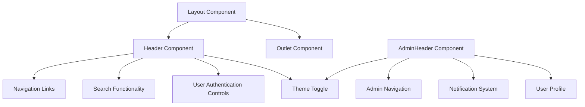
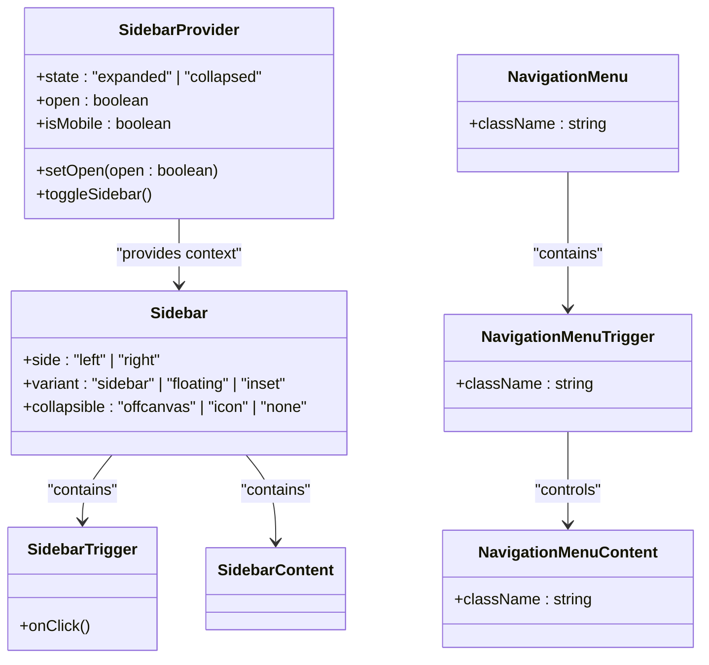
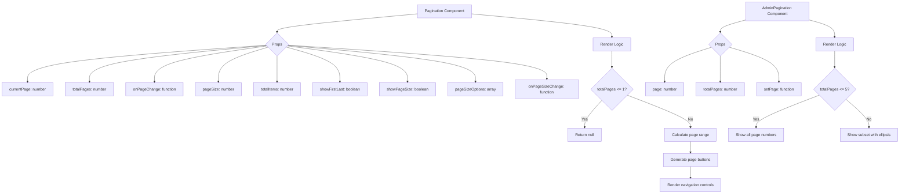
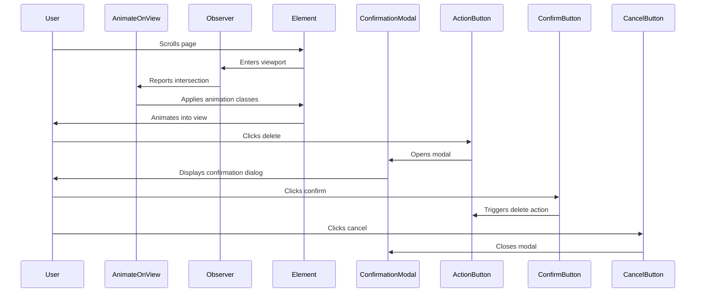

# Layout and Navigation Components

<cite>
**Referenced Files in This Document**   
- [Layout.tsx](file://src/components/Layout.tsx)
- [header.tsx](file://src/components/header.tsx)
- [sidebar.tsx](file://src/components/ui/sidebar.tsx)
- [navigation-menu.tsx](file://src/components/ui/navigation-menu.tsx)
- [pagination.tsx](file://src/components/pagination.tsx)
- [AdminPagination.tsx](file://src/components/AdminPagination.tsx)
- [AnimateOnView.tsx](file://src/components/AnimateOnView.tsx)
- [ConfirmationModal.tsx](file://src/components/ConfirmationModal.tsx)
- [ThemeContext.tsx](file://src/components/contexts/ThemeContext.tsx)
- [ThemeToggle.tsx](file://src/components/ThemeToggle.tsx)
- [AdminHeader.tsx](file://src/components/AdminHeader.tsx)
- [PaginationProps.ts](file://src/types/PaginationProps.ts)
- [ConfirmationModalProps.ts](file://src/types/ConfirmationModalProps.ts)
- [AnimateOnViewProps.ts](file://src/types/AnimateOnViewProps.ts)
</cite>

## Table of Contents
1. [Introduction](#introduction)
2. [Layout and Header Components](#layout-and-header-components)
3. [Sidebar and Navigation Menu](#sidebar-and-navigation-menu)
4. [Pagination Components](#pagination-components)
5. [Animation and Confirmation Components](#animation-and-confirmation-components)
6. [Theme and Authentication Integration](#theme-and-authentication-integration)
7. [Component Usage Examples](#component-usage-examples)
8. [Conclusion](#conclusion)

## Introduction
The MERN_chatai_blog application features a comprehensive set of layout and navigation components that provide a consistent user experience across both frontend and admin interfaces. These components work together to create a cohesive structure for the application, handling everything from global layout to specific user interactions. The design emphasizes responsiveness, accessibility, and seamless integration with the application's theme system and authentication state. This documentation details the implementation and usage of key components including Layout, header, sidebar, navigation-menu, pagination, AnimateOnView, and ConfirmationModal, explaining how they contribute to the overall user experience.

## Layout and Header Components

The Layout and header components form the foundation of the application's user interface, providing a consistent structure across all pages. The Layout component serves as the primary container, while the header component delivers navigation and user controls.

The Layout component is a simple yet essential wrapper that provides the basic structure for all pages in the application. It imports the Header component and React Router's Outlet component, rendering them in a main element. This creates a consistent layout pattern where the header appears at the top of every page, followed by the content specific to the current route. The component is implemented as a functional React component with no props, making it easy to use throughout the application.

The header component is more complex, providing navigation, search functionality, user authentication controls, and theme toggling. It uses React hooks to manage state for menu visibility, search functionality, and user information. The header displays different navigation options based on the user's authentication state and role, with authenticated users seeing additional options like profile management and logout. The header also implements responsive behavior, collapsing into a hamburger menu on smaller screens to optimize space.



**Diagram sources**
- [Layout.tsx](file://src/components/Layout.tsx)
- [header.tsx](file://src/components/header.tsx)
- [AdminHeader.tsx](file://src/components/AdminHeader.tsx)

**Section sources**
- [Layout.tsx](file://src/components/Layout.tsx#L1-L22)
- [header.tsx](file://src/components/header.tsx#L1-L589)

## Sidebar and Navigation Menu

The sidebar and navigation-menu components provide structured navigation options with responsive behavior across different screen sizes. These components are built using the Radix UI primitives and are designed to work seamlessly together to create an intuitive navigation experience.

The sidebar component is a comprehensive navigation solution that supports multiple states and configurations. It uses a context-based approach with SidebarProvider to manage the sidebar's state (expanded or collapsed) across the application. The component supports different variants including regular sidebar, floating, and inset layouts, as well as collapsible behaviors like offcanvas and icon-only modes. On mobile devices, the sidebar transforms into a sheet component that slides in from the side, providing a mobile-friendly navigation experience. The sidebar also supports keyboard shortcuts (Ctrl+B) to toggle its visibility, enhancing accessibility.

The navigation-menu component provides a horizontal navigation menu that typically appears in the header. It's built using Radix UI's NavigationMenu primitives and supports dropdown menus with animated transitions. The component includes a trigger element with a chevron icon that rotates when the menu is open, providing visual feedback to users. The navigation menu content animates in and out using CSS transitions, creating a smooth user experience. The component is styled using class-variance-authority (cva) to ensure consistent styling across different states.



**Diagram sources**
- [sidebar.tsx](file://src/components/ui/sidebar.tsx)
- [navigation-menu.tsx](file://src/components/ui/navigation-menu.tsx)

**Section sources**
- [sidebar.tsx](file://src/components/ui/sidebar.tsx#L1-L764)
- [navigation-menu.tsx](file://src/components/ui/navigation-menu.tsx#L1-L129)

## Pagination Components

The application includes two pagination components: a general-purpose Pagination component for the frontend and a specialized AdminPagination component for the admin interface. Both components provide intuitive controls for navigating through paginated content, but with different styling and feature sets tailored to their respective contexts.

The frontend Pagination component is a flexible and feature-rich implementation that supports various configuration options. It accepts props for current page, total pages, page size, and callback functions for handling page changes. The component displays page numbers with a sliding window approach, showing a maximum of five page numbers at a time with ellipsis for omitted pages. It includes controls for navigating to the first, previous, next, and last pages, as well as an input field for directly entering a page number. The component also supports dynamic page size selection, allowing users to choose how many items to display per page from predefined options.

The AdminPagination component is a simpler implementation focused on the needs of the admin interface. It displays the current page and total pages, along with navigation buttons for moving between pages. The component uses a more compact design with SVG icons for navigation controls and includes ellipsis to indicate omitted page numbers when there are many pages. The styling is consistent with the admin interface's design language, using gray and lime colors for visual feedback.



**Diagram sources**
- [pagination.tsx](file://src/components/pagination.tsx)
- [AdminPagination.tsx](file://src/components/AdminPagination.tsx)
- [PaginationProps.ts](file://src/types/PaginationProps.ts)

**Section sources**
- [pagination.tsx](file://src/components/pagination.tsx#L1-L160)
- [AdminPagination.tsx](file://src/components/AdminPagination.tsx#L1-L134)
- [PaginationProps.ts](file://src/types/PaginationProps.ts#L1-L11)

## Animation and Confirmation Components

The AnimateOnView and ConfirmationModal components enhance the user experience by providing visual feedback and preventing accidental data loss. These components address specific interaction patterns that are common in modern web applications.

The AnimateOnView component implements scroll-triggered animations, revealing content as it enters the viewport. This creates a more engaging user experience by providing visual interest as users scroll through content. The component uses the Intersection Observer API to detect when an element comes into view, then applies CSS transitions to animate the element. It supports multiple animation types including fade, slide (in four directions), zoom, and bounce effects. The component accepts configuration props for animation type, duration, delay, and intersection threshold, allowing developers to customize the animation behavior. The implementation uses React's useRef and useState hooks to manage the element reference and visibility state.

The ConfirmationModal component provides a standardized way to confirm potentially destructive actions like deleting content. It's built on the react-modal library and displays a dialog with a warning icon, confirmation message, and action buttons. The modal includes appropriate styling for both confirm and cancel actions, with visual emphasis on the destructive action. The component accepts props to control its visibility and callback functions for handling user responses. The styling includes a semi-transparent overlay with backdrop blur, creating a focused experience that draws attention to the confirmation dialog.



**Diagram sources**
- [AnimateOnView.tsx](file://src/components/AnimateOnView.tsx)
- [ConfirmationModal.tsx](file://src/components/ConfirmationModal.tsx)
- [AnimateOnViewProps.ts](file://src/types/AnimateOnViewProps.ts)
- [ConfirmationModalProps.ts](file://src/types/ConfirmationModalProps.ts)

**Section sources**
- [AnimateOnView.tsx](file://src/components/AnimateOnView.tsx#L1-L101)
- [ConfirmationModal.tsx](file://src/components/ConfirmationModal.tsx#L1-L75)
- [AnimateOnViewProps.ts](file://src/types/AnimateOnViewProps.ts#L1-L9)
- [ConfirmationModalProps.ts](file://src/types/ConfirmationModalProps.ts#L1-L5)

## Theme and Authentication Integration

The layout components are deeply integrated with the application's theme system and authentication state, creating a cohesive user experience that adapts to user preferences and account status. This integration is achieved through context providers and state management patterns that allow components to respond to changes in theme and authentication status.

The theme system is implemented using a ThemeContext that provides theme state and functions to components throughout the application. The context manages both the color theme (light/dark) and the accent color (green, blue, purple, amber). It synchronizes with localStorage to persist user preferences and respects the system's preferred color scheme when the user selects "system" mode. The ThemeToggle component allows users to cycle through theme options, updating the context state which triggers re-renders of all theme-dependent components. The theme state is applied to the document element, allowing CSS to style components appropriately for the current theme.

Authentication state is managed through the UserContext, which provides user information and authentication functions to components. The header components subscribe to this context to display appropriate navigation options based on the user's login status and role. When a user logs in, the context is updated with their profile information, causing the header to display user-specific options like profile links and logout buttons. The header also fetches user information on mount, ensuring the displayed information is current. Authentication state affects not only navigation but also access to certain features and content throughout the application.

```mermaid
graph TD
A[ThemeProvider] --> B[ThemeContext]
B --> C[Theme State]
C --> D[light | dark | system]
C --> E[color theme]
B --> F[Theme Functions]
F --> G[toggleTheme]
F --> H[setColorTheme]
F --> I[applyTheme]
J[UserContext] --> K[User State]
K --> L[userInfo: object]
K --> M[setUserInfo: function]
N[Header Component] --> B : "consumes"
N --> J : "consumes"
N --> O[Conditional Rendering]
O --> P{User Authenticated?}
P --> |Yes| Q[Show user menu]
P --> |No| R[Show login link]
P --> |Admin| S[Show admin links]
T[ThemeToggle] --> B : "consumes"
T --> U[Theme Button]
U --> V{Theme Mode}
V --> W[light]
V --> X[dark]
V --> Y[system]
```

**Diagram sources**
- [ThemeContext.tsx](file://src/components/contexts/ThemeContext.tsx)
- [ThemeToggle.tsx](file://src/components/ThemeToggle.tsx)
- [header.tsx](file://src/components/header.tsx)
- [UserContext.tsx](file://src/UserContext.tsx)

**Section sources**
- [ThemeContext.tsx](file://src/components/contexts/ThemeContext.tsx#L1-L236)
- [ThemeToggle.tsx](file://src/components/ThemeToggle.tsx#L1-L96)
- [header.tsx](file://src/components/header.tsx#L1-L589)

## Component Usage Examples

The layout and navigation components are used throughout the application in both frontend and admin interfaces, demonstrating their versatility and adaptability to different contexts.

In the frontend interface, the Layout component wraps all pages, providing a consistent structure with the header and outlet for page content. The header displays navigation links to main sections of the site, a search function, and authentication controls. On blog listing pages, the Pagination component is used to navigate through posts, with options to change page size and jump to specific pages. The AnimateOnView component is applied to featured content sections, creating engaging scroll-triggered animations as users explore the site. The ConfirmationModal is used when users attempt to delete their own posts, preventing accidental data loss.

In the admin interface, the AdminHeader component replaces the standard header, providing navigation between admin sections like user management and statistics. It includes additional features like a notification system with an unread count badge. The AdminPagination component is used in user and content management screens, providing a more compact pagination interface suited to data tables. The sidebar component is used in some admin views to provide secondary navigation options, with collapsible sections for different administrative functions.

The theme integration is consistent across both interfaces, with the ThemeToggle component available in both headers. Users can switch between light, dark, and system themes, with their preference persisted across sessions. The authentication integration ensures that navigation options are appropriate to the user's role, with admin users seeing additional options not available to regular users.

## Conclusion

The layout and navigation components in the MERN_chatai_blog application work together to create a cohesive, responsive, and user-friendly interface. The component architecture follows modern React patterns with a focus on reusability, accessibility, and maintainability. The integration of theme and authentication state ensures a personalized experience that adapts to user preferences and account status. The responsive design patterns ensure the interface works well across different device sizes, from mobile phones to desktop computers. By providing a consistent navigation experience and thoughtful user interactions, these components contribute significantly to the overall quality of the application.