# UI Components

<cite>
**Referenced Files in This Document**   
- [button.tsx](file://src/components/ui/button.tsx)
- [card.tsx](file://src/components/ui/card.tsx)
- [form.tsx](file://src/components/ui/form.tsx)
- [input.tsx](file://src/components/ui/input.tsx)
- [textarea.tsx](file://src/components/ui/textarea.tsx)
- [select.tsx](file://src/components/ui/select.tsx)
- [dialog.tsx](file://src/components/ui/dialog.tsx)
- [tabs.tsx](file://src/components/ui/tabs.tsx)
- [badge.tsx](file://src/components/ui/badge.tsx)
- [avatar.tsx](file://src/components/ui/avatar.tsx)
- [checkbox.tsx](file://src/components/ui/checkbox.tsx)
- [switch.tsx](file://src/components/ui/switch.tsx)
- [skeleton.tsx](file://src/components/ui/skeleton.tsx)
- [progress.tsx](file://src/components/ui/progress.tsx)
- [Post.tsx](file://src/components/Post.tsx)
- [MarkdownRenderer.tsx](file://src/components/MarkdownRenderer.tsx)
- [TiptapRenderer.tsx](file://src/components/TiptapRenderer.tsx)
- [theme-overrides.css](file://src/css/theme-overrides.css)
- [dark-mode.css](file://src/css/dark-mode.css)
- [global.css](file://src/css/global.css)
</cite>

## Table of Contents
1. [Introduction](#introduction)
2. [Core UI Components](#core-ui-components)
3. [Form Components](#form-components)
4. [Interactive Components](#interactive-components)
5. [Layout and Display Components](#layout-and-display-components)
6. [Blog-Specific Components](#blog-specific-components)
7. [Theming and Styling](#theming-and-styling)
8. [Accessibility and Responsive Design](#accessibility-and-responsive-design)
9. [Component Composition and Integration](#component-composition-and-integration)
10. [Performance Optimization](#performance-optimization)

## Introduction
The MERN_chatai_blog application features a comprehensive UI component library built with React and Radix UI primitives. This documentation provides detailed information about the visual appearance, behavior, and user interaction patterns of key UI components. The components are designed with accessibility, responsiveness, and theming support in mind, following modern design principles and best practices.

## Core UI Components

### Button Component
The Button component is a versatile interactive element with multiple variants and sizes. It supports different visual styles including default, destructive, outline, secondary, ghost, and link variants. The component also offers size options: default, small (sm), large (lg), and icon-only.

The button features smooth hover and active states with appropriate visual feedback. It supports the `asChild` prop, which allows rendering the button as any other component while maintaining button styling and behavior, enabling seamless integration with navigation links and other elements.

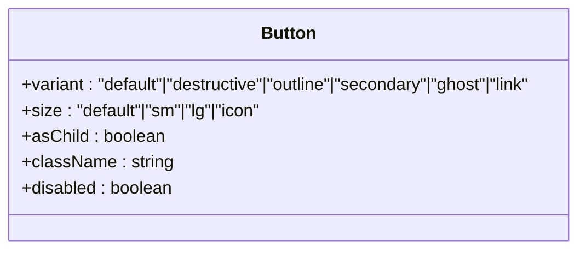

**Diagram sources**
- [button.tsx](file://src/components/ui/button.tsx#L1-L50)

**Section sources**
- [button.tsx](file://src/components/ui/button.tsx#L1-L50)

### Badge Component
The Badge component is used to display small pieces of information such as status indicators, categories, or tags. It features a pill-shaped design with rounded corners and comes in several variants: default (primary), secondary, destructive, and outline.

Badges provide visual hierarchy and help categorize content. They include appropriate color contrast and are designed to be easily readable. The component supports custom class names for additional styling and can be used inline with text content.

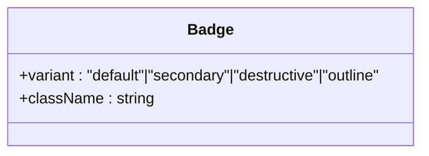

**Diagram sources**
- [badge.tsx](file://src/components/ui/badge.tsx#L1-L30)

**Section sources**
- [badge.tsx](file://src/components/ui/badge.tsx#L1-L30)

### Avatar Component
The Avatar component displays user profile images with a circular shape. It includes three sub-components: Avatar, AvatarImage, and AvatarFallback. The component gracefully handles image loading states and provides a fallback placeholder when images are unavailable.

Avatars support different sizes and maintain consistent styling across the application. The fallback displays when the image fails to load or when no image is provided, typically showing user initials or a default icon.

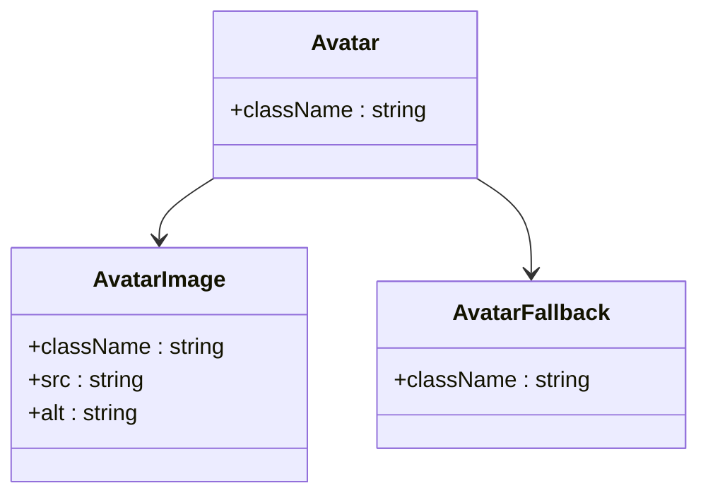

**Diagram sources**
- [avatar.tsx](file://src/components/ui/avatar.tsx#L1-L50)

**Section sources**
- [avatar.tsx](file://src/components/ui/avatar.tsx#L1-L50)

## Form Components

### Input and Textarea Components
The Input and Textarea components provide styled form controls with consistent styling and behavior. Both components feature proper focus states, disabled states, and error handling capabilities. They support all standard HTML input attributes and are designed to work seamlessly with form libraries.

The Input component is suitable for single-line text entry, while the Textarea component handles multi-line content. Both include appropriate padding, border styling, and hover/focus effects. They are optimized for both light and dark themes with appropriate text color contrast.

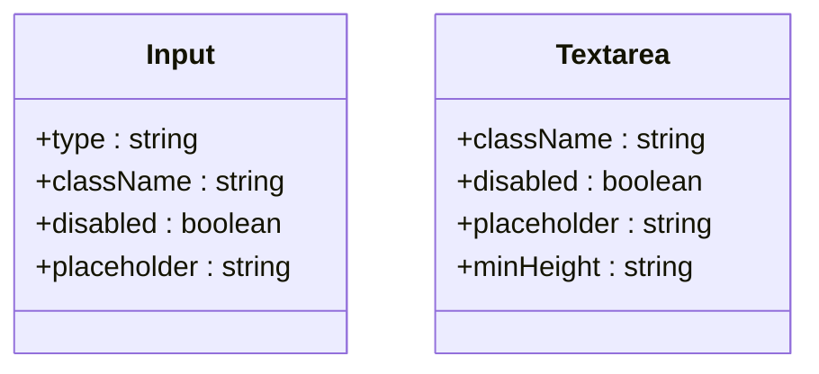

**Diagram sources**
- [input.tsx](file://src/components/ui/input.tsx#L1-L22)
- [textarea.tsx](file://src/components/ui/textarea.tsx#L1-L22)

**Section sources**
- [input.tsx](file://src/components/ui/input.tsx#L1-L22)
- [textarea.tsx](file://src/components/ui/textarea.tsx#L1-L22)

### Select Component
The Select component provides a styled dropdown menu for selecting options from a list. It includes several sub-components: Select, SelectTrigger, SelectContent, SelectItem, and SelectSeparator. The component features smooth animations for opening and closing, with proper keyboard navigation support.

Options are clearly distinguishable with checkmark indicators for selected items. The component supports scrolling for long lists and includes visual feedback for hover states. It integrates well with form libraries and supports both single and multiple selection patterns.

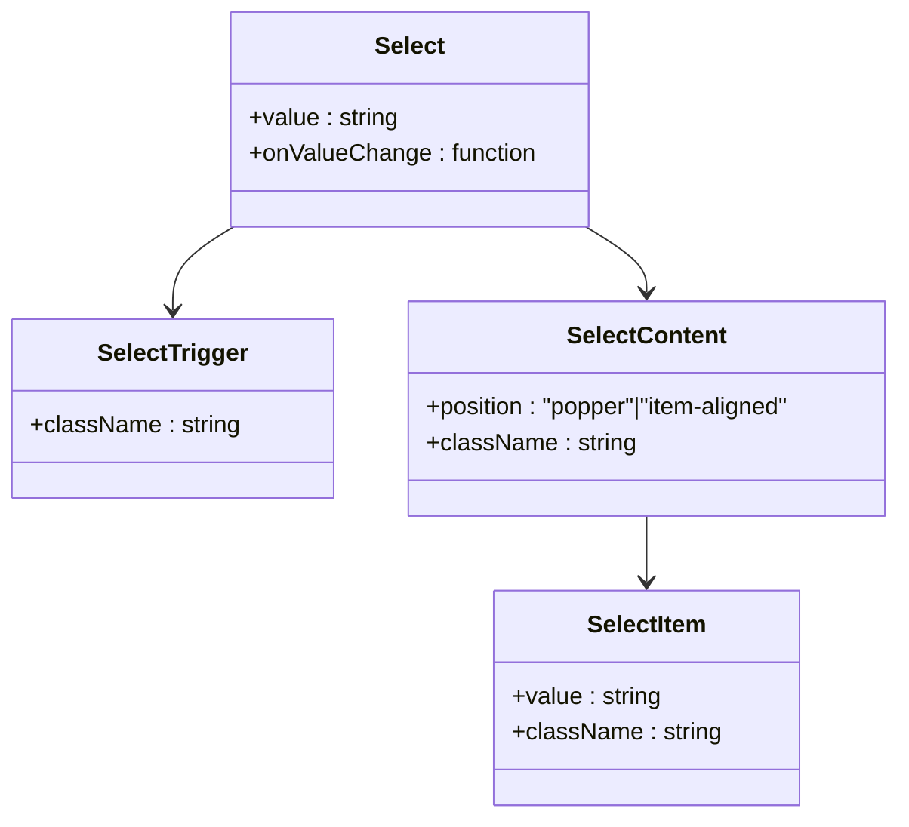

**Diagram sources**
- [select.tsx](file://src/components/ui/select.tsx#L1-L160)

**Section sources**
- [select.tsx](file://src/components/ui/select.tsx#L1-L160)

### Form Component
The Form component is a comprehensive form handling solution built on react-hook-form. It includes several sub-components: Form, FormItem, FormLabel, FormControl, FormDescription, and FormMessage. This component system provides a structured approach to form creation with built-in validation and error handling.

The form components work together to create accessible forms with proper labeling, error messaging, and descriptive text. The system supports complex form structures with nested fields and conditional rendering. It includes proper ARIA attributes for screen reader accessibility.

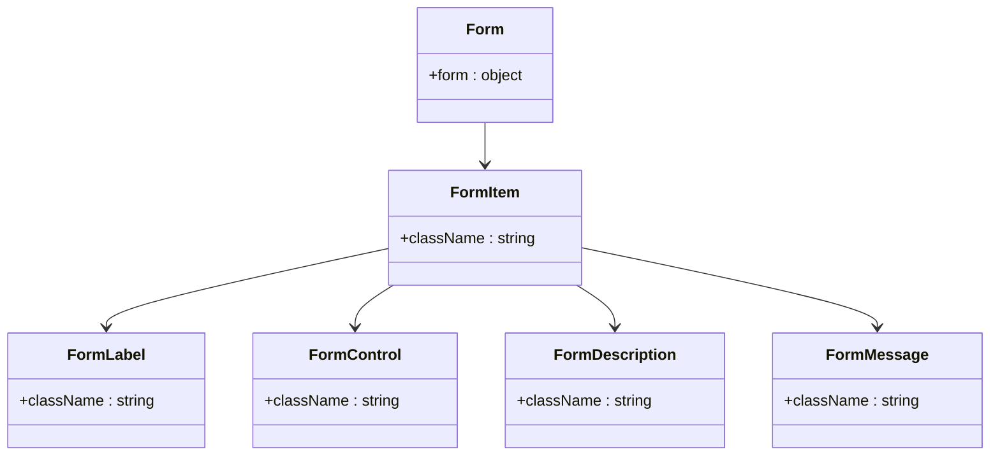

**Diagram sources**
- [form.tsx](file://src/components/ui/form.tsx#L1-L178)

**Section sources**
- [form.tsx](file://src/components/ui/form.tsx#L1-L178)

## Interactive Components

### Checkbox and Switch Components
The Checkbox and Switch components provide binary choice controls with distinct visual representations. The Checkbox follows standard form control patterns with a checkmark indicator, while the Switch offers a toggle-style interface with animated state transitions.

Both components include proper focus states and are fully keyboard navigable. They support the disabled state and provide visual feedback for user interactions. The Switch component features a smooth sliding animation when toggling between states.

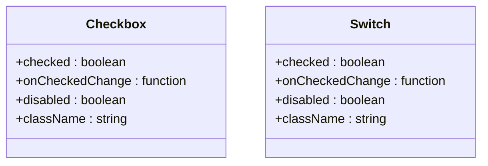

**Diagram sources**
- [checkbox.tsx](file://src/components/ui/checkbox.tsx#L1-L30)
- [switch.tsx](file://src/components/ui/switch.tsx#L1-L29)

**Section sources**
- [checkbox.tsx](file://src/components/ui/checkbox.tsx#L1-L30)
- [switch.tsx](file://src/components/ui/switch.tsx#L1-L29)

### Dialog Component
The Dialog component provides a modal interface for displaying content that requires user attention. It includes several sub-components: Dialog, DialogTrigger, DialogPortal, DialogOverlay, DialogContent, DialogHeader, DialogFooter, DialogTitle, and DialogDescription.

The dialog features a backdrop overlay with proper focus trapping to ensure accessibility. It includes smooth entrance and exit animations and supports keyboard dismissal (Escape key). The header and footer components provide structured layout options for titles and action buttons.

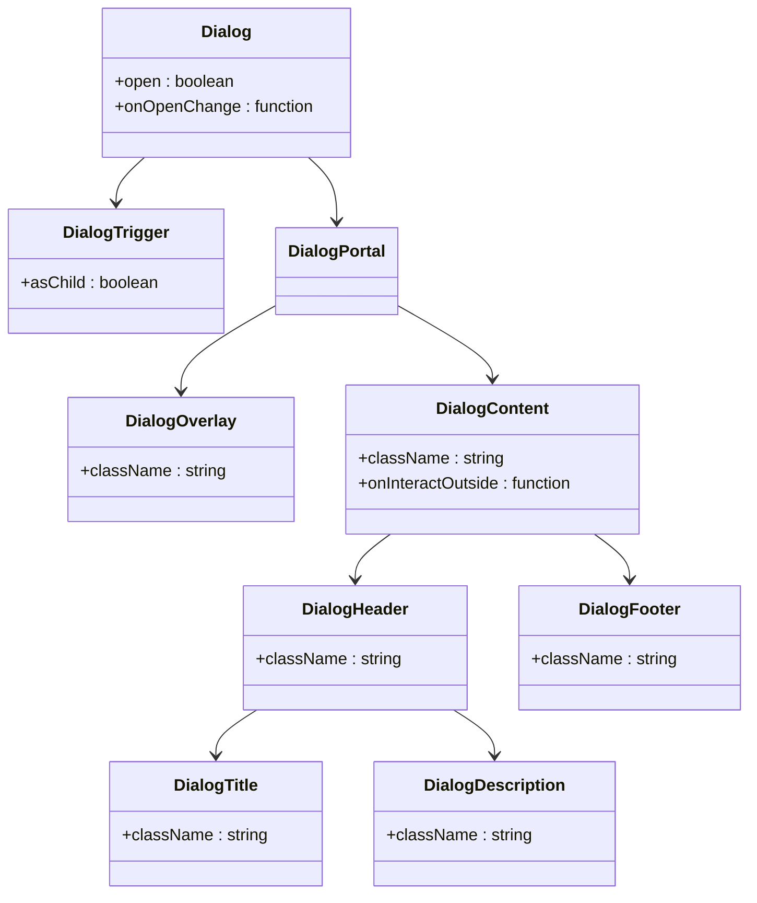

**Diagram sources**
- [dialog.tsx](file://src/components/ui/dialog.tsx#L1-L122)

**Section sources**
- [dialog.tsx](file://src/components/ui/dialog.tsx#L1-L122)

### Tabs Component
The Tabs component enables content organization through tabbed navigation. It includes sub-components: Tabs, TabsList, TabsTrigger, and TabsContent. The component supports both controlled and uncontrolled usage patterns.

Tabs provide visual indication of the active tab with appropriate styling and subtle shadows. The component includes smooth transitions between tab panels and supports keyboard navigation (arrow keys). It is optimized for both mouse and touch interactions.

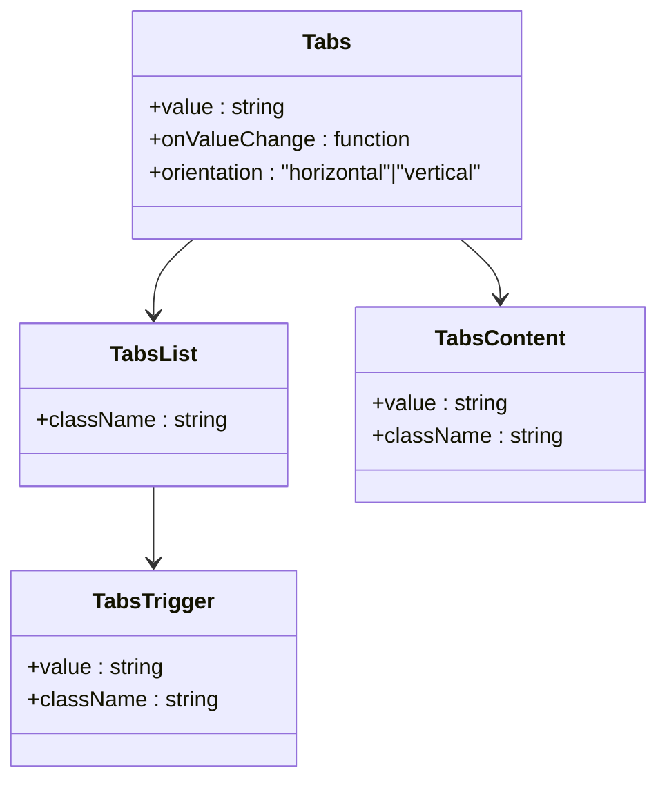

**Diagram sources**
- [tabs.tsx](file://src/components/ui/tabs.tsx#L1-L55)

**Section sources**
- [tabs.tsx](file://src/components/ui/tabs.tsx#L1-L55)

## Layout and Display Components

### Card Component
The Card component provides a container for grouping related content with a consistent visual style. It includes several sub-components: Card, CardHeader, CardTitle, CardDescription, CardContent, and CardFooter.

Cards feature a subtle border, background color, and shadow to create visual separation from surrounding content. They include hover effects with enhanced shadows to indicate interactivity. The component supports flexible content organization with designated areas for headers, body content, and footers.

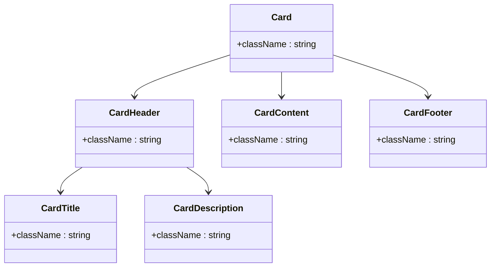

**Diagram sources**
- [card.tsx](file://src/components/ui/card.tsx#L1-L50)

**Section sources**
- [card.tsx](file://src/components/ui/card.tsx#L1-L50)

### Skeleton Component
The Skeleton component provides loading state placeholders that mimic the final content layout. It features a subtle animation with a moving gradient to indicate loading activity. The component is used to improve perceived performance by providing immediate visual feedback during data loading.

Skeletons maintain the same dimensions as the content they replace, preventing layout shifts when content loads. They can be customized with different shapes and sizes to match various content types including text, images, and complex layouts.

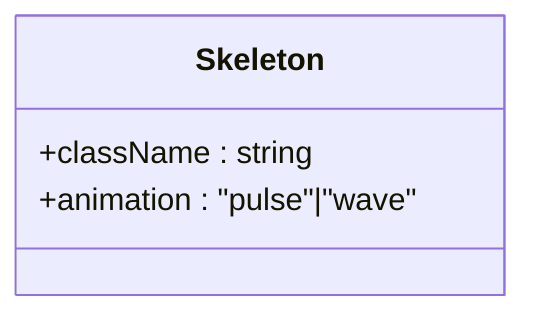

**Diagram sources**
- [skeleton.tsx](file://src/components/ui/skeleton.tsx#L1-L15)

**Section sources**
- [skeleton.tsx](file://src/components/ui/skeleton.tsx#L1-L15)

### Progress Component
The Progress component visually represents completion status or loading progress. It features a horizontal bar with a filled portion indicating the current value. The component includes smooth transitions when the value changes.

The progress bar supports both determinate and indeterminate states. It includes appropriate color coding (typically blue for primary actions) and maintains proper contrast ratios. The component is accessible with appropriate ARIA attributes for screen readers.

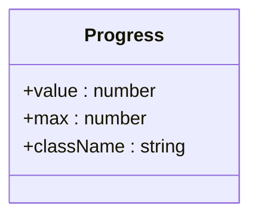

**Diagram sources**
- [progress.tsx](file://src/components/ui/progress.tsx#L1-L28)

**Section sources**
- [progress.tsx](file://src/components/ui/progress.tsx#L1-L28)

## Blog-Specific Components

### Post Component
The Post component is a custom blog-specific component that renders individual blog posts with metadata, content, and interaction elements. It integrates various UI components to create a cohesive post display with title, author information, publication date, content body, and engagement metrics.

The component supports different display modes including full post view and card/list view. It includes responsive design considerations for various screen sizes and integrates with the MarkdownRenderer for content display.

**Section sources**
- [Post.tsx](file://src/components/Post.tsx#L1-L200)

### MarkdownRenderer Component
The MarkdownRenderer component converts Markdown content to styled HTML for display in the blog. It supports standard Markdown syntax including headings, lists, code blocks, images, and links. The component ensures consistent styling across different content types and integrates with the application's theme system.

The renderer includes security considerations by sanitizing input to prevent XSS attacks. It supports syntax highlighting for code blocks and responsive image handling. The component is optimized for performance with lazy loading of images and efficient rendering of large content.

**Section sources**
- [MarkdownRenderer.tsx](file://src/components/MarkdownRenderer.tsx#L1-L150)
- [TiptapRenderer.tsx](file://src/components/TiptapRenderer.tsx#L1-L100)

## Theming and Styling

### Theme System
The application implements a comprehensive theme system that supports both light and dark modes. The theme is managed through context providers and can be toggled by users. The styling system uses CSS variables for consistent color application across components.

Theme-specific styles are defined in separate CSS files with appropriate selectors. Components automatically adapt their appearance based on the current theme, ensuring optimal readability and visual harmony. The theme system supports customizations through CSS overrides and component props.

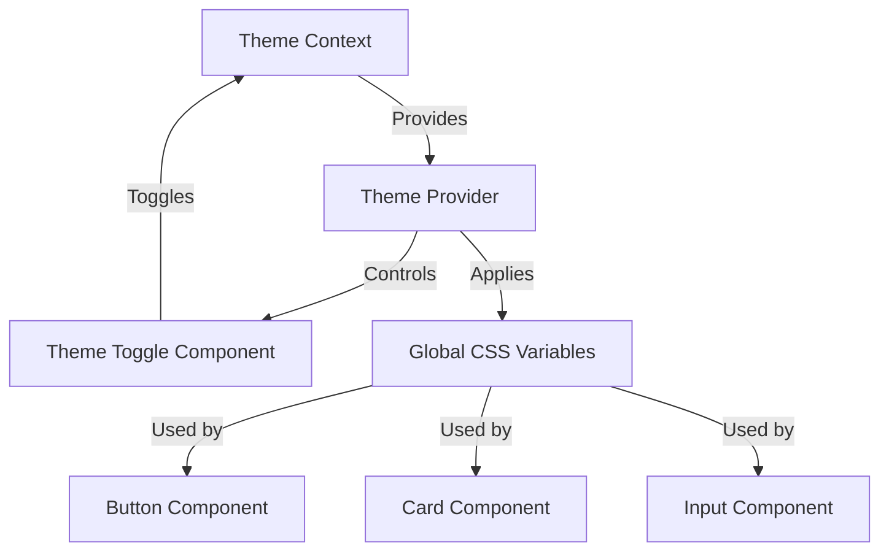

**Diagram sources**
- [theme-overrides.css](file://src/css/theme-overrides.css#L1-L50)
- [dark-mode.css](file://src/css/dark-mode.css#L1-L30)
- [global.css](file://src/css/global.css#L1-L100)

**Section sources**
- [theme-overrides.css](file://src/css/theme-overrides.css#L1-L50)
- [dark-mode.css](file://src/css/dark-mode.css#L1-L30)
- [global.css](file://src/css/global.css#L1-L100)

## Accessibility and Responsive Design

### Accessibility Features
All UI components are designed with accessibility as a core principle. They include proper ARIA attributes, keyboard navigation support, and sufficient color contrast. Interactive elements have visible focus indicators and are operable through keyboard alone.

Form components include proper labeling with associated input fields and error messaging. Screen reader users receive appropriate feedback for component states and interactions. The application follows WCAG 2.1 guidelines for web accessibility.

### Responsive Design
The component library is built with responsive design principles, ensuring optimal display across various screen sizes and devices. Components adapt their layout, size, and behavior based on viewport dimensions.

Mobile-specific considerations include touch-friendly tap targets, appropriate spacing, and simplified layouts for smaller screens. The design system uses a mobile-first approach with progressive enhancement for larger screens.

**Section sources**
- [global.css](file://src/css/global.css#L1-L200)
- [Post.css](file://src/css/Post.css#L1-L100)

## Component Composition and Integration

### Radix UI Integration
The UI components are built on Radix UI primitives, leveraging their unstyled, accessible foundation components. This approach provides full control over styling while maintaining excellent accessibility and behavior.

Components wrap Radix UI primitives with application-specific styling and additional functionality. The integration ensures that all interactive components have proper focus management, keyboard navigation, and screen reader support.

### Component Composition Patterns
The component library encourages composition through props like `asChild` and slot-based APIs. This allows developers to combine components in flexible ways while maintaining consistent styling and behavior.

Common composition patterns include form layouts with labels, inputs, and error messages; card layouts with headers, content, and actions; and modal dialogs with structured content areas. The system promotes reusability and consistency across the application.

**Section sources**
- [button.tsx](file://src/components/ui/button.tsx#L1-L50)
- [form.tsx](file://src/components/ui/form.tsx#L1-L178)
- [dialog.tsx](file://src/components/ui/dialog.tsx#L1-L122)

## Performance Optimization

### Rendering Performance
The components are optimized for rendering performance with React.memo where appropriate to prevent unnecessary re-renders. Event handlers are properly memoized to maintain referential equality.

The component library minimizes the use of expensive operations in render methods and leverages React's concurrent features for smoother interactions. Large lists are virtualized where applicable to improve scroll performance.

### Bundle Size Optimization
The modular component structure allows for tree-shaking, ensuring that only used components are included in the final bundle. Each component is exported individually, enabling selective imports.

The styling system uses utility classes efficiently to minimize CSS bloat. The application leverages Tailwind CSS for atomic styling, reducing the overall CSS bundle size while maintaining design consistency.

**Section sources**
- [button.tsx](file://src/components/ui/button.tsx#L1-L50)
- [global.css](file://src/css/global.css#L1-L200)
- [tailwind.config.js](file://tailwind.config.js#L1-L50)