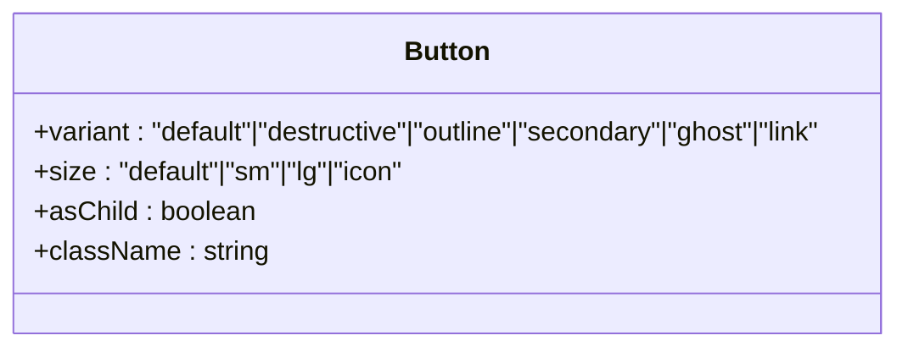
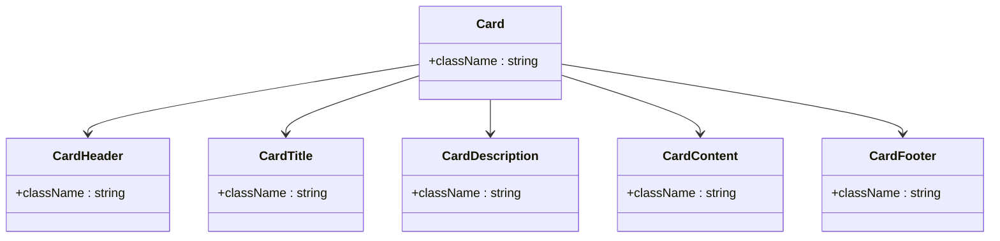
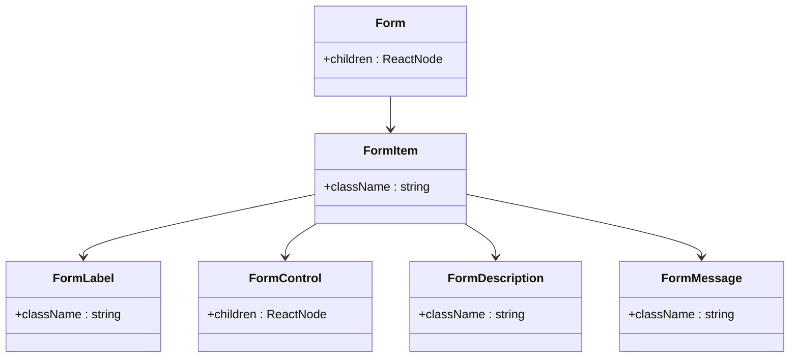
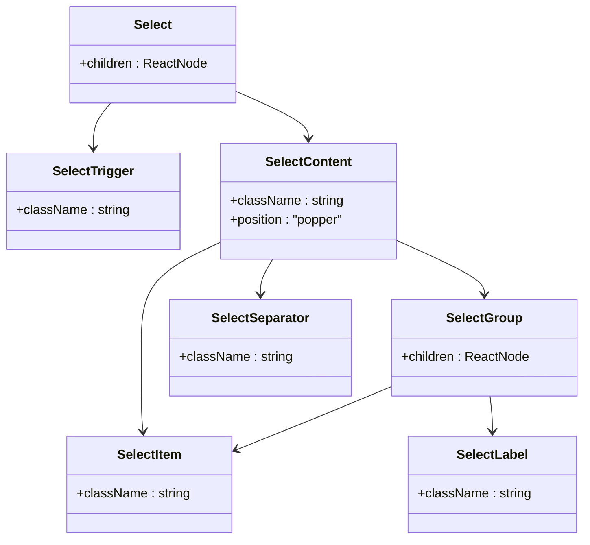
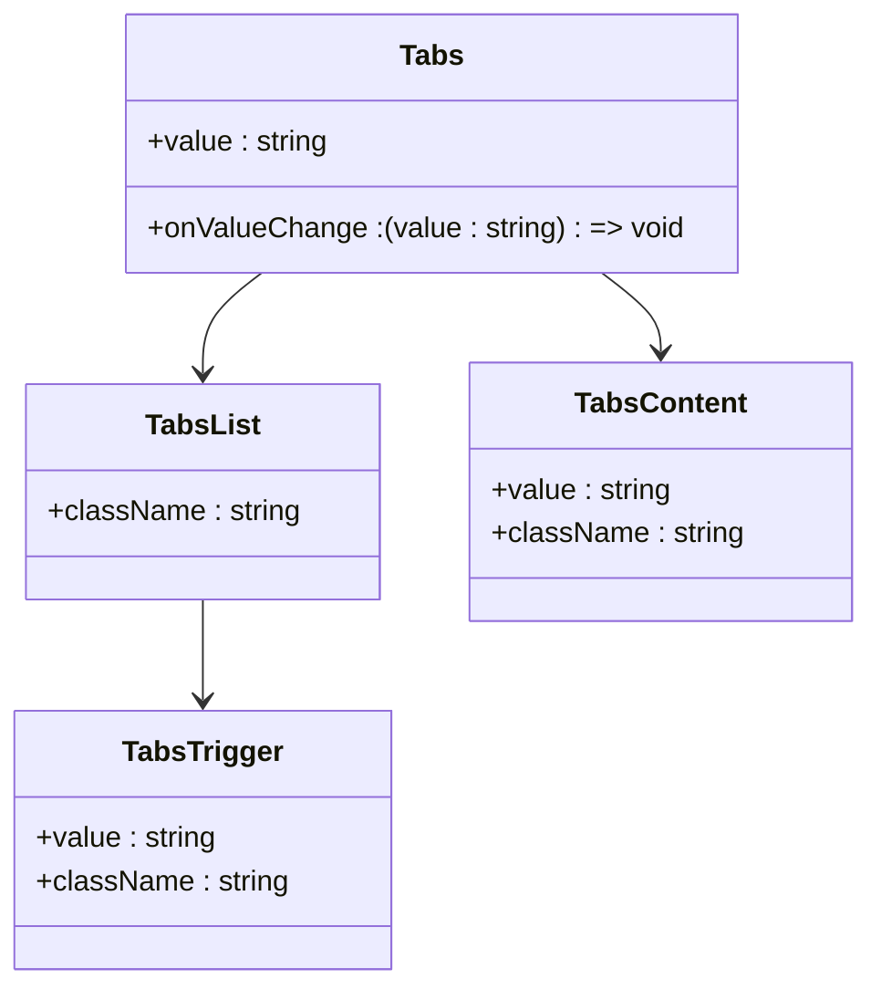
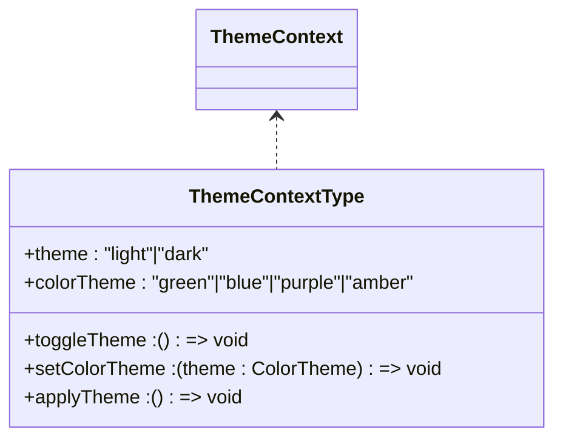
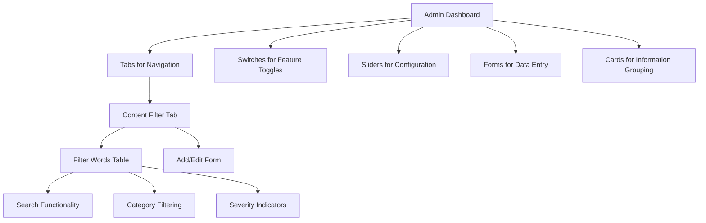

# UI Primitives

<cite>
**Referenced Files in This Document**   
- [button.tsx](file://src/components/ui/button.tsx)
- [input.tsx](file://src/components/ui/input.tsx)
- [form.tsx](file://src/components/ui/form.tsx)
- [checkbox.tsx](file://src/components/ui/checkbox.tsx)
- [radio-group.tsx](file://src/components/ui/radio-group.tsx)
- [select.tsx](file://src/components/ui/select.tsx)
- [tabs.tsx](file://src/components/ui/tabs.tsx)
- [tooltip.tsx](file://src/components/ui/tooltip.tsx)
- [switch.tsx](file://src/components/ui/switch.tsx)
- [slider.tsx](file://src/components/ui/slider.tsx)
- [card.tsx](file://src/components/ui/card.tsx)
- [theme-toggle.tsx](file://src/components/ui/theme-toggle.tsx)
- [ThemeContext.tsx](file://src/components/contexts/ThemeContext.tsx)
- [ContentFilterAdmin.tsx](file://src/components/admin/ContentFilterAdmin.tsx)
- [CreatePost.tsx](file://src/features/posts/pages/CreatePost.tsx)
- [AdminDashboard.tsx](file://src/pages/AdminDashboard.tsx)
</cite>

## Table of Contents
1. [Introduction](#introduction)
2. [Core UI Primitives](#core-ui-primitives)
3. [Form Components](#form-components)
4. [Interactive Controls](#interactive-controls)
5. [Layout and Display Components](#layout-and-display-components)
6. [Theme System Integration](#theme-system-integration)
7. [Usage Examples](#usage-examples)
8. [Performance Considerations](#performance-considerations)
9. [Component Composition](#component-composition)
10. [Accessibility Features](#accessibility-features)

## Introduction
The MERN_chatai_blog application utilizes a comprehensive set of UI primitives built with Radix UI and styled with Tailwind CSS. These components form the foundation of the application's user interface, providing consistent visual design, accessibility features, and interaction patterns across the entire platform. The component library follows a modular architecture that enables flexible composition while maintaining design consistency. Built on Radix UI's unstyled, accessible primitives, each component is enhanced with Tailwind CSS for styling, ensuring a responsive design that works across devices and screen sizes.

**Section sources**
- [button.tsx](file://src/components/ui/button.tsx)
- [ThemeContext.tsx](file://src/components/contexts/ThemeContext.tsx)

## Core UI Primitives

### Button Component
The Button component provides multiple visual variants and sizes for different use cases. It supports accessibility features including focus states and disabled states with appropriate opacity. The component uses class-variance-authority (CVA) for variant management, allowing for consistent styling across the application. Available variants include default, destructive, outline, secondary, ghost, and link, each with distinct visual characteristics and hover states. Size options include default, small, large, and icon-only variants.

**Diagram sources**
- [button.tsx](file://src/components/ui/button.tsx#L1-L50)

**Section sources**
- [button.tsx](file://src/components/ui/button.tsx)

### Input Component
The Input component provides a styled text input with consistent styling across the application. It includes focus states with ring effects, disabled states with reduced opacity, and proper handling of placeholder text. The component is designed to work seamlessly with the form system and supports all standard HTML input attributes. Visual feedback is provided through border color changes on focus and appropriate cursor styles for disabled states.

**Section sources**
- [input.tsx](file://src/components/ui/input.tsx)

### Card Component
The Card component provides a container for grouping related content with a consistent visual treatment. It includes subcomponents for header, title, description, content, and footer, allowing for flexible composition. The card has a subtle shadow and border with smooth hover effects that enhance the interactive experience. The component responds to hover events with a slightly elevated shadow, providing visual feedback to users.

**Diagram sources**
- [card.tsx](file://src/components/ui/card.tsx#L1-L60)

**Section sources**
- [card.tsx](file://src/components/ui/card.tsx)

## Form Components

### Form Component System
The form component system is built on react-hook-form and provides a structured approach to form management. It includes components for form items, labels, controls, descriptions, and error messages, ensuring consistent layout and accessibility across all forms in the application. The system automatically handles aria attributes for accessibility, including aria-describedby references between labels and controls.

**Diagram sources**
- [form.tsx](file://src/components/ui/form.tsx#L1-L180)

**Section sources**
- [form.tsx](file://src/components/ui/form.tsx)
- [label.tsx](file://src/components/ui/label.tsx)

### Checkbox Component
The Checkbox component provides a visually styled checkbox with accessibility features. It uses data attributes to reflect the checked state, allowing for CSS styling based on component state. The component includes a check icon that appears when the checkbox is in the checked state, with smooth transitions between states. Focus states are clearly indicated with ring effects that meet accessibility standards.

**Section sources**
- [checkbox.tsx](file://src/components/ui/checkbox.tsx)

### Radio Group Component
The Radio Group component provides a set of mutually exclusive options with consistent styling. It uses a grid layout to arrange radio items and includes visual indicators for the selected state. Each radio item displays a filled circle when selected, with smooth transitions between states. The component handles keyboard navigation and ensures proper accessibility attributes are applied.

**Section sources**
- [radio-group.tsx](file://src/components/ui/radio-group.tsx)

### Select Component
The Select component provides a styled dropdown menu with comprehensive functionality. It includes features like scroll buttons for long lists, proper keyboard navigation, and visual indicators for the selected state. The component supports grouping of options and separators between groups. The dropdown menu is properly positioned and includes animation effects for opening and closing.

**Diagram sources**
- [select.tsx](file://src/components/ui/select.tsx#L1-L160)

**Section sources**
- [select.tsx](file://src/components/ui/select.tsx)

## Interactive Controls

### Tabs Component
The Tabs component provides a tabbed interface for organizing content. It includes visual indicators for the active tab with background color changes and subtle shadows. The component handles keyboard navigation between tabs and ensures proper ARIA attributes for screen readers. The active tab is clearly distinguished from inactive tabs through visual styling.

**Diagram sources**
- [tabs.tsx](file://src/components/ui/tabs.tsx#L1-L60)

**Section sources**
- [tabs.tsx](file://src/components/ui/tabs.tsx)

### Tooltip Component
The Tooltip component provides contextual information on hover or focus. It includes proper positioning logic to ensure the tooltip is visible within the viewport and includes animation effects for smooth appearance and disappearance. The component supports custom positioning offsets and ensures proper z-index stacking for visibility.

**Section sources**
- [tooltip.tsx](file://src/components/ui/tooltip.tsx)

### Switch Component
The Switch component provides a toggle control with visual feedback. It includes smooth transitions for the thumb movement between on and off states, with appropriate color changes for each state. The component provides visual feedback on hover and focus states, with proper accessibility attributes for screen readers.

**Section sources**
- [switch.tsx](file://src/components/ui/switch.tsx)

### Slider Component
The Slider component provides a range input with visual feedback. It includes a track with a filled portion indicating the selected value, and a draggable thumb for direct manipulation. The component supports keyboard interaction and provides visual feedback for focus states.

**Section sources**
- [slider.tsx](file://src/components/ui/slider.tsx)

## Layout and Display Components
The UI component library includes various layout and display components such as accordion, popover, dialog, and sheet. These components provide structured ways to present content while maintaining consistent styling and interaction patterns. They are built on Radix UI primitives to ensure accessibility and proper focus management.

## Theme System Integration

### Theme Context
The theme system is implemented using React Context, allowing theme preferences to be shared across the application. The ThemeContext provides the current theme (light/dark) and color theme (green, blue, purple, amber), along with functions to toggle the theme and change the color theme. The context handles both user preferences and system preferences through the prefers-color-scheme media query.

**Diagram sources**
- [ThemeContext.tsx](file://src/components/contexts/ThemeContext.tsx#L1-L50)

**Section sources**
- [ThemeContext.tsx](file://src/components/contexts/ThemeContext.tsx)

### Theme Toggle Component
The ThemeToggle component provides a button for switching between light and dark themes. It displays appropriate icons (sun for light, moon for dark) and uses the ThemeContext to access and modify the current theme. The component is designed as a ghost button with a rounded shape for a clean visual appearance.

**Section sources**
- [theme-toggle.tsx](file://src/components/ui/theme-toggle.tsx)

## Usage Examples

### Form Integration in Post Creation
The form components are extensively used in the post creation interface, where users can create new blog posts with various fields including title, content, category, and tags. The form system ensures proper validation and error messaging, with accessible labels and input controls.

**Section sources**
- [CreatePost.tsx](file://src/features/posts/pages/CreatePost.tsx)

### Interactive Controls in Admin Dashboard
The admin dashboard utilizes various interactive controls including tabs for navigation between different management sections, switches for enabling/disabling features, and sliders for configuring settings. The ContentFilterAdmin component demonstrates complex usage of multiple UI primitives working together.

**Diagram sources**
- [AdminDashboard.tsx](file://src/pages/AdminDashboard.tsx#L1-L50)
- [ContentFilterAdmin.tsx](file://src/components/admin/ContentFilterAdmin.tsx#L1-L100)

**Section sources**
- [AdminDashboard.tsx](file://src/pages/AdminDashboard.tsx)
- [ContentFilterAdmin.tsx](file://src/components/admin/ContentFilterAdmin.tsx)

## Performance Considerations
The UI primitives are designed with performance in mind, particularly when rendering large lists of interactive elements. The components use React.memo where appropriate to prevent unnecessary re-renders. For lists of interactive elements, virtualization techniques should be considered to maintain smooth scrolling performance. The theme system minimizes re-renders by batching theme updates and using efficient state management.

**Section sources**
- [use-mobile.tsx](file://src/hooks/use-mobile.tsx)
- [useThemeListener.ts](file://src/hooks/useThemeListener.ts)

## Component Composition
The UI primitives are designed to be composable, allowing developers to create higher-level components by combining basic primitives. For example, form fields can be created by combining label, input, and optional description and error message components. This compositional approach ensures consistency while providing flexibility for custom interfaces.

**Section sources**
- [PostForm](file://src/features/posts/components/PostForm)
- [CategorySelector.tsx](file://src/features/posts/components/PostForm/CategorySelector.tsx)

## Accessibility Features
All UI primitives include comprehensive accessibility features. Components have appropriate ARIA attributes, support keyboard navigation, and provide visual feedback for focus states. The form system automatically manages aria-describedby relationships between labels and controls. Interactive elements have sufficient color contrast and target sizes for touch devices. The theme system ensures that both light and dark themes meet accessibility contrast requirements.

**Section sources**
- [button.tsx](file://src/components/ui/button.tsx)
- [form.tsx](file://src/components/ui/form.tsx)
- [checkbox.tsx](file://src/components/ui/checkbox.tsx)