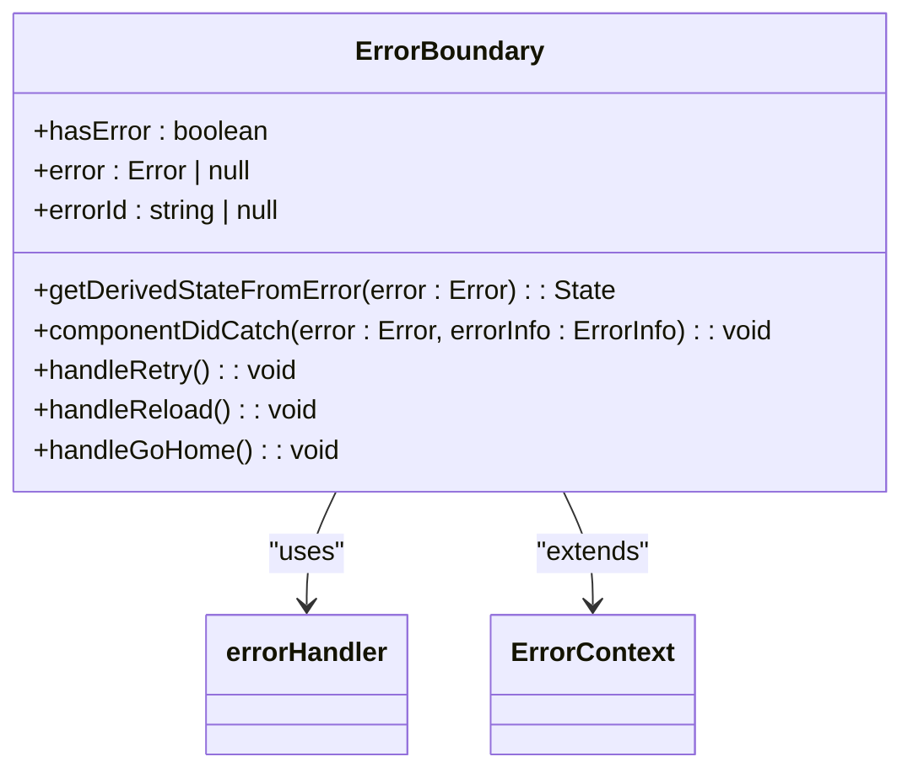
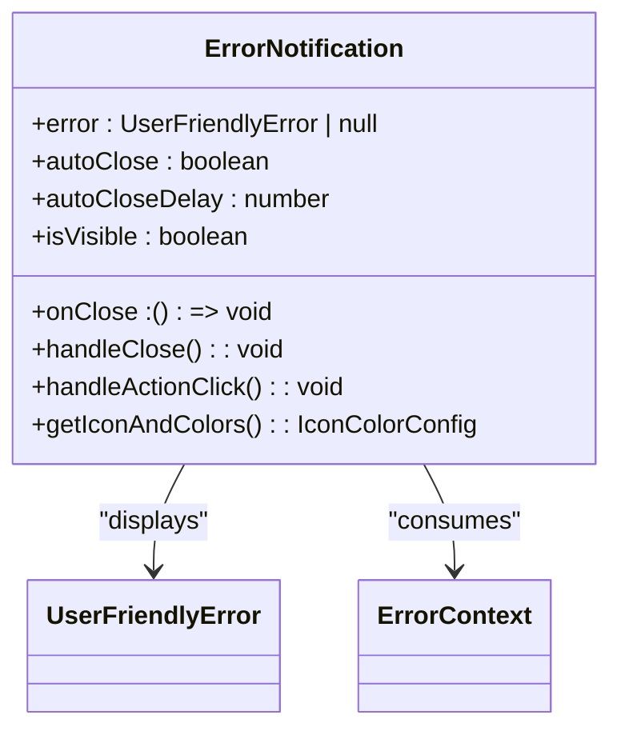
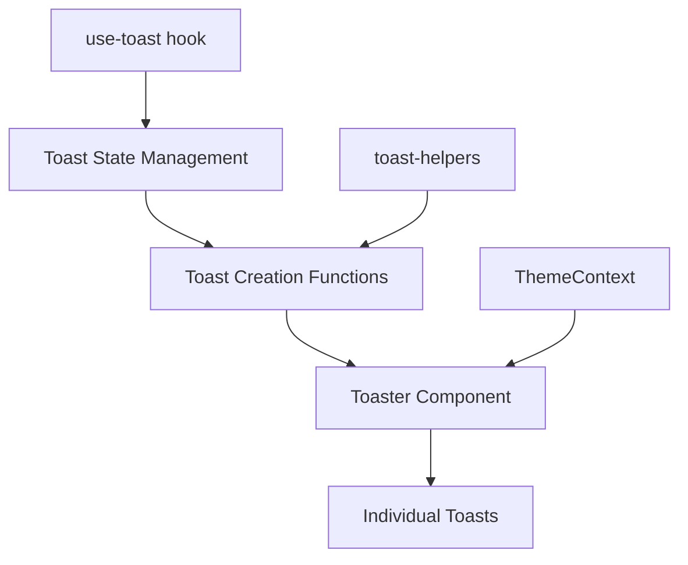
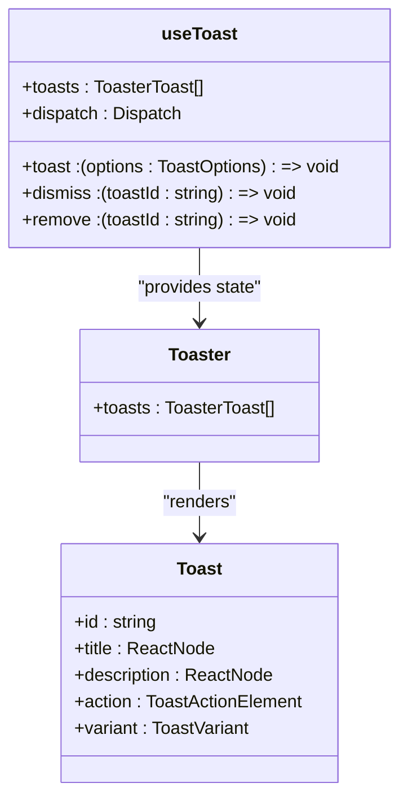
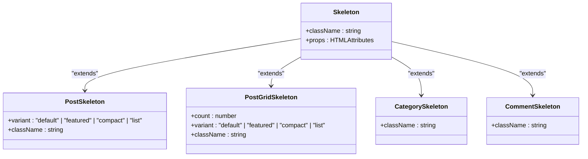
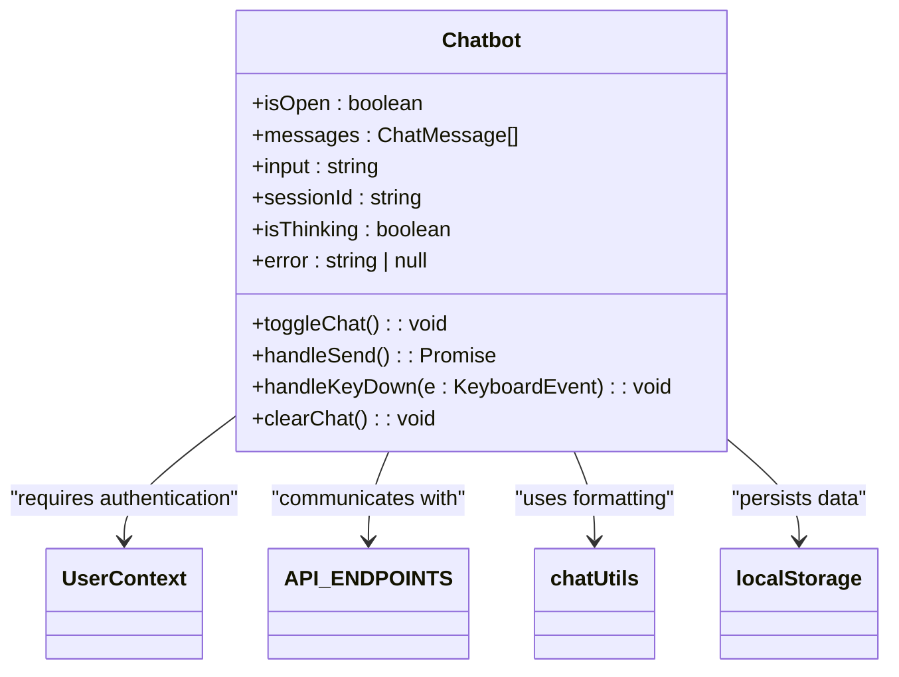
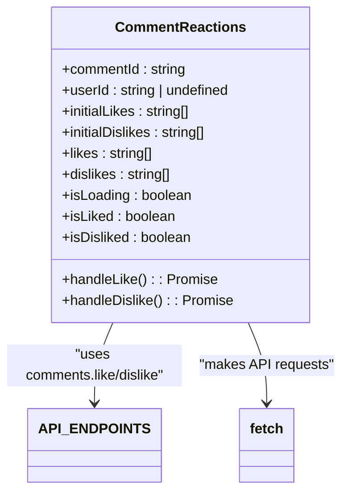
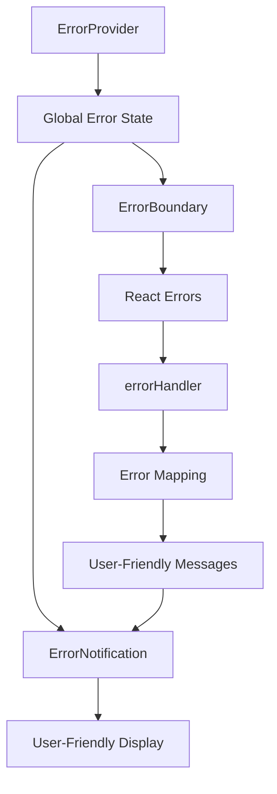

# Utility and Feedback Components

<cite>
**Referenced Files in This Document**   
- [ErrorBoundary.tsx](file://src/components/ErrorBoundary.tsx)
- [ErrorNotification.tsx](file://src/components/ErrorNotification.tsx)
- [sonner.tsx](file://src/components/ui/sonner.tsx)
- [toaster.tsx](file://src/components/ui/toaster.tsx)
- [use-toast.ts](file://src/hooks/use-toast.ts)
- [toast-helpers.ts](file://src/lib/toast-helpers.ts)
- [LoadingSkeleton.tsx](file://src/components/ui/LoadingSkeleton.tsx)
- [skeleton.tsx](file://src/components/ui/skeleton.tsx)
- [Chatbot.tsx](file://src/components/Chatbot.tsx)
- [CommentReactions.tsx](file://src/components/CommentReactions.tsx)
- [ErrorContext.tsx](file://src/contexts/ErrorContext.tsx)
- [ErrorTypes.ts](file://src/types/ErrorTypes.ts)
- [errorHandler.ts](file://src/services/errorHandler.ts)
- [api.config.ts](file://src/config/api.config.ts)
- [UserContext.tsx](file://src/UserContext.tsx)
- [App.tsx](file://src/App.tsx)
</cite>

## Table of Contents
1. [Introduction](#introduction)
2. [Error Handling Components](#error-handling-components)
3. [Notification and Toast System](#notification-and-toast-system)
4. [Skeleton Loaders](#skeleton-loaders)
5. [Chatbot Component](#chatbot-component)
6. [Comment Reactions](#comment-reactions)
7. [Component Integration and Best Practices](#component-integration-and-best-practices)
8. [Conclusion](#conclusion)

## Introduction
The MERN_chatai_blog application implements a comprehensive suite of utility and user feedback components designed to enhance user experience and application reliability. This documentation details the implementation and usage of key components including ErrorBoundary, ErrorNotification, Toast system, skeleton loaders, Chatbot, and CommentReactions. These components work together to provide graceful error handling, meaningful user feedback, smooth loading experiences, and interactive features that improve the overall usability of the application.

**Section sources**
- [App.tsx](file://src/App.tsx)

## Error Handling Components

### ErrorBoundary Implementation
The ErrorBoundary component serves as a critical safety net for the React application, capturing and handling runtime errors that occur during rendering, in lifecycle methods, and in constructors. Implemented as a class component, it uses React's error boundary lifecycle methods to intercept errors and provide a fallback user interface.

When an error occurs, the ErrorBoundary component:
1. Catches the error through the `getDerivedStateFromError` static method
2. Updates its internal state to indicate an error has occurred
3. Logs the error using the centralized errorHandler service
4. Displays a user-friendly fallback UI with recovery options

The component provides three recovery options: retry (reset the component state), reload page, and return home. In development mode, it also displays technical details of the error for debugging purposes. Each error instance is assigned a unique ID for tracking and debugging.

**Diagram sources**
- [ErrorBoundary.tsx](file://src/components/ErrorBoundary.tsx)
- [ErrorTypes.ts](file://src/types/ErrorTypes.ts)

**Section sources**
- [ErrorBoundary.tsx](file://src/components/ErrorBoundary.tsx)

### ErrorNotification Component
The ErrorNotification component provides a non-intrusive way to display system alerts and user-friendly error messages. It is designed to be used in conjunction with the ErrorContext provider, which manages the global error state.

The component supports different error types (error, warning, info) with appropriate styling and icons. It automatically closes after a configurable delay (default 5 seconds) unless the error type is 'error', in which case it remains visible until dismissed. The notification includes an optional action button that can trigger specific handlers when clicked.

Error notifications are styled according to their type:
- Error: Red background with error icon
- Warning: Yellow background with warning icon  
- Info: Blue background with information icon

**Diagram sources**
- [ErrorNotification.tsx](file://src/components/ErrorNotification.tsx)
- [ErrorTypes.ts](file://src/types/ErrorTypes.ts)

**Section sources**
- [ErrorNotification.tsx](file://src/components/ErrorNotification.tsx)

## Notification and Toast System

### Toast Notification Architecture
The toast notification system in MERN_chatai_blog is built on the Sonner library, providing a modern and customizable toast experience. The system consists of several components working together:

1. **Toaster**: The container component that renders all active toasts
2. **Toast**: Individual toast components with title, description, and actions
3. **use-toast hook**: Custom hook that manages toast state and provides toast creation functions
4. **toast-helpers**: Utility functions for common toast types (success, error, info)

The toast system is integrated with the application's theme context, automatically adapting its appearance to the current theme (light or dark mode). Toasts are positioned in the top-right corner of the screen and support various actions and dismissals.

**Diagram sources**
- [use-toast.ts](file://src/hooks/use-toast.ts)
- [toaster.tsx](file://src/components/ui/toaster.tsx)
- [sonner.tsx](file://src/components/ui/sonner.tsx)

**Section sources**
- [use-toast.ts](file://src/hooks/use-toast.ts)
- [toaster.tsx](file://src/components/ui/toaster.tsx)
- [sonner.tsx](file://src/components/ui/sonner.tsx)

### Toast Implementation Details
The toast system uses a reducer pattern to manage toast state, with actions for adding, updating, dismissing, and removing toasts. Each toast is assigned a unique ID and can include a title, description, and action element. The system limits the number of simultaneously displayed toasts and automatically removes dismissed toasts after a delay.

The `toast-helpers.ts` file provides convenience functions for common toast types:
- `showError(message, title)`: Displays a destructive toast for errors
- `showSuccess(message, title)`: Displays a success toast
- `showInfo(message, title)`: Displays an informational toast

These helper functions abstract the toast configuration, making it easy for developers to provide consistent user feedback throughout the application.

**Diagram sources**
- [use-toast.ts](file://src/hooks/use-toast.ts)
- [toaster.tsx](file://src/components/ui/toaster.tsx)
- [toast-helpers.ts](file://src/lib/toast-helpers.ts)

**Section sources**
- [toast-helpers.ts](file://src/lib/toast-helpers.ts)

## Skeleton Loaders

### Skeleton Component Implementation
The skeleton loader system in MERN_chatai_blog provides visual placeholders for content that is loading, improving perceived performance and user experience. The system includes two main components:

1. **Skeleton**: A basic skeleton component that creates a pulsing placeholder with a muted background
2. **LoadingSkeleton**: A collection of specialized skeleton components for different content types

The base Skeleton component uses CSS animations to create a pulsing effect, simulating content loading. It applies the "animate-pulse" class and a muted background color, making it visually distinct from actual content while indicating that something will appear in that space.

**Diagram sources**
- [skeleton.tsx](file://src/components/ui/skeleton.tsx)
- [LoadingSkeleton.tsx](file://src/components/ui/LoadingSkeleton.tsx)

**Section sources**
- [skeleton.tsx](file://src/components/ui/skeleton.tsx)
- [LoadingSkeleton.tsx](file://src/components/ui/LoadingSkeleton.tsx)

### Specialized Skeleton Components
The LoadingSkeleton component provides several specialized skeleton variants for common content types:

- **PostSkeleton**: Displays a placeholder for blog posts with different variants (default, featured, compact, list)
- **PostGridSkeleton**: Renders multiple PostSkeleton components in a grid layout
- **CategorySkeleton**: Displays a placeholder for category tags
- **CommentSkeleton**: Shows a placeholder for comments with avatar, text, and action buttons

These specialized components maintain visual consistency across the application while providing appropriate placeholders for different content types. For example, the featured post skeleton includes a larger image placeholder and more prominent text elements, while the list variant displays posts in a horizontal layout with thumbnails.

The skeleton components are designed to be easily integrated into loading states, typically used when data is being fetched from the API. They help prevent layout shifts and provide users with immediate visual feedback that content is loading.

## Chatbot Component

### Chatbot Architecture and Integration
The Chatbot component provides an AI-powered assistant that users can interact with to get information about the blog, articles, or other topics. The component is implemented as a floating window that can be toggled open and closed, positioned in the bottom-right corner of the screen.

Key features of the Chatbot component:
- Persistent chat sessions stored in localStorage
- Message history preservation between sessions
- AI integration through the backend API
- User authentication requirements
- Typing indicator and error handling
- Markdown-like formatting for message display

The chatbot is integrated with the application's user authentication system, requiring users to be logged in before they can interact with the AI assistant. This ensures that interactions can be personalized and tracked appropriately.

**Diagram sources**
- [Chatbot.tsx](file://src/components/Chatbot.tsx)
- [UserContext.tsx](file://src/UserContext.tsx)
- [api.config.ts](file://src/config/api.config.ts)

**Section sources**
- [Chatbot.tsx](file://src/components/Chatbot.tsx)

### Chatbot User Interface and Behavior
The Chatbot component features a clean, modern interface with the following elements:

1. **Toggle Button**: A floating button with a message icon that opens and closes the chat window
2. **Chat Window**: A card-style container that displays the conversation
3. **Message Area**: Shows the conversation history with user and AI messages
4. **Input Area**: Contains a text input and send button for user messages
5. **Action Buttons**: Clear chat and close window controls

Messages are displayed with different styling based on the sender:
- User messages: Green background with white text, aligned to the right
- AI messages: White/dark background with gray text, aligned to the left
- System messages: Red background for errors

The component includes several UX enhancements:
- Automatic scrolling to the latest message
- Input focus when the chat opens
- Enter key to send messages (Shift+Enter for new lines)
- Welcome message for new sessions
- Error messages for authentication and API issues
- Thinking indicator when waiting for AI response

The chat history is persisted in localStorage, allowing users to resume conversations across sessions. Each session has a unique ID that is also stored in localStorage, enabling the backend to maintain conversation context.

## Comment Reactions

### CommentReactions Component Implementation
The CommentReactions component provides a simple interface for users to express their sentiment about comments through likes and dislikes. The component displays the current like and dislike counts and allows authenticated users to toggle their reactions.

Key features of the CommentReactions component:
- Like and dislike buttons with heart and thumbs down icons
- Visual feedback when a reaction is applied (filled icons)
- Loading states during API requests
- Disabled state for unauthenticated users
- Real-time update of reaction counts

The component manages its state with React hooks, maintaining the current like and dislike arrays, loading state, and user interaction status. When a user clicks a reaction button, the component sends a request to the appropriate API endpoint and updates the local state with the response.

**Diagram sources**
- [CommentReactions.tsx](file://src/components/CommentReactions.tsx)
- [api.config.ts](file://src/config/api.config.ts)

**Section sources**
- [CommentReactions.tsx](file://src/components/CommentReactions.tsx)

### User Engagement Features
The CommentReactions component enhances user engagement by providing a simple way to interact with content. The implementation includes several UX considerations:

- **Visual Feedback**: The heart and thumbs down icons fill when a user has reacted, providing immediate visual confirmation
- **Loading States**: Buttons are disabled and show a loading indicator during API requests to prevent multiple submissions
- **Accessibility**: Icons include appropriate labels and the component is keyboard navigable
- **Performance**: The component only re-renders when necessary, using useCallback for event handlers

The reaction counts are updated in real-time based on the API response, ensuring consistency between the frontend display and backend data. The component gracefully handles errors by logging them to the console without disrupting the user experience.

## Component Integration and Best Practices

### Global Error Handling Strategy
The MERN_chatai_blog application implements a comprehensive error handling strategy that combines multiple components to provide a robust user experience. The strategy follows a layered approach:

1. **ErrorBoundary**: Catches React rendering errors and prevents application crashes
2. **ErrorContext**: Manages global error state and provides error display functionality
3. **ErrorNotification**: Displays user-friendly error messages with optional actions
4. **errorHandler service**: Centralizes error handling logic and provides consistent error mapping

The ErrorProvider wraps the entire application, making error handling functionality available throughout the component tree. ErrorBoundary components are strategically placed around key sections of the application (App, Header, Routes, Chatbot) to catch errors in different parts of the UI.

**Diagram sources**
- [App.tsx](file://src/App.tsx)
- [ErrorContext.tsx](file://src/contexts/ErrorContext.tsx)
- [ErrorBoundary.tsx](file://src/components/ErrorBoundary.tsx)
- [errorHandler.ts](file://src/services/errorHandler.ts)

**Section sources**
- [App.tsx](file://src/App.tsx)
- [ErrorContext.tsx](file://src/contexts/ErrorContext.tsx)

### Best Practices for Component Usage
To ensure consistent and effective use of these utility and feedback components, follow these best practices:

**Error Handling:**
- Wrap major application sections with ErrorBoundary components
- Provide meaningful fallback UIs that allow users to recover from errors
- Use the centralized errorHandler service for consistent error mapping
- Log errors appropriately while maintaining user privacy

**Notifications and Feedback:**
- Use toast notifications for transient feedback (success messages, minor errors)
- Use ErrorNotification for system alerts that require user attention
- Ensure notifications are accessible and keyboard navigable
- Provide appropriate actions in notifications when recovery is possible

**Loading States:**
- Use skeleton loaders for content that takes more than 300ms to load
- Match skeleton component variants to the actual content they represent
- Avoid skeleton loaders for very fast operations (<100ms)
- Consider using loading spinners for actions with indeterminate duration

**Interactive Components:**
- Ensure interactive components like Chatbot and CommentReactions provide clear visual feedback
- Handle loading states appropriately to prevent user frustration
- Implement proper error handling for API interactions
- Consider accessibility requirements for all interactive elements

## Conclusion
The utility and feedback components in MERN_chatai_blog work together to create a robust, user-friendly application. The error handling system provides graceful recovery from runtime errors, while the notification system delivers timely feedback to users. Skeleton loaders improve perceived performance during data fetching, and interactive components like the Chatbot and CommentReactions enhance user engagement.

By following the documented best practices and understanding the component architecture, developers can effectively use these components to build reliable and intuitive user interfaces. The modular design allows for easy customization and extension while maintaining consistency across the application.